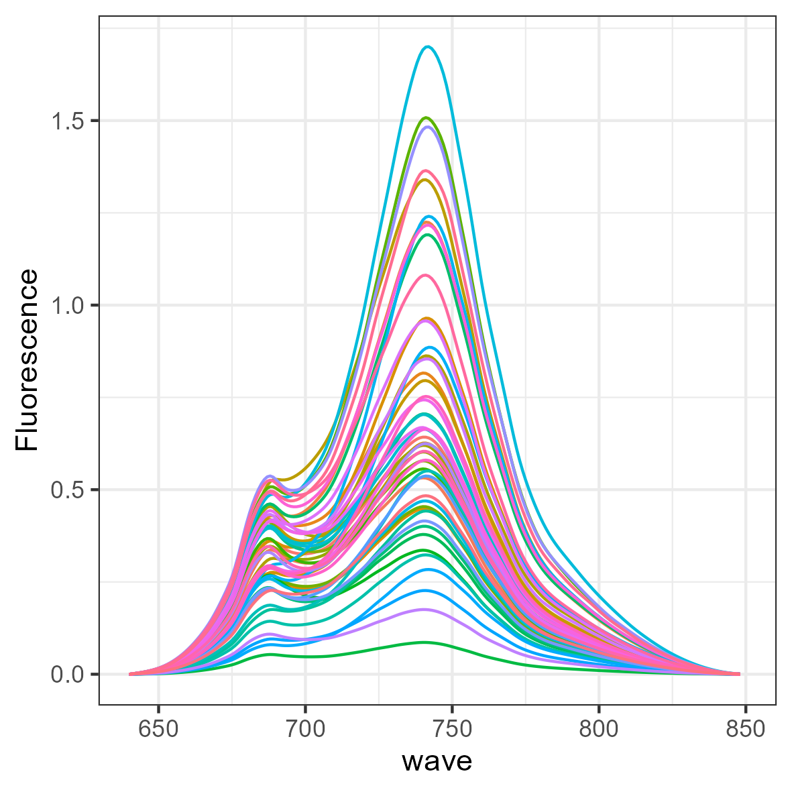
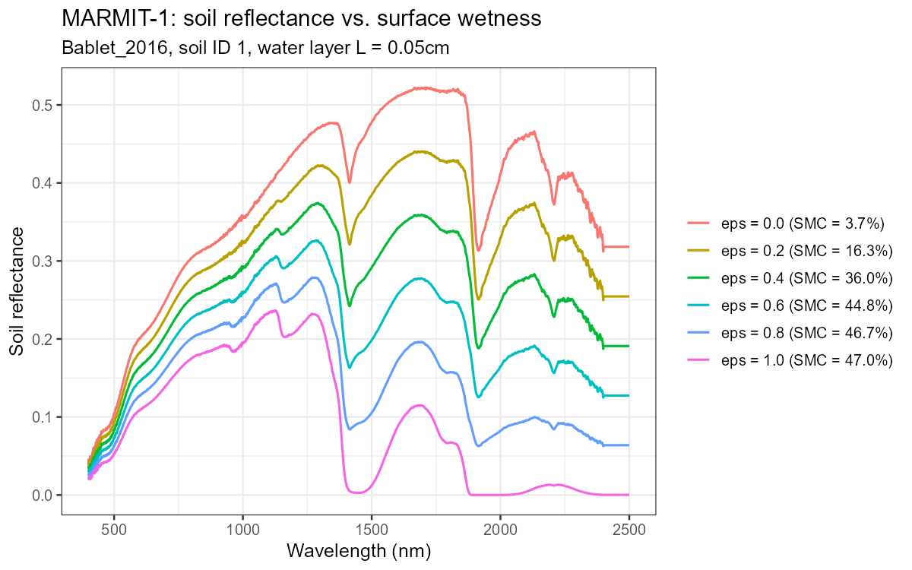
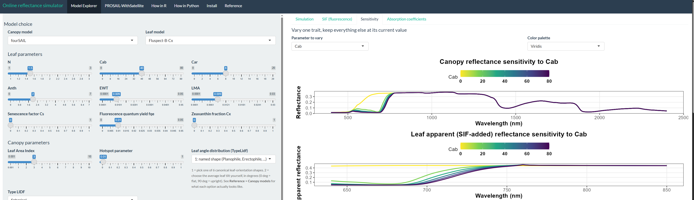

# RTM Suite

**An integrated R and Python framework for radiative transfer modelling, simulation, inversion, and Earth observation applications.**

   

RTM-Suite brings together a collection of radiative transfer models and tools for simulating and retrieving vegetation biophysical and biochemical traits from remote sensing observations. The framework connects leaf optical properties, canopy radiative transfer, soil reflectance, fluorescence, and energy-balance modelling within a common environment, supporting applications from model sensitivity analysis to satellite data interpretation and trait retrieval.

The suite builds on the **ToolsRTM** and **SCOPEinR** R packages and extends their functionality through Python implementations, including **ToolsRTM for Python** and **SCOPEinPython**.


***Figure 1**. FourSAIL, foursail2 and INFORM canopy models compared across 5 leaf models*

------------------------------------------------------------------------

## Packages in this suite

| Library | What it does | Depends on |
|----|----|----|
| [**ToolsRTM**](ToolsRTM/) | Leaf-level optics (PROSPECT-D, PROSPECT-PRO, Liberty, Fluspect-B, Fluspect-B-Cx) and canopy-level optics (fourSAIL, foursail2, INFORM). Real soil via MARMIT. Trait inversion via 12 `caret` algorithms plus TensorFlow/Keras deep learning. Sensor convolution (Sentinel-2A/2B, PRISMA). | — |
| [**SCOPEinR**](SCOPEinR/) | R port of **SCOPE 2.0** (Van der Tol & Yang et al.) — the full Soil-Canopy-Observation, Photochemistry and Energy-balance model: couples ToolsRTM's radiative transfer with leaf photosynthesis/biochemistry, canopy energy balance, and chlorophyll fluorescence. | ToolsRTM |
| [**ToolsRTM.app**](ToolsRTM.app/) | `get.simulator()` and nine interactive Shiny apps (PROSAIL, PROSAIL-BRDF, MARMIT, SPART, SCOPE, LUTs, RTMs, Inversion, STAC) — every model above, point-and-click. Kept as a separate package so the core `ToolsRTM` install stays light for scripted/batch use. | ToolsRTM (+ SCOPEinR for the SCOPE/SPART apps) |
| [**toolsrtm**](python/toolsrtm/) *(Python)* | Python port of ToolsRTM's core: all 5 leaf models, fourSAIL/foursail2/INFORM, MARMIT, sensor convolution, spectral indices. See [`python/README.md`](python/README.md) for exactly what's ported. | — |
| [**scopeinpython**](python/scopeinpython/) *(Python)* | Python port of SCOPEinR's core: soil + optical top-of-canopy BRDF pipeline of SCOPE. | toolsrtm |

**Get each library directly — click a badge to open that library's own repo:**

[](https://gitlab.com/caminoccg/toolsrtm) [](https://gitlab.com/caminoccg/scopeinr) [](https://github.com/CCGCAM/ToolsRTMinPython) [](https://github.com/CCGCAM/scopeinpython)

Also in this repo: a Python port of the core models ([`python/`](python/)), narrative tutorials ([`Tutorials/`](Tutorials/)), and generated reference manuals ([`docs/`](docs/index.html)).

## Repo layout

```         
0-RTM-Suite/
├── ToolsRTM/     R package — leaf + canopy radiative transfer models, trait inversion
├── SCOPEinR/     R package — full SCOPE energy-balance simulation (needs ToolsRTM)
├── ToolsRTM.app/ R package — get.simulator() + the interactive Shiny apps
├── python/       Python port of the core models (toolsrtm, scopeinpython — also published standalone,
│                 see "Canonical repos" below)
├── Apps/         Standalone Shiny apps, run directly with shiny::runApp() — no course material needed
│   ├── RTMs/         Model Explorer, PROSAIL-WithSatellite, How in R/Python tutorials, Reference
│   └── STAC/         real Sentinel-2 time series retrieval via STAC, interactive map
├── Tutorials/    Rmd/HTML/ipynb walkthroughs, verified block-by-block by execution
├── docs/         pkgdown reference manuals for both R packages + Sphinx docs for both Python packages (generated)
├── assets/      Images used in this README
├── databases/    All 8 official MARMIT soil databases (~200MB total) — only Bablet_2016 ships inside
│                 ToolsRTM/toolsrtm (keeps install size small); point get.marmit.rsoil()/get_marmit_rsoil()'s
│                 `db_root` at this folder to use any of the other 7 directly, no download needed
├── Scripts/      Working scripts — real-world usage examples and pipelines
│   ├── R/            all R script folders (moved under here 2026-08-19, was directly under Scripts/)
│   │   ├── Pipeline/     generic simulate → convolve → index → invert, for both ToolsRTM and SCOPEinR (see Scripts/R/Pipeline/README.md)
│   │   ├── ForPROSAIL/   course pipeline: fourSAIL — same shape as the folders below
│   │   ├── ForFoursail2/ course pipeline: foursail2 (two-layer green/brown canopy)
│   │   ├── ForINFORM/    course pipeline: INFORM (forest, explicit crown geometry)
│   │   ├── ForSPART/     course pipeline: SPART (soil+canopy+atmosphere, real sensors)
│   │   ├── ForMARMIT/    course pipeline: MARMIT (soil-only, moisture retrieval)
│   │   ├── ForSCOPE/     course pipeline: full SCOPE (energy balance, fluorescence, Vcmax25)
│   │   ├── Comparison/   same inputs across every leaf × canopy combination, side by side
│   │   ├── Sensibility/  which traits drive which wavelengths — OAT, Sobol, and Johnson methods
│   │   └── AEO/          course exercise scripts
│   ├── Python/       Python-port equivalent pipeline (simulate → indices → invert → sensor convolution),
│   │                 kept separate from Scripts/R/ above (see Scripts/Python/README.md)
│   ├── sync_python_repos.sh  publishes python/toolsrtm + python/scopeinpython to their own GitHub
│   └── sync_r_repos.sh       publishes ToolsRTM + SCOPEinR to their own GitLab repositories
└── outs/         All generated output (plots, LUTs, models) — gitignored, always written here, never inside Scripts/
```

## What you can do with RTM-Suite

RTM-Suite provides a common framework for simulating how vegetation, soil and the atmosphere interact with radiation, and for retrieving plant traits from remote sensing observations.

At the **leaf level**, models such as PROSPECT-D, PROSPECT-PRO, LIBERTY and Fluspect describe how biochemical and structural properties control leaf reflectance, transmittance and fluorescence. At the **canopy level**, fourSAIL, foursail2 and INFORM propagate these signals through different representations of vegetation structure.

The framework also extends beyond vegetation reflectance. **MARMIT** represents the effect of soil moisture on soil reflectance (with all 8 official MARMIT soil databases available from [`databases/`](databases/) — see the "Repo layout" table above), **SPART** connects soil–vegetation simulations with atmospheric radiative transfer, and **SCOPE** couples radiative transfer with photosynthesis, chlorophyll fluorescence and the soil–canopy energy balance.

RTM-Suite can also run these models in reverse. Simulated Look-Up Tables (LUTs) can be combined with machine learning or deep learning to retrieve vegetation traits from hyperspectral or satellite observations. Simulated spectra can be convolved to real sensor configurations, including **Sentinel-2A/2B** and **PRISMA**, allowing the same workflow to be transferred from hyperspectral simulations to satellite observations.

For users who prefer graphical interfaces, **ToolsRTM.app** provides interactive Shiny applications for exploring the models without writing code.

## Quick start

The examples below show the basic RTM-Suite workflow. Complete and reproducible workflows are available in [`Scripts/`](Scripts/) and [`Tutorials/`](Tutorials/).

Each step below shows R and Python side by side — both use the same underlying models and give numerically equivalent results (see [`python/README.md`](python/README.md) for the verification).

### 1. Install the packages

**R** (from GitLab):

``` r
# Install the remotes package if it is not already available
if (!requireNamespace("remotes", quietly = TRUE))
    install.packages("remotes")
    
# Install the latest ToolsRTM and SCOPEinR versions from GitLab
remotes::install_gitlab("caminoccg/toolsrtm")
remotes::install_gitlab("caminoccg/scopeinr")

# Load the RTM-Suite R packages
library(ToolsRTM)
library(SCOPEinR)
```

**Python** (from GitHub — each package also has its own standalone repo, see "Canonical repos" below):

``` bash
pip install git+https://github.com/CCGCAM/ToolsRTMinPython.git
pip install git+https://github.com/CCGCAM/scopeinpython.git
```

``` python
from toolsrtm import foursail, compute_brf
from scopeinpython import get_scope
```

### 2. Simulate a vegetation spectrum

Generate a small LUT of vegetation traits and simulate canopy reflectance with PROSPECT-PRO + fourSAIL.

**R:**

``` r
# Generate a small Look-Up Table (LUT) of vegetation traits
LUT <- as.data.frame(getLUT(inputs = ToolsRTM::inputsPROSAIL,
                            nLUT = 10,setseed = 123))

# Simulate canopy reflectance using PROSPECT-PRO + fourSAIL
sim <- simulate_RTM(
    inputLUT    = LUT[1, ],
    rsoil       = rep(0.15, 2101),
    leaf.model  = "PROSPECT-PRO",
    canopy.model = "fourSAIL")

# Plot the simulated canopy reflectance spectrum
plot(sim$rsot, type = "l",
     xlab = "Wavelength",
     ylab = "Reflectance")
     
```

**Python:**

``` python
import numpy as np

# One row of vegetation traits (the lower-level toolsrtm API takes a dict
# directly rather than sampling a LUT first, see Tutorials/How-in-Python.ipynb
# for the many-simulations / LUT-sampling version)
row = dict(
    N=1.5, Cab=40, Car=8, Anth=1, Cbrown=0.1, EWT=0.01, LMA=0.009, alpha=40,
    LAI=3, hspot=0.01, LIDFa=-0.35, LIDFb=-0.15, TypeLidf=1,
    tts=30, tto=0, psi=0,
)
rsoil = np.full(2101, 0.15)

# Simulate canopy reflectance using PROSPECT-PRO + fourSAIL
sail = foursail(row, rsoil, leaf_model="PROSPECT-PRO")
reflectance = compute_brf(sail.rdot, sail.rsot, row["tts"])

# Plot the simulated canopy reflectance spectrum
import matplotlib.pyplot as plt
plt.plot(reflectance)
plt.xlabel("Wavelength")
plt.ylabel("Reflectance")
plt.show()
```

The same workflow can use different combinations of leaf and canopy RTMs, including PROSPECT, Fluspect, Liberty, fourSAIL, foursail2 and INFORM.

### 3. Simulate satellite observations

RTM-Suite can convolve hyperspectral simulations to the spectral response of real Earth observation sensors.

**R:**

``` r
# Convolve the simulated hyperspectral spectra
# to the Sentinel-2A spectral configuration

sentinel2 <- get.spectra.convolved(rfl = simulated_spectra, sensor = "Sentinel2a",
    plot.spectra = FALSE)
    
```

**Python:**

``` python
from toolsrtm.srf import srf_sentinel2a, spectral_convolution_srf

wavelength = np.arange(400, 2501)
sentinel2 = spectral_convolution_srf(wavelength, reflectance, srf_sentinel2a())
# sentinel2.wl / .fwhm / .rfl / .band_names -- one entry per Sentinel-2A band
```

The current workflows include **Sentinel-2A, Sentinel-2B and PRISMA** with a real measured spectral response function, plus **EnMAP, Landsat, MODIS, and your own sensor or camera** via a Gaussian-from-nominal-characteristics fallback (`spectral_convolution_gaussian()`/`get.spectral.convolution.gaussian()`) — see [`Tutorials/How-in-R.Rmd`](Tutorials/How-in-R.Rmd)/[`How-in-Python.ipynb`](Tutorials/How-in-Python.ipynb) for all three convolution functions and when to use each.

### 4. Retrieve vegetation traits

Once a simulated LUT is available, vegetation traits can be retrieved using the inversion tools included in ToolsRTM.

**R:**

``` r
# Retrieve leaf chlorophyll content (Cab) from spectral data
# using Random Forest (RF) inversion

fit <- get.inversion( data = dataset,
    depVar    = "Cab",
    inputs    = spectral_bands,
    algorithm = "RF")
    
```

The same interface supports multiple machine-learning approaches (12 `caret` algorithms — see [`Tutorials/ToolsRTM_PROSAIL_tutorial.Rmd`](Tutorials/ToolsRTM_PROSAIL_tutorial.Rmd) for all of them), making it straightforward to compare retrieval algorithms for traits such as chlorophyll, LAI or equivalent water thickness.

**Python** — the same 12 algorithm names, dispatched to scikit-learn/xgboost estimators (`caret` itself has no 1:1 Python equivalent, so each algorithm is matched to its closest standard-library counterpart; needs the optional `ml` extra, `pip install "toolsrtm[ml]"`):

``` python
from toolsrtm.inversion import get_inversion

# dataset: a DataFrame with spectral_bands as columns and a "Cab" column
fit = get_inversion(dataset, dep_var="Cab", inputs=spectral_bands, algorithm="RF")
pred = fit.predictions["test"]
```

Or use scikit-learn directly for full control:

``` python
from sklearn.ensemble import RandomForestRegressor

rf = RandomForestRegressor(n_estimators=300, random_state=1)
rf.fit(dataset[spectral_bands], dataset["Cab"])
pred = rf.predict(dataset[spectral_bands])
```

### 5. Run SCOPE

SCOPEinR/scopeinpython extend the workflow from reflectance modelling to photosynthesis, chlorophyll fluorescence and soil–canopy energy balance.

**R:**

``` r
# Load the default SCOPE model options
opts <- read.table(
  system.file("input", "setoptions.csv", package = "SCOPEinR"),
  header = TRUE,
  sep = ","
)

# Load the example SCOPE input parameters
lut <- read.table(
  system.file("input", "LUT_input.csv", package = "SCOPEinR"),
  header = TRUE,
  sep = ","
)

# Run one complete SCOPE simulation
scope <- get.SCOPE(
  LUT = lut[1, ],
  options.SCOPE = opts,
  optipar = optipar2021.Pro.CX,
  leaf.model = "fluspect-CX",
  canopy.model = "fourSAIL",
  get.outputs = "ALL",
  get.plots = FALSE
)
    
```

**Python:**

``` python
import csv
from scopeinpython import ScopeOptions, get_scope

# Load the example SCOPE input parameters (same bundled example row the R version uses)
with open("SCOPEinR/inst/input/LUT_input.csv", newline="") as f:
    row = next(csv.DictReader(f))

# Run one complete SCOPE simulation
result = get_scope(row, options=ScopeOptions(calc_fluor=True, calc_xanthophyllabs=True))
print(result.rtmo.refl[:5])       # top-of-canopy reflectance
print(result.ebal.Tcave)          # converged canopy-average leaf temperature
```

This example runs a complete SCOPE simulation using Fluspect-CX and fourSAIL, providing access to canopy reflectance, fluorescence, photosynthesis, radiance, and energy-balance outputs. See [`Tutorials/SCOPEinR_tutorial.Rmd`](Tutorials/SCOPEinR_tutorial.Rmd)/[`How-in-R-SCOPEinR.Rmd`](Tutorials/How-in-R-SCOPEinR.Rmd)/[`How-in-Python-SCOPEinR.ipynb`](Tutorials/How-in-Python-SCOPEinR.ipynb) for the full input/output field reference.

### Go further

These examples are intentionally minimal. Full workflows covering **LUT generation → RTM simulation → sensor convolution → vegetation indices → machine-learning/deep-learning inversion → validation and visualisation** are available in:

- [`Scripts/R/Pipeline/`](Scripts/R/Pipeline/) — complete generic workflows
- [`Scripts/R/ForPROSAIL/`](Scripts/R/ForPROSAIL/) — fourSAIL / PROSAIL
- [`Scripts/R/ForFoursail2/`](Scripts/R/ForFoursail2/) — two-layer canopy modelling
- [`Scripts/R/ForINFORM/`](Scripts/R/ForINFORM/) — forest canopy modelling
- [`Scripts/R/ForMARMIT/`](Scripts/R/ForMARMIT/) — soil moisture and reflectance
- [`Scripts/R/ForSPART/`](Scripts/R/ForSPART/) — soil–canopy–atmosphere modelling
- [`Scripts/R/ForSCOPE/`](Scripts/R/ForSCOPE/) — SCOPE, SIF and energy balance
- [`Scripts/Python/`](Scripts/Python/) — equivalent Python workflows
- [`Tutorials/`](Tutorials/) — guided tutorials and examples

> **Note**: as of 2026-08-19, all R script folders above moved from `Scripts/<Folder>/` to `Scripts/R/<Folder>/` (Python's own `Scripts/Python/` is unchanged) — update any bookmarked links accordingly.

## Gallery

<p align="center">



</p>

***Figure 2**. SIF emission simulated with SCOPE model.*

<p align="center">


</p>

***Figure 3**. Where fourSAIL/foursail2/INFORM agree (white) and diverge (colour) across the spectrum.*

<p align="center">



</p>

***Figure 4.** MARMIT soil reflectance darkening as surface wetness increases, with estimated soil moisture content.* Simulated from the bundled `Bablet_2016` database — all 8 official MARMIT databases are available directly from [`databases/`](databases/), see `?get.marmit.rsoil`/`get_marmit_rsoil`'s `db_root` argument.

## Interactive apps: `Apps/`

Two point-and-click Shiny apps, no code required:

- [**`Apps/RTMs`**](Apps/RTMs) — explore every leaf/canopy model combination: Model Explorer (any of 3 canopy models × 5 leaf models, live SIF and sensitivity sub-tabs), PROSAIL-WithSatellite (resample to a real sensor's bands), How in R/How in Python tutorial tabs, Install and Reference tabs.
- [**`Apps/STAC`**](Apps/STAC) — retrieve a real Sentinel-2 time series for any area of interest via STAC (SpatioTemporal Asset Catalog), with an interactive map (`leaflet`) to draw/pick the area.

<p align="center">


</p>

***Figure 5.** `Apps/RTMs` — Model Explorer tab: pick any of 3 canopy models × 5 leaf models, see the reflectance spectrum update live.*

<p align="center">


</p>

***Figure 6.** `Apps/RTMs` — PROSAIL-WithSatellite tab: resample the same simulation onto a real sensor's bands (Sentinel-2A shown, grey bands = FWHM).*

<p align="center">



</p>

***Figure 7.** `Apps/RTMs` — Sensitivity tab: sweep any trait (Cab shown) and watch the whole spectrum, including SIF, respond.*

**Run either from an R console:**

``` r
# from the repo root
shiny::runApp("Apps/RTMs")
shiny::runApp("Apps/STAC")

# or, from anywhere, with a full path
shiny::runApp("<path to this repo>/Apps/RTMs")
```

`Apps/RTMs` requires `ToolsRTM` installed (`devtools::install("ToolsRTM")` from a local clone, or `remotes::install_gitlab("caminoccg/toolsrtm")`) plus `shiny`, `shinythemes`, `ggplot2`, `reshape2`, `patchwork`, `randomForest`. `Apps/STAC` additionally needs `sf`, `leaflet`, `rstac`, `gdalcubes`, `terra` (real Sentinel-2 STAC retrieval) plus the usual `shiny`/`dplyr`/`DT`/`tidyr` stack — see `Apps/STAC/app.R`'s own header for the exact list, auto-installed on first run if missing. Both open in your default browser at a local address (`http://127.0.0.1:<port>`); pass `port = ...`/`launch.browser = FALSE` to `runApp()` to control that.

## Canonical repos

The source of truth for `ToolsRTM`/`SCOPEinR` (R) lives on GitLab:

```         
git clone https://gitlab.com/caminoccg/toolsrtm
git clone https://gitlab.com/caminoccg/scopeinr
```

The Python ports each have their own standalone GitHub repo too (lighter install than cloning this whole monorepo — course materials, both R packages, and generated docs aren't needed just to `pip install` the library):

```         
pip install git+https://github.com/CCGCAM/ToolsRTMinPython.git
pip install git+https://github.com/CCGCAM/scopeinpython.git
```

This suite repo is where the two R packages, both Python ports, their docs, and `ToolsRTM.app` are developed and demonstrated together.

## Tutorials & manuals

- **Tutorials** (`Tutorials/`) — narrative, verified-by-execution walkthroughs. Two pairs:
  - **Complete reference manuals** (comprehensive, the higher-level `simulate_RTM()`/`get.inversion()`/`get.SCOPE()` API):
    - `ToolsRTM_PROSAIL_tutorial.Rmd`/`.html` — leaf/canopy models, trait distributions and correlation, sensor convolution, all 12 inversion algorithms, real TensorFlow/Keras deep learning.
    - `SCOPEinR_tutorial.Rmd`/`.html` — the SCOPE simulation workflow, reflectance components (`rdd`/`rdo`/`rsd`/`rso`/`refl`/`reflapp`), serial and parallel runs, trait inversion from simulated reflectance.
  - **How-in-R / How-in-Python** (a shorter, faster on-ramp, matching the `Apps/RTMs` Shiny app's own tutorial tabs, R and Python side by side, the lower-level `foursail()`/`compute_brf()` API):
    - `How-in-R.Rmd` / `How-in-Python.ipynb` — one simulation → 500 simulations → sensitivity → sensor convolution (all 3 convolution functions, incl. your own sensor/camera) → ML inversion → a Fluspect/SIF bonus.
    - `How-in-R-SCOPEinR.Rmd` / `How-in-Python-SCOPEinR.ipynb` — the SCOPE equivalent: one full simulation → explore reflectance/fluorescence/temperature/fluxes → a small LUT.
- **Runnable pipeline** ([`Scripts/R/Pipeline/`](Scripts/R/Pipeline/README.md)) — the same workflow as the tutorials above, as plain `.R` scripts meant to be copied and adapted: simulate a LUT (any of the 3 canopy models, any of 3 sensors) → convolve → compute indices → invert (12 ML algorithms or deep learning), for both ToolsRTM and SCOPEinR/SCOPE.
- **Course pipeline** (`Scripts/R/For*/`) — one self-contained folder per model (`ForPROSAIL`, `ForFoursail2`, `ForINFORM`, `ForSPART`, `ForMARMIT`, `ForSCOPE`), each always: simulate 100 runs → save trait histograms/correlations/example spectra → convolve to real sensors → invert with 11 ML algorithms and deep learning, saving every fitted model, metric, and figure. Plus `Comparison/` (models side by side) and `Sensibility/` (OAT, Sobol, and Johnson sensitivity indices).
- **Articles** — narrative write-ups of the course pipeline above, with the real figures embedded: [ToolsRTM: course pipeline](docs/toolsrtm/articles/course-pipeline.html), [ToolsRTM: model comparison & sensitivity](docs/toolsrtm/articles/model-comparison-and-sensitivity.html), [SCOPEinR: SCOPE course pipeline](docs/scopeinr/articles/scope-pipeline.html) (includes a real SIF-vs-Vcmax25 experiment, not just a discussion).
- **Reference manuals** ([`docs/`](docs/index.html)) — auto-generated `pkgdown` sites, one per package, browsable offline.
- **Python port** — see [`python/README.md`](python/README.md) for what's ported and how it's numerically verified against the R originals, [`docs/python/index.html`](docs/python/index.html) for the full Sphinx/Read the Docs-style API reference (mirrors the two R pkgdown sites above), and [`Scripts/Python/README.md`](Scripts/Python/README.md) for a real, runnable simulate → indices → ML-invert → sensor-convolution pipeline built entirely on it (scripts + a Jupyter notebook). Each Python package also has its own standalone GitHub repo -- see "Canonical repos" above.

## Citation

If you use **ToolsRTM** or **SCOPEinR**, please consider citing:

1.  Camino et al. (2024). **RT-Simulator: An Online Platform to Simulate Canopy Reflectance from Biochemical and Structural Plant Properties Using Radiative Transfer Models**. *IGARSS 2024*, Athens, Greece, pp. 2811-2814. [doi: 10.1109/IGARSS53475.2024.10642442](https://doi.org/10.1109/IGARSS53475.2024.10642442)
2.  Arano et al. (2024). **Enhancing Chlorophyll Content Estimation with Sentinel-2 Imagery: A Fusion of Deep Learning and Biophysical Models**. *IGARSS 2024*, Athens, Greece, pp. 4486-4489. doi: [10.1109/IGARSS53475.2024.10641613](https://doi.org/10.1109/IGARSS53475.2024.10641613)
3.  Camino et al. (in preparation). **Integrating Physiological Plant Traits with Sentinel-2 Imagery for Monitoring Gross Primary Production and Detecting Forest Disturbances**.

## References

**Leaf models**

- Jacquemoud, S., Baret, F. (1990). *PROSPECT: A model of leaf optical properties spectra.* Remote Sensing of Environment, 34(2), 75-91. [10.1016/0034-4257(90)90100-Z](https://doi.org/10.1016/0034-4257(90)90100-Z)
- Féret, J.-B. et al. (2017). *PROSPECT-D: Towards modeling leaf optical properties through a complete lifecycle.* Remote Sensing of Environment, 193, 204-215. [10.1016/j.rse.2017.03.004](https://doi.org/10.1016/j.rse.2017.03.004) (PROSPECT-D, adds anthocyanins)
- Féret, J.-B. et al. (2021). *PROSPECT-PRO for estimating content of nitrogen-containing leaf proteins and other carbon-based constituents.* Remote Sensing of Environment, 252, 112173. [10.1016/j.rse.2020.112173](https://doi.org/10.1016/j.rse.2020.112173) (PROSPECT-PRO, splits dry matter into protein + carbon-based constituents)
- Dawson, T.P., Curran, P.J., Plummer, S.E. (1998). *LIBERTY — Modelling the effects of leaf biochemical concentration on reflectance spectra.* Remote Sensing of Environment, 65(1), 50-60. [10.1016/S0034-4257(98)00007-8](https://doi.org/10.1016/S0034-4257(98)00007-8)
- Vilfan, N., van der Tol, C., Muller, O., Rascher, U., Verhoef, W. (2016). *Fluspect-B: A model for leaf fluorescence, reflectance and transmittance spectra.* Remote Sensing of Environment, 186, 596-615. [10.1016/j.rse.2016.09.017](https://doi.org/10.1016/j.rse.2016.09.017)
- Vilfan, N., Van der Tol, C., Yang, P., Wyber, R., Malenovský, Z., Robinson, S.A., Verhoef, W. (2018). *Extending Fluspect to simulate xanthophyll driven leaf reflectance dynamics.* Remote Sensing of Environment, 211, 345-356. [10.1016/j.rse.2018.04.012](https://doi.org/10.1016/j.rse.2018.04.012) (Fluspect-B-Cx, adds the xanthophyll/Cx de-epoxidation state)

**Canopy models**

- Verhoef, W. (1984). *Light scattering by leaf layers with application to canopy reflectance modeling: The SAIL model.* Remote Sensing of Environment, 16(2), 125-141. [10.1016/0034-4257(84)90057-9](https://doi.org/10.1016/0034-4257(84)90057-9)
- Verhoef, W. (1998). *Theory of radiative transfer models applied in optical remote sensing of vegetation canopies.* PhD thesis, Wageningen University. (4SAIL, the extended/corrected SAIL version this suite's `fourSAIL` implements)
- Verhoef, W., Bach, H. (2007). *Coupled soil-leaf-canopy and atmosphere radiative transfer modeling to simulate hyperspectral multi-angular surface reflectance and TOA radiance data.* Remote Sensing of Environment, 109, 166-182. [10.1016/j.rse.2006.12.013](https://doi.org/10.1016/j.rse.2006.12.013) (introduces 4SAIL2, this suite's `fourSAIL2`)
- Atzberger, C. (2000). *Development of an invertible forest reflectance model: The INFOR-model.* In: *A Decade of Trans-European Remote Sensing Cooperation*, Proceedings of the 20th EARSeL Symposium, Dresden, Germany, 39-44. (no DOI, conference proceedings)

**Soil, atmosphere & SCOPE**

- Bablet, A., Vu, P.V.H., Jacquemoud, S., Viallefont-Robinet, F., Fabre, S., Briottet, X., Sadeghi, M., Whiting, M.L., Baret, F., Tian, J. (2018). *MARMIT: a multilayer radiative transfer model of soil reflectance to estimate surface soil moisture content in the solar domain (400-2500 nm).* Remote Sensing of Environment, 217:1-17. [10.1016/j.rse.2018.07.031](https://doi.org/10.1016/j.rse.2018.07.031)
- Dupiau, A., Jacquemoud, S., Briottet, X., Fabre, S., Viallefont-Robinet, F., Philpot, W., Di Biagio, C., Hébert, H., Formenti, P. (2022). *MARMIT-2: an improved version of the MARMIT model to predict soil reflectance as a function of surface water content in the solar domain.* Remote Sensing of Environment, 272:112951. [10.1016/j.rse.2022.112951](https://doi.org/10.1016/j.rse.2022.112951)
- Rahman, H., Dedieu, G. (1994). *SMAC: a simplified method for the atmospheric correction of satellite measurements in the solar spectrum.* International Journal of Remote Sensing, 15(1), 123-143.
- Yang, P., van der Tol, C., Yin, T., Verhoef, W. (2020). *The SPART model: A soil-plant-atmosphere radiative transfer model for satellite measurements in the solar spectrum.* Remote Sensing of Environment, 247, 111870. [10.1016/j.rse.2020.111870](https://doi.org/10.1016/j.rse.2020.111870)
- Van der Tol, C., Verhoef, W., Timmermans, J., Verhoef, A., Su, Z. (2009). *An integrated model of soil-canopy spectral radiances, photosynthesis, fluorescence, temperature and energy balance.* Biogeosciences 6(12), 3109-29. [10.5194/bg-6-3109-2009](https://doi.org/10.5194/bg-6-3109-2009)
- Yang, P., Prikaziuk, E., Verhoef, W., van der Tol, C. (2021). *SCOPE 2.0: A model to simulate vegetated land surface fluxes and satellite signals.* Geoscientific Model Development, 14, 4697-4712. [10.5194/gmd-14-4697-2021](https://doi.org/10.5194/gmd-14-4697-2021)

## License

[](LICENSE) [](THIRD_PARTY_LICENSES.md) [](THIRD_PARTY_LICENSES.md)

**ToolsRTM** and **SCOPEinR** were originally developed as **R packages** prior to the ERA-AI project. Their Python adaptations, **ToolsRTM for Python** and **SCOPEinPython**, have subsequently been developed and integrated within the **RTM-Suite** repository. **RTM-Suite** combines original software developed within the project with implementations and ports of established radiative transfer models developed by the remote-sensing community. These two components are licensed separately.

### RTM-Suite framework

The original software developed as part of RTM-Suite is distributed under the **MIT License** (see [`LICENSE`](LICENSE)). This includes the common R and Python interfaces, model integration, utilities, LUT generation, sensitivity analysis, spectral and sensor convolution, classical machine-learning and deep-learning inversion tools, visualization, Shiny applications, tutorials, and processing workflows.

These components provide a common environment for running, comparing, analysing, and inverting radiative transfer models across R and Python.

### Implemented and ported radiative transfer models

RTM-Suite incorporates established scientific models including **PROSPECT, Fluspect, fourSAIL, fourSAIL2, INFORM, MARMIT, SPART, and SCOPE**. The underlying scientific models remain the work of their respective authors and research groups.

Where an RTM-Suite implementation is derived from existing source code, it retains the applicable copyright, licensing, and attribution requirements of that source. The RTM-Suite MIT License therefore **does not override or relicense third-party model implementations**.

In particular, **SCOPE, SPART, and fourSAIL2** are implemented from GPL-3.0-licensed sources and their corresponding ports in RTM-Suite are distributed under **GPL-3.0**. Other model implementations are distributed according to their respective source licenses or permissions, as documented individually in [`THIRD_PARTY_LICENSES.md`](THIRD_PARTY_LICENSES.md).

### Scientific attribution and citation

RTM-Suite provides a unified software framework around these models; it does **not claim authorship of the underlying scientific RTMs**. We gratefully acknowledge the researchers who developed and made these models available to the scientific community.

When using an implemented model in scientific work, users should **cite the original publication(s) describing that model**, in addition to citing RTM-Suite/ToolsRTM where appropriate.

A model-by-model record of **original developers, source-code provenance, scientific references, DOI, implementation language, and applicable license** is provided in [`THIRD_PARTY_LICENSES.md`](THIRD_PARTY_LICENSES.md).

Before redistributing, modifying, or commercially using a particular model implementation, users should consult its corresponding entry in `THIRD_PARTY_LICENSES.md` and the original license referenced there.
