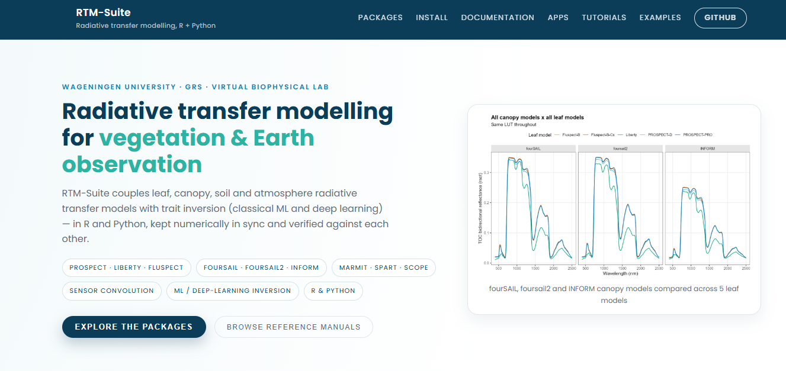
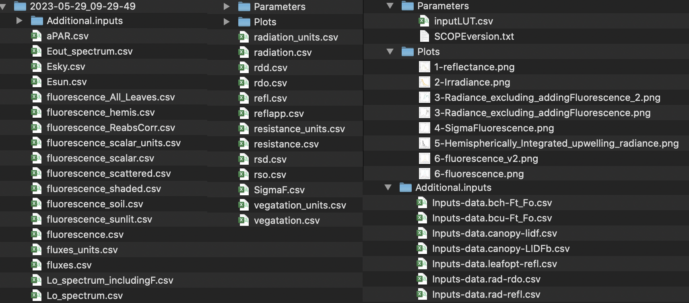
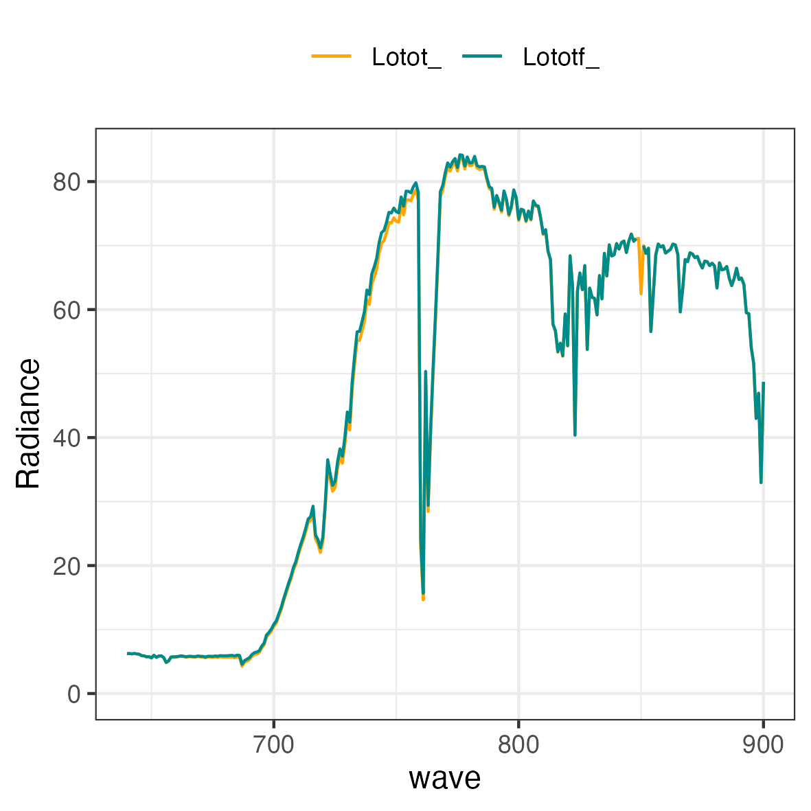
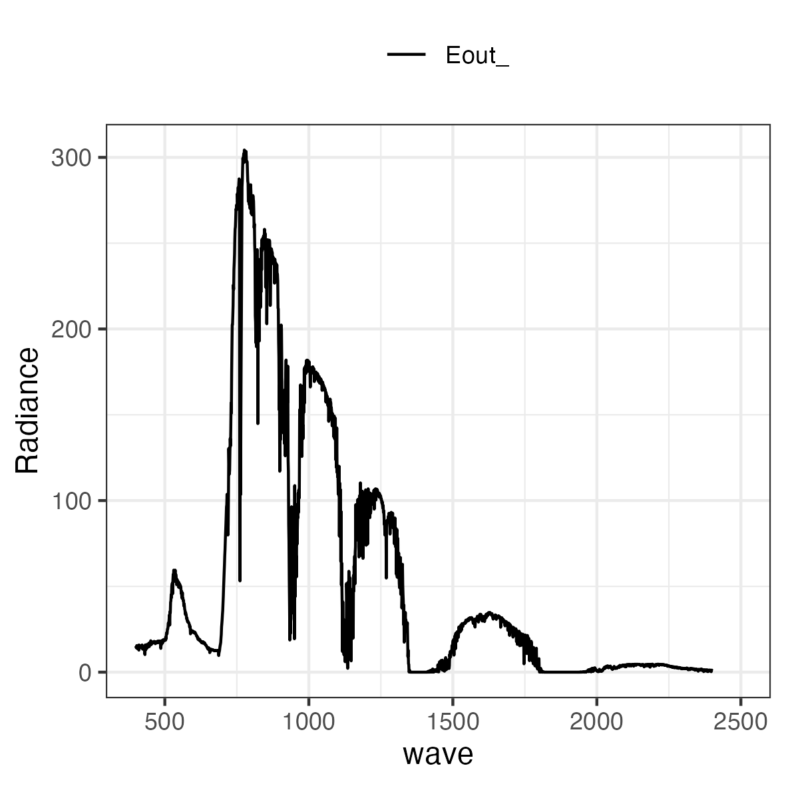
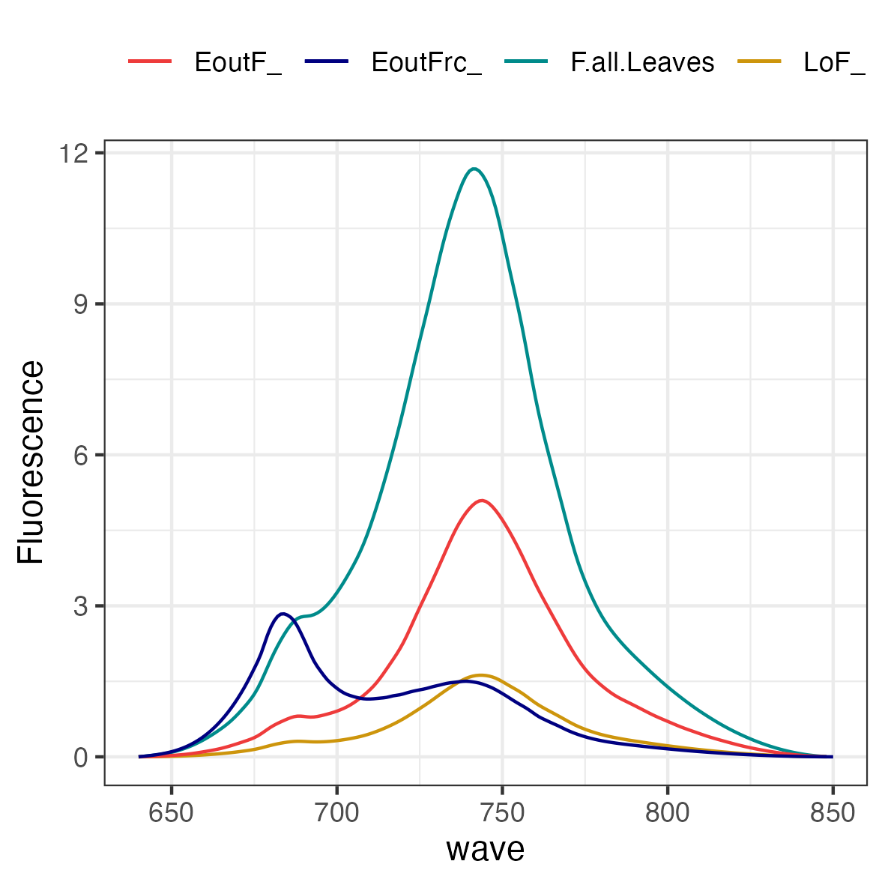
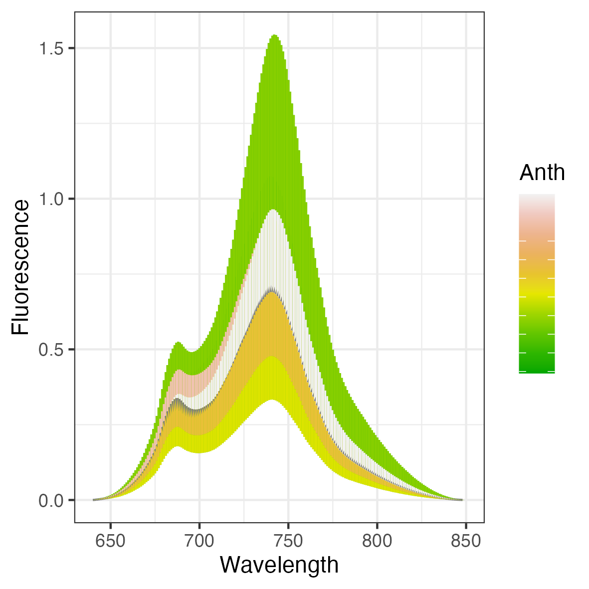

### SCOPEinR

[](https://www.r-project.org/) [](https://gitlab.com/caminoccg/scopeinr) [](https://github.com/CCGCAM/RTM-Suite) [-181717?logo=github&logoColor=white)](https://github.com/CCGCAM/scopeinpython)

**SCOPEinR** is an R package designed for implementing the Soil Canopy Observation, Photochemistry, and Energy Fluxes (SCOPE) radiative transfer model. Originally developed in MATLAB. SCOPE is a physically based model that simulates the interactions between **soil, vegetation and atmosphere**, linking radiative transfer with photosynthesis, chlorophyll fluorescence and energy balance processes (Van der Tol et al., 2009; Yang et al., 2020).

[**SCOPEinR documentation — SCOPE Model v2.1 in R**](https://ccgcam.github.io/RTM-Suite/scopeinr/index.html)

**SCOPEinR** also powers [`Apps/RTMs`](https://github.com/CCGCAM/RTM-Suite/tree/main/Apps/RTMs), a point-and-click Shiny app (no code required) for simulating canopy reflectance and chlorophyll fluorescence at Top of Canopy (TOC) level -- run it locally via `shiny::runApp("Apps/RTMs")`.

For broader radiative transfer model simulations and inter-comparisons, **SCOPEinR** can be used alongside **ToolsRTM**, which provides additional leaf, soil, canopy and soil–plant–atmosphere RT models within the **RTM-Suite** framework.

### RTM-Suite ecosystem

SCOPEinR is part of **RTM-Suite**, which brings together the R packages, interactive applications, tutorials, reproducible pipelines, and generated documentation for radiative transfer modelling.



**Fig.** The [RTM-Suite website](https://ccgcam.github.io/RTM-Suite/) — see **Documentation** for R/Python reference manuals, **Tutorials** for step-by-step walkthroughs (R and Python side by side), and **Examples** for copy-paste runnable code with real generated figures.

| Resource | Purpose | Access |
|------------------------|------------------------|------------------------|
| **ToolsRTM** (R) | Leaf, canopy, soil, atmosphere, sensor convolution, and trait inversion | [](https://gitlab.com/caminoccg/toolsrtm) |
| **SCOPEinR** (R) | Energy balance, photosynthesis, fluorescence, and SCOPE simulations in R | [](https://gitlab.com/caminoccg/scopeinr) |
| **toolsrtm** (Python) | Python port of ToolsRTM | [](https://github.com/CCGCAM/ToolsRTMinPython) |
| **scopeinpython** (Python) | Python port of SCOPEinR | [](https://github.com/CCGCAM/scopeinpython) |
| **RTM-Suite** | Monorepo: both R packages, both Python ports, apps, tutorials, docs | [](https://github.com/CCGCAM/RTM-Suite) |
| **Apps/RTMs** | Interactive access to the models without writing code (Shiny, run locally) | [Source](https://github.com/CCGCAM/RTM-Suite/tree/main/Apps/RTMs) |

### Documentation and learning resources

The complete documentation is maintained together in the [**RTM-Suite documentation hub**](https://ccgcam.github.io/RTM-Suite/), so the R and Python implementations, tutorials, package references, and model-comparison material can be explored from one place. The [SCOPEinR reference](https://ccgcam.github.io/RTM-Suite/scopeinr/index.html) and [SCOPEinR tutorials 01-11](https://ccgcam.github.io/RTM-Suite/scopeinr/articles/index.html) are the direct entry points.

**SCOPEinR** is part of [**RTM-Suite**](https://ccgcam.github.io/RTM-Suite/), a unified documentation hub for the R packages (`ToolsRTM`, `SCOPEinR`) and their Python counterparts (`toolsrtm`, `scopeinpython`). It brings together reference manuals, tutorials, examples, and reproducible workflows for radiative transfer modelling.

- [**SCOPEinR reference manual**](https://ccgcam.github.io/RTM-Suite/scopeinr/index.html): complete documentation for SCOPE v2.1 in R, including model inputs and outputs, radiative transfer, energy balance, photosynthesis, chlorophyll fluorescence (SIF), and simulation utilities.

- [**SCOPEinR tutorials, 01-11**](https://ccgcam.github.io/RTM-Suite/scopeinr/articles/index.html): the numbered step-by-step series -- getting started, soil/canopy BRDF/input structure, energy balance, fluorescence (SIF), building LUTs, parallel runs, sensitivity (direct vs. indirect trait effects), hybrid inversion, SIF-vs-photosynthesis, an end-to-end pipeline, and closing with **[Tutorial 11, the capstone](https://ccgcam.github.io/RTM-Suite/scopeinr/articles/t11-photosynthesis-capstone.html)**: ML retrieval of net photosynthesis (`Actot`) applied to a real Sentinel-2 time series and spatial map (STAC, Speulderbos forest, NL) -- paired with ToolsRTM's own real-EO tutorials (15/17).

- [**SCOPE course pipeline**](https://ccgcam.github.io/RTM-Suite/scopeinr/articles/scope-pipeline.html) and [**SIF and photosynthesis**](https://ccgcam.github.io/RTM-Suite/scopeinr/articles/sif-photosynthesis-proxy.html): the older, more comprehensive reference-manual versions of Tutorials 09-10 above, kept alongside the numbered series for their fuller detail.

- [**RTM-Suite**](https://ccgcam.github.io/RTM-Suite/): the common documentation hub connecting SCOPEinR with ToolsRTM and their Python counterparts, including reference manuals, tutorials, examples, and reproducible pipelines.

Documentation is also accessible from the installed R package through its help pages and vignettes.

### Installation

SCOPEinR requires R 4.3 or later and imports ToolsRTM. Install the current versions directly from their GitLab repositories:

``` r
if (!requireNamespace("remotes", quietly = TRUE)) {
  install.packages("remotes")
}

# Install the dependency first, then SCOPEinR.
remotes::install_gitlab("caminoccg/toolsrtm")
remotes::install_gitlab("caminoccg/scopeinr")

packageVersion("ToolsRTM")
packageVersion("SCOPEinR")
```

For an offline installation, downloaded source archives can still be used:

``` r
install.packages("path/to/toolsrtm-main.tar.gz", repos = NULL, type = "source")
install.packages("path/to/scopeinr-main.tar.gz", repos = NULL, type = "source")
```

### How to run SCOPE model in R

The package installs its default options and example LUT. Locate them with `system.file()` so the example works from any working directory:

``` r
scope_options <- read.csv(
  system.file("input", "setoptions.csv", package = "SCOPEinR"),
  check.names = FALSE
)

scope_lut <- read.csv(
  system.file("input", "LUT_input.csv", package = "SCOPEinR"),
  check.names = FALSE
)

scope_sim <- SCOPEinR::get.SCOPE(
  LUT = scope_lut[1, , drop = FALSE],
  options.SCOPE = scope_options,
  optipar = SCOPEinR::optipar2021.Pro.CX,
  get.outputs = "ALL",
  get.plots = FALSE
)
```

`get.SCOPE()` returns one list element per LUT row. For the example above, inspect the first simulation with `names(scope_sim[[1]])`. SCOPE currently uses its native multi-layer RTMo canopy calculation and Fluspect-Cx leaf optics, so `canopy.model` and alternative `leaf.model` values are not presented as interchangeable engines in this quick-start example.

### Runnable pipeline scripts

For the full workflow (simulate N SCOPE runs → convolve to Sentinel-2/PRISMA → compute indices → invert traits, e.g. Cab, LAI, or Vcmax25), see [`Scripts/Pipeline/SCOPE-1-simulate.R`](https://gitlab.com/caminoccg/toolsrtm/-/tree/main/Scripts/Pipeline) through `SCOPE-3-inversion_deep_learning.R` in the suite repo — the SCOPEinR counterpart to ToolsRTM's own pipeline scripts.

The main elements in `scope_sim[[1]]` are:

|               |               |                  |           |
|:-------------:|:-------------:|:----------------:|:---------:|
|   data.rad    |  data.fluxes  |    data.soil     | data.gap  |
| data.spectral | data.leafbio  |   data.angles    | data.bcu  |
| data.thermal  |  data.canopy  |    data.meteo    | data.bch  |
|   data.opts   | data.profiles | data.directional | iter.ebal |

#### Get SCOPE's outputs

``` r
SCOPEinR::get.SCOPE.outputs(
  data.sim = scope_sim,
  N.sims = length(scope_sim),
  LUT = scope_lut[1, , drop = FALSE],
  path.out = "outs/",
  get.more.inputs = c("refl", "lidf", "LIDFb", "Ft_Fo", "rdo"),
  get.plots = TRUE
)
```

The `get.SCOPE.outputs` function includes the `get.more.inputs` parameter, which allows for the addition of extra inputs and outputs in the output folder. In the previous example, we extracted the reflectance, LIDF angles used, LIDF-b parameter, Ft-Fo ratio, and TOC hemispherical-directional reflectance. These additional outputs will be saved in the `Additional.inputs` folder.



The `get.plots` function allows for the plotting of key outputs from the SCOPE model, with the default setting set to `FALSE`. This option is recommended for single simulations. When enabled, the `get.plots` parameter will generate plots for reflectance, irradiance, radiance, Sigma-fluorescence, and chlorophyll fluorescence emission.

{width="500"}

{width="500"}

{width="500"}

{width="500"}

{width="500"}

### Run the SCOPE model in parallel

For multiple LUT rows, use `get.SCOPE.parallel()`. Start with a modest number of workers and leave one or more CPU cores free for the operating system:

``` r
parallel_lut <- scope_lut[rep(1, 20), , drop = FALSE]

scope_sims_parallel <- SCOPEinR::get.SCOPE.parallel(
  LUT = parallel_lut,
  options.SCOPE = scope_options,
  optipar = SCOPEinR::optipar2021.Pro.CX,
  parallel = TRUE,
  n.cores = 4,
  get.outputs = "ALL",
  get.plots = FALSE,
  get.csv = FALSE
)
```

Set `get.csv = TRUE` to let the function write the simulation outputs to its output directory. For large production LUTs, process bounded chunks rather than keeping every full SCOPE result in memory at once. See [Tutorial 10 — End-to-End Pipeline](https://ccgcam.github.io/RTM-Suite/scopeinr/articles/t10-end-to-end-pipeline.html) for the complete simulation, sensor-convolution, and trait-inversion workflow.

### 1.6 Get some additional plots by main plant trait.

```         
output.folder = 'path With outputs'
plant.traits <- c('Vcmax25','EWT','Anth')

###  get.plots the options are 'fluorescence'; 'reflectance', and 'radiance'
get.SCOPE.plots(path.files=output.folder, plant.trait=plant.traits, get.plots='fluorescence')
```

{width="500"}

{width="500"}

{width="500"}

**Note** Figure 8-10 showed also the effects form other plant traits

### Citation

If you use **ToolsRTM** or **SCOPEinR**, please consider citing:

1.  Camino et al. (2024). **RT-Simulator: An Online Platform to Simulate Canopy Reflectance from Biochemical and Structural Plant Properties Using Radiative Transfer Models**. *IGARSS 2024*, Athens, Greece, pp. 2811-2814. [doi: 10.1109/IGARSS53475.2024.10642442](https://doi.org/10.1109/IGARSS53475.2024.10642442)

2.  Arano et al. (2024). **Enhancing Chlorophyll Content Estimation with Sentinel-2 Imagery: A Fusion of Deep Learning and Biophysical Models**. *IGARSS 2024*, Athens, Greece, pp. 4486-4489. doi: [10.1109/IGARSS53475.2024.10641613](https://doi.org/10.1109/IGARSS53475.2024.10641613)

3.  Camino et al. (in preparation). **Integrating Physiological Plant Traits with Sentinel-2 Imagery for Monitoring Gross Primary Production and Detecting Forest Disturbances**.

### References

The official SCOPE's github is available at <https://github.com/Christiaanvandertol/SCOPE>

Yang, P., E. Prikaziuk, W. Verhoef, and C. van der Tol. 2020. "SCOPE 2.0: A Model to Simulate Vegetated Land Surface Fluxes and Satellite Signals." Geoscientific Model Development Discussions 2020: 1--26. <https://doi.org/10.5194/gmd-2020-251>.

Van der Tol, C., W. Verhoef, J Timmermans, A Verhoef, and Z Su. 2009. "An Integrated Model of Soil-Canopy Spectral Radiances, Photosynthesis, Fluorescence, Temperature and Energy Balance." Biogeosciences 6 (12): 3109--29. <https://doi.org/10.5194/bg-6-3109-2009>.

Other relevant references:

Christiaan van der Tol, Micol Rossini, Sergio Cogliati, Wouter Verhoef, Roberto Colombo, Uwe Rascher, and Gina Mohammed. A model and measurement comparison of diurnal cycles of sun-induced chlorophyll fluorescence of crops. Remote Sens. Environ., 186:663--677, dec 2016. URL: <https://doi.org/10.1016/j.rse.2016.09.021>.

Wout. Verhoef and Nationaal Lucht- en Ruimtevaartlaboratorium (Netherlands). Theory of radiative transfer models applied in optical remote sensing of vegetation canopies. [publisher not identified], 1998. ISBN 9054858044. URL: <https://library.wur.nl/WebQuery/wda/945481>.

Peiqi Yang, Wout Verhoef, and Christiaan van der Tol. The mSCOPE model: A simple adaptation to the SCOPE model to describe reflectance, fluorescence and photosynthesis of vertically heterogeneous canopies. Remote Sens. Environ., 201:1--11, nov 2017. URL: <https://doi.org/10.1016/j.rse.2017.08.029>.

Van der Tol, C.V, Berry J. A., Campbell P.K.E., and Rascher U. Models of fluorescence and photosynthesis for interpreting measurements of solar-induced chlorophyll fluorescence. J. Geophys. Res. Biogeosciences, 119(12):2312--2327, 2014.

### License

[{alt="RTM-Suite code: MIT"}](#0) [{alt="Ported GPL models: GPL--3.0"}](#0) [{alt="Model licenses"}](#0)

**SCOPEinR** is a port of **SCOPE**, whose own reference implementation ([`Christiaanvandertol/SCOPE`](https://github.com/Christiaanvandertol/SCOPE)) is GPL-3.0-licensed. Since this package's entire purpose is porting SCOPE, `SCOPEinR` is distributed under **GPL-3.0** (`License: GPL-3` in `DESCRIPTION`), matching its Python port `scopeinpython`'s own license.

Within that GPL-3.0 distribution, two kinds of code coexist:

- **The core SCOPE physics port** (`RTMo`, `RTMf`, `RTMt.sb`, `RTMz`, `BSM`, `Biochemical_functions`, `ebal`, `fluspect_*_ForSCOPE`, ...) is a direct translation of SCOPE's own GPL-3.0 algorithm -- GPL-3.0, same as upstream.
- **Original utilities developed in this package** -- LUT generation and batch/time-series execution (`getLUT.SCOPE`, `getLUT_time`, `getinputLUT`, `get.SCOPE.parallel`), output aggregation, CSV export and plotting (`get.SCOPE.outputs`, `get.SCOPE.ind`, `get.merge.SCOPE`, `get.outs.lut*`, `getCSV`), and the trait-inversion and LUT-matching workflows built around SCOPE's outputs -- are original, independent work and are **MIT** individually. Because GPL-3.0 requires the combined, distributed package to be GPL-3.0 as a whole, the package you install is still `License: GPL-3` end to end; the MIT notice above is about authorship/reuse of those specific original files on their own, not a separate installable subset.

See [`THIRD_PARTY_LICENSES.md`](THIRD_PARTY_LICENSES.md) for the full source-code provenance and citation details. `SCOPEinR` depends on [`ToolsRTM`](https://gitlab.com/caminoccg/toolsrtm) for leaf-level optics -- see that package's own `THIRD_PARTY_LICENSES.md` for the licensing of those specific leaf models. Always cite the original SCOPE publication(s) when using this package in scientific work, in addition to citing RTM-Suite/SCOPEinR.
