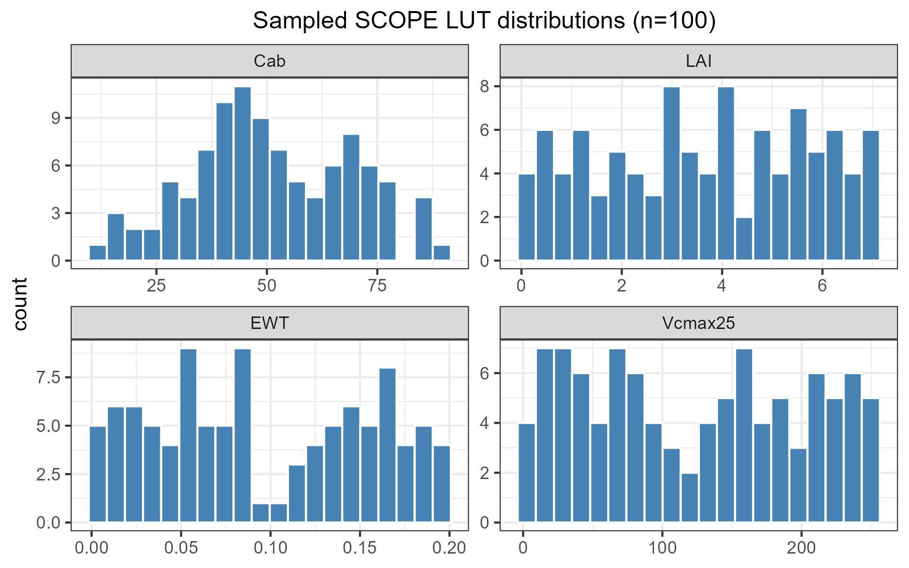
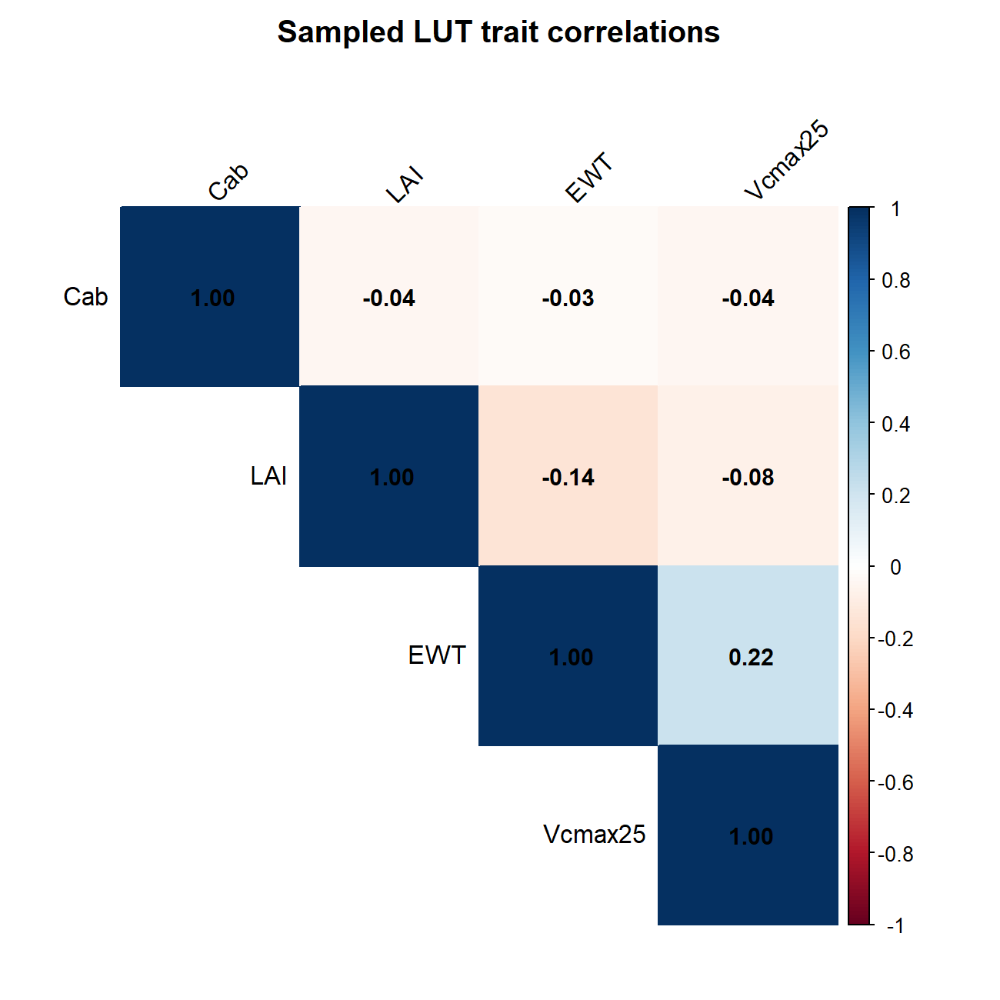
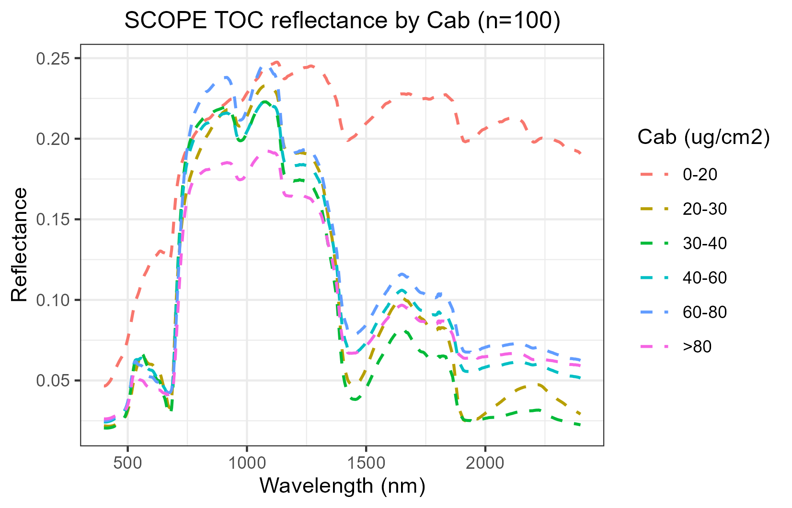
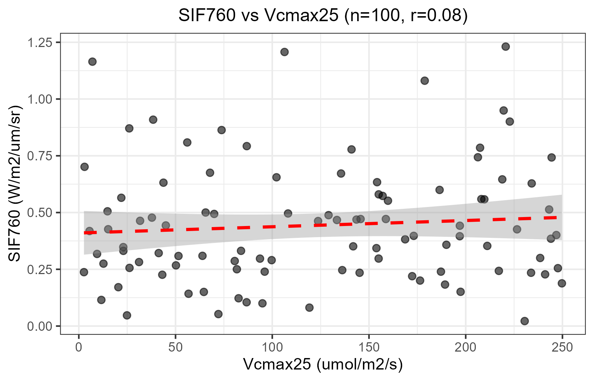
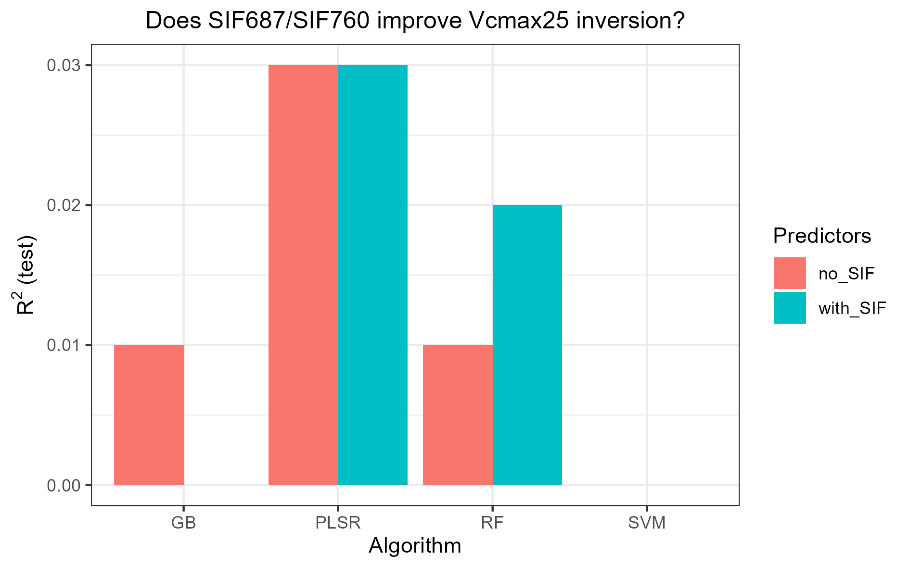
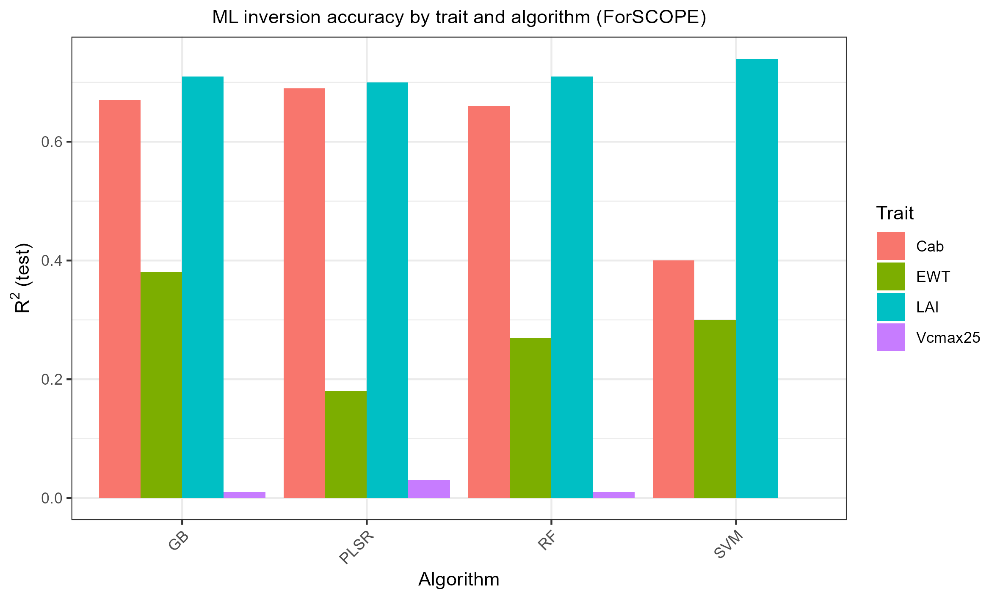
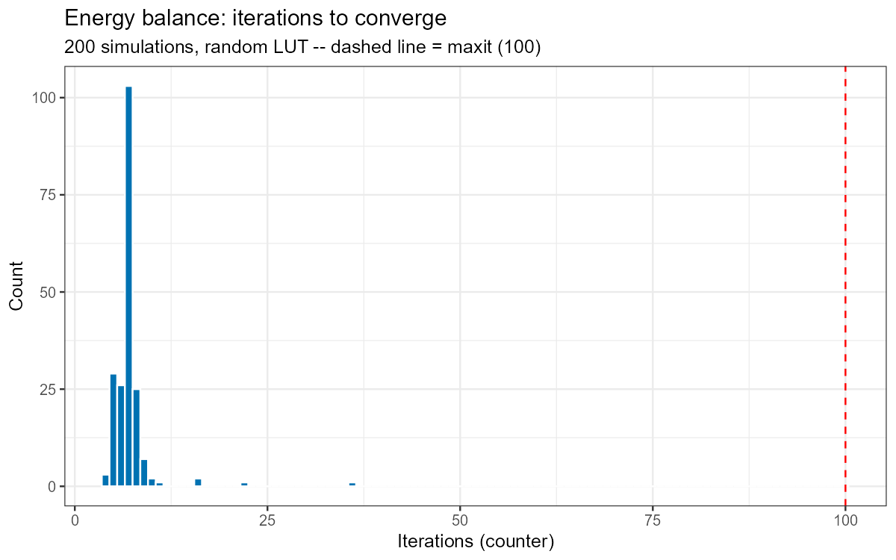
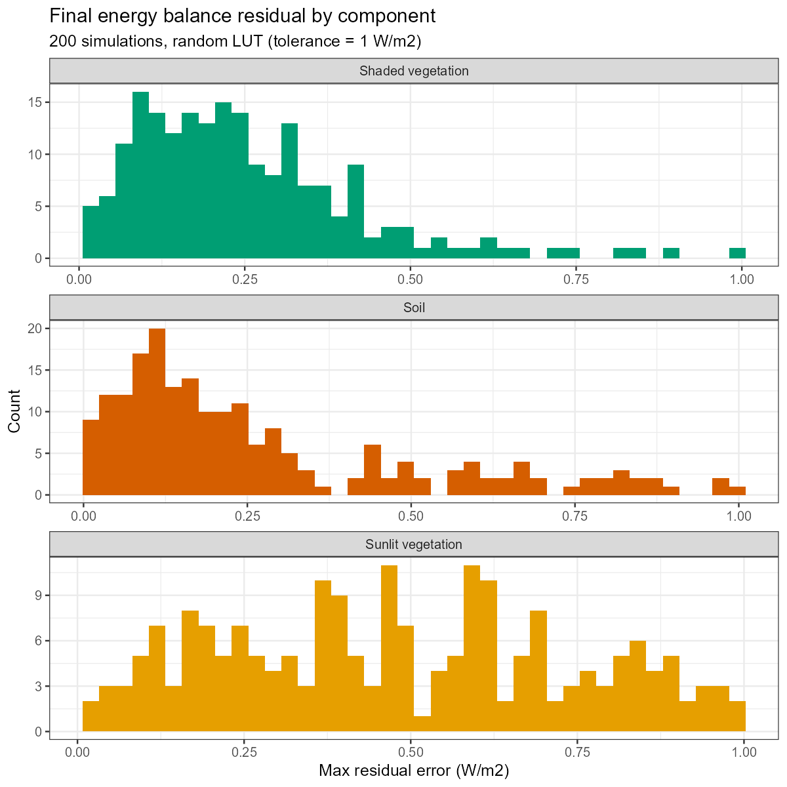

```{r, include = FALSE}
knitr::opts_chunk$set(collapse = TRUE, comment = "#>", eval = FALSE, fig.align = "center")
```

`Scripts/R/ForSCOPE/` is the SCOPEinR counterpart to ToolsRTM's `ForPROSAIL`
course pipeline (see that package's `course-pipeline` article for the general
pattern) -- with one addition: SCOPE runs the full Soil-Canopy-Observation,
Photochemistry and Energy-balance model, so it also produces chlorophyll
fluorescence (SIF) and can target `Vcmax25` (maximum carboxylation rate), not
just leaf/canopy optical traits.

```r
if (!requireNamespace("ToolsRTM", quietly = TRUE)) remotes::install_gitlab("caminoccg/toolsrtm")
if (!requireNamespace("SCOPEinR", quietly = TRUE)) remotes::install_gitlab("caminoccg/scopeinr")
library(ToolsRTM); library(SCOPEinR)
source("Scripts/R/ForSCOPE/3-simulate_LUT.R")   # ~100 SCOPE runs, several minutes
source("Scripts/R/ForSCOPE/4-inversion_ML.R")   # Cab/LAI/EWT/Vcmax25 x 11 algorithms + a SIF experiment
source("Scripts/R/ForSCOPE/5-inversion_DL.R")
```

Unlike the optical-only models, `get.SCOPE()`'s `leaf.model`/`canopy.model`
arguments are **not functional** -- SCOPE always runs its own integral
multi-layer Fluspect-Cx + RTMo (verified directly in
`Scripts/R/Comparison/compare_SCOPE_models.R`, not just documented). There is
one leaf/canopy configuration, not a choice to expose here.

## 1. Simulate

Same shape as the ToolsRTM course scripts: build a LUT via `getLUT.SCOPE()`,
run `get.SCOPE()` row-by-row (wrapped in `tryCatch` -- one row with an
extreme random parameter combination can otherwise crash the whole batch with
no R-level error, a native/numerical fault rather than a catchable `stop()`),
convolve to sensors, compute indices, save diagnostics.

```{r fig-hist, eval = TRUE, echo = FALSE, out.width = "90%"}

```

```{r fig-corr, eval = TRUE, echo = FALSE, out.width = "70%"}

```

```{r fig-refl, eval = TRUE, echo = FALSE, out.width = "80%"}

```

## 2. Solar-induced fluorescence (SIF)

`calc_fluorescence=1` is on by default in `setoptions.csv`, so every SCOPE
run already computes fluorescence radiance (`data.rad$LoF_`, over
`data.spectral$wlF`, roughly 640-850nm). `3-simulate_LUT.R` extracts the two
classic single-band SIF metrics, SIF687 and SIF760, as extra LUT columns.

```{r sif-extract}
wlF <- sims[[1]]$data.spectral$wlF
i687 <- which.min(abs(wlF - 687)); i760 <- which.min(abs(wlF - 760))
LUT$SIF687 <- sapply(sims, function(s) s$data.rad$LoF_[i687])
LUT$SIF760 <- sapply(sims, function(s) s$data.rad$LoF_[i760])
```

## 3. Does SIF predict Vcmax25? A real experiment, not just a discussion

Photosynthetic electron transport is directly linked to fluorescence emission
-- in principle, SIF should carry information about photosynthetic capacity
(`Vcmax25`) beyond what reflectance alone captures. `4-inversion_ML.R` tests
this directly: it inverts `Vcmax25` twice, once from reflectance+indices
alone and once with SIF687/SIF760 added, across 4 algorithms.

```{r fig-sif-vcmax, eval = TRUE, echo = FALSE, out.width = "80%"}

```

```{r fig-sif-comparison, eval = TRUE, echo = FALSE, out.width = "80%"}

```

**Honest result: no.** R² stays at 0.00-0.03 whether or not SIF is included.
Worth understanding *why*, since it's not that "SIF doesn't work" --

```{r fig-ml-summary, eval = TRUE, echo = FALSE, out.width = "90%"}

```

Cab and LAI invert reasonably (R²=0.66-0.74), EWT modestly (0.18-0.38), but
`Vcmax25` is barely predictable from *anything* here, SIF included. The root
cause: `getLUT.SCOPE()` samples `Vcmax25` fully independently of `Cab`/leaf
nitrogen/everything else. In real leaves, Vcmax correlates with nitrogen and
chlorophyll content -- and that correlation is exactly what real SIF-Vcmax
remote-sensing studies rely on as their proxy signal. Sampled at random here,
there's no such signal for *any* method, SIF or otherwise, to find. If you
want a fair test of the SIF-Vcmax hypothesis, correlate `Vcmax25` with `Cab`
first (the same `correlatedValue()` mechanism `ForPROSAIL` uses for
`Car`~`Cab`) before re-running this comparison.

## 4. Energy balance convergence

`Scripts/R/ForSCOPE/6-validate_ebal_convergence.R` runs many randomized SCOPE
simulations and records how many iterations the energy-balance solver took to
converge, and the residual error per component (sunlit vegetation, shaded
vegetation, soil) -- a numerical-stability check, not a trait-retrieval one.

```{r fig-ebal-iter, eval = TRUE, echo = FALSE, out.width = "80%"}

```

```{r fig-ebal-resid, eval = TRUE, echo = FALSE, out.width = "80%"}

```

200/200 simulations converged (100%), median 7 iterations, residuals well
under 1 W/m² for every component.

## Where to go next

- **ToolsRTM**'s `course-pipeline` article for the optical-only models
  (fourSAIL, foursail2, INFORM, SPART, MARMIT) this pipeline mirrors.
- `Scripts/R/ForSCOPE/1-getSCOPE.R`, `1-getSCOPE-v3_withChunck.R`,
  `2-Explore_outputsSCOPE.R` -- lower-level teaching scripts covering
  `get.SCOPE()`/`get.SCOPE.parallel()` directly, and how to explore SCOPE's
  own multi-part output structure (`data.rad`, `data.fluxes`, `data.canopy`, etc).
