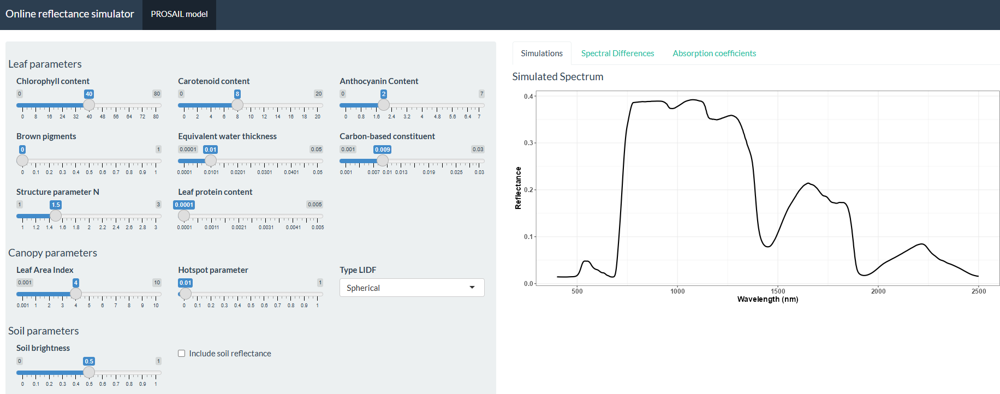

### ToolsRTM package

[](https://www.r-project.org/) [](https://gitlab.com/caminoccg/toolsrtm) [](https://github.com/CCGCAM/RTM-Suite) [-181717?logo=github&logoColor=white)](https://github.com/CCGCAM/ToolsRTMinPython)

The **ToolsRTM** package provides a comprehensive suite of tools for simulating canopy reflectance using various radiative transfer (RT) models at multiple satellite resolutions. Currently in the testing phase, this package is designed to facilitate detailed simulations, enabling versatile and accurate analyses of canopy reflectance characteristics.

For canopy-level simulations, the package features models such as **INFORM**, **fourSAIL**, and **fourSAIL2**. When it comes to leaf-level simulations, it includes the **PROSPECT** model (with D and PRO variants), **Liberty**, and **FLUSPECT** (B-Cx). These models empower users to conduct sophisticated simulations that capture the intricate dynamics of reflectance behavior in both leaf and canopy contexts.

Additionally, the **SPART** model (Soil-Plant-Atmosphere Radiative Transfer model) is tailored for satellite measurements in the solar spectrum. It integrates three computationally efficient RT models: the **BSM** model for soil, **PROSAIL** for vegetation canopies, and **SMAC** for the atmosphere. These components are interconnected using the four-stream theory and the adding method, allowing SPART to simulate directional top-of-atmosphere (TOA) spectral observations. This approach accounts for significant effects, such as sun-observer geometries and the non-Lambertian reflectance of the land surface.

This package specifically simulates the **MARMIT** (Multilayer rAdiative tRansfer Model of soIl reflecTance), a radiative transfer model that predicts the spectral reflectance of bare soil across the solar domain, from 400 nm to 2500 nm with a 1 nm resolution, based on its surface water content. To run the MARMIT model, use the `get.marmit1` and `get.marmit2` functions.

The necessary datasets for running these models can be downloaded from the corresponding databases. Each of the eight database directories (Bablet-2016, Dupiau-2020, Humper-2015, Lesaignoux-2008, Liu-2002, Lobell-2002, Marcq-2012, and Philpot-2014) contains essential data for model validation and simulations.

For more information, please visit: MARMIT [GitLab](https://pss-gitlab.math.univ-paris-diderot.fr/marmit/marmit)


**Fig. 1.** Simulations performed with ToolsRTM Package for several radiative transfer models .

### Installation

ToolsRTM requires R 4.3 or newer. Install the development version directly from GitLab:

``` r
if (!requireNamespace("remotes", quietly = TRUE)) {
  install.packages("remotes")
}

if (!requireNamespace("ToolsRTM", quietly = TRUE)) {
  remotes::install_gitlab("caminoccg/toolsrtm", upgrade = "never")
}
```

Alternatively, install a downloaded source archive:

``` r
install.packages(
  "path/to/toolsrtm-main.tar.gz",
  repos = NULL,
  type = "source"
)
```

Check the installed version:

``` r
packageVersion("ToolsRTM")
```

The version described by this README is 0.62.5.

### Quick example

The following example creates a small lookup table and runs PROSPECT-PRO coupled to fourSAIL. Both `getLUT()` and `simulate_RTM()` are exported by the current package.

``` r
inputs <- ToolsRTM::inputsPROSAIL
lut <- as.data.frame(
  ToolsRTM::getLUT(inputs = inputs, nLUT = 30, setseed = 1234)
)
rsoil <- rep(0.2, 2101)

simulation <- ToolsRTM::simulate_RTM(
  inputLUT = lut[1, , drop = FALSE],
  rsoil = rsoil,
  leaf.model = "PROSPECT-PRO",
  canopy.model = "fourSAIL"
)
```

### SCOPEinR

Install [SCOPEinR](https://gitlab.com/caminoccg/scopeinr) when the workflow requires the SCOPE model. ToolsRTM is installed first because SCOPEinR imports it.

``` r
if (!requireNamespace("remotes", quietly = TRUE)) {
  install.packages("remotes")
}

remotes::install_gitlab("caminoccg/toolsrtm", upgrade = "never")
remotes::install_gitlab("caminoccg/scopeinr", upgrade = "never")
packageVersion("SCOPEinR")
```

For an offline installation, replace the second `install_gitlab()` call with:

``` r
install.packages(
  "path/to/scopeinr-main.tar.gz",
  repos = NULL,
  type = "source"
)
```

### Manuals and RTM-Suite resources

| Resource | Description |
|------------------------------------|------------------------------------|
| [RTM-Suite documentation](../docs/index.html) | Entry point for the complete R suite |
| [ToolsRTM reference](../docs/toolsrtm/index.html) | Function reference and package articles |
| [Course pipeline](../docs/toolsrtm/articles/course-pipeline.html) | Simulation, spectral convolution and inversion |
| [Model comparison and sensitivity](../docs/toolsrtm/articles/model-comparison-and-sensitivity.html) | Comparison and sensitivity workflows |
| [SCOPEinR reference](../docs/scopeinr/index.html) | SCOPE model documentation |
| [Tutorials](../Tutorials/) | Reproducible R tutorials included in RTM-Suite |
| [Pipeline scripts](../Scripts/R/Pipeline/) | Adaptable simulate-to-invert workflows |

### Interactive application

Use the [online RT-Simulator](https://carlos-camino.shinyapps.io/0-toolsrtm-simulator/) to configure models and inspect simulations interactively. Its source code is maintained separately in the [RT-Simulator GitLab repository](https://gitlab.com/caminoccg/toolsrtm-simulator); the Shiny application is not launched through the core ToolsRTM API.



**Fig. 2.** Interactive reflectance simulator using PROSAIL model based on shiny app.

### Citation of the main radiative transfer models

For further details on the the radiative transfer modelsl, please refer to the original publications by the authors.

#### PROSPECT model

Féret J-B, Gitelson AA, Noble SD & Jacquemoud S, 2017. PROSPECT-D: Towards modeling leaf optical properties through a complete lifecycle. Remote Sensing of Environment, 193, 204--215. <https://doi.org/10.1016/j.rse.2017.03.004>

Féret, J.B., Berger, K., de Boissieu, F., Malenovský, Z., 2021. PROSPECT-PRO for estimating content of nitrogen-containing leaf proteins and other carbon-based constituents. Remote Sens. Environ. 252. <https://doi.org/10.1016/j.rse.2020.112173>

Jacquemoud S, Baret F, Hanocq J-F, 1992. Modeling spectral and bidirectional soil reflectance. Remote Sensing of Environment, 41, 123--132. [https://doi.org/10.1016/0034-4257(92)90072-R](https://doi.org/10.1016/0034-4257(92)90072-R){.uri}

Jacquemoud, S., Baret, F., 1990. PROSPECT: a model of leaf optical properties spectra. Remote Sens. Environ. 34, 75--91. [https://doi.org/10.1016/0034-4257(90)90100-Z](https://doi.org/10.1016/0034-4257(90)90100-Z){.uri}.

More info: <http://teledetection.ipgp.fr/prosail/>

#### FLUSPECT model

Vilfan, N., van der Tol, C., Muller, O., Rascher, U., Verhoef, W., 2016. Fluspect-B: A model for leaf fluorescence, reflectance and transmittance spectra. Remote Sens. Environ. 186, 596?615. <doi:10.1016/j.rse.2016.09.017>

#### Liberty model

Dawson, T. P., Curran, P. J., & Plummer, S. E. (1998). LIBERTY—Modeling the Effects of Leaf Biochemical Concentration on Reflectance Spectra. Remote Sensing of Environment, 65(1), 50–60. [https://doi.org/10.1016/S0034-4257(98)00007-8](https://doi.org/10.1016/S0034-4257(98)00007-8){.uri}

Di Vittorio, A. V. (2009). Enhancing a leaf radiative transfer model to estimate concentrations and in vivo specific absorption coefficients of total carotenoids and chlorophylls a and b from single-needle reflectance and transmittance. Remote Sensing of Environment, 113(9), 1948–1966. <https://doi.org/10.1016/j.rse.2009.05.002>

#### fourSAIL & fourSAIL-2 models

Verhoef W & Bach H, 2007. Coupled soil--leaf-canopy and atmosphere radiative transfer modeling to simulate hyperspectral multi-angular surface reflectance and TOA radiance data. Remote Sensing of Environment, 109:166-182. <doi:10.1016/j.rse.2006.12.013>

Verhoef W, Jia L, Xiao Q & Su Z, 2007. Unified optical-thermal four-stream radiative transfer theory for homogeneous vegetation canopies. IEEE Transactions in Geosciences and Remote Sensing, 45:1808--1822. <https://doi.org/10.1109/TGRS.2007.895844> PROSAIL

Jacquemoud S, Verhoef W, Baret F, Bacour C, Zarco-Tejada PJ, Asner GP, François C & Ustin SL, 2009. PROSPECT+ SAIL models: A review of use for vegetation characterization. Remote Sensing of Environment, 113:S56--S66. <https://doi.org/doi:10.1016/j.rse.2008.01.026>

Berger K, Atzberger C, Danner M, D'Urso G, Mauser W, Vuolo F & Hank T 2018. Evaluation of the PROSAIL Model Capabilities for Future Hyperspectral Model Environments: A Review Study. Remote Sensing, 10:85. <https://doi.org/10.3390/rs10010085>

#### Invertible Forest Reflectance Model

Atzberger, C., 2000. Development of an Invertible Forest Reflectance Model: The INFOR- model.

Schlerf, M., Atzberger, C., 2006. Inversion of a forest reflectance model to estimate structural canopy variables from hyperspectral remote sensing data. Remote Sens. Environ. 100, 281--294. <https://doi.org/10.1016/j.rse.2005.10.006>.

Atzberger, C. 2000: Development of an invertible forest reflectance model: The INFOR-Model.In: Buchroithner (Ed.): A decade of trans-european remote sensing cooperation. Proceedings of the 20th EARSeL Symposium Dresden, Germany, 14.-16. June 2000: 39-44.

Rosema, A., Verhoef, W., Noorbergen, H. 1992: A new forest light interaction model in support of forest monitoring. Remote Sensing of Environment, 42: 23-41.

Jacquemoud S., Ustin S.L., Verdebout J., Schmuck G., Andreoli G., Hosgood B. (1996): Estimating leaf biochemistry using the PROSPECT leaf optical properties model, Remote Sens. Environ., 56:194-202.

Verhoef, W. 1984: Light scattering by leaf layers with application to canopy reflectance modeling: The SAIL model. Remote Sensing of Environment, 16: 125-141.

Basic version of INFORM: Clement Atzberger, 1999 INFORM modifications and validation: Martin Schlerf, 2004-2007

#### The SPART model: a soil-plant-atmosphere radiative transfer model for satellite measurements in the solar spectrum

Yang, P., van der Tol, C., Yin, T., & Verhoef, W. (2020). The SPART model: A soil-plant-atmosphere radiative transfer model for satellite measurements in the solar spectrum. Remote Sensing of Environment, 247, 111870.

#### SCOPE model: The Soil Canopy Observation, Photochemistry and Energy fluxes model

Yang, P., Verhoef, W., & van der Tol, C. (2017). The mSCOPE model: A simple adaptation to the SCOPE model to describe reflectance, fluorescence and photosynthesis of vertically heterogeneous canopies. Remote sensing of environment, 201, 1-11.

Yang, P., Prikaziuk, E., Verhoef, W., & Van der Tol, C. (2021). **SCOPE 2.0: A model to simulate vegetated land surface fluxes and satellite signals**. *Geoscientific Model Development*, 14, 4697–4712. <https://doi.org/10.5194/gmd-14-4697-2021>.

Van der Tol, C., Verhoef, W., Timmermans, J., Verhoef, A., & Su, Z. (2009). **An integrated model of soil-canopy spectral radiances, photosynthesis, fluorescence, temperature, and energy balance**. *Biogeosciences*, 6(12), 3109–3129. <https://doi.org/10.5194/bg-6-3109-2009>.

#### MARMIT model (Multilayer rAdiative tRansfer Model of soIl reflecTance)

Bablet A., Vu P.V.H., Jacquemoud S., Viallefont-Robinet F., Fabre S., Briottet X., Sadeghi M., Whiting M.L., Baret F. and Tian J. (2018), MARMIT: a multilayer radiative transfer model of soil reflectance to estimate surface soil moisture content in the solar domain (400–2500 nm), Remote Sensing of Environment, 217:1-17. <https://doi.org/10.1016/j.rse.2018.07.031>.

Dupiau A., Jacquemoud S., Briottet X., Fabre S., Viallefont-Robinet F., Philpot W., Di Biagio C., Hébert H. and Formenti P. (2022), MARMIT-2: an improved version of the MARMIT model to predict soil reflectance as a function of surface water content in the solar domain, Remote Sensing of Environment, 272:112951. <https://doi.org/10.1016/j.rse.2022.112951>.

### License

[](https://www.gnu.org/licenses/gpl-3.0)

**ToolsRTM** is a port of several radiative transfer models bundled behind one common R interface, and not all of them carry the same license. Three of the bundled models -- **Fluspect-B**, **fourSAIL2**, and **SPART** -- are ports of GPL-3.0-licensed original models, and GPL-3.0 requires any combined work incorporating GPL-3.0 code to be distributed as GPL-3.0 as a whole. `ToolsRTM` is therefore distributed under **GPL-3.0** (`License: GPL-3` in `DESCRIPTION`), matching its Python port `toolsrtm`'s own license.

See [`THIRD_PARTY_LICENSES.md`](THIRD_PARTY_LICENSES.md) for the license and source-code provenance of every individual model this package implements (some are independently MIT-licensable on their own, e.g. PROSPECT-D/-PRO; that does not change the combined package's GPL-3.0 status). Always cite the original publication(s) of each model you use, in addition to citing RTM-Suite/ToolsRTM.
