```{r, include = FALSE}
knitr::opts_chunk$set(collapse = TRUE, comment = "#>", eval = FALSE, fig.align = "center")
```

This article walks through the `Scripts/For*/` course pipeline shipped in the
[0-RTM-Suite repo](https://gitlab.com/caminoccg) alongside this package: a
consistent simulate &rarr; convolve &rarr; index &rarr; invert workflow, one
folder per canopy model (`ForPROSAIL`, `ForFoursail2`, `ForINFORM`), plus
`ForSPART` (soil-plant-atmosphere, top-of-atmosphere) and `ForMARMIT`
(soil-only, moisture retrieval). Every figure below is real output from an
actual run of these scripts, not a mockup -- code chunks are shown but not
re-executed when this article is built (the full pipeline takes several
minutes per folder), so treat them as copy-paste starting points against your
own installed package.

If you just want to run something, the fastest path is:

```r
devtools::load_all("ToolsRTM/R")   # or library(ToolsRTM) once installed
source("Scripts/ForPROSAIL/3-simulate_LUT.R")   # ~10s, 100 simulations
source("Scripts/ForPROSAIL/4-inversion_ML.R")   # a few minutes, 11 algorithms x 3 traits
source("Scripts/ForPROSAIL/5-inversion_DL.R")   # a few minutes, needs Scripts/Pipeline/0-setup_python_env.R run once first
```

Everything below explains what each step actually does and why, using
`ForPROSAIL` (fourSAIL canopy model) as the running example, then shows how
the *same* pipeline looks for the other four folders with just a couple of
lines changed.

## 1. Simulate a LUT

Every `1-simulate_LUT.R` (`3-simulate_LUT.R` in `ForPROSAIL` specifically,
numbered after that folder's pre-existing field-calibration scripts) does the
same six things:

1. Draw `n.samples` (always 100) trait combinations via `getLUT()`, optionally
   correlating one trait with another via `correlatedValue()` (e.g. `Car`
   tracking `Cab`, since real leaf pigments co-vary).
2. Save a histogram grid and a correlation heatmap of the sampled traits, so
   you can see at a glance what actually varied and how.
3. Build a soil spectrum -- `get.marmit.rsoil()` by default, so soil moisture
   is physically realistic rather than a flat guess.
4. Run the canopy model (`simulate_RTM()`, which dispatches to
   `foursail()`/`foursail2()`/`inform()`) for every LUT row.
5. Convolve to Sentinel-2A, Sentinel-2B, and PRISMA via
   `get.spectra.convolved()`, and compute vegetation indices at native
   resolution and per sensor via `getIndices()`/`getIndicesSE2()`.
6. Save diagnostic figures and a `1-datasets.rds` that the next two scripts
   read back.

```{r sim-code}
n.samples    <- 100
leaf.model   <- "PROSPECT-D"
canopy.model <- "fourSAIL"
correlate.traits <- list(Car = list(with = "Cab", scale = 1/4, r = 0.8))

# ... build LUT, apply correlate.traits, run simulate_RTM() per row,
#     convolve to sensors, compute indices -- see the full script for detail.
```

### Trait distributions and correlations

```{r fig-hist, eval = TRUE, echo = FALSE, out.width = "90%"}
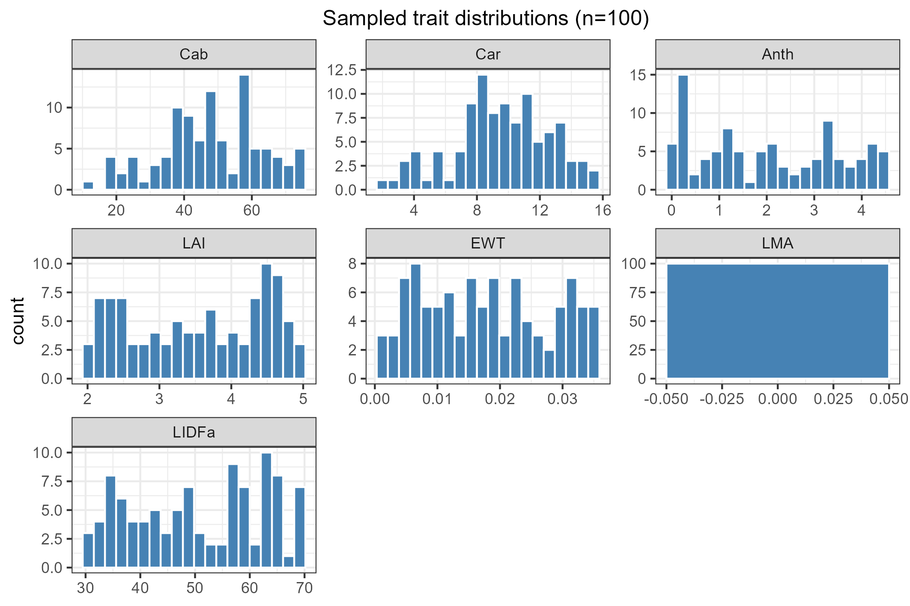
```

```{r fig-corr, eval = TRUE, echo = FALSE, out.width = "70%"}
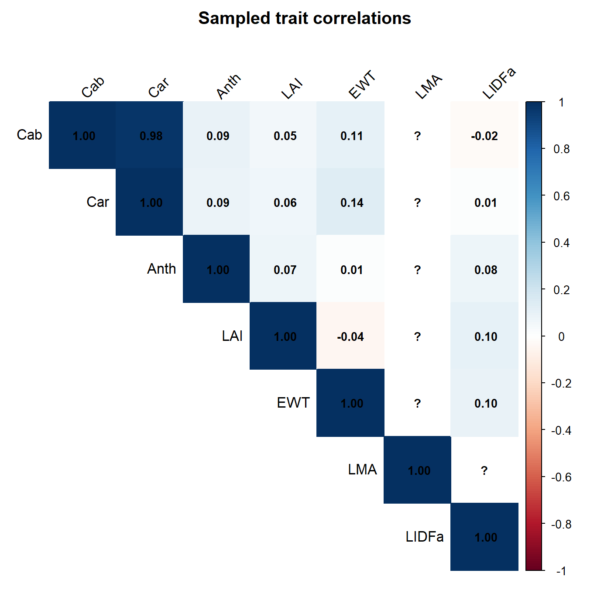
```

Note `Car`~`Cab` at r=0.98 -- much stronger than the target r=0.8 passed to
`correlatedValue()`. That's a real, useful thing to notice when working with
this function: the realized correlation can run higher than the target,
especially for narrow-range traits, so always check `cor()` of the result
rather than trusting the parameter alone (both scripts print the realized `r`
for exactly this reason).

### Reflectance by trait, and by trait percentile

```{r fig-refl-cab, eval = TRUE, echo = FALSE, out.width = "80%"}
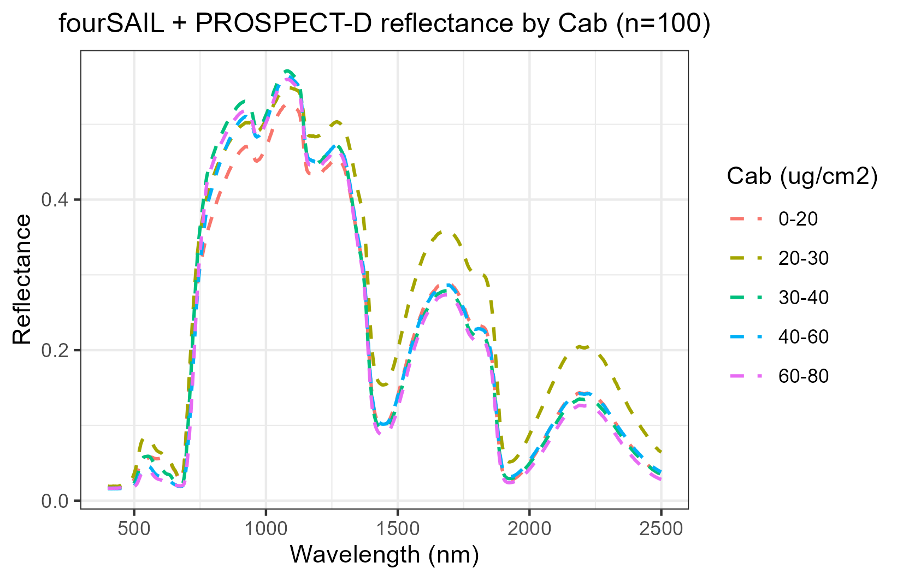
```

```{r fig-percentile, eval = TRUE, echo = FALSE, out.width = "80%"}
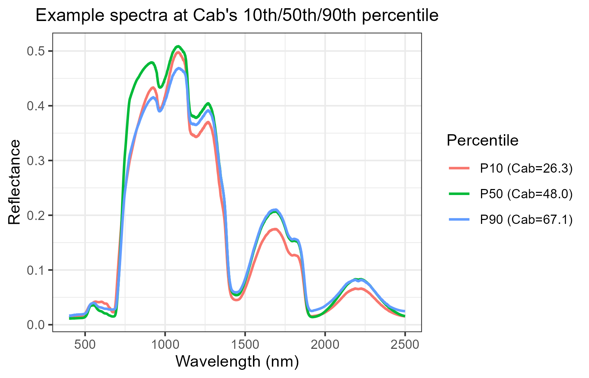
```

The first plot bins simulations by `Cab` and averages within each bin --
good for seeing the overall trend (reflectance drops in the visible as
chlorophyll increases). The second shows three *individual* simulated spectra
at `Cab`'s 10th/50th/90th percentile, unaveraged -- useful for sanity-checking
that a single simulation looks physically reasonable, not just the ensemble.

### Sensor convolution

```{r fig-sensor, eval = TRUE, echo = FALSE, out.width = "80%"}
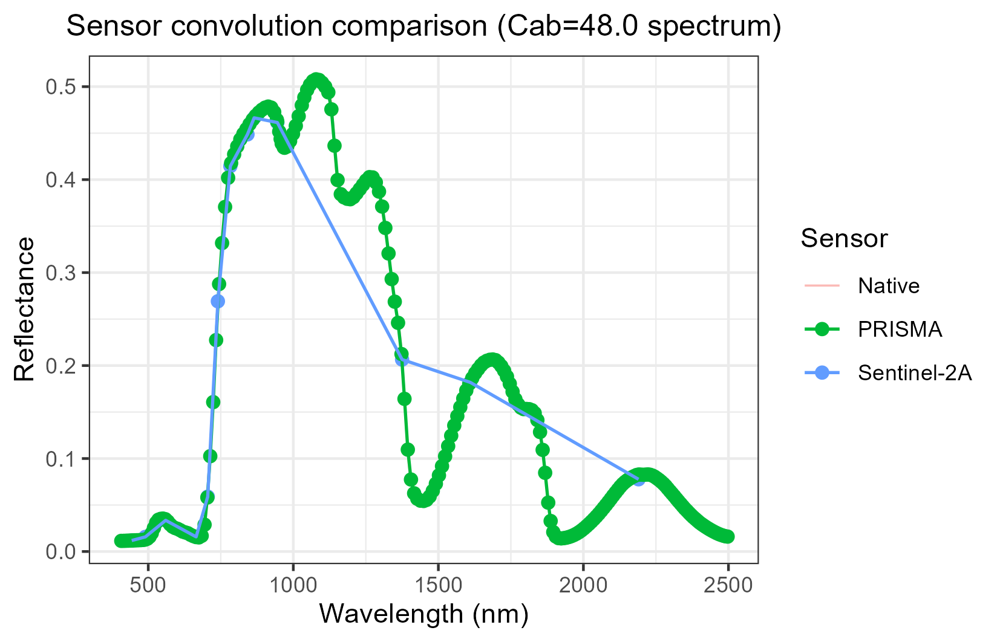
```

PRISMA (green) is dense enough to nearly retrace the native curve; Sentinel-2A
(blue) is 13 discrete bands. This is the same `get.spectra.convolved()` used
throughout the suite -- `Scripts/compare_RTM_models.R`,
`Scripts/Pipeline/1-simulate_LUT.R`, and every `ForXXX` folder all call it the
same way.

## 2. Classic ML inversion

`4-inversion_ML.R` loops over target traits (`Cab`, `LAI`, `EWT`) and 11 of
`get.inversion()`'s 12 algorithms (`NN` is skipped here -- caret's nnet tuning
grid is impractically slow against ~250 predictors at only 100 training rows;
see the script's comment for the diagnosis). `get.inversion(save.model=TRUE,
save.path=...)` already saves the fitted model, per-algorithm statistics, and
a predicted-vs-observed scatter plot -- the script doesn't reimplement any of
that, just loops and aggregates.

```{r inv-code}
target_traits <- c("Cab", "LAI", "EWT")
algorithms <- c("PLSR", "SVM", "RF", "GB", "Bayesian",
                "AdaBag", "BRNN", "xGB", "RVM", "qLASSO", "Ensemble")

for (target_trait in target_traits) {
  for (algo in algorithms) {
    fit <- get.inversion(data = dataset, depVar = target_trait,
                          inputs = predictor_cols, algorithm = algo,
                          save.model = TRUE, save.path = model_dir)
  }
}
```

```{r fig-ml-summary, eval = TRUE, echo = FALSE, out.width = "90%"}
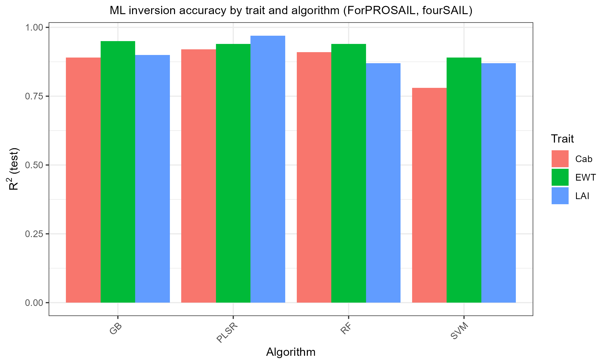
```

PLSR/SVM/RF/GB all succeed with R² between 0.78 and 0.97 across the three
traits (the other 7 algorithms need optional packages -- `bartMachine`,
`adabag`, `brnn`, `xgboost`, `kernlab`, `rqPen` -- not everyone has installed;
they fail cleanly with a named-package message, not a crash).

## 3. Deep learning inversion

`5-inversion_DL.R` is the same idea via `getMLmodel()`, training both
`'Hidden-layers'` and `'CNN'` architectures per trait (TensorFlow/Keras
backend -- run `Scripts/Pipeline/0-setup_python_env.R` once first to
provision the Python environment `reticulate` needs). One thing worth calling
out because it cost real debugging time while building this: `getMLmodel()`
calls `callback_early_stopping()` without a package prefix, so `library(keras)`
must actually be *attached* (not just installed) before calling it, or every
fit fails with `could not find function "callback_early_stopping"`. Every
`*-inversion_DL.R` script starts with this exact block for that reason:

```{r keras-setup}
local_venv_root <- file.path(Sys.getenv("LOCALAPPDATA"), "r-reticulate-venvs")
Sys.setenv(RETICULATE_VIRTUALENV_ROOT = local_venv_root)
Sys.setenv(WORKON_HOME = local_venv_root)
Sys.setenv(TF_USE_LEGACY_KERAS = "1")
library(reticulate)
py_require(packages = c("tensorflow", "tf-keras"))
library(keras)
```

## 4. Same pipeline, different canopy model

`canopy.model` is a single variable at the top of `1-simulate_LUT.R` -- there
is no separate script per model in `Scripts/Pipeline/`, and the per-folder
`ForFoursail2`/`ForINFORM` scripts differ from `ForPROSAIL`'s only in that one
line (plus `leaf.model`, since foursail2/INFORM additionally need a handful
of crown/canopy-geometry LUT columns fourSAIL doesn't use -- see each folder's
`1-simulate_LUT.R` for the exact list, `fraction_brown`/`Cv`/`sd`/`cd`/`h`/etc).

```{r fig-foursail2, eval = TRUE, echo = FALSE, out.width = "80%"}
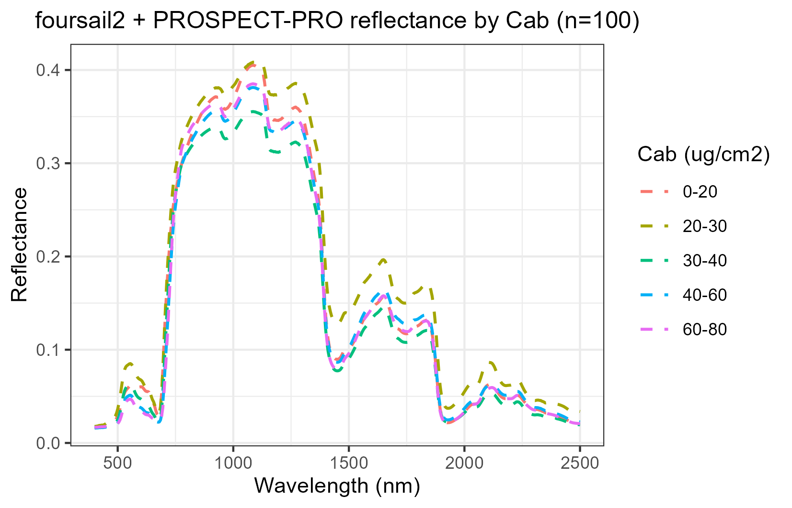
```

```{r fig-inform, eval = TRUE, echo = FALSE, out.width = "80%"}
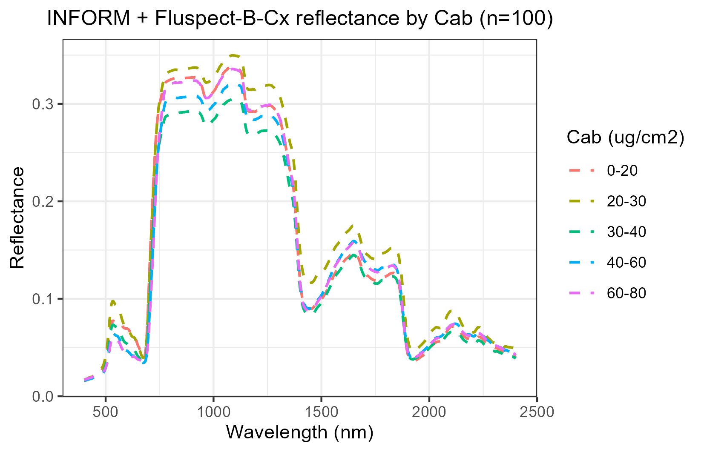
```

INFORM's forest-level reflectance is visibly lower overall than fourSAIL's
turbid-medium canopy -- expected, from crown/shadow geometry that fourSAIL
doesn't model at all.

### A genuine finding, not a bug: INFORM's LAI barely inverts

```{r fig-inform-ml, eval = TRUE, echo = FALSE, out.width = "90%"}
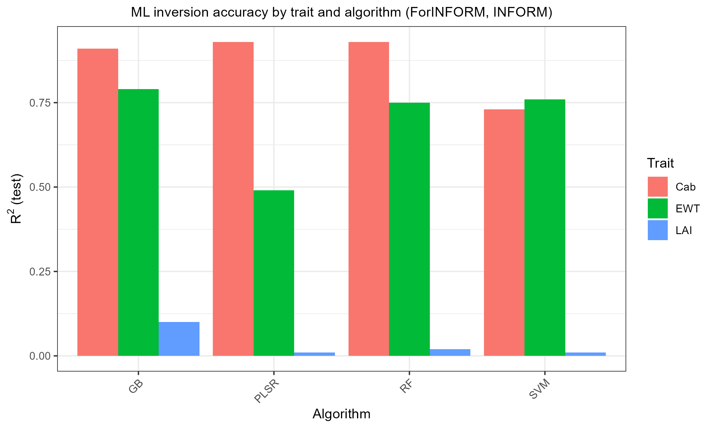
```

Compare against foursail2's own summary:

```{r fig-foursail2-ml, eval = TRUE, echo = FALSE, out.width = "90%"}
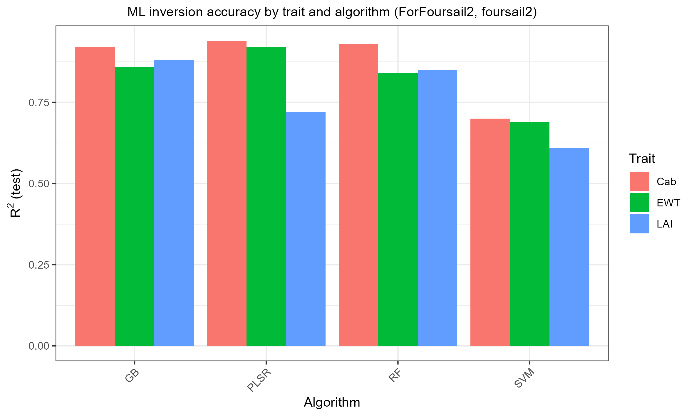
```

Cab and EWT invert similarly well in both. LAI is the story: R²=0.61-0.88 with
foursail2, but only R²=0.01-0.10 with INFORM. This isn't a bug -- confirmed by
checking LAI's own variance and its univariate correlation with reflectance
(both real, just modest: r&asymp;-0.26 with NIR). The reason is that
`ForINFORM/1-simulate_LUT.R` holds INFORM's crown-geometry parameters
(`sd`/`cd`/`h`/`LAIu` -- stem density, crown diameter, tree height, understory
LAI) **constant** across all 100 samples, so LAI's own signal is weak relative
to what actually dominates forest reflectance variation in reality. Want
better LAI retrieval from INFORM? Vary those crown-geometry parameters too,
not just LAI.

## 5. SPART: top-of-canopy *and* top-of-atmosphere

`ForSPART` is structurally different from the three canopy-model folders:
`SPART()` returns TOC and TOA reflectance already convolved to a chosen real
sensor (`ToolsRTM::Sentinel2A.MSI`/`TerraAqua.MODIS`, etc, both bundled) in
one call -- there's no separate "simulate native, then convolve" step, so
`ForSPART/1-simulate_LUT.R` runs `SPART()` once per sensor per LUT row
instead.

```{r fig-spart-toc-toa, eval = TRUE, echo = FALSE, out.width = "80%"}
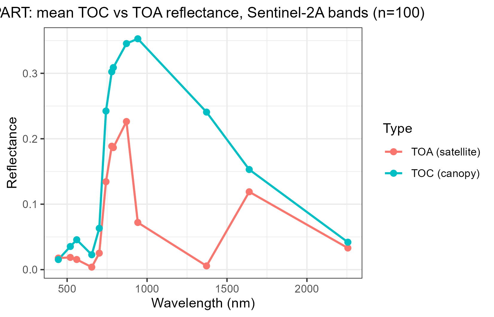
```

The atmospheric dip at ~1375nm (strong water-vapour absorption) shows up in
TOA but not TOC -- exactly what real atmospheric correction has to deal with.

```{r fig-spart-ml, eval = TRUE, echo = FALSE, out.width = "90%"}
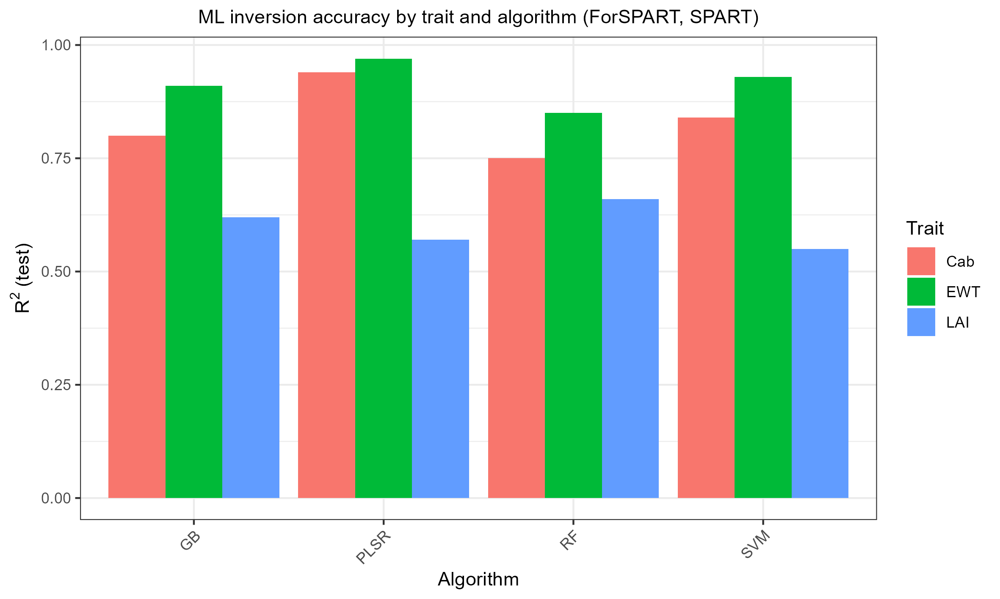
```

## 6. MARMIT: soil only, no vegetation

`ForMARMIT` is the odd one out on purpose: MARMIT has no leaf or canopy
model, so there's no `Cab`/`LAI`/`EWT` to invert. Its two physical knobs are
`L` (surface water film thickness, cm) and `eps` (fraction of the surface
that's wet); the single target trait is `SMC` (gravimetric soil moisture %,
MARMIT's own physical output via `sigmoid.soil()`).

This pipeline runs on the bundled `Bablet_2016` soil database. All 8
official MARMIT databases (Bablet 2016, Dupiau 2020, Humper 2015,
Lesaignoux 2008, Liu 2002, Lobell 2002, Marcq 2012, Philpot 2014 -- see the
[MARMIT GitLab](https://pss-gitlab.math.univ-paris-diderot.fr/marmit/marmit))
are available directly from this monorepo's own `databases/` folder (repo
root) -- pass `db_root = "databases"` and `database = "<name>"` to
`get.marmit.rsoil()` to use any of them, no download needed.

```{r fig-marmit-smc, eval = TRUE, echo = FALSE, out.width = "80%"}
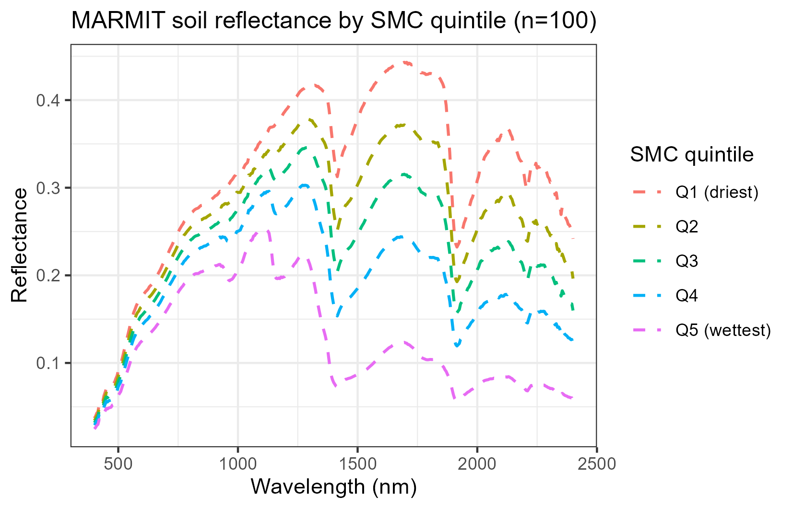
```

Textbook-correct: reflectance darkens monotonically with increasing soil
moisture, with deepening water-absorption dips (~1450nm/1950nm) for the
wettest quintile.

```{r fig-marmit-ml, eval = TRUE, echo = FALSE, out.width = "90%"}
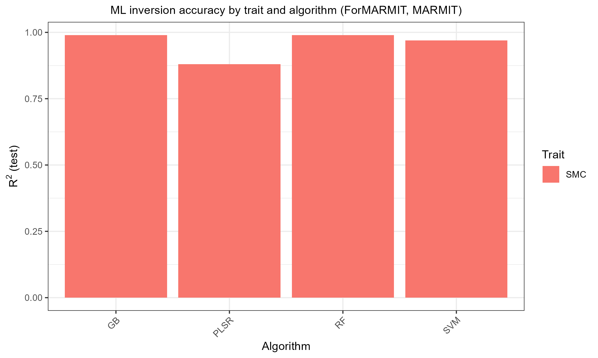
```

SMC inverts almost perfectly (R²=0.88-0.99) -- unsurprising, since MARMIT's
reflectance response to moisture is close to deterministic physics, not a
noisy proxy relationship the way trait retrieval from canopy reflectance
usually is.

## Where to go next

- `Scripts/Pipeline/README.md` -- the underlying generic simulate/invert
  scripts these course folders are built on.
- `vignettes/articles/model-comparison-and-sensitivity.html` -- comparing
  models directly against each other, and which traits actually drive which
  wavelengths (Sobol/Johnson sensitivity indices).
- For the full SCOPE energy-balance + fluorescence pipeline (including a
  `Vcmax25`/SIF experiment), see the **SCOPEinR** package's own
  `scope-pipeline` article.
