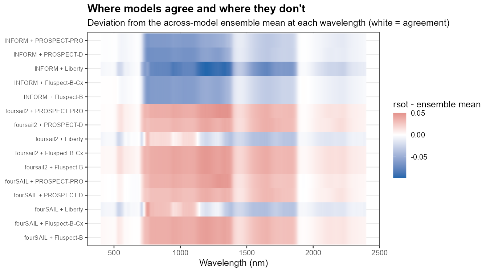
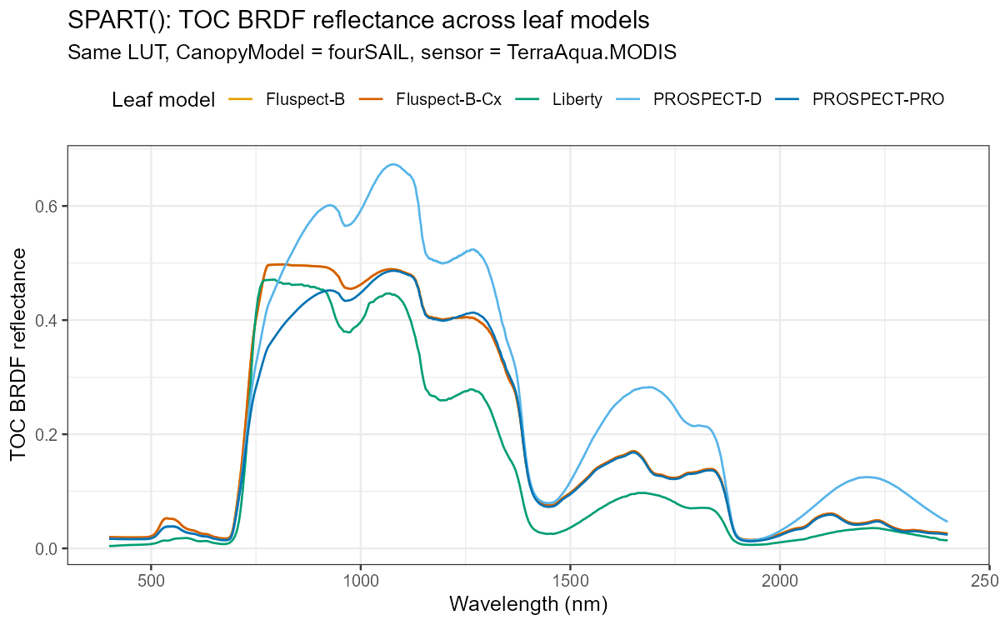
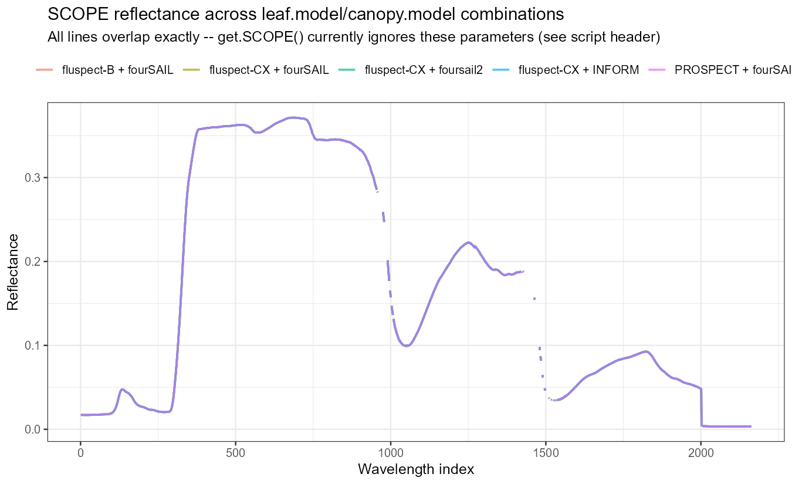
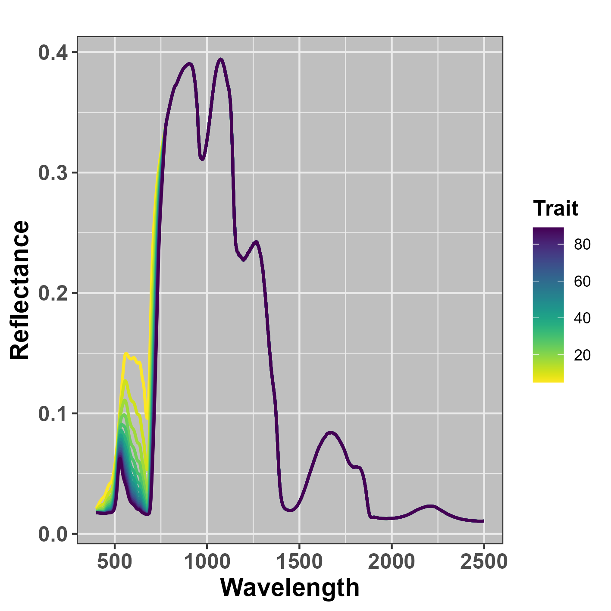
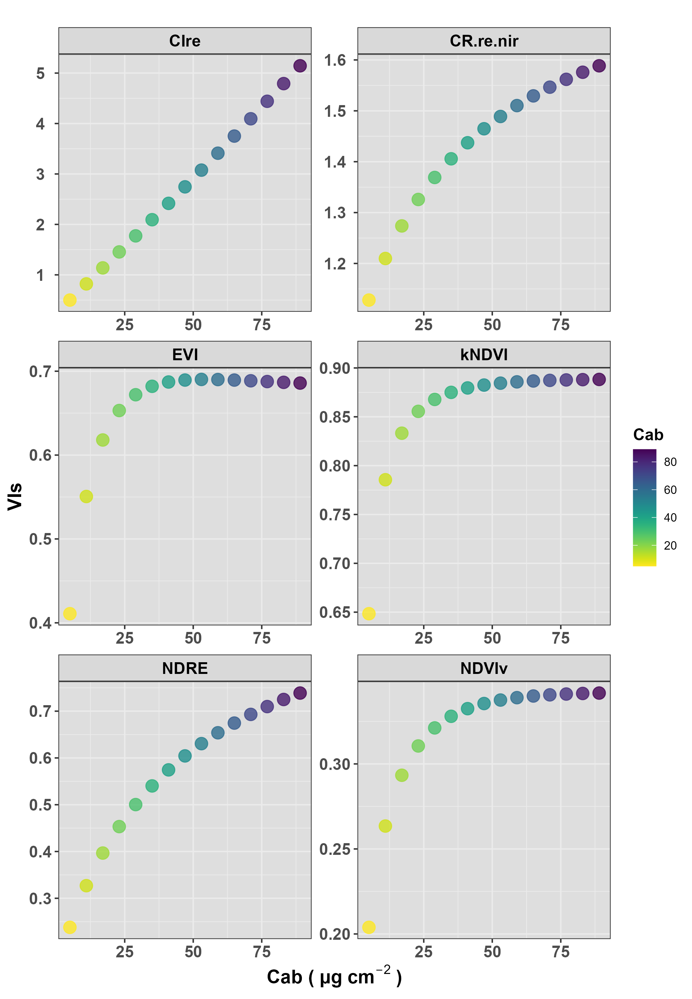
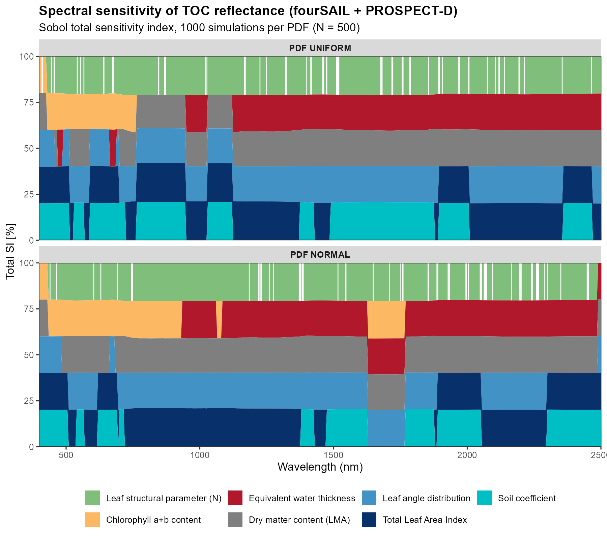
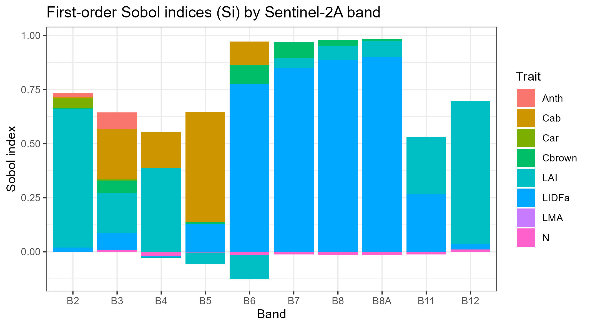
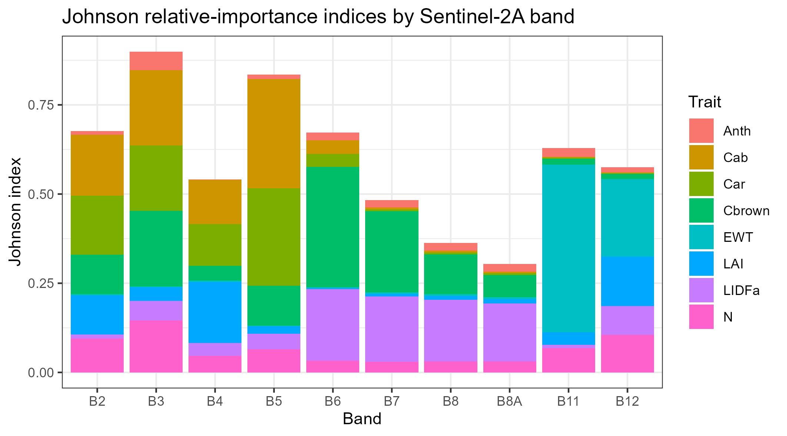

```{r, include = FALSE}
knitr::opts_chunk$set(collapse = TRUE, comment = "#>", eval = FALSE, fig.align = "center")
```

Two different questions, two different folders in `Scripts/`:

- **`Scripts/Comparison/`** -- given the *same* trait inputs, how much do the
  different leaf/canopy models actually disagree with each other?
- **`Scripts/Sensibility/`** -- given *one* model, which traits actually drive
  which wavelengths, and by how much?

Both are about understanding the models themselves, not retrieving traits
from real data -- useful before you trust an inversion result.

## Model comparison

`Scripts/Comparison/compare_RTM_models.R` runs every leaf model (PROSPECT-PRO,
PROSPECT-D, Liberty, Fluspect-B, Fluspect-B-Cx) crossed with every canopy
model (fourSAIL, foursail2, INFORM) on the *same* LUT row, then plots:

```{r fig-grid, eval = TRUE, echo = FALSE, out.width = "100%"}
knitr::include_graphics("figures/comparison-sensitivity/compare_grid_canopy_x_leaf.png")
```

...and a difference/agreement heatmap -- deviation of each combination from
the ensemble mean, at every wavelength, so you can see *where* models agree
(white) and diverge (saturated colour), not just a single aggregate number:

```{r fig-heatmap, eval = TRUE, echo = FALSE, out.width = "90%"}

```

`compare_SPART_models.R` does the same for SPART's TOC BRDF reflectance
across all 5 leaf models:

```{r fig-spart-compare, eval = TRUE, echo = FALSE, out.width = "80%"}

```

And `compare_SCOPE_models.R` checks something different: whether SCOPE's
`leaf.model`/`canopy.model` arguments actually change anything (they don't --
SCOPE always runs its own integral multi-layer Fluspect-Cx + RTMo, so those
arguments are documented no-ops, verified rather than assumed):

```{r fig-scope-compare, eval = TRUE, echo = FALSE, out.width = "80%"}

```

## Sensitivity analysis

`Scripts/Sensibility/` has four scripts, each answering "which traits matter"
with a different method:

| Script | Method | Scope |
|---|---|---|
| `0-Sensibility_indices.R` | One-at-a-time (OAT) | Sweep one trait, hold others fixed |
| `1-Sobol_spectral_sensitivity.R` | Sobol total index, per wavelength | Global, full spectrum |
| `2-Sobol_perband_sensitivity.R` | Sobol Si/Ti, per Sentinel-2A band | Global, discrete bands |
| `3-Johnson_relative_importance.R` | Johnson relative importance | Regression-based, per band |

### One-at-a-time (OAT)

The simplest and most intuitive: vary *one* trait across a realistic range
with everything else fixed, and watch the spectrum respond.

```{r fig-oat, eval = TRUE, echo = FALSE, out.width = "80%"}

```

```{r fig-oat-indices, eval = TRUE, echo = FALSE, out.width = "90%"}

```

### Global Sobol sensitivity, across the full spectrum

`1-Sobol_spectral_sensitivity.R` uses `get.spectral.sensitivity()` (which
wraps `get.sobol.indices()`, run once per wavelength) to get a *global*
variance-based sensitivity estimate -- unlike OAT, every trait varies
simultaneously, so this captures interactions OAT can't. Run twice, comparing
a Uniform-PDF sampling scenario against a Gaussian one:

```{r fig-sobol-spectral, eval = TRUE, echo = FALSE, out.width = "100%"}

```

### Global Sobol sensitivity, per Sentinel-2A band

`2-Sobol_perband_sensitivity.R` uses the `sensobol` package's proper
quasi-random design (`sobol_matrices()` &rarr; evaluate `foursail()` at every
design point &rarr; `sobol_indices()`) to get first-order (Si) and total (Ti)
indices per band, rather than per native wavelength:

```{r fig-sobol-si, eval = TRUE, echo = FALSE, out.width = "100%"}

```

Structural traits (`LAI`, `LIDFa`) dominate the NIR/SWIR bands (B6-B8A, B11-B12);
pigments (`Cab`/`Car`/`Anth`) dominate the visible bands (B2-B5) -- exactly
what leaf/canopy optics theory predicts, and a useful sanity check that the
whole simulate-and-estimate pipeline is behaving.

### Johnson relative importance

`3-Johnson_relative_importance.R` is a regression-based alternative
(`sensitivity::johnson()`) -- doesn't need the special Sobol quasi-random
design, an ordinary random LUT is enough, but it answers a related-but-different
question (relative contribution to explained variance, not a variance
decomposition):

```{r fig-johnson, eval = TRUE, echo = FALSE, out.width = "100%"}

```

Note `EWT` dominating band B11 (SWIR, a classic water-absorption region) --
both methods agree structural/water traits dominate SWIR while pigments
dominate the visible, which is reassuring: two different statistical methods
converging on the same physical story.

## A practical note on zero-variance predictors

Building `Scripts/Sensibility/3-Johnson_relative_importance.R` surfaced a
real, generically-useful gotcha: `johnson()`'s correlation-matrix step fails
outright (`eigen(): infinite or missing values`) if any predictor column has
zero variance -- e.g. `LMA` is constant when a LUT is built with
`LeafModel = "PROSPECT-PRO"`, since that variant uses `CBC`/`Prot` for dry
matter instead. The script now drops any zero-variance column before calling
`johnson()`, with a message naming what got dropped, rather than crashing.
Worth checking for in your own code any time you feed a LUT-derived data.frame
into a correlation- or regression-based method.
