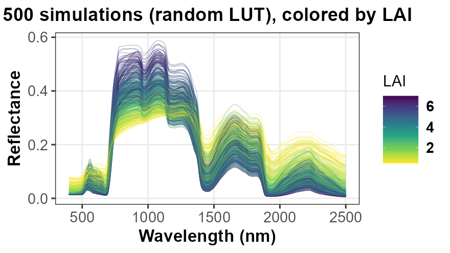
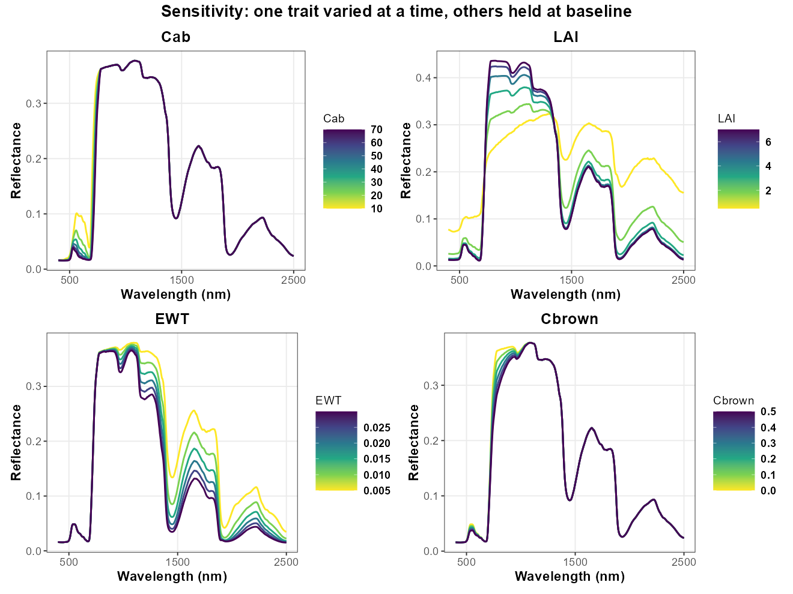
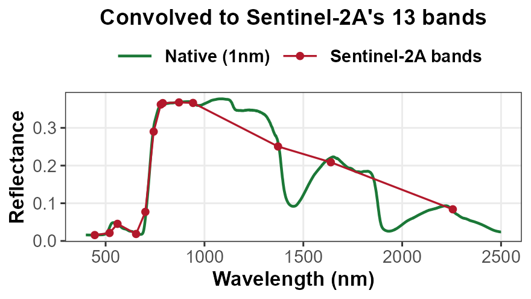
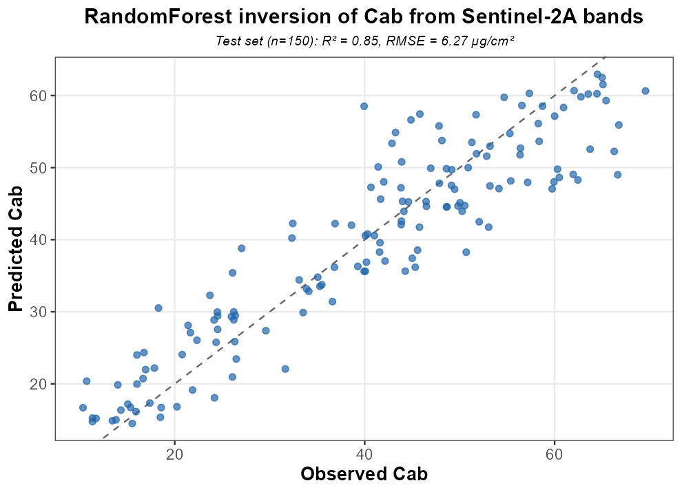

```{r setup, include=FALSE}
knitr::opts_chunk$set(echo = TRUE, fig.width = 8, fig.height = 5)
```

Reproducing the [`AEO-Course/Apps/RTMs`](https://github.com/CCGCAM/RTM-Suite/tree/main/AEO-Course/Apps/RTMs)
Shiny app's own workflow, step by step, in plain R -- no app required.
Six steps: load the package, run one simulation, run 500, look at
sensitivity to one trait at a time, convolve onto a real sensor's bands,
and invert sensor-band reflectance back into a trait with machine
learning. Every code chunk below runs in sequence -- later steps reuse
variables from earlier ones, same as the app's own tutorial tab.

Worked example throughout: **fourSAIL + PROSPECT-D**. Swap in any of
`foursail2`/`inform` and `PROSPECT-PRO`/`Fluspect-B`/`Fluspect-B-Cx`/`Liberty`
by changing step 1-2's model/parameter names -- see the app's own
**Model Explorer** tab for an interactive version of every combination,
including live plots and a Sensitivity sub-tab that lets you pick any
trait to sweep instead of it being fixed in code.

## 1. Load the package

```{r step1}
library(ToolsRTM)
```

## 2. Run one simulation

Build a single-row parameter set (one plant/canopy's worth of trait
values), run the canopy model, and combine its direct/diffuse-light
outputs into one reflectance spectrum -- the most basic thing this whole
pipeline does.

```{r step2}
row <- data.frame(
  LAI = 3, hspot = 0.01, LIDFa = -0.35, LIDFb = -0.15, TypeLidf = 1,
  tts = 30, tto = 0, psi = 0,
  N = 1.5, Cab = 40, Car = 8, Anth = 2, Cbrown = 0, EWT = 0.009, LMA = 0.009, alpha = 40
)
rsoil <- 0.5 * dataSpec_PDB[, 11] + 0.5 * dataSpec_PDB[, 12]  # dry/wet soil blend

sail <- foursail(inputLUT = row, rsoil = rsoil, LeafModel = "PROSPECT-D")
reflectance <- Compute_BRF(rdot = sail$rdot, rsot = sail$rsot,
                            tts = row$tts, data.light = dataSpec_PDB)

plot(dataSpec_PDB[, 1], reflectance, type = "l", col = "#2E8B57", lwd = 2,
     xlab = "Wavelength (nm)", ylab = "Reflectance",
     main = "One simulation: fourSAIL + PROSPECT-D")
```


**A note on BRDF and TOC correction**: the `Compute_BRF()` call above
blends a canopy's hemispherical-directional (`rdot`) and bi-directional
(`rsot`) reflectance factors using the sun/view geometry
(`tts`/`tto`/`psi`) -- this IS the BRDF correction: it's needed whenever
illumination or viewing geometry isn't fixed nadir-sun-normalized
(off-nadir sensors, multi-angle acquisitions, comparing images from
different overpass times/dates), so the resulting top-of-canopy (TOC)
reflectance is comparable across geometries rather than confounded by
them. For a flat, purely Lambertian assumption you'd only need `rsot`
itself; using the full BRDF blend is what real satellites -- and this
pipeline -- actually do.

**If you're using a Fluspect leaf model** (`Fluspect-B`/`Fluspect-B-Cx`
instead of `PROSPECT-D`), see the "Bonus: fluorescence (SIF)" section at
the end of this document -- Fluspect also simulates sun-induced
fluorescence, and what a sensor actually measures is reflectance PLUS
that emitted fluorescence, not reflectance alone.

## 3. Many simulations (n_samples = 500)

Do step 2 five hundred times, with trait values sampled randomly instead
of fixed at one baseline -- this builds a LUT (look-up table): one row of
traits, one simulated spectrum, times 500. Everything from here on
(sensitivity, ML inversion) works from this LUT.

```{r step3}
n_samples <- 500
set.seed(42)
lut <- data.frame(
  LAI = runif(n_samples, 0.5, 8), N = runif(n_samples, 1, 3),
  Cab = runif(n_samples, 0, 80), Car = runif(n_samples, 0, 20),
  Anth = runif(n_samples, 0, 7), Cbrown = runif(n_samples, 0, 1),
  EWT = runif(n_samples, 1e-04, 0.05), LMA = runif(n_samples, 1e-04, 0.03),
  hspot = 0.01, LIDFa = -0.35, LIDFb = -0.15, TypeLidf = 1, tts = 30, tto = 0, psi = 0,
  alpha = 40
)

spectra <- t(sapply(seq_len(n_samples), function(i) {
  sail_i <- foursail(inputLUT = lut[i, ], rsoil = rsoil, LeafModel = "PROSPECT-D")
  Compute_BRF(rdot = sail_i$rdot, rsot = sail_i$rsot,
              tts = lut$tts[i], data.light = dataSpec_PDB)
}))

# A few random parameter draws can be numerically unstable for some leaf
# models (e.g. Liberty's inter-layer solver, near the edges of its own
# range) and come back as NaN -- drop those rows rather than propagating them.
ok <- apply(spectra, 1, function(r) all(is.finite(r)))
spectra <- spectra[ok, , drop = FALSE]
lut <- lut[ok, ]
# spectra: one valid simulated spectrum per row (length depends on the leaf
# model's own domain -- 2101 for PROSPECT-D/-PRO/Liberty, 2001 for Fluspect-B/-B-Cx)

matplot(dataSpec_PDB[, 1], t(spectra[1:40, ]), type = "l", lty = 1, col = "#2E8B57",
        xlab = "Wavelength (nm)", ylab = "Reflectance",
        main = "40 of 500 simulated spectra")
```



## 4. Sensitivity: vary one trait at a time

Different question from step 3: instead of random combinations, hold
every parameter at one fixed baseline except one, and sweep just that one
trait across its realistic range -- this isolates which spectral regions
respond to which trait (Cab: red/red-edge; LAI: NIR plateau; EWT: SWIR;
Cbrown: visible/red-edge). The interactive equivalent is the app's own
**Model Explorer > Sensitivity** sub-tab, which lets you pick the trait
(any leaf parameter, LAI, angles, or canopy-model-specific parameters)
instead of it being fixed in code.

```{r step4, fig.height=8}
sweep_trait <- function(trait, values) {
  sapply(values, function(v) {
    row2 <- row; row2[[trait]] <- v
    sail_i <- foursail(inputLUT = row2, rsoil = rsoil, LeafModel = "PROSPECT-D")
    Compute_BRF(rdot = sail_i$rdot, rsot = sail_i$rsot,
                tts = row2$tts, data.light = dataSpec_PDB)
  })
}
cab_curves <- sweep_trait("Cab", seq(10, 70, length.out = 6))     # 2101 x 6
ewt_curves <- sweep_trait("EWT", seq(0.005, 0.03, length.out = 6))
# repeat for LAI, Cbrown, ... -- plot each trait in ITS OWN panel with its
# own color scale (a scale shared across traits hides every trait except
# the one with the largest absolute range).

op <- par(mfrow = c(2, 1))
matplot(dataSpec_PDB[, 1], cab_curves, type = "l", lty = 1,
        col = colorRampPalette(c("gold", "darkgreen"))(6),
        xlab = "Wavelength (nm)", ylab = "Reflectance", main = "Sweeping Cab (10-70)")
matplot(dataSpec_PDB[, 1], ewt_curves, type = "l", lty = 1,
        col = colorRampPalette(c("gold", "darkblue"))(6),
        xlab = "Wavelength (nm)", ylab = "Reflectance", main = "Sweeping EWT (0.005-0.03)")
par(op)
```



## 5. Convolve to a specific sensor

Resample the native 1nm spectrum from step 2 onto a real sensor's bands
(13 for Sentinel-2A here) using its spectral response function (SRF) --
this is what a satellite actually observes, coarser and fewer bands than
the simulation itself.

**Three convolution functions, one for each kind of sensor data you might
have:**

1. `get.spectral.convolution.srf()` (used below) -- a real, MEASURED
   per-nm SRF, no atmospheric-correction coefficients needed. Covers
   PRISMA and Sentinel-2A/Sentinel-2B (`srf.prisma`/`srf.sentinel2a`/`srf.sentinel2b`).
2. `get.spectral.convolution.rfl()` -- a measured SRF bundled together
   WITH SMAC atmospheric-correction coefficients. Covers the other 6
   bundled sensors: Landsat 4/5/7/8, Sentinel-3A/B OLCI, Terra/Aqua MODIS.
3. `get.spectral.convolution.gaussian()` -- no measured SRF at all, only
   nominal band characteristics (center wavelength + FWHM, or center +
   published band edges), approximated as a Gaussian response. This is
   what you need for **EnMAP** (`sensor.i = "EnMAP"`), for **ALI,
   Hyperion, MODIS (19-band nominal set), Quickbird, RapidEye,
   WorldView-2** (`sensor.i = "MODIS"`, etc. -- see
   `unique(ToolsRTM::sensor.characteristics$Sensor)` for the full list),
   and for **your own sensor or camera** -- pass your own `centers` (and,
   if you know it, `fwhm`) instead of `sensor.i`.

```{r step5}
band_values <- get.spectral.convolution.srf(
  df  = data.frame(wave = dataSpec_PDB[, 1], rfl = reflectance),
  srf = ToolsRTM::srf.sentinel2a)
# band_values$wl / $fwhm / $RFL -- one row per Sentinel-2A band, sorted by
# wavelength. For the other 6 bundled sensors (Landsat/OLCI/MODIS), swap in
# get.spectral.convolution.rfl(df, sensor.i = ToolsRTM::LANDSAT8.OLI) instead.
print(band_values)

plot(dataSpec_PDB[, 1], reflectance, type = "l", col = "grey60",
     xlab = "Wavelength (nm)", ylab = "Reflectance", main = "Native 1nm vs Sentinel-2A bands")
points(band_values$wl, band_values$RFL, col = "#B2182B", pch = 19, cex = 1.3)
lines(band_values$wl, band_values$RFL, col = "#B2182B", lwd = 1.5)
```



### Worked example -- your own sensor

A synchronized 3-camera, 15-band rig with a known center + FWHM for every
band (e.g. from a calibration sheet):

```{r step5-own-sensor}
own_centers <- c(444, 475, 502, 531, 550, 560, 570, 650, 668, 678, 705, 717, 740, 754, 842)
own_fwhm    <- c(28,  32,  18,  14,  12,  27,  14,  16,  14,  14,  10,  12,  18,  10,  57)

df <- data.frame(wave = dataSpec_PDB[, 1], rfl = reflectance)
own_bands <- get.spectral.convolution.gaussian(df, centers = own_centers, fwhm = own_fwhm)
# No measured SRF for your camera -- each band is approximated as a
# Gaussian response with that center/FWHM.

# A pushbroom hyperspectral camera (e.g. Headwall) where only band centers
# are known (copied from its ENVI header's "wavelength = {...}" block, no
# "fwhm = {...}" block) -- FWHM is estimated from band spacing instead:
headwall_centers <- c(398.0166, 400.247, 402.4774, 404.7078, 406.9382)  # (full header has 272)
headwall_bands <- get.spectral.convolution.gaussian(df, centers = headwall_centers)

# A bundled sensor with only nominal characteristics (no measured SRF):
enmap_bands <- get.spectral.convolution.gaussian(df, sensor.i = "EnMAP")
modis_bands <- get.spectral.convolution.gaussian(df, sensor.i = "MODIS")

own_bands
```

## 6. Trait inversion with machine learning

The reverse problem from every step above: given ONLY the sensor-band
reflectance (what a satellite actually measures), retrieve the trait (Cab
here) that produced it, without knowing the ground truth. Train a model
on step 3's LUT's (sensor-band reflectance -> trait) pairs, then evaluate
it on held-out rows the model never saw during training.

```{r step6}
library(randomForest)
band_refl <- t(sapply(seq_len(n_samples), function(i) {
  df_i <- data.frame(wave = dataSpec_PDB[, 1], rfl = spectra[i, ])
  get.spectral.convolution.srf(df_i, ToolsRTM::srf.sentinel2a)$RFL
}))
colnames(band_refl) <- paste0("B", seq_len(ncol(band_refl)))
ml_data <- data.frame(band_refl, Cab = lut$Cab)

train_idx <- sample(seq_len(n_samples), size = round(0.7 * n_samples))
rf <- randomForest(Cab ~ ., data = ml_data[train_idx, ], ntree = 300)
pred <- predict(rf, ml_data[-train_idx, ])
obs  <- ml_data$Cab[-train_idx]
cat("R2:", cor(pred, obs)^2, " RMSE:", sqrt(mean((pred - obs)^2)))

plot(obs, pred, xlab = "Observed Cab", ylab = "Predicted Cab", pch = 19, col = "#2166AC")
abline(0, 1, col = "grey40", lty = 2)
```



## Bonus: simulating fluorescence (SIF) with Fluspect

The steps above use PROSPECT-D, which has no fluorescence. Swap in
`Fluspect-B`/`Fluspect-B-Cx` and every step still works the same way for
reflectance -- but Fluspect also simulates sun-induced fluorescence
(SIF), and what a sensor actually measures is reflectance PLUS that
emitted fluorescence, not reflectance alone:

```{r bonus-sif}
sif_row <- data.frame(N = 1.8, Cab = 40, Car = 10, Anth = 0, EWT = 0.015,
                       LMA = 0.01, Cs = 0.1, fqe = 0.01, Cx = 0, alpha = 40)
lrt <- getFluspect.B(inputsLeaf = sif_row, inputsOptipar = ToolsRTM::optipar, version = "D")
# lrt$refl / lrt$tran:  true leaf reflectance/transmittance (unaffected by fqe)
# lrt$MbI / lrt$MbII:   excitation-emission fluorescence matrices (PSI/PSII, wlF x wlE)

wlE <- seq(400, 750, 1); wlF <- seq(640, 850, 1)
d <- dataSpec_PDB
incident <- d$direct_light + d$diffuse_light  # W m-2 nm-1, 400-2500nm grid
E_wle <- incident[match(wlE, d$wavelength)]
sif <- as.numeric((lrt$MbI + lrt$MbII) %*% E_wle)   # simulated SIF emission, 640-850nm

refl_wlf <- lrt$refl[match(wlF, lrt$lambda)]
E_wlf <- incident[match(wlF, d$wavelength)]
apparent_reflectance <- refl_wlf + sif / E_wlf       # what a sensor actually measures

plot(wlF, sif, type = "l", col = "#B2182B", lwd = 2,
     xlab = "Wavelength (nm)", ylab = "SIF (W m-2 nm-1)", main = "Simulated leaf-level SIF emission")
```

`apparent_reflectance = reflectance + SIF / incident irradiance` -- what a
sensor actually measures, since at-sensor radiance = reflected + emitted.
See the app's own `compute_leaf_sif()` (in `app.R`) for the same physics
wrapped in one function, or the **Model Explorer > SIF** sub-tab for a
live, interactive version.

## What changes on the app's other tabs

- **PROSAIL-WithSatellite**: steps 1 + 5 together, interactively, with the
  model fixed to fourSAIL + PROSPECT-PRO -- pick any bundled sensor from a
  dropdown instead of hardcoding Sentinel-2A.
- **Model Explorer**: step 1, generalized -- pick any of the 3 canopy
  models (fourSAIL/fourSAIL2/INFORM) and any of the 5 leaf models
  interactively, plus the interactive SIF, Sensitivity, and Absorption
  coefficients sub-tabs described above.

See [`CCGCAM/RTM-Suite`](https://github.com/CCGCAM/RTM-Suite) for the full
course materials, the app itself, and the R/Python numerical verification
writeup.
