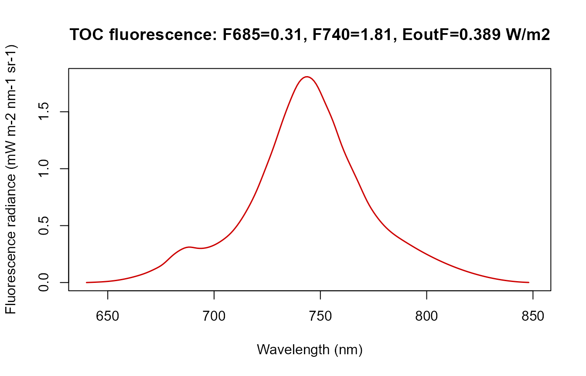
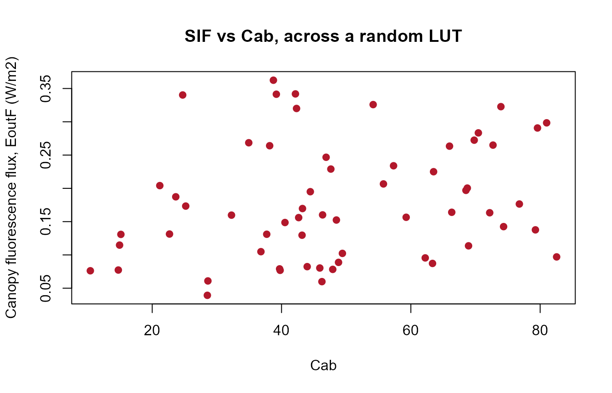

# 04. Fluorescence (SIF)

``` r

library(ToolsRTM)
library(SCOPEinR)
```

[`get.SCOPE()`](../reference/get.SCOPE.md) computes sun-induced
chlorophyll fluorescence (SIF) as a standard part of every run – unlike
ToolsRTM’s Fluspect-B/-Cx (Tutorial 02 of that series), which needs the
leaf-level matrices assembled by hand into a canopy signal, SCOPE
already propagates fluorescence through the full canopy radiative
transfer for you.

## 1. One simulation’s fluorescence spectrum

``` r

path_input <- system.file("input", package = "SCOPEinR")
table.with.opts <- read.table(file.path(path_input, "setoptions.csv"), header = TRUE, sep = ",")
LUT_default <- read.table(file.path(path_input, "LUT_input.csv"), header = TRUE, sep = ",")

invisible(capture.output(
  res <- get.SCOPE(LUT = LUT_default[1, ], options.SCOPE = table.with.opts,
                    optipar = SCOPEinR::optipar2021.Pro.CX, leaf.model = "fluspect-CX",
                    canopy.model = "fourSAIL", get.outputs = "ALL", get.plots = FALSE)[[1]]
))

wlF <- res$data.spectral$wlF
plot(wlF, res$data.rad$LoF_, type = "l", col = "red3", lwd = 1.5,
     xlab = "Wavelength (nm)", ylab = "Fluorescence radiance (mW m-2 nm-1 sr-1)",
     main = sprintf("TOC fluorescence: F685=%.2f, F740=%.2f, EoutF=%.3f W/m2",
                     res$data.rad$F685, res$data.rad$F740, res$data.rad$EoutF))
```



The classic double-peak SIF spectrum – a red peak near 685nm (`F685`)
and a larger far-red peak near 740nm (`F740`), on top of the chlorophyll
re-absorption dip between them. `EoutF` is the single canopy-integrated
fluorescence flux (W/m²) used throughout this series as the scalar SIF
summary, e.g. Tutorial 09’s SIF-vs-photosynthesis experiment.

## 2. Which traits drive SIF?

`calc_fluorescence=1` is on by default in `setoptions.csv`. Sweep `Cab`
(the pigment SIF emission scales with) across several simulations:

``` r

cab_values <- seq(15, 65, length.out = 6)
res_cab <- lapply(cab_values, function(v) {
  row_i <- LUT_default[1, ]; row_i$Cab <- v
  invisible(capture.output(
    r <- get.SCOPE(LUT = row_i, options.SCOPE = table.with.opts,
                    optipar = SCOPEinR::optipar2021.Pro.CX, leaf.model = "fluspect-CX",
                    canopy.model = "fourSAIL", get.outputs = "ALL", get.plots = FALSE)[[1]]
  ))
  r
})

EoutF_by_cab <- sapply(res_cab, function(r) r$data.rad$EoutF)
plot(cab_values, EoutF_by_cab, type = "o", pch = 19, col = "#B2182B",
     xlab = "Cab", ylab = "EoutF (canopy fluorescence flux, W/m2)",
     main = "SIF vs chlorophyll content")
```


## 3. Fluorescence across many random simulations

``` r

inputLUT <- read.table(file.path(path_input, "inputs_SCOPE.csv"), header = TRUE, sep = ",")
N_SAMPLES <- 60
Table.LUT.many <- getLUT.SCOPE(inputLUT = inputLUT, nLUT = N_SAMPLES, setseed = 5)

db.sim.many <- lapply(seq_len(N_SAMPLES), function(i) {
  tryCatch(
    invisible(capture.output(
      r <- get.SCOPE(LUT = Table.LUT.many[i, ], options.SCOPE = table.with.opts,
                      optipar = SCOPEinR::optipar2021.Pro.CX, leaf.model = "fluspect-CX",
                      canopy.model = "fourSAIL", get.outputs = "ALL", get.plots = FALSE)[[1]]
    )),
    error = function(e) NULL
  )
  r
})
ok <- !sapply(db.sim.many, is.null)
db.sim.many <- db.sim.many[ok]; Table.LUT.many <- Table.LUT.many[ok, ]
cat(sum(ok), "/", N_SAMPLES, "simulations usable\n")
#> 60 / 60 simulations usable

EoutF_vals <- sapply(db.sim.many, function(r) r$data.rad$EoutF)
plot(Table.LUT.many$Cab, EoutF_vals, pch = 19, col = "#B2182B",
     xlab = "Cab", ylab = "Canopy fluorescence flux, EoutF (W/m2)",
     main = "SIF vs Cab, across a random LUT")
```



Fluorescence is sensitive to leaf pigments, not just to LAI/structure –
try substituting `Table.LUT.many$Anth` or `$Car` for `Cab` above to see
the same output against anthocyanin or carotenoid content instead.

## What’s next

- **Tutorial 08** – retrieving traits from reflectance alone (no SIF).
- **Tutorial 09** – does adding SIF as a predictor help retrieve
  photosynthesis (`Actot`) better than reflectance alone?
