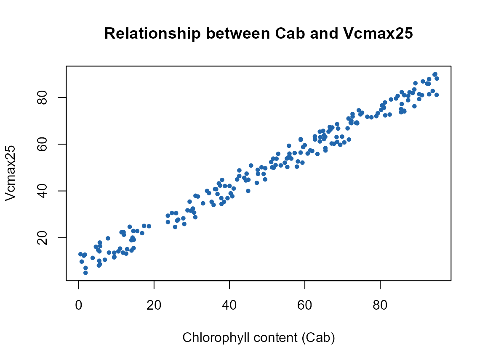

# 05. Building SCOPE LUTs

``` r

library(ToolsRTM)
library(SCOPEinR)
```

[`getLUT.SCOPE()`](../reference/getLUT.SCOPE.md) builds a full SCOPE LUT
the same way
[`ToolsRTM::getLUT()`](https://rdrr.io/pkg/ToolsRTM/man/getLUT.html)
builds a PROSAIL one – sample every parameter’s own range from a ranges
table (`inputs_SCOPE.csv`, Tutorial 02), respecting each column’s own
`Distribution` (`Uniform`/`Gaussian`/`Fixed`).

## 1. A default LUT

``` r

path_input <- system.file("input", package = "SCOPEinR")
inputLUT <- read.table(file.path(path_input, "inputs_SCOPE.csv"), header = TRUE, sep = ",")

n_samples <- 200
LUT <- getLUT.SCOPE(inputLUT = inputLUT, nLUT = n_samples, setseed = 1)
dim(LUT)
#> [1] 200  76
```

``` r

op <- par(mfrow = c(1, 2))
hist(LUT$Cab, breaks = 25, col = "#2E8B57", border = "white",
     main = "Cab (Gaussian, mean=50)", xlab = "Cab")
hist(LUT$LAI, breaks = 25, col = "#B2182B", border = "white",
     main = "LAI (Uniform)", xlab = "LAI")
```


``` r

par(op)
```

## 2. What’s in a SCOPE LUT row that isn’t in a PROSAIL one

``` r

meteo_cols <- c("Ta", "Rin", "Rli", "p", "u", "RH")
extra_cols <- c("Vcmax25", meteo_cols)
LUT[1, extra_cols]
#>    Vcmax25 Ta Rin Rli   p u        RH
#> 1 214.6308 20 600 300 970 2 0.8540528
```

`Vcmax25` (photosynthetic capacity) has no counterpart in a plain
PROSAIL LUT at all – it drives `Actot` (Tutorial 01) but not reflectance
directly (Tutorial 07 confirms this precisely). The meteorology columns
(`Ta`, `Rin`, `Rli`, `p`, `u`, `RH`) are held `"Fixed"` by default
(Tutorial 02) – they set the boundary conditions the energy balance
solves against, and matter for `Tcave`/fluxes even though they carry no
optical signal either.

## 3. Updating the LUT: `Vcmax25` and a Cab~Vcmax25 correlation

``` r

LUT$Vcmax25 <- stats::runif(n_samples, min = 5, max = 90)
n.seed <- round(runif(1, 1, n_samples), 0)

pigments <- ToolsRTM::getCor(n_inputs = 2, setseed = n.seed, distribution = "Uniform",
                              nLUT = n_samples, rho = 0.99, Varnames = c("Cab", "Vcmax25"),
                              MinRange = c(0.5, 5), MaxRange = c(95, 90))
LUT$Cab     <- pigments$LUT$Cab
LUT$Vcmax25 <- pigments$LUT$Vcmax25

cat("Achieved Cab~Vcmax25 correlation:", round(cor(LUT$Cab, LUT$Vcmax25), 2), "\n")
#> Achieved Cab~Vcmax25 correlation: 0.99
```

``` r

plot(LUT$Cab, LUT$Vcmax25, pch = 19, col = "#2166AC", cex = 0.6,
     xlab = "Chlorophyll content (Cab)", ylab = "Vcmax25",
     main = "Relationship between Cab and Vcmax25")
```



This deliberately strong correlation (rho=0.99) matters for Tutorial 09
and the capstone Tutorial 11: real leaves DO correlate nitrogen/Vcmax
with chlorophyll, and this is exactly the correlation real SIF-GPP
remote-sensing proxy studies rely on –
[`getLUT.SCOPE()`](../reference/getLUT.SCOPE.md)’s own default (fully
independent sampling) has no such signal for any inversion method to
find, as Tutorial 07’s sensitivity results and the SCOPE course
pipeline’s honest-negative SIF-Vcmax result both show directly.

## What’s next

- **Tutorial 06** – running a LUT this size (or larger) in parallel;
  SCOPE is far more expensive per row than plain PROSAIL.
- **Tutorial 07** – sensitivity: confirming `Vcmax25`’s reflectance
  signature really is only indirect.
