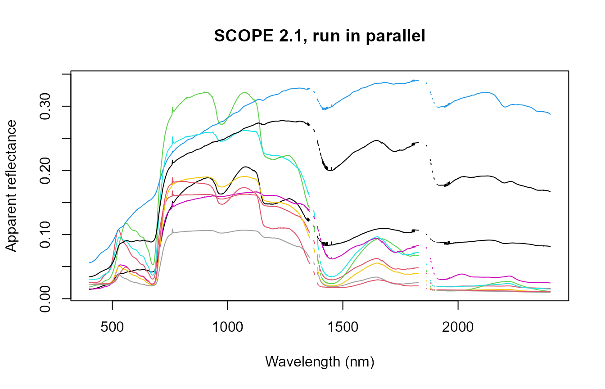

# 06. Large-Scale and Parallel SCOPE Runs

``` r

library(ToolsRTM)
library(SCOPEinR)
```

[`get.SCOPE()`](../reference/get.SCOPE.md) is far more expensive per
call than [`foursail()`](https://rdrr.io/pkg/ToolsRTM/man/foursail.html)
(ToolsRTM Tutorial 06) – dominated by the iterative energy-balance solve
(Tutorial 03), roughly 0.1-0.3s per call vs. ~2ms for a plain optical
simulation. At LUT sizes of hundreds to thousands of rows, that
difference is the whole reason
[`get.SCOPE.parallel()`](../reference/get.SCOPE.parallel.md) exists as a
separate entry point rather than just looping.

## 1. Sequential timing baseline

``` r

path_input <- system.file("input", package = "SCOPEinR")
table.with.opts <- read.table(file.path(path_input, "setoptions.csv"), header = TRUE, sep = ",")
inputLUT <- read.table(file.path(path_input, "inputs_SCOPE.csv"), header = TRUE, sep = ",")

n_samples <- 30
LUT <- getLUT.SCOPE(inputLUT = inputLUT, nLUT = n_samples, setseed = 1)

t_seq <- system.time({
  db.sim.seq <- get.SCOPE(LUT = LUT, n.LUT = n_samples, options.SCOPE = table.with.opts,
                           optipar = SCOPEinR::optipar2021.Pro.CX, leaf.model = "fluspect-CX",
                           canopy.model = "fourSAIL", get.outputs = "ALL", get.plots = FALSE)
})
cat("Sequential:", round(t_seq[["elapsed"]], 1), "s for", n_samples, "SCOPE runs (",
    round(1000 * t_seq[["elapsed"]] / n_samples, 0), "ms/run)\n")
#> Sequential: 24 s for 30 SCOPE runs ( 802 ms/run)
```

## 2. `get.SCOPE.parallel()`

``` r

t_par <- system.time({
  db.sims <- SCOPEinR::get.SCOPE.parallel(
    LUT = LUT, options.SCOPE = table.with.opts, optipar = SCOPEinR::optipar2021.Pro.CX,
    leaf.model = "fluspect-CX", canopy.model = "fourSAIL", parallel = TRUE,
    get.outputs = "ALL", get.plots = FALSE, get.csv = FALSE, n.cores = 3)
})
#> Total simulations: 30 
#> Total execution time: 9.282455
cat("Parallel (3 cores):", round(t_par[["elapsed"]], 1), "s for", n_samples, "SCOPE runs\n")
#> Parallel (3 cores): 10.2 s for 30 SCOPE runs
cat("Speedup:", round(t_seq[["elapsed"]] / t_par[["elapsed"]], 2), "x\n")
#> Speedup: 2.35 x
```

``` r

wave_ <- db.sims[[1]]$data.spectral$wlS[1:2001]
matrix.reflapp <- sapply(seq_along(db.sims), function(i) db.sims[[i]]$data.rad$reflapp[1:2001])
ncols <- sample(ncol(matrix.reflapp), min(10, n_samples))
matplot(wave_, matrix.reflapp[, ncols], type = "l", lty = 1, col = seq_along(ncols),
        xlab = "Wavelength (nm)", ylab = "Apparent reflectance", main = "SCOPE 2.1, run in parallel")
```



## 3. Exporting simulation outputs

For a real production run,
[`get.SCOPE.outputs()`](../reference/get.SCOPE.outputs.md) saves
everything to disk rather than keeping it all in memory:

``` r

path.outs <- "outs/"
get.SCOPE.outputs(data.sim = db.sims, N.sims = n_samples, LUT = inputLUT,
                   path.out = path.outs,
                   get.more.inputs = c("refl", "lidf", "LIDFb", "Ft_Fo", "rdo"),
                   get.plots = TRUE)
```

`get.more.inputs` controls which extra fields get pulled out of each
run’s nested output list and saved as flat columns – reflectance, LIDF
angles, the LIDFb parameter, the Ft/Fo fluorescence-efficiency ratio,
and the `rdo` BRDF component (Tutorial 02) in this example.

## What’s next

- **Tutorial 07** – sensitivity analysis, now that many-run simulation
  is fast enough to sweep traits properly.
- **Tutorial 10** – the full end-to-end pipeline at production scale.
