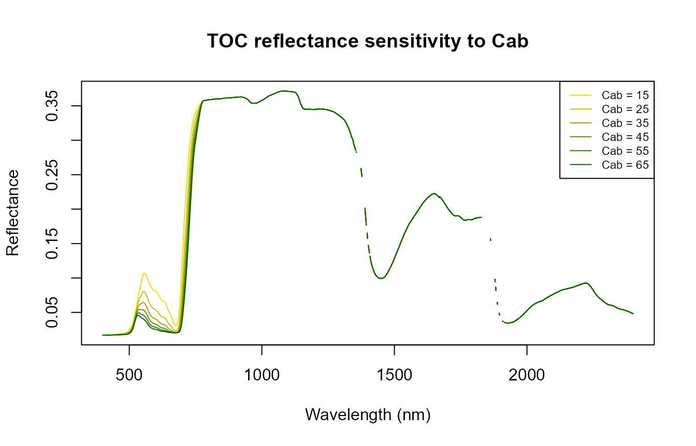
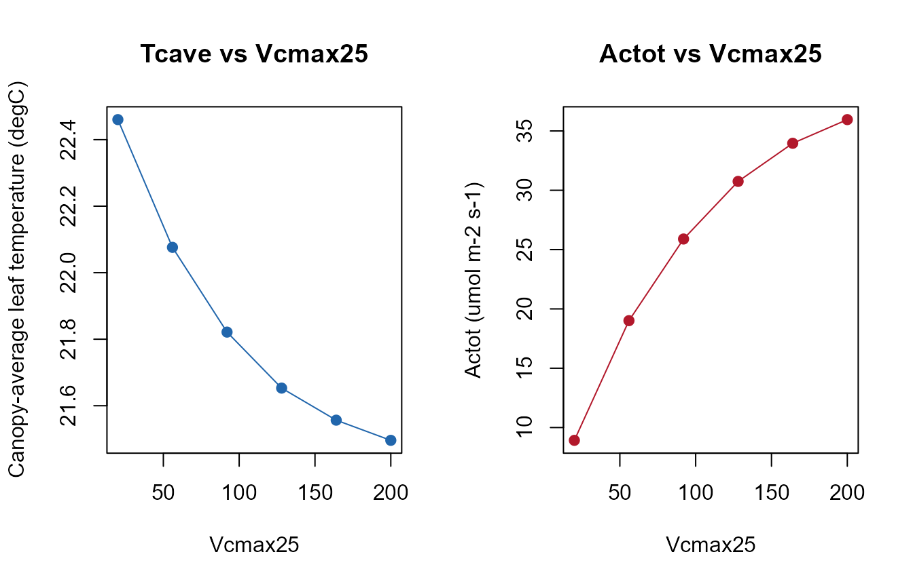
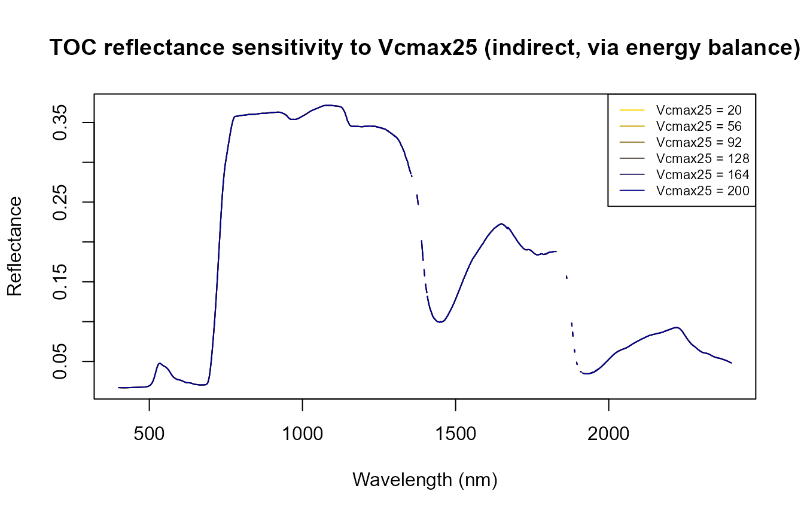
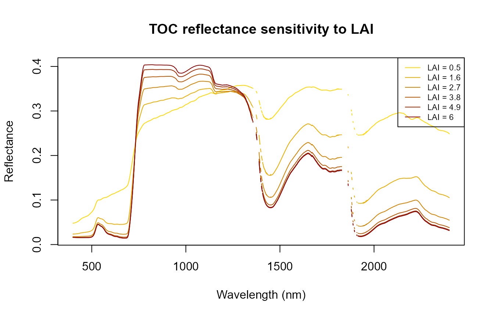

# 07. Sensitivity: Direct vs. Indirect Trait Effects

``` r

library(ToolsRTM)
library(SCOPEinR)
```

SCOPE couples radiative transfer, energy balance, and photosynthesis –
so a trait with no direct radiative-transfer role (`Vcmax25`,
photosynthetic capacity) can still leave a signature in reflectance
*indirectly*, through the leaf temperature the energy balance solves
for. This page sweeps one trait at a time and looks at three outputs:
reflectance (`refl`), canopy temperature (`Tcave`), and photosynthesis
(`Actot`).

``` r

path_input <- system.file("input", package = "SCOPEinR")
scope_options <- read.table(file.path(path_input, "setoptions.csv"), header = TRUE, sep = ",")
LUT_default <- read.table(file.path(path_input, "LUT_input.csv"), header = TRUE, sep = ",")

run_scope <- function(row) {
  invisible(capture.output(
    r <- get.SCOPE(LUT = row, options.SCOPE = scope_options, optipar = SCOPEinR::optipar2021.Pro.CX,
                    leaf.model = "fluspect-CX", canopy.model = "fourSAIL",
                    get.outputs = "ALL", get.plots = FALSE)[[1]]
  ))
  r
}
wl_optical <- 400:2400; n <- length(wl_optical)
```

## 1. Sweeping `Cab` (chlorophyll content)

``` r

cab_values <- seq(15, 65, length.out = 6)
res_cab <- lapply(cab_values, function(v) { row_i <- LUT_default[1, ]; row_i$Cab <- v; run_scope(row_i) })

cols <- colorRampPalette(c("gold", "darkgreen"))(length(cab_values))
matplot(wl_optical, sapply(res_cab, function(r) r$data.rad$refl[1:n]), type = "l", lty = 1, col = cols,
        xlab = "Wavelength (nm)", ylab = "Reflectance", main = "TOC reflectance sensitivity to Cab")
legend("topright", paste("Cab =", round(cab_values)), col = cols, lty = 1, cex = 0.7)
```



Chlorophyll’s own signature (red-edge/visible absorption) dominates –
the expected, direct radiative-transfer effect.

## 2. Sweeping `Vcmax25` (photosynthetic capacity)

`Vcmax25` has no role in Fluspect/4SAIL’s radiative transfer at all –
any reflectance change it causes is entirely indirect, through the
energy balance:

``` r

vcmax_values <- seq(20, 200, length.out = 6)
res_vcmax <- lapply(vcmax_values, function(v) { row_i <- LUT_default[1, ]; row_i$Vcmax25 <- v; run_scope(row_i) })

Tcave_vals <- sapply(res_vcmax, function(r) r$data.fluxes$Tcave)
Actot_vals <- sapply(res_vcmax, function(r) r$data.fluxes$Actot)

op <- par(mfrow = c(1, 2))
plot(vcmax_values, Tcave_vals, type = "o", pch = 19, col = "#2166AC",
     xlab = "Vcmax25", ylab = "Canopy-average leaf temperature (degC)", main = "Tcave vs Vcmax25")
plot(vcmax_values, Actot_vals, type = "o", pch = 19, col = "#B2182B",
     xlab = "Vcmax25", ylab = "Actot (umol m-2 s-1)", main = "Actot vs Vcmax25")
```



``` r

par(op)
```

``` r

cols2 <- colorRampPalette(c("gold", "darkblue"))(length(vcmax_values))
matplot(wl_optical, sapply(res_vcmax, function(r) r$data.rad$refl[1:n]), type = "l", lty = 1, col = cols2,
        xlab = "Wavelength (nm)", ylab = "Reflectance",
        main = "TOC reflectance sensitivity to Vcmax25 (indirect, via energy balance)")
legend("topright", paste("Vcmax25 =", round(vcmax_values)), col = cols2, lty = 1, cex = 0.7)
```



`Actot` responds strongly and directly to `Vcmax25`, as expected from
the Farquhar-type model. The reflectance panel is the real point: any
spread there is *not* Fluspect/4SAIL reacting to `Vcmax25` (it has no
such input) – it’s the small, indirect effect of a different leaf
temperature feeding into the thermal part of the spectrum. Compare its
magnitude to the `Cab` sweep above.

## 3. Sweeping `LAI`

``` r

lai_values <- seq(0.5, 6, length.out = 6)
res_lai <- lapply(lai_values, function(v) { row_i <- LUT_default[1, ]; row_i$LAI <- v; run_scope(row_i) })

cols3 <- colorRampPalette(c("gold", "darkred"))(length(lai_values))
matplot(wl_optical, sapply(res_lai, function(r) r$data.rad$refl[1:n]), type = "l", lty = 1, col = cols3,
        xlab = "Wavelength (nm)", ylab = "Reflectance", main = "TOC reflectance sensitivity to LAI")
legend("topright", paste("LAI =", round(lai_values, 1)), col = cols3, lty = 1, cex = 0.7)
```



NIR reflectance rises with LAI to a plateau (more leaf layers
scattering) – see ToolsRTM’s Tutorial 15 for how this same LAI-driven
canopy closure also controls how much a *soil* trait can influence the
signal.

## Summary

| Trait swept | Direct RT effect? | Where it shows up |
|----|----|----|
| `Cab` | Yes – Fluspect input | Visible/red-edge reflectance, strong |
| `LAI` | Yes – 4SAIL input | NIR plateau height, strong |
| `Vcmax25` | No – biochemistry only | `Actot` strongly; reflectance only indirectly, via leaf temperature |

This distinction is exactly what Tutorial 08 tests the practical
consequence of: can `Vcmax25` actually be *retrieved* from reflectance
the way `Cab`/`LAI` can?

## What’s next

- **Tutorial 08** – hybrid inversion: retrieving Cab, LAI, and Vcmax25
  from reflectance, and seeing which one this sensitivity result
  predicts will fail.
