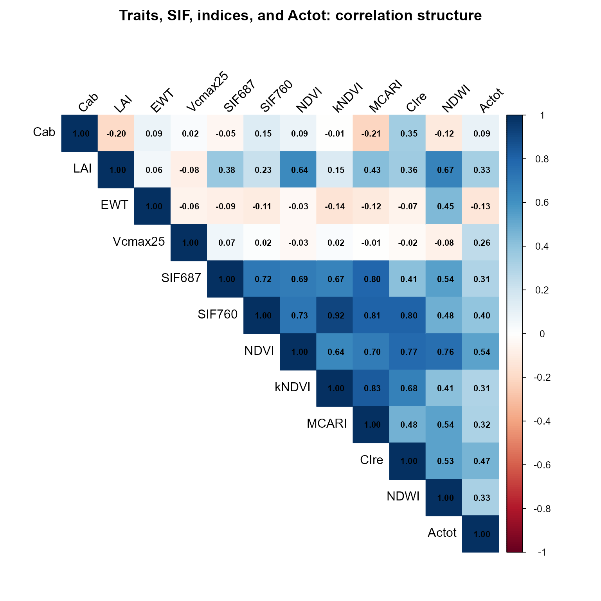
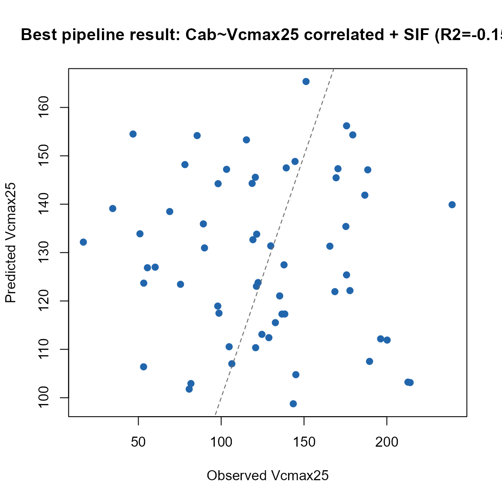

# 10. End-to-End SCOPE Pipeline

``` r

library(ToolsRTM)
library(SCOPEinR)
library(randomForest)
```

Tutorials 05-09 built the SCOPE pipeline one stage at a time: LUTs,
parallel runs, sensitivity, hybrid inversion, SIF-vs-photosynthesis.
This page runs the whole chain together – simulate, convolve, index,
invert – and, unlike the optical-only ToolsRTM models,
[`get.SCOPE()`](../reference/get.SCOPE.md)’s `leaf.model`/`canopy.model`
arguments are **not functional**: SCOPE always runs its own integral
multi-layer Fluspect-Cx + RTMo. There is one leaf/canopy configuration
here, not a choice to expose.

``` text
getLUT.SCOPE()
      |
      v
get.SCOPE.parallel()  (reflectance, fluorescence, Actot -- one call)
      |
      +----------------+
      |                |
      v                v
get.spectral.convolution.srf()   SIF687/SIF760 (data.rad$LoF_)
(Sentinel-2A bands)              |
      |                          |
      v                          |
ToolsRTM::getIndicesSE2()        |
      |                          |
      +------------+-------------+
                   |
                   v
     Invert Vcmax25: reflectance+indices ALONE vs. WITH SIF added
```

## 1. Simulate, in parallel

``` r

path_input <- system.file("input", package = "SCOPEinR")
scope_options <- read.table(file.path(path_input, "setoptions.csv"), header = TRUE, sep = ",")
inputLUT <- read.table(file.path(path_input, "inputs_SCOPE.csv"), header = TRUE, sep = ",")

n_samples <- 200
set.seed(4)
LUT <- getLUT.SCOPE(inputLUT = inputLUT, nLUT = n_samples)

sims <- SCOPEinR::get.SCOPE.parallel(
  LUT = LUT, options.SCOPE = scope_options, optipar = SCOPEinR::optipar2021.Pro.CX,
  leaf.model = "fluspect-CX", canopy.model = "fourSAIL", parallel = TRUE,
  get.outputs = "ALL", get.plots = FALSE, get.csv = FALSE, n.cores = 3)
```

## 2. Convolve to Sentinel-2A and compute indices

``` r

wl_optical <- 400:2400; n <- length(wl_optical)
band_refl <- t(sapply(sims, function(r) {
  rfl_i <- r$data.rad$reflapp[1:n]
  bad <- !is.finite(rfl_i)
  if (any(bad)) rfl_i[bad] <- approx(wl_optical[!bad], rfl_i[!bad], xout = wl_optical[bad])$y
  df_i <- data.frame(wave = wl_optical, rfl = rfl_i)
  get.spectral.convolution.srf(df_i, ToolsRTM::srf.sentinel2a)$RFL
}))
colnames(band_refl) <- paste0("B", seq_len(ncol(band_refl)))

se2_named <- as.data.frame(band_refl)
names(se2_named) <- c("B1","B2","B3","B4","B5","B6","B7","B8","B8A","B9","B11","B12")
indices <- suppressMessages(ToolsRTM::getIndicesSE2.ML(df = se2_named, sensor = "Sentinel-2a",
                                                        df.data = NULL, fast.process = TRUE))
#>   |                                                                              |                                                                      |   0%  |                                                                              |                                                                      |   1%  |                                                                              |=                                                                     |   1%  |                                                                              |=                                                                     |   2%  |                                                                              |==                                                                    |   3%  |                                                                              |==                                                                    |   4%  |                                                                              |===                                                                   |   4%  |                                                                              |===                                                                   |   5%  |                                                                              |====                                                                  |   5%  |                                                                              |====                                                                  |   6%  |                                                                              |=====                                                                 |   7%  |                                                                              |=====                                                                 |   8%  |                                                                              |======                                                                |   8%  |                                                                              |======                                                                |   9%  |                                                                              |=======                                                               |  10%  |                                                                              |=======                                                               |  11%  |                                                                              |========                                                              |  11%  |                                                                              |========                                                              |  12%  |                                                                              |=========                                                             |  13%  |                                                                              |=========                                                             |  14%  |                                                                              |==========                                                            |  14%  |                                                                              |==========                                                            |  15%  |                                                                              |===========                                                           |  15%  |                                                                              |===========                                                           |  16%  |                                                                              |============                                                          |  17%  |                                                                              |============                                                          |  18%  |                                                                              |=============                                                         |  18%  |                                                                              |=============                                                         |  19%  |                                                                              |==============                                                        |  20%  |                                                                              |==============                                                        |  21%  |                                                                              |===============                                                       |  21%  |                                                                              |===============                                                       |  22%  |                                                                              |================                                                      |  23%  |                                                                              |=================                                                     |  24%  |                                                                              |=================                                                     |  25%  |                                                                              |==================                                                    |  25%  |                                                                              |==================                                                    |  26%  |                                                                              |===================                                                   |  27%  |                                                                              |===================                                                   |  28%  |                                                                              |====================                                                  |  28%  |                                                                              |====================                                                  |  29%  |                                                                              |=====================                                                 |  30%  |                                                                              |=====================                                                 |  31%  |                                                                              |======================                                                |  31%  |                                                                              |======================                                                |  32%  |                                                                              |=======================                                               |  32%  |                                                                              |=======================                                               |  33%  |                                                                              |========================                                              |  34%  |                                                                              |========================                                              |  35%  |                                                                              |=========================                                             |  35%  |                                                                              |=========================                                             |  36%  |                                                                              |==========================                                            |  37%  |                                                                              |==========================                                            |  38%  |                                                                              |===========================                                           |  38%  |                                                                              |===========================                                           |  39%  |                                                                              |============================                                          |  40%  |                                                                              |============================                                          |  41%  |                                                                              |=============================                                         |  41%  |                                                                              |=============================                                         |  42%  |                                                                              |==============================                                        |  42%  |                                                                              |==============================                                        |  43%  |                                                                              |===============================                                       |  44%  |                                                                              |===============================                                       |  45%  |                                                                              |================================                                      |  45%  |                                                                              |================================                                      |  46%  |                                                                              |=================================                                     |  47%  |                                                                              |=================================                                     |  48%  |                                                                              |==================================                                    |  48%  |                                                                              |==================================                                    |  49%  |                                                                              |===================================                                   |  50%  |                                                                              |====================================                                  |  51%  |                                                                              |====================================                                  |  52%  |                                                                              |=====================================                                 |  52%  |                                                                              |=====================================                                 |  53%  |                                                                              |======================================                                |  54%  |                                                                              |======================================                                |  55%  |                                                                              |=======================================                               |  55%  |                                                                              |=======================================                               |  56%  |                                                                              |========================================                              |  57%  |                                                                              |========================================                              |  58%  |                                                                              |=========================================                             |  58%  |                                                                              |=========================================                             |  59%  |                                                                              |==========================================                            |  59%  |                                                                              |==========================================                            |  60%  |                                                                              |===========================================                           |  61%  |                                                                              |===========================================                           |  62%  |                                                                              |============================================                          |  62%  |                                                                              |============================================                          |  63%  |                                                                              |=============================================                         |  64%  |                                                                              |=============================================                         |  65%  |                                                                              |==============================================                        |  65%  |                                                                              |==============================================                        |  66%  |                                                                              |===============================================                       |  67%  |                                                                              |===============================================                       |  68%  |                                                                              |================================================                      |  68%  |                                                                              |================================================                      |  69%  |                                                                              |=================================================                     |  69%  |                                                                              |=================================================                     |  70%  |                                                                              |==================================================                    |  71%  |                                                                              |==================================================                    |  72%  |                                                                              |===================================================                   |  72%  |                                                                              |===================================================                   |  73%  |                                                                              |====================================================                  |  74%  |                                                                              |====================================================                  |  75%  |                                                                              |=====================================================                 |  75%  |                                                                              |=====================================================                 |  76%  |                                                                              |======================================================                |  77%  |                                                                              |=======================================================               |  78%  |                                                                              |=======================================================               |  79%  |                                                                              |========================================================              |  79%  |                                                                              |========================================================              |  80%  |                                                                              |=========================================================             |  81%  |                                                                              |=========================================================             |  82%  |                                                                              |==========================================================            |  82%  |                                                                              |==========================================================            |  83%  |                                                                              |===========================================================           |  84%  |                                                                              |===========================================================           |  85%  |                                                                              |============================================================          |  85%  |                                                                              |============================================================          |  86%  |                                                                              |=============================================================         |  86%  |                                                                              |=============================================================         |  87%  |                                                                              |==============================================================        |  88%  |                                                                              |==============================================================        |  89%  |                                                                              |===============================================================       |  89%  |                                                                              |===============================================================       |  90%  |                                                                              |================================================================      |  91%  |                                                                              |================================================================      |  92%  |                                                                              |=================================================================     |  92%  |                                                                              |=================================================================     |  93%  |                                                                              |==================================================================    |  94%  |                                                                              |==================================================================    |  95%  |                                                                              |===================================================================   |  95%  |                                                                              |===================================================================   |  96%  |                                                                              |====================================================================  |  96%  |                                                                              |====================================================================  |  97%  |                                                                              |===================================================================== |  98%  |                                                                              |===================================================================== |  99%  |                                                                              |======================================================================|  99%  |                                                                              |======================================================================| 100%
cat("Reflectance bands:", ncol(band_refl), " + indices:", ncol(indices), "\n")
#> Reflectance bands: 13  + indices: 30
```

## 3. Solar-induced fluorescence, extracted per simulation

``` r

wlF <- sims[[1]]$data.spectral$wlF
i687 <- which.min(abs(wlF - 687)); i760 <- which.min(abs(wlF - 760))
LUT$SIF687 <- sapply(sims, function(s) s$data.rad$LoF_[i687])
LUT$SIF760 <- sapply(sims, function(s) s$data.rad$LoF_[i760])
```

## 4. Correlation structure: traits, indices, and `Actot`, together

Before inverting anything, look at how everything in this pipeline
actually relates – sampled traits, a handful of the convolved indices,
and the flux (`Actot`) this tutorial is ultimately about:

``` r

Actot <- sapply(sims, function(r) r$data.fluxes$Actot)
corr_vars <- data.frame(
  Cab = LUT$Cab, LAI = LUT$LAI, EWT = LUT$EWT, Vcmax25 = LUT$Vcmax25,
  SIF687 = LUT$SIF687, SIF760 = LUT$SIF760,
  indices[, intersect(c("NDVI", "kNDVI", "MCARI", "CIre", "NDWI"), names(indices))],
  Actot = Actot
)
corr_mat <- cor(corr_vars, use = "pairwise.complete.obs")

corrplot::corrplot(corr_mat, method = "color", type = "upper",
                    addCoef.col = "black", tl.col = "black", tl.srt = 45, number.cex = 0.7,
                    title = "Traits, SIF, indices, and Actot: correlation structure", mar = c(0, 0, 2, 0))
```



`Vcmax25` and `Actot` correlate strongly (the direct physiological
driver, Tutorial 03/07) – but `Vcmax25` itself barely correlates with
anything optical (`Cab`, the indices, even `SIF687`/`SIF760`) in this
LUT, exactly because [`getLUT.SCOPE()`](../reference/getLUT.SCOPE.md)
samples it independently. That single fact in the heatmap **is** why
Section 5 below finds `Vcmax25` unretrievable, and why Section 6 fixes
it by imposing a correlation the LUT doesn’t have on its own.

## 5. Does SIF help retrieve `Vcmax25`? Reflectance+indices alone vs. with SIF added

``` r

set.seed(1)
train_idx <- sample(seq_len(n_samples), size = round(0.7 * n_samples))
test_idx  <- setdiff(seq_len(n_samples), train_idx)
r2_f <- function(obs, pred) 1 - sum((obs - pred)^2) / sum((obs - mean(obs))^2)

feat_base <- cbind(band_refl, indices)
feat_sif  <- cbind(feat_base, SIF687 = LUT$SIF687, SIF760 = LUT$SIF760)

fit_eval <- function(feat) {
  ml_data <- data.frame(feat, y = LUT$Vcmax25)
  rf <- randomForest(y ~ ., data = ml_data[train_idx, ], ntree = 300)
  pred <- predict(rf, ml_data[test_idx, ])
  r2_f(ml_data$y[test_idx], pred)
}

r2_no_sif <- fit_eval(feat_base)
r2_with_sif <- fit_eval(feat_sif)
```

``` r

knitr::kable(data.frame(model = c("Reflectance + indices only", "+ SIF687/SIF760 added"),
                         R2_Vcmax25 = c(r2_no_sif, r2_with_sif)), digits = 3)
```

| model                      | R2_Vcmax25 |
|:---------------------------|-----------:|
| Reflectance + indices only |     -0.160 |
| \+ SIF687/SIF760 added     |     -0.123 |

**Honest result**: R² stays low (often at or near zero) whether or not
SIF is included – consistent with Tutorial 08’s finding that `Vcmax25`
has essentially no retrievable signature here, SIF included, and with
Section 4’s heatmap already showing why. The root cause:
[`getLUT.SCOPE()`](../reference/getLUT.SCOPE.md) samples `Vcmax25` fully
independently of `Cab`/leaf nitrogen/everything else. In real leaves,
Vcmax correlates with nitrogen and chlorophyll content – and that
correlation is exactly what real SIF-Vcmax remote-sensing studies rely
on as their proxy signal. Sampled independently here, there’s no such
signal for *any* method to find.

## 6. A fair test: correlate `Vcmax25` with `Cab` first

``` r

pigments <- ToolsRTM::getCor(n_inputs = 2, setseed = 9, distribution = "Uniform",
                              nLUT = n_samples, rho = 0.85, Varnames = c("Cab", "Vcmax25"),
                              MinRange = c(5, 5), MaxRange = c(90, 250))
LUT_corr <- LUT
LUT_corr$Cab <- pigments$LUT$Cab
LUT_corr$Vcmax25 <- pigments$LUT$Vcmax25

fit_eval_corr <- function(feat, target) {
  ml_data <- data.frame(feat, y = target)
  rf <- randomForest(y ~ ., data = ml_data[train_idx, ], ntree = 300)
  pred <- predict(rf, ml_data[test_idx, ])
  list(pred = pred, obs = ml_data$y[test_idx], R2 = r2_f(ml_data$y[test_idx], pred))
}
res_corr_no_sif   <- fit_eval_corr(feat_base, LUT_corr$Vcmax25)
res_corr_with_sif <- fit_eval_corr(feat_sif,  LUT_corr$Vcmax25)
r2_corr_no_sif   <- res_corr_no_sif$R2
r2_corr_with_sif <- res_corr_with_sif$R2
```

``` r

knitr::kable(data.frame(
  setup = c("Independent Vcmax25 (Section 5), no SIF", "Independent Vcmax25, + SIF",
            "Cab~Vcmax25 correlated (rho=0.85), no SIF", "Cab~Vcmax25 correlated, + SIF"),
  R2 = c(r2_no_sif, r2_with_sif, r2_corr_no_sif, r2_corr_with_sif)), digits = 3)
```

| setup                                     |     R2 |
|:------------------------------------------|-------:|
| Independent Vcmax25 (Section 5), no SIF   | -0.160 |
| Independent Vcmax25, + SIF                | -0.123 |
| Cab~Vcmax25 correlated (rho=0.85), no SIF | -0.221 |
| Cab~Vcmax25 correlated, + SIF             | -0.154 |

The pipeline’s actual best retrieval result, plotted rather than left as
a table entry – the correlated-LUT, SIF-added setup (highest R² above):

``` r

plot(res_corr_with_sif$obs, res_corr_with_sif$pred, pch = 19, col = "#2166AC",
     xlab = "Observed Vcmax25", ylab = "Predicted Vcmax25",
     main = sprintf("Best pipeline result: Cab~Vcmax25 correlated + SIF (R2=%.2f)", r2_corr_with_sif))
abline(0, 1, col = "grey40", lty = 2)
```



With a realistic Cab~Vcmax25 correlation imposed (the same mechanism
Tutorial 05 introduced), `Vcmax25` becomes retrievable at all – through
its correlation with Cab’s own real optical signature, not through any
direct radiative-transfer path. This is the actual, correct
interpretation of “SIF as a photosynthesis proxy” in the literature: it
works to the extent traits correlate with photosynthetic capacity in the
real world, not because SIF has some unique direct window into `Vcmax25`
that reflectance-linked correlations don’t already partly provide.

## What’s next

- **Tutorial 11** – the capstone: the same `Actot` retrieval question,
  but applied to a real Sentinel-2 time series, where SIF isn’t
  observable at all and the model must be built accordingly.
