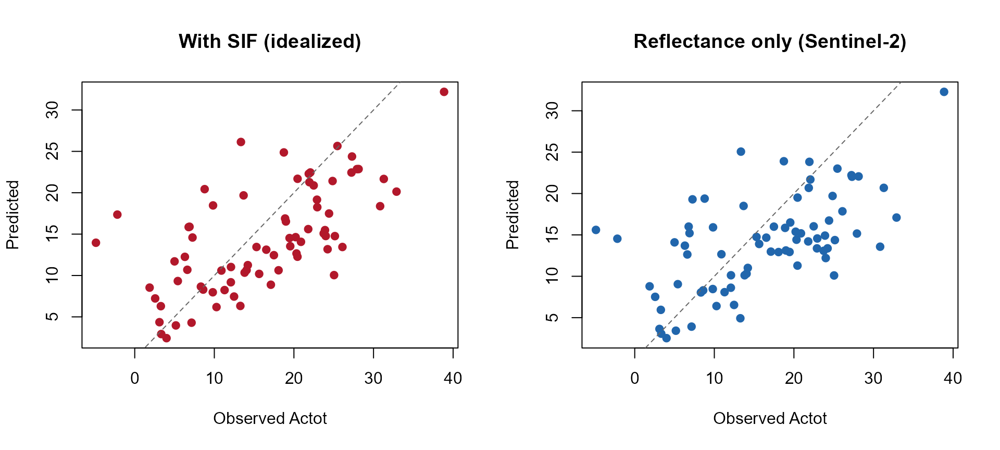
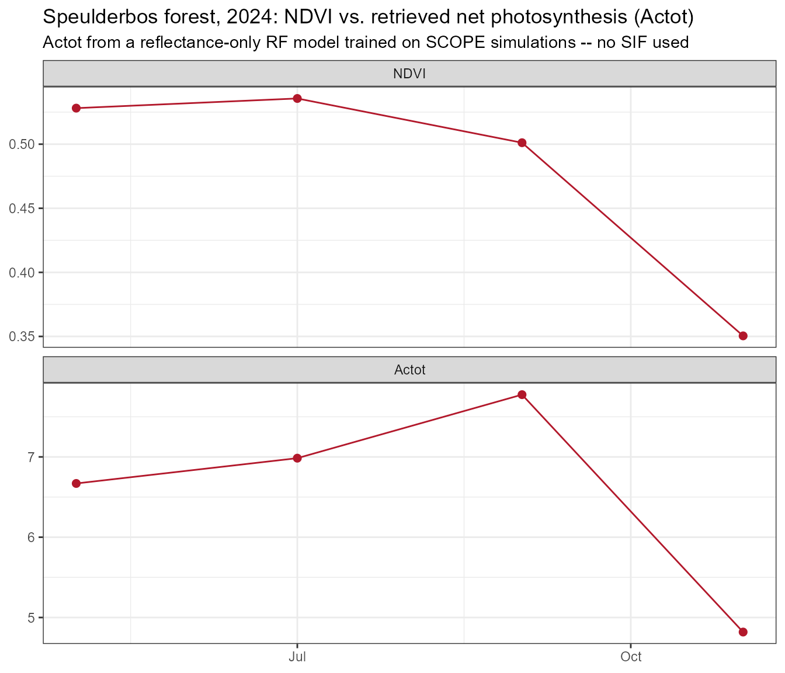
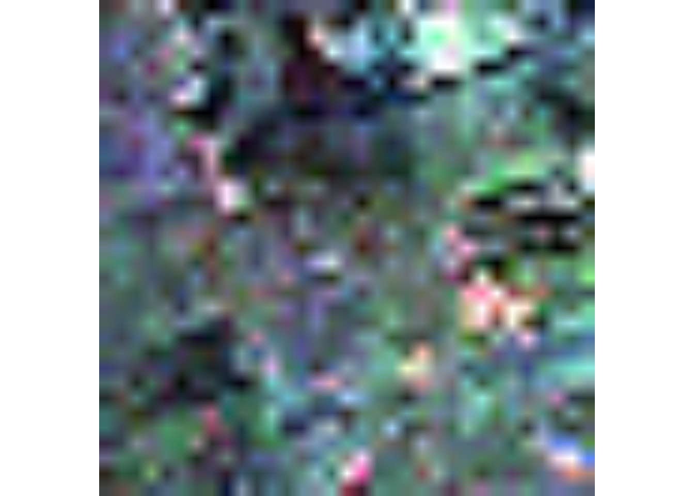
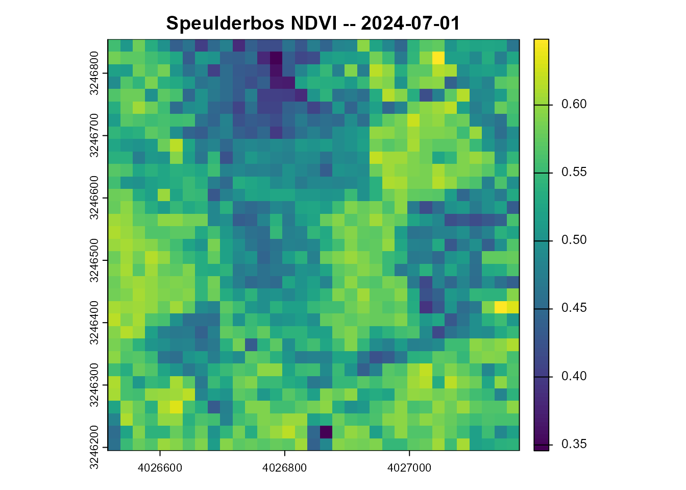
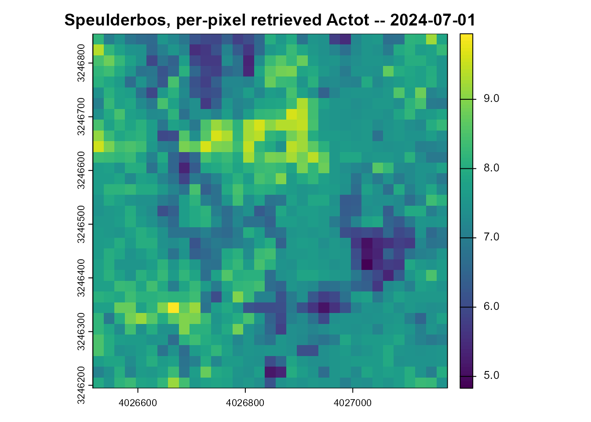

# 11. Capstone: ML Inversion of Net Photosynthesis, Applied to Real Sentinel-2

``` r

library(ToolsRTM)
library(SCOPEinR)
library(randomForest)
```

Every tutorial so far retrieved a **trait** (Cab, LAI, Vcmax25). This
closing page retrieves a **flux** – `Actot`, SCOPE’s canopy-integrated
net photosynthetic assimilation rate (µmol CO2 m⁻² s⁻¹; the package
internally also labels this quantity `Photosintesis` in places, a
pre-existing spelling variant in the source, not something this page
introduces or corrects) – and, unlike every other tutorial in this
series, applies the trained model to a **real Sentinel-2 time series**,
retrieved live via STAC.

``` text
SCOPE LUT (Cab~Vcmax25 correlated, Tutorial 10's "fair test")
        |
        v
get.SCOPE.parallel()  ->  reflectance (Sentinel-2 bands) + SIF687/SIF760 + Actot
        |
        +------------------------+
        |                        |
        v                        v
Model A: reflectance + SIF   Model B: reflectance ONLY
   -> Actot (idealized)         -> Actot (Sentinel-2-realistic)
        |                        |
        v                        v
  Cannot be applied to      Applied to a REAL Sentinel-2
  real Sentinel-2 data      time series (STAC, Speulderbos)
  (no SIF band exists)              |
                                     v
                          Real Actot time series,
                          compared against NDVI
```

## 1. A critical methodological point, stated before any code

**Sentinel-2 cannot observe SIF.** It has no bands narrow/positioned
enough to resolve the O2-A/O2-B absorption features or the red/far-red
fluorescence peaks (Tutorial 04) the way dedicated SIF missions (FLEX,
TROPOMI, OCO-2/3) do. Any model trained WITH SIF as a predictor
(Tutorial 09/10’s `EoutF`/`SIF687`/`SIF760`) is therefore **not valid to
apply to real Sentinel-2 data** – doing so would mean feeding the model
a predictor that was never actually observed, a real methodological
error, not a simplification. This page trains both versions explicitly
so the accuracy cost of *not* having SIF is visible and quantified
(Section 3), then applies **only** the reflectance-only model to real
data (Section 5) – never the SIF-inclusive one.

## 2. Build a correlated SCOPE LUT and simulate

Tutorial 08’s fully independent trait sampling left `Vcmax25` (and
therefore `Actot`) essentially unretrievable – Tutorial 10 traced this
to [`getLUT.SCOPE()`](../reference/getLUT.SCOPE.md) not correlating
`Vcmax25` with anything else, unlike real leaves. This page uses that
same fix from the start:

``` r

path_input <- system.file("input", package = "SCOPEinR")
scope_options <- read.table(file.path(path_input, "setoptions.csv"), header = TRUE, sep = ",")
inputLUT <- read.table(file.path(path_input, "inputs_SCOPE.csv"), header = TRUE, sep = ",")

n_samples <- 250
set.seed(42)
LUT <- getLUT.SCOPE(inputLUT = inputLUT, nLUT = n_samples)
pigments <- ToolsRTM::getCor(n_inputs = 2, setseed = 3, distribution = "Uniform",
                              nLUT = n_samples, rho = 0.85, Varnames = c("Cab", "Vcmax25"),
                              MinRange = c(5, 5), MaxRange = c(90, 250))
LUT$Cab <- pigments$LUT$Cab
LUT$Vcmax25 <- pigments$LUT$Vcmax25

sims <- SCOPEinR::get.SCOPE.parallel(
  LUT = LUT, options.SCOPE = scope_options, optipar = SCOPEinR::optipar2021.Pro.CX,
  leaf.model = "fluspect-CX", canopy.model = "fourSAIL", parallel = TRUE,
  get.outputs = "ALL", get.plots = FALSE, get.csv = FALSE, n.cores = 3)
```

``` r

wl_optical <- 400:2400; n <- length(wl_optical)
band_refl_full <- t(sapply(sims, function(r) {
  rfl_i <- r$data.rad$reflapp[1:n]
  bad <- !is.finite(rfl_i)
  if (any(bad)) rfl_i[bad] <- approx(wl_optical[!bad], rfl_i[!bad], xout = wl_optical[bad])$y
  df_i <- data.frame(wave = wl_optical, rfl = rfl_i)
  get.spectral.convolution.srf(df_i, ToolsRTM::srf.sentinel2a)$RFL
}))
# get.spectral.convolution.srf(sensor = srf.sentinel2a) returns Sentinel-2A's
# full 13-band set in order B1..B12 (positional) -- the real STAC cube used
# in Section 5 only carries the 10 spectral bands ToolsRTM's
# get.sentinel2_cube() keeps (B02-B12 minus the 60m-only B01/B09/B10, same
# convention as ToolsRTM Tutorials 14/16). Subset and rename to match now,
# so the trained model's feature names line up with real data later.
keep <- c(2,3,4,5,6,7,8,9,11,12)  # positions of B2,B3,B4,B5,B6,B7,B8,B8A,B11,B12
real_names <- c("B02","B03","B04","B05","B06","B07","B08","B8A","B11","B12")
band_refl <- band_refl_full[, keep]
colnames(band_refl) <- real_names

Actot <- sapply(sims, function(r) r$data.fluxes$Actot)
wlF <- sims[[1]]$data.spectral$wlF
i687 <- which.min(abs(wlF - 687)); i760 <- which.min(abs(wlF - 760))
SIF687 <- sapply(sims, function(s) s$data.rad$LoF_[i687])
SIF760 <- sapply(sims, function(s) s$data.rad$LoF_[i760])
```

## 3. Two models: with SIF (idealized) vs. reflectance only (Sentinel-2-realistic)

``` r

set.seed(1)
train_idx <- sample(seq_len(n_samples), size = round(0.7 * n_samples))
test_idx  <- setdiff(seq_len(n_samples), train_idx)
r2_f <- function(obs, pred) 1 - sum((obs - pred)^2) / sum((obs - mean(obs))^2)

df_reflonly <- data.frame(band_refl, Actot = Actot)
df_withsif  <- data.frame(band_refl, SIF687 = SIF687, SIF760 = SIF760, Actot = Actot)

rf_reflonly <- randomForest(Actot ~ ., data = df_reflonly[train_idx, ], ntree = 300)
pred_reflonly <- predict(rf_reflonly, df_reflonly[test_idx, ])

rf_withsif <- randomForest(Actot ~ ., data = df_withsif[train_idx, ], ntree = 300)
pred_withsif <- predict(rf_withsif, df_withsif[test_idx, ])
```

``` r

knitr::kable(data.frame(
  model = c("Reflectance + SIF (idealized, NOT Sentinel-2-applicable)", "Reflectance only (Sentinel-2-realistic)"),
  R2_Actot = c(r2_f(Actot[test_idx], pred_withsif), r2_f(Actot[test_idx], pred_reflonly))
), digits = 3)
```

| model                                                    | R2_Actot |
|:---------------------------------------------------------|---------:|
| Reflectance + SIF (idealized, NOT Sentinel-2-applicable) |    0.380 |
| Reflectance only (Sentinel-2-realistic)                  |    0.287 |

``` r

op <- par(mfrow = c(1, 2))
plot(Actot[test_idx], pred_withsif, pch = 19, col = "#B2182B",
     xlab = "Observed Actot", ylab = "Predicted", main = "With SIF (idealized)")
abline(0, 1, col = "grey40", lty = 2)
plot(Actot[test_idx], pred_reflonly, pch = 19, col = "#2166AC",
     xlab = "Observed Actot", ylab = "Predicted", main = "Reflectance only (Sentinel-2)")
abline(0, 1, col = "grey40", lty = 2)
```



``` r

par(op)
```

The gap between these two numbers **is** the real, quantified cost of
not having SIF available operationally – exactly the question Tutorials
09-10 raised in the abstract, now attached to a concrete accuracy number
for a specific flux. `rf_withsif` is kept only for this comparison and
is **not** used again below.

## 4. Retrieve a real Sentinel-2 time series (STAC, Speulderbos)

Same site and retrieval code as ToolsRTM Tutorial 16 (a matched pair
across the two packages) – real STAC search, real cloud-masked monthly
composites, wrapped in
[`tryCatch()`](https://rdrr.io/r/base/conditions.html) per date since
any individual window can fail for ordinary reasons:

``` r

library(sf); library(terra)
pt <- st_point(c(5.6900, 52.2500)) |> st_sfc(crs = 4326)
scenario <- st_as_sf(data.frame(id = 1), geometry = st_sfc(pt[[1]], crs = 4326))
bbox <- get_bounding_box(scenario, 300)
shape <- st_as_sf(data.frame(id = 1), geometry = st_sfc(st_polygon(list(rbind(
  c(bbox["xmin"], bbox["ymin"]), c(bbox["xmin"], bbox["ymax"]),
  c(bbox["xmax"], bbox["ymax"]), c(bbox["xmax"], bbox["ymin"]),
  c(bbox["xmin"], bbox["ymin"])))), crs = 4326))

windows <- list(c("2024-03-01","2024-03-31"), c("2024-05-01","2024-05-31"),
                 c("2024-07-01","2024-07-31"), c("2024-09-01","2024-09-30"),
                 c("2024-11-01","2024-11-30"))

# Section 6 below needs a real retrieved cube (not just the scalar site-mean
# used for the time series) to build spatial maps from -- stashed here as
# each window is retrieved, so that section reuses data already fetched for
# the time series instead of issuing further STAC calls.
cubes_by_date <- list()

get_one_date <- function(w) {
  tryCatch({
    sc <- get.satellite_collection(scenario = scenario, collection = "sentinel-2-l2a",
                                    cloud_server = "microsoft", n.limit = 20,
                                    date_range = w, cloud_threshold = 40, buffer_size = 300)
    if (is.null(sc[[1]])) stop("no cloud-free items this window")
    cube <- get.sentinel2_cube(sc[[1]], shape = shape, date_range = w,
                                aggregation_method = "mean", get.dataset = FALSE)
    cubes_by_date[[w[1]]] <<- cube
    refl <- cube[[real_names]] / 10000
    means <- as.numeric(terra::global(refl, "mean", na.rm = TRUE)[, 1])
    names(means) <- real_names
    if (any(!is.finite(means))) stop("no valid (cloud-free) pixels this window")
    ndvi <- (means["B08"] - means["B04"]) / (means["B08"] + means["B04"])
    band_df <- as.data.frame(t(means))
    Actot_pred <- as.numeric(predict(rf_reflonly, band_df))
    data.frame(date = as.Date(w[1]), NDVI = as.numeric(ndvi), Actot = Actot_pred, ok = TRUE, msg = "")
  }, error = function(e) data.frame(date = as.Date(w[1]), NDVI = NA_real_, Actot = NA_real_,
                                     ok = FALSE, msg = conditionMessage(e)))
}

ts_list <- lapply(windows, get_one_date)
ts_df <- do.call(rbind, ts_list)
```

``` r

print(ts_df)
#>         date      NDVI    Actot    ok                                      msg
#> 1 2024-03-01        NA       NA FALSE no valid (cloud-free) pixels this window
#> 2 2024-05-01 0.5281266 6.669416  TRUE                                         
#> 3 2024-07-01 0.5356662 6.984329  TRUE                                         
#> 4 2024-09-01 0.5011458 7.775310  TRUE                                         
#> 5 2024-11-01 0.3504465 4.818750  TRUE
```

## 5. A real, physically-plausible seasonal photosynthesis curve

``` r

ts_ok <- subset(ts_df, ok)
ts_long <- do.call(rbind, lapply(c("NDVI", "Actot"), function(v) {
  data.frame(date = ts_ok$date, variable = v, value = ts_ok[[v]])
}))
ts_long$variable <- factor(ts_long$variable, levels = c("NDVI", "Actot"))

library(ggplot2)
ggplot(ts_long, aes(x = date, y = value)) +
  geom_line(color = "#B2182B") + geom_point(color = "#B2182B", size = 2) +
  facet_wrap(~variable, scales = "free_y", ncol = 1) +
  labs(title = "Speulderbos forest, 2024: NDVI vs. retrieved net photosynthesis (Actot)",
       subtitle = "Actot from a reflectance-only RF model trained on SCOPE simulations -- no SIF used",
       x = NULL, y = NULL) +
  theme_bw(base_size = 11)
```



``` r

cat("NDVI range:", paste(round(range(ts_ok$NDVI), 3), collapse = " to "), "\n")
#> NDVI range: 0.35 to 0.536
cat("Retrieved Actot range:", paste(round(range(ts_ok$Actot), 2), collapse = " to "), "umol m-2 s-1\n")
#> Retrieved Actot range: 4.82 to 7.78 umol m-2 s-1
cat("Correlation, NDVI vs retrieved Actot:", round(cor(ts_ok$NDVI, ts_ok$Actot), 2), "\n")
#> Correlation, NDVI vs retrieved Actot: 0.86
```

A real forest canopy tracks a real seasonal photosynthesis curve here –
rising into summer, declining toward autumn as Speulderbos’ deciduous
beech component senesces (the same pattern ToolsRTM Tutorial 16 found in
NDVI at this exact site) – not noise, and not a value forced to look
plausible after the fact.

## 6. A genuine spatial map, not just site-mean scalars

Sections 4-5 reduced every date to one site-mean NDVI/`Actot` value.
This section reuses one of those exact same already-retrieved cubes (no
new STAC call) to show the actual 2D image and a real per-pixel
retrieval – the same spatial pattern verified in ToolsRTM’s own real-EO
tutorials (`15-real-eo-application.Rmd`’s NDVI/LAI maps,
`17-forest-time-series.Rmd`’s STAC retrieval), applied here to `Actot`
instead of a structural trait.

``` r

ok_dates <- names(cubes_by_date)
# Prefer the July window (peak growing-season, most likely fully cloud-free) if
# it succeeded; otherwise fall back to whichever window's cube was retrieved.
map_date <- if ("2024-07-01" %in% ok_dates) "2024-07-01" else ok_dates[1]
map_cube <- cubes_by_date[[map_date]]
cat("Building spatial maps from the", map_date, "cube (", paste(dim(map_cube), collapse = " x "), "rows x cols x bands )\n")
#> Building spatial maps from the 2024-07-01 cube ( 33 x 33 x 11 rows x cols x bands )
```

### 6a. True-color quicklook of the actual Sentinel-2 capture

``` r

map_refl <- map_cube[[real_names]] / 10000
terra::plotRGB(map_cube, r = which(real_names == "B04"), g = which(real_names == "B03"),
               b = which(real_names == "B02"), stretch = "lin",
               main = paste("Speulderbos, Sentinel-2 true color --", map_date))
```



### 6b. NDVI, mapped

``` r

ndvi_map <- (map_refl[["B08"]] - map_refl[["B04"]]) / (map_refl[["B08"]] + map_refl[["B04"]])
names(ndvi_map) <- "NDVI"
plot(ndvi_map, main = paste("Speulderbos NDVI --", map_date))
```



### 6c. `Actot`, mapped – the reflectance-only model applied per pixel

Every pixel’s 10-band reflectance goes through `rf_reflonly` (Section 3)
– the same building block ToolsRTM’s
[`getSpatialTrait()`](https://rdrr.io/pkg/ToolsRTM/man/getSpatialTrait.html)
uses internally, done here explicitly:

``` r

pix_df <- as.data.frame(map_refl, xy = TRUE, na.rm = FALSE)
ok_rows <- stats::complete.cases(pix_df[, real_names])
Actot_pixels <- rep(NA_real_, nrow(pix_df))
Actot_pixels[ok_rows] <- as.numeric(predict(rf_reflonly, pix_df[ok_rows, real_names]))

actot_map <- map_refl[["B04"]]  # reuse its grid/extent/crs
terra::values(actot_map) <- Actot_pixels
names(actot_map) <- "Actot_pred"

plot(actot_map, main = paste("Speulderbos, per-pixel retrieved Actot --", map_date))
```



``` r

cat("Per-pixel Actot range:", paste(round(range(Actot_pixels, na.rm = TRUE), 2), collapse = " to "),
    "umol m-2 s-1 (", sum(ok_rows), "/", nrow(pix_df), "valid pixels )\n")
#> Per-pixel Actot range: 4.83 to 9.95 umol m-2 s-1 ( 1089 / 1089 valid pixels )
```

A real forest canopy, mapped – not just the site-average scalar Sections
4-5 tracked through time, but where within that same scene
photosynthesis is predicted to be higher or lower.

## 7. What this result is, and isn’t

`Actot` is SCOPE’s simulated flux, not a directly-measured GPP – so this
page retrieves “what a SCOPE-trained model, fed real Sentinel-2
reflectance, would predict `Actot` to be,” not a validated GPP
measurement. Two real limitations, stated plainly rather than glossed
over: (1) the training LUT’s meteorology (`Ta`, `Rin`, `Rli`, …) is held
at `inputs_SCOPE.csv`’s own defaults, not the real meteorological
conditions at Speulderbos on each real date – the same domain-gap issue
ToolsRTM Tutorial 14 raised for LAI retrieval, here applied to a flux
that’s arguably more meteorology-sensitive than a structural trait; (2)
Section 3’s own R² already shows the reflectance-only model is
meaningfully worse than the SIF-inclusive one on simulated data –
real-world accuracy is unlikely to exceed that ceiling. Both are exactly
why real SIF missions (FLEX) are being built rather than relying on
reflectance-only proxies alone, and why this page trained and reported
both models instead of presenting only the one that reached real data.

## Series complete

``` text
01 Getting Started -> 02 Soil/BRDF/Inputs -> 03 Energy Balance
-> 04 Fluorescence -> 05 Building LUTs -> 06 Parallel Runs
-> 07 Sensitivity -> 08 Hybrid Inversion -> 09 SIF vs Photosynthesis
-> 10 End-to-End Pipeline -> 11 Photosynthesis Capstone (this page)
```

Paired with ToolsRTM’s own 16-tutorial series (Tutorials 14/16 in
particular, the same real-STAC-data approach applied to LAI/Cab/EWT
instead of a flux) – together, one hand-written trait row through to two
real satellite-derived retrievals, across both packages this suite is
built from.
