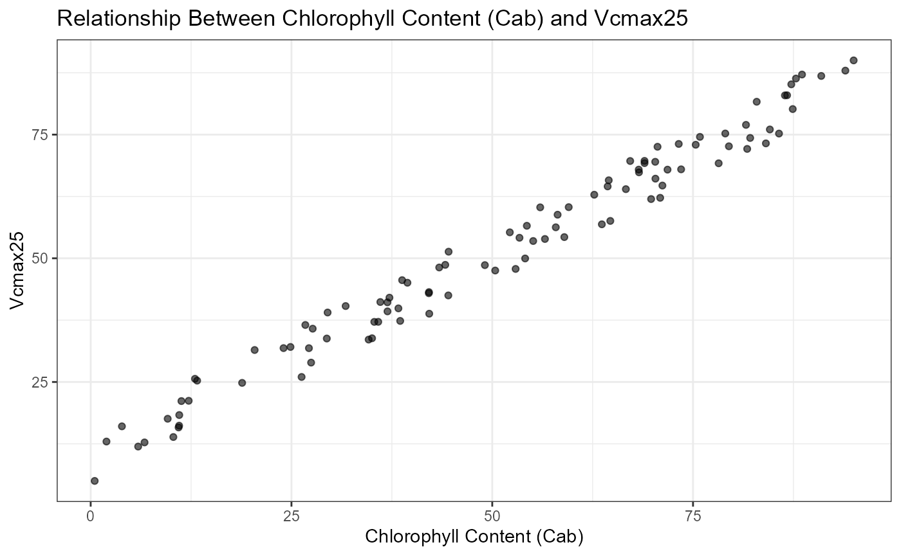
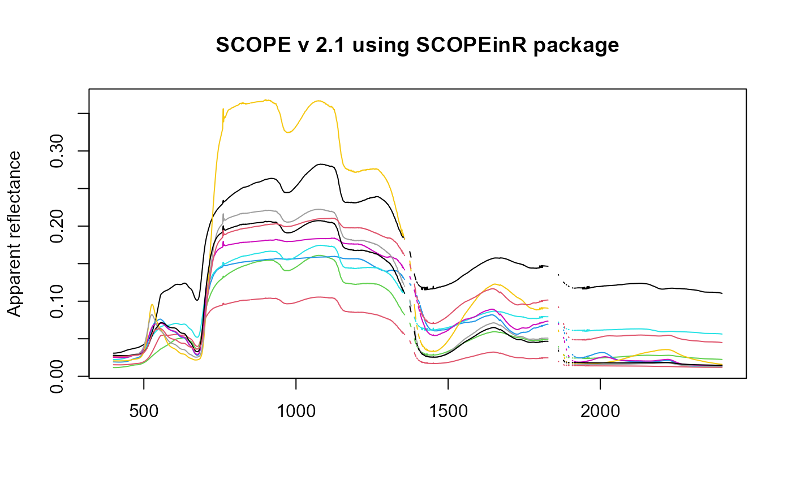

# The SCOPEinR package

    #> Warning: package 'knitr' was built under R version 4.5.2
    #> Warning: package 'kableExtra' was built under R version 4.5.3

## 1. Introduction

This tutorial provides an introduction to the **SCOPEinR** package,
developed using [R Markdown](http://rmarkdown.rstudio.com). The
**SCOPEinR** package powers the online RT-Simulator, offering a
user-friendly interface through a Shiny app that allows users to
simulate canopy reflectance at the Top of Canopy (TOC) level.
Additionally, it enables the simulation of reflectance and chlorophyll
fluorescence emissions using the SCOPE model. For inter-comparison with
other key radiative transfer (RT) models, it is recommended to install
the **ToolsRTM** package alongside **SCOPEinR**.


**Fig. 1** Simulations generated using the SCOPE model via the
**SCOPEinR** package

The **SCOPEinR** package is designed to execute the Soil Canopy
Observation, Photochemistry, and Energy fluxes (SCOPE) radiative
transfer model. Originally developed in MATLAB by Van der Tol et
al. (2009) and extended by Yang et al. (2020). **SCOPEinR** enables
seamless integration of the SCOPE model within the R environment,
offering users the flexibility to harness its capabilities for in-depth
analysis.

**ToolsRTM** and **SCOPEinR** are both part of
[**RTM-Suite**](https://ccgcam.github.io/RTM-Suite/), which also ships a
point-and-click Shiny app (no code required) covering the same models –
see
[`Apps/RTMs`](https://github.com/CCGCAM/RTM-Suite/tree/main/Apps/RTMs),
runnable locally via `shiny::runApp("Apps/RTMs")`. Both R packages are
distributed under GPL-3.0 (see each package’s own
`LICENSE`/`THIRD_PARTY_LICENSES.md` for the per-model breakdown).

The repositories for accessing the R packages are as follows:

- The **ToolsRTM** package: <https://gitlab.com/caminoccg/toolsrtm>

- The **SCOPEinR** package: <https://gitlab.com/caminoccg/scopeinr>

- The monorepo (both packages, their Python ports, tutorials, and the
  Shiny apps together): <https://github.com/CCGCAM/RTM-Suite>

**Citation**: Camino et al. (2024): **DOI:**
[10.1109/IGARSS53475.2024.10642442](https://doi.org/10.1109/IGARSS53475.2024.10642442)

## 2. SCOPEinR package

### 2.1 Install from GitLab

``` r

if (!requireNamespace("remotes", quietly = TRUE)) install.packages("remotes")
if (!requireNamespace("SCOPEinR", quietly = TRUE)) remotes::install_gitlab("caminoccg/scopeinr")
library(SCOPEinR)
```

Additionally, we recommend installing the **ToolsRTM** package. This
package provides inversion methods, LUT functions, and relevant
radiative transfer models for comparison with the SCOPE model
(installation is not mandatory).

``` r

if (!requireNamespace("ToolsRTM", quietly = TRUE)) remotes::install_gitlab("caminoccg/toolsrtm")
library(ToolsRTM)
```

### 2.2 How to run SCOPE model in R

Before running the SCOPE model in R, it’s essential to prepare the
options file. This file contains various settings that customize the
model’s behavior. To view the available options, you can use the
following command:

``` r

table.with.opts<-SCOPEinR::data.opts
knitr::kable(head(table.with.opts, 10))
```

| Order | Options | Value | Info |
|---:|:---|---:|:---|
| 1 | lite | 1 | Value 1 indicates the SCOPE will use the lite SCOPEversion |
| 2 | calc_fluorescence | 1 | Value 1 indicates that SCOPE will calculate thechlorophyll fluorescence in observation direction |
| 3 | calc_spectrum_planck | 1 | Value 1 SCOPE will calculate the spectrum of thermal radiation |
| 4 | calc_xanthophyllabs | 1 | Value 1 indicates the SCOPE includes simulation of reflectance dependence on de-epoxydation state |
| 5 | soilspectrum | 0 | Value 0 use a soil reflectance file and Value 1 SCOPE will calculate the soil spectrum using BSM model |
| 6 | Fluorescence_model | 0 | Value 0 empirical with sustained NPQ from Flexas data and Value 1 empirical with sigmoid for Kn and Value 2 uses Magnani 2012 model |
| 7 | applTcorr | 1 | Value 1 indicates that SCOPE will correct the Vcmax and rate constants for temperature in biochemical.m |
| 8 | verify | 1 | Value 1 indicates that SCOPE will check with field data |
| 9 | mSCOPE | 0 | Value 1 indicates that SCOPE wil use the mSCOPE considering vertical variations in the vegetation canopies |
| 10 | simulation | 0 | Value 0 the SCOPE will execute by individual runs based on LUT table and Value 1 for time series (uses text files with meteo input as time series) |

This command retrieves the options table from the SCOPEinR package and
displays the first ten entries in a user-friendly format. Each entry
outlines an option, its corresponding value, and a brief description of
its purpose within the model.

Once you have reviewed the available options, you can proceed to create
a Look-Up Table (LUT) for your SCOPE simulation. The LUT is a crucial
component that allows the model to reference pre-calculated values for
various parameters, streamlining the simulation process.

To create the LUT, you can use the following commands:

``` r

n.samples =100 
inputLUT=SCOPEinR::inputsSCOPE
# create a LUT
LUT <-SCOPEinR::getLUT.SCOPE(inputLUT=inputLUT,nLUT=n.samples)
knitr::kable(head(LUT, 5))
```

| N | Cab | Car | Anth | LMA | EWT | alpha | Cbrown | Cs | Prot | CBC | Cx | rho_thermal | tau_thermal | Vcmax25 | BallBerrySlope | BallBerry0 | Type | kV | Rdparam | Kn0 | Knalpha | Knbeta | Tyear | beta | kNPQs | qLs | stressfactor | fqe | spectrum | rss | rs_thermal | cs | rhos | lambdas | SMC | BSMBrightness | BSMlat | BSMlon | LAI | hc | LIDFa | LIDFb | TypeLidf | leafwidth | hspot | Cv | crowndiameter | zo | d | Cd | rb | CR | CD1 | Psicor | CSSOIL | rbs | rwc | z | Rin | Rli | Ta | p | ea | RH | u | Ca | Oa | startDate | endDate | LAT | LON | timezn | tts | tto | psi |
|---:|---:|---:|---:|---:|---:|---:|---:|---:|---:|---:|---:|---:|---:|---:|---:|---:|:---|---:|---:|---:|---:|---:|---:|---:|---:|---:|---:|---:|---:|---:|---:|---:|---:|---:|---:|---:|---:|---:|---:|---:|---:|---:|---:|---:|---:|---:|---:|---:|---:|---:|---:|---:|---:|---:|---:|---:|---:|---:|---:|---:|---:|---:|---:|---:|---:|---:|---:|:---|:---|---:|---:|---:|---:|---:|---:|
| 2.362733 | 78.89102 | 3.251115 | 2.1283673 | 0.1985231 | 0.0277819 | 43.6251882 | 0.5974519 | 0.2702431 | 0 | 0 | 0.9760460 | 0.01 | 0.01 | 25.60002 | 8.005108 | 0.01 | C3 | 0.64 | 0.015 | 2.48 | 2.83 | 0.114 | 15 | 0.51 | 0 | 1 | 1 | 0.01 | 1 | 500 | 0.06 | 1180 | 1800 | 1.55 | 25 | 0.5 | 25 | 45 | 2.1396909 | 1.659416 | -0.0421029 | 0.4141272 | 1 | 0.1 | 0 | 1 | 1 | 0.25 | 1.34 | 0.3 | 10 | 0.35 | 20.6 | 0.2 | 0.01 | 10 | 0 | 5 | 600 | 300 | 20 | 970 | 15 | 0.2894528 | 2 | 410 | 209 | 2018-08-01 | 2018-09-01 | 51.55 | 5.55 | 1 | 6.971054 | 23.70328 | 35.10155 |
| 3.864915 | 48.91944 | 8.155829 | 3.9219638 | 0.1417711 | 0.1829314 | 49.6014030 | 0.0248983 | 0.5988021 | 0 | 0 | 0.9698001 | 0.01 | 0.01 | 69.78263 | 19.514643 | 0.01 | C3 | 0.64 | 0.015 | 2.48 | 2.83 | 0.114 | 15 | 0.51 | 0 | 1 | 1 | 0.01 | 1 | 500 | 0.06 | 1180 | 1800 | 1.55 | 25 | 0.5 | 25 | 45 | 6.3529055 | 1.111979 | 0.1807867 | -0.3479634 | 1 | 0.1 | 0 | 1 | 1 | 0.25 | 1.34 | 0.3 | 10 | 0.35 | 20.6 | 0.2 | 0.01 | 10 | 0 | 5 | 600 | 300 | 20 | 970 | 15 | 0.9992738 | 2 | 410 | 209 | 2018-08-01 | 2018-09-01 | 51.55 | 5.55 | 1 | 11.683607 | 27.06327 | 106.32946 |
| 2.726931 | 48.22870 | 18.159972 | 1.0911191 | 0.1653431 | 0.1198232 | 30.6432645 | 0.0048417 | 0.7358376 | 0 | 0 | 0.0884846 | 0.01 | 0.01 | 180.76385 | 16.651130 | 0.01 | C3 | 0.64 | 0.015 | 2.48 | 2.83 | 0.114 | 15 | 0.51 | 0 | 1 | 1 | 0.01 | 1 | 500 | 0.06 | 1180 | 1800 | 1.55 | 25 | 0.5 | 25 | 45 | 5.9879357 | 3.935698 | -0.8067595 | 0.9303666 | 1 | 0.1 | 0 | 1 | 1 | 0.25 | 1.34 | 0.3 | 10 | 0.35 | 20.6 | 0.2 | 0.01 | 10 | 0 | 5 | 600 | 300 | 20 | 970 | 15 | 0.9870372 | 2 | 410 | 209 | 2018-08-01 | 2018-09-01 | 51.55 | 5.55 | 1 | 12.354996 | 20.10399 | 27.97176 |
| 4.149052 | 63.75834 | 24.793631 | 6.6960583 | 0.1783793 | 0.1499214 | 34.0635699 | 0.1313783 | 0.7135778 | 0 | 0 | 0.4983800 | 0.01 | 0.01 | 89.55907 | 15.961528 | 0.01 | C3 | 0.64 | 0.015 | 2.48 | 2.83 | 0.114 | 15 | 0.51 | 0 | 1 | 1 | 0.01 | 1 | 500 | 0.06 | 1180 | 1800 | 1.55 | 25 | 0.5 | 25 | 45 | 3.2875501 | 1.453983 | 0.9017805 | 0.3929089 | 1 | 0.1 | 0 | 1 | 1 | 0.25 | 1.34 | 0.3 | 10 | 0.35 | 20.6 | 0.2 | 0.01 | 10 | 0 | 5 | 600 | 300 | 20 | 970 | 15 | 0.4800463 | 2 | 410 | 209 | 2018-08-01 | 2018-09-01 | 51.55 | 5.55 | 1 | 4.235326 | 17.02276 | 93.50929 |
| 4.321402 | 58.56334 | 17.878338 | 0.3077664 | 0.1078821 | 0.1837909 | 0.0693492 | 0.0248171 | 0.1164929 | 0 | 0 | 0.3956894 | 0.01 | 0.01 | 96.14094 | 12.833691 | 0.01 | C3 | 0.64 | 0.015 | 2.48 | 2.83 | 0.114 | 15 | 0.51 | 0 | 1 | 1 | 0.01 | 1 | 500 | 0.06 | 1180 | 1800 | 1.55 | 25 | 0.5 | 25 | 45 | 0.5923029 | 1.705863 | -0.6745137 | -0.6778436 | 1 | 0.1 | 0 | 1 | 1 | 0.25 | 1.34 | 0.3 | 10 | 0.35 | 20.6 | 0.2 | 0.01 | 10 | 0 | 5 | 600 | 300 | 20 | 970 | 15 | 0.7622751 | 2 | 410 | 209 | 2018-08-01 | 2018-09-01 | 51.55 | 5.55 | 1 | 10.949675 | 26.60419 | 74.31114 |

In this example, n.samples is set to 10, indicating the number of
samples you wish to generate. The **inputLUT** variable is assigned the
default inputs for the SCOPE model, which are necessary for creating the
LUT. The function **getLUT.SCOPE** then generates the LUT based on these
inputs and the specified number of samples. The resulting LUT is
displayed, showcasing the first five entries, which will be utilized in
your SCOPE simulations.

By preparing the options file and creating the LUT, you set the
foundation for effective and efficient SCOPE model runs in R.The LUT
contains the inputs and their variants generated using a uniform
distribution. This ensures that the model explores a broad range of
parameter values, enhancing the robustness of the simulations. By
leveraging this comprehensive LUT, you can achieve more accurate and
representative results from your SCOPE model analysis.

### 2.3 Updating the LUT according to new ranges

In this section, we will update the Look-Up Table (LUT) by generating
values for the Vcmax25 parameter, which represents the velocity of
carboxylation of the enzyme RUbisCO at 25 degrees, and creating a
correlation between Cab (chlorophyll content) and Vcmax25. The following
code performs these tasks:

1.  Generate Vcmax25 Values: We create random values for the Vcmax25
    parameter using the runif function from the stats package. This
    function generates values uniformly distributed between 5 and 90.

2.  Set Seed for Randomness: A random seed is established using the
    runif function to ensure that the generated values can be reproduced
    in future runs. This is critical for maintaining consistency in
    simulations.

3.  Generate a correlation dataset: The getCor function from the
    **ToolsRTM** package is called to create a correlation structure for
    the variables Cab and Vcmax25. This function takes several
    arguments:

    - `n:inputs`: Indicates the number of input variables.

    - `n.seed`: Uses the previously set random seed.

    - `distribution`: Specifies the type of distribution to be used; the
      options are ‘Uniform’ or ‘Gauss’.

    - `nLUT`: The number of samples to generate.

    - `rho`: Sets the correlation coefficient for the generated
      variables (0.99 below).

    - `Varnames`: A vector containing the names of the variables (Cab
      and Vcmax25).

    - `MinRange` and `MaxRange`: Specify the minimum and maximum ranges
      for each variable.

``` r


LUT$Vcmax25 = stats::runif(n.samples,min = 5 ,max=90 )
n.seed <- round(runif(1,1,n.samples),0)

pigments<-ToolsRTM::getCor(n_inputs = 2,setseed = n.seed,distribution = 'Uniform',nLUT = n.samples, rho = 0.99,
               Varnames = c('Cab','Vcmax25'),MinRange = c(0.5,5), MaxRange = c(95,90))
#> Generating a Uniform distribution for all correlated inputs ...
LUT$Cab <-pigments$LUT$Cab
LUT$Vcmax25 <-pigments$LUT$Vcmax25
# Create the ggplot
ggplot(pigments$LUT, aes(x = Cab, y = Vcmax25)) +
  geom_point(alpha = 0.6) +
  labs(title = "Relationship Between Chlorophyll Content (Cab) and Vcmax25",
       x = "Chlorophyll Content (Cab)",
       y = "Vcmax25") +
  theme_bw()
```



In this example a scatter plot is generated using the `ggplot2` package
to visualize the relationship between `Cab` and `Vcmax25`. The `aes`
function maps the `Cab` values to the x-axis and `Vcmax25` values to the
y-axis. The `geom_point` function adds points to the plot, with `alpha`
set to 0.6 for transparency. The plot is titled “Relationship Between
Chlorophyll Content (Cab) and Vcmax25,” with appropriately labeled axes.
The `theme_bw()` function is applied to give the plot a clean,
minimalistic appearance.

This process allows for a detailed examination of how changes in
chlorophyll content correlate with variations in Vcmax25, providing
valuable insights for further analysis in your SCOPE model simulations.

### 2.4 Run the SCOPE model in parallel

To simulate canopy reflectance using the SCOPE model, you need to define
a range of inputs that describe plant traits, canopy structure, and
environmental conditions. In this example, we will focus on generating a
Look-Up Table (LUT) for SCOPE and running the model in parallel. The LUT
will contain a range of values for the key input parameters, which will
be used to simulate various outputs such as apparent reflectance.

In SCOPE, you can configure the leaf and canopy models and choose
different radiative transfer models such as fluspect-CX (for leaf
optical properties) and fourSAIL (for canopy structure). Below is an
example of running SCOPE in parallel with the default settings and using
the SCOPEinR package.

``` r


db.sims <-SCOPEinR::get.SCOPE.parallel(LUT=LUT,options.SCOPE=table.with.opts,optipar=SCOPEinR::optipar2017.ProspectD,
                                       leaf.model='fluspect-CX',canopy.model='fourSAIL', parallel = T,
                                       get.outputs='ALL', get.plots = F, get.csv =F, n.cores = 3)
#> Executing SCOPE 2.1. version ...
```

Total simulations: 100 Total execution time: 33.5249

``` r


wave_<-db.sims[[1]]$data.spectral$wlS[1:2001]
matrix.reflapp <- sapply(seq_along(db.sims), function(i) db.sims[[i]]$data.rad$reflapp[1:2001])
# Assuming matrix.refl is your matrix
ncols <- sample(ncol(matrix.reflapp), n.samples/10)

matplot(wave_,matrix.reflapp[,ncols], type = "l", lty = 1, col = 1:ncol(matrix.reflapp), xlab = "", ylab = "Apparent reflectance", main = "SCOPE v 2.1 using SCOPEinR package")
```



### 2.5 Export the simulations and SCOPE outputs

The `get.SCOPE.outputs` function is designed to export all the results
from the SCOPE simulations to your disk. By specifying the output
folder, the function will save both the primary simulation outputs and
any additional parameters that you choose to extract. The following code
demonstrates how to export the outputs to a specified directory:

the `get.SCOPE.outputs` function includes the **get.more.inputs**
parameter, which allows you to specify additional inputs/outputs to be
saved. In the example above we extract extra outputs such as:

- **Reflectance (refl)**

- **LIDF angles (lidf)**

- **LIDF-b parameter (LIDFb)**

- **Ft-Fo ratio (Ft_Fo)** (representing fluorescence efficiency)

- **TOC hemispherical-directional reflectance (rdo)**

All simulation outputs, including these additional variables, will be
saved in the specified folder on your disk for further analysis. By
setting **get.plots = TRUE**, the function will also generate and save
relevant plots alongside the data.


**Fig. 2** Directory containing all outputs generated by the
**SCOPEinR** package.

## 3. Inputs and ranges used in the SCOPE model

Below are tables summarizing the key inputs and their respective ranges
utilized in each RTMs.

### 3.1 FLUSPECT model (Leaf radiative transfer model)

[TABLE]

### 3.2 FourSAIL model (Canopy radiative transfer model)

[TABLE]

## 4. References

If you use any of the RTM models integrate into **SCOPEinR package**,
please cite the following references:

The official SCOPE’s github is available at
<https://github.com/Christiaanvandertol/SCOPE>

Peiqi Yang, Elizaveta Prikaziuk, Wout Verhoef, and Christiaan van der
Tol. SCOPE 2.0: A model to simulate vegetated land surface fluxes and
satellite signals. *Geosci. Model Dev.*, 14:4697–4712, 2021.
<https://doi.org/10.5194/gmd-14-4697-2021>.

Christiaan van der Tol, Wouter Verhoef, Joost Timmermans, Adriaan
Verhoef, and Zoltan Su. An integrated model of soil-canopy spectral
radiances, photosynthesis, fluorescence, temperature and energy balance.
*Biogeosciences*, 6(12):3109–3129, 2009.
<https://doi.org/10.5194/bg-6-3109-2009>.

### Other Main References:

G.James Collatz, J.Timothy Ball, Cyril Grivet, and Joseph A. Berry.
Physiological and environmental regulation of stomatal conductance,
photosynthesis, and transpiration: A model that includes a laminar
boundary layer. *Agric. For. Meteorol.*, 54(2-4):107–136, April 1991.

G.J. Collatz, M. Ribas-Carbo, and J.A. Berry. Coupled
photosynthesis-stomatal conductance model for leaves of C4 plants.
*Aust. J. Plant Physiol.*, 19(5):519, 1992.

Albert Porcar-Castell. A high-resolution portrait of the annual dynamics
of photochemical and non-photochemical quenching in needles of *Pinus
sylvestris*. *Physiol. Plant.*, 143(2):139–153, October 2011.

G. Schaepman-Strub, M.E. Schaepman, T.H. Painter, S. Dangel, and J.V.
Martonchik. Reflectance quantities in optical remote sensing:
Definitions and case studies. *Remote Sens. Environ.*, 103(1):27–42,
2006.

Christiaan van der Tol, Micol Rossini, Sergio Cogliati, Wouter Verhoef,
Roberto Colombo, Uwe Rascher, and Gina Mohammed. A model and measurement
comparison of diurnal cycles of sun-induced chlorophyll fluorescence of
crops. *Remote Sens. Environ.*, 186:663–677, December 2016.

Wout Verhoef and Nationaal Lucht- en Ruimtevaartlaboratorium
(Netherlands). Theory of radiative transfer models applied in optical
remote sensing of vegetation canopies, 1998. ISBN 9054858044.

Wouter Verhoef, Christiaan van der Tol, and Elizabeth M. Middleton.
Hyperspectral radiative transfer modeling to explore the combined
retrieval of biophysical parameters and canopy fluorescence from
FLEX–Sentinel-3 tandem mission multi-sensor data. *Remote Sens.
Environ.*, 204(August 2016):942–963, 2018.

Nastassia Vilfan, Christiaan van der Tol, Onno Muller, Uwe Rascher, and
Wouter Verhoef. Fluspect-B: A model for leaf fluorescence, reflectance,
and transmittance spectra. *Remote Sens. Environ.*, 186:596–615, 2016.

Peiqi Yang, Wout Verhoef, and Christiaan van der Tol. The mSCOPE model:
A simple adaptation to the SCOPE model to describe reflectance,
fluorescence, and photosynthesis of vertically heterogeneous canopies.
*Remote Sens. Environ.*, 201:1–11, November 2017.

Xinyou Yin, Jeremy Harbinson, and Paul C. Struik. Mathematical review of
literature to assess alternative electron transports and
interphotosystem excitation partitioning of steady-state C3
photosynthesis under limiting light. *Plant, Cell Environ.*,
29(9):1771–1782, September 2006.

Xinyou Yin and Paul C. Struik. Crop systems biology as an avenue to
bridge applied crop science and fundamental plant biology. In *Proc. -
2012 IEEE 4th Int. Symp. Plant Growth Model. Simulation, Vis. Appl. PMA
2012*, pages 15–17. IEEE, October 2012.

C.V. van der Tol, J.A. Berry, P.K.E. Campbell, and U. Rascher. Models of
fluorescence and photosynthesis for interpreting measurements of
solar-induced chlorophyll fluorescence. *J. Geophys. Res.
Biogeosciences*, 119(12):2312–2327, 2014.
