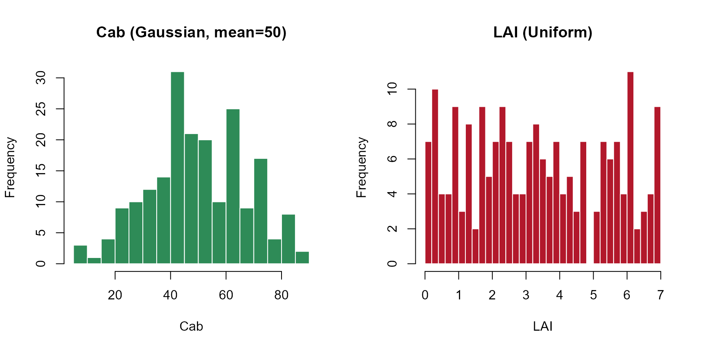
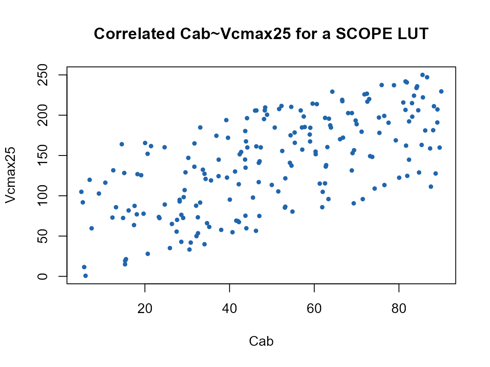

# Getting LUTs for SCOPE

``` r

library(ToolsRTM)
library(SCOPEinR)
```

SCOPE needs more input columns than a plain PROSAIL LUT – leaf
biochemistry, canopy structure, soil/meteorology, and viewing geometry
all in one row (see `SCOPEinR_tutorial.Rmd`’s “Input structure” section
for the full field list).
[`getLUT.SCOPE()`](../reference/getLUT.SCOPE.md) builds that from a
single ranges table, and this page covers the two things you’ll want
beyond the default call: which distribution each variable samples from,
and how to correlate two of them.

## 1. `inputs_SCOPE.csv`: one distribution per variable, already built in

Unlike
[`ToolsRTM::get_distributionLUT()`](https://rdrr.io/pkg/ToolsRTM/man/get_distributionLUT.html)
(a separate function taking distribution as an explicit argument),
SCOPE’s ranges table has the distribution choice baked into the CSV
itself – the `Distribution` column, one of `"Uniform"`, `"Gaussian"`, or
`"Fixed"`:

``` r

path_input <- system.file("input", package = "SCOPEinR")
inputLUT <- read.table(file.path(path_input, "inputs_SCOPE.csv"), header = TRUE, sep = ",")

inputLUT[inputLUT$variable %in% c("Cab", "LAI", "Vcmax25", "tts"),
         c("variable", "lower", "upper", "Distribution", "Mean_D", "Std_D", "default")]
#>    variable lower upper Distribution Mean_D Std_D default
#> 2       Cab  5.00    90     Gaussian     50    20      40
#> 15  Vcmax25  0.75   250      Uniform     NA    NA      70
#> 40      LAI  0.10     7      Uniform     NA    NA       3
#> 74      tts  0.00    15      Uniform     NA    NA      30
```

`"Fixed"` rows (most of the meteorology – `Ta`, `Rin`, `Rli`, … – and
constants like `BallBerry0`) are held at their `default` value every
time, regardless of `lower`/`upper`. `"Uniform"` rows are sampled evenly
across `[lower, upper]`. `"Gaussian"` rows (`Cab` here) are sampled
around `Mean_D` with spread `Std_D`, truncated to stay within
`[lower, upper]`.

``` r

n_samples <- 200
LUT <- getLUT.SCOPE(inputLUT = inputLUT, nLUT = n_samples, setseed = 1)
```

``` r

op <- par(mfrow = c(1, 2))
hist(LUT$Cab, breaks = 25, col = "#2E8B57", border = "white",
     main = "Cab (Gaussian, mean=50)", xlab = "Cab")
hist(LUT$LAI, breaks = 25, col = "#B2182B", border = "white",
     main = "LAI (Uniform)", xlab = "LAI")
```



``` r

par(op)
```

## 2. Correlating two SCOPE traits

Real leaf traits co-vary – e.g. plants with higher photosynthetic
capacity (`Vcmax25`) often also carry more chlorophyll (`Cab`).
[`getLUT.SCOPE()`](../reference/getLUT.SCOPE.md) samples every variable
independently;
[`ToolsRTM::getCor()`](https://rdrr.io/pkg/ToolsRTM/man/getCor.html)
(covered in depth in the `ToolsRTM` package’s own `Getting-LUTs`
article) generates a correlated pair instead, which can then be spliced
into the LUT in place of its independent columns:

``` r

pigments <- ToolsRTM::getCor(n_inputs = 2, setseed = 7, distribution = "Uniform",
                              nLUT = n_samples, rho = 0.6, Varnames = c("Cab", "Vcmax25"),
                              MinRange = c(5, 0.75), MaxRange = c(90, 250))

LUT$Cab     <- pigments$LUT$Cab
LUT$Vcmax25 <- pigments$LUT$Vcmax25

cat("Target rho: 0.6. Achieved correlation:", round(cor(LUT$Cab, LUT$Vcmax25), 2), "\n")
#> Target rho: 0.6. Achieved correlation: 0.65
```

``` r

plot(LUT$Cab, LUT$Vcmax25, pch = 19, col = "#2166AC", cex = 0.6,
     xlab = "Cab", ylab = "Vcmax25", main = "Correlated Cab~Vcmax25 for a SCOPE LUT")
```



This `LUT` is now ready for
[`get.SCOPE()`](../reference/get.SCOPE.md)/[`get.SCOPE.parallel()`](../reference/get.SCOPE.parallel.md)
exactly as built by the plain
[`getLUT.SCOPE()`](../reference/getLUT.SCOPE.md) call – only the
sampling of these two columns changed. See `How-in-R-SCOPEinR.Rmd`
(Section 4) for the same
[`getCor()`](https://rdrr.io/pkg/ToolsRTM/man/getCor.html) pattern
applied to `LIDFa`/`LIDFb` instead, and `SCOPEinR_tutorial.Rmd` (Section
6) for running the resulting LUT through
[`get.SCOPE()`](../reference/get.SCOPE.md) at scale.
