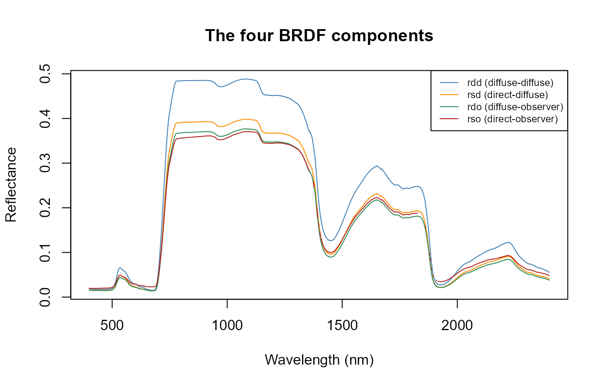
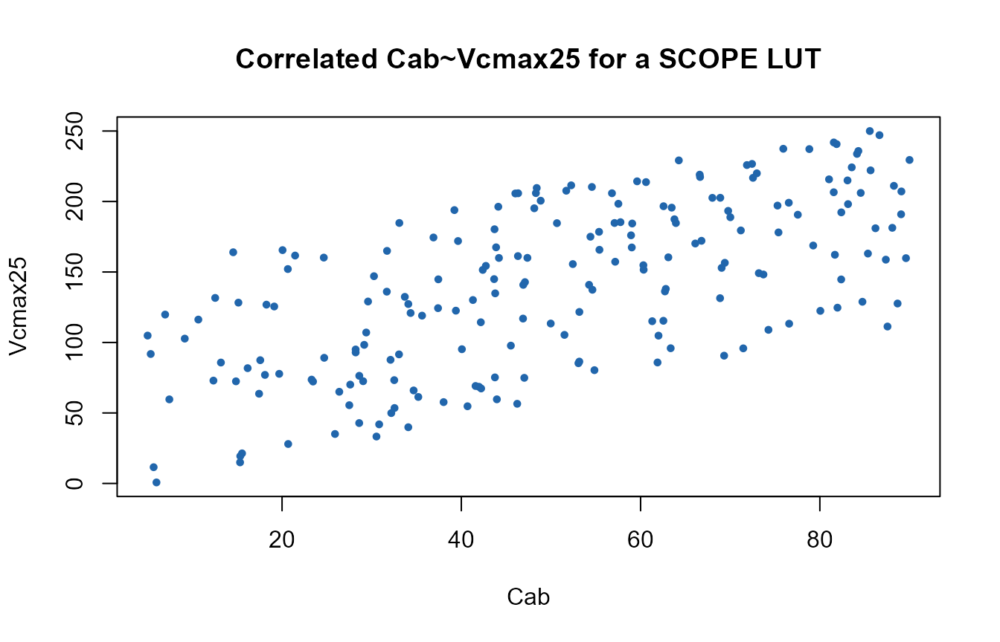

# 02. Soil, Canopy BRDF, and the SCOPE Input Structure

``` r

library(ToolsRTM)
library(SCOPEinR)
```

SCOPE needs more input columns than a plain PROSAIL LUT (ToolsRTM
Tutorial 01) – leaf biochemistry, canopy structure, soil, meteorology,
and viewing geometry all in one row. `inputs_SCOPE.csv` is SCOPE’s own
ranges table; unlike
[`ToolsRTM::get_distributionLUT()`](https://rdrr.io/pkg/ToolsRTM/man/get_distributionLUT.html)
(distribution as an explicit argument), the distribution choice is baked
into the CSV itself via a `Distribution` column.

## 1. The input table

``` r

path_input <- system.file("input", package = "SCOPEinR")
inputLUT <- read.table(file.path(path_input, "inputs_SCOPE.csv"), header = TRUE, sep = ",")

inputLUT[inputLUT$variable %in% c("Cab", "LAI", "Vcmax25", "tts"),
         c("variable", "lower", "upper", "Distribution", "Mean_D", "Std_D", "default")]
#>    variable lower upper Distribution Mean_D Std_D default
#> 2       Cab  5.00    90     Gaussian     50    20      40
#> 15  Vcmax25  0.75   250      Uniform     NA    NA      70
#> 40      LAI  0.10     7      Uniform     NA    NA       3
#> 74      tts  0.00    15      Uniform     NA    NA      30
```

`"Fixed"` rows (most of the meteorology – `Ta`, `Rin`, `Rli`, … – and
constants like `BallBerry0`) are held at their `default` value every
time. `"Uniform"` rows sample evenly across `[lower, upper]`.
`"Gaussian"` rows (`Cab` here) sample around `Mean_D` with spread
`Std_D`, truncated to `[lower, upper]`.

## 2. TOC reflectance: BRDF components

`refl` (Tutorial 01) is a blend of several BRDF components – the same
directional-vs-hemispherical distinction ToolsRTM’s
[`Compute_BRF()`](https://rdrr.io/pkg/ToolsRTM/man/Compute_BRF.html)
makes for plain fourSAIL, but SCOPE exposes all four separately:

``` r

table.with.opts <- read.table(file.path(path_input, "setoptions.csv"), header = TRUE, sep = ",")
LUT_default <- read.table(file.path(path_input, "LUT_input.csv"), header = TRUE, sep = ",")

invisible(capture.output(
  res <- get.SCOPE(LUT = LUT_default[1, ], options.SCOPE = table.with.opts,
                    optipar = SCOPEinR::optipar2021.Pro.CX, leaf.model = "fluspect-CX",
                    canopy.model = "fourSAIL", get.outputs = "ALL", get.plots = FALSE)[[1]]
))

wl_optical <- 400:2400; n <- length(wl_optical)
matplot(wl_optical, cbind(res$data.rad$rdd[1:n], res$data.rad$rsd[1:n],
                           res$data.rad$rdo[1:n], res$data.rad$rso[1:n]),
        type = "l", lty = 1, col = c("steelblue", "darkorange", "seagreen", "firebrick"),
        xlab = "Wavelength (nm)", ylab = "Reflectance", main = "The four BRDF components")
legend("topright", c("rdd (diffuse-diffuse)", "rsd (direct-diffuse)",
                      "rdo (diffuse-observer)", "rso (direct-observer)"),
       col = c("steelblue", "darkorange", "seagreen", "firebrick"), lty = 1, cex = 0.7)
```



`refl` (Tutorial 01’s `apparent` reflectance) combines these according
to the actual sun/sky illumination split for the simulated conditions –
the SCOPE equivalent of
[`ToolsRTM::Compute_BRF()`](https://rdrr.io/pkg/ToolsRTM/man/Compute_BRF.html)’s
`rdot`/`rsot` blend, but with the sky-diffuse fraction handled
explicitly rather than folded into two terms.

## 3. Correlating two SCOPE traits

Real leaf traits co-vary – e.g. plants with higher photosynthetic
capacity (`Vcmax25`) often also carry more chlorophyll (`Cab`).
[`getLUT.SCOPE()`](../reference/getLUT.SCOPE.md) samples every variable
independently;
[`ToolsRTM::getCor()`](https://rdrr.io/pkg/ToolsRTM/man/getCor.html)
(ToolsRTM Tutorial 05) generates a correlated pair instead, spliced into
the LUT in place of its independent columns:

``` r

n_samples <- 200
LUT <- getLUT.SCOPE(inputLUT = inputLUT, nLUT = n_samples, setseed = 1)

pigments <- ToolsRTM::getCor(n_inputs = 2, setseed = 7, distribution = "Uniform",
                              nLUT = n_samples, rho = 0.6, Varnames = c("Cab", "Vcmax25"),
                              MinRange = c(5, 0.75), MaxRange = c(90, 250))
LUT$Cab     <- pigments$LUT$Cab
LUT$Vcmax25 <- pigments$LUT$Vcmax25

cat("Target rho: 0.6. Achieved correlation:", round(cor(LUT$Cab, LUT$Vcmax25), 2), "\n")
#> Target rho: 0.6. Achieved correlation: 0.65
```

``` r

plot(LUT$Cab, LUT$Vcmax25, pch = 19, col = "#2166AC", cex = 0.6,
     xlab = "Cab", ylab = "Vcmax25", main = "Correlated Cab~Vcmax25 for a SCOPE LUT")
```



This `LUT` is ready for
[`get.SCOPE()`](../reference/get.SCOPE.md)/[`get.SCOPE.parallel()`](../reference/get.SCOPE.parallel.md)
exactly as built by the plain
[`getLUT.SCOPE()`](../reference/getLUT.SCOPE.md) call – only the
sampling of these two columns changed.

## What’s next

- **Tutorial 03** – the energy-balance solve that turns these inputs
  into the temperature profile behind `refl`’s indirect trait effects.
- **Tutorial 05** – building full SCOPE LUTs at scale.
