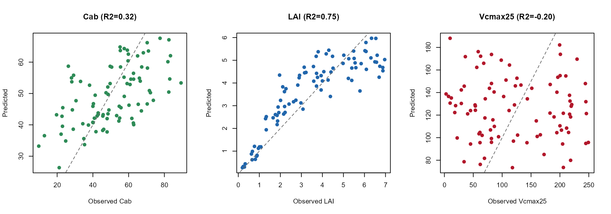

# 08. Hybrid Inversion from SCOPE Reflectance

``` r

library(ToolsRTM)
library(SCOPEinR)
library(randomForest)
```

Tutorial 07 found that `Vcmax25` (photosynthetic capacity) has no direct
radiative-transfer signature – Fluspect/4SAIL don’t take it as an input
at all, so any reflectance response is indirect, through the leaf
temperature the energy balance solves for. This page tests the practical
consequence: **can `Vcmax25` actually be retrieved from sensor-band
reflectance, the way `Cab` or `LAI` can?**

## 1. Simulate a LUT and convolve to Sentinel-2A

``` r

path_input <- system.file("input", package = "SCOPEinR")
scope_options <- read.table(file.path(path_input, "setoptions.csv"), header = TRUE, sep = ",")
inputLUT <- read.table(file.path(path_input, "inputs_SCOPE.csv"), header = TRUE, sep = ",")

n_samples <- 300
set.seed(11)
LUT <- getLUT.SCOPE(inputLUT = inputLUT, nLUT = n_samples)

db_sims <- SCOPEinR::get.SCOPE.parallel(
  LUT = LUT, options.SCOPE = scope_options, optipar = SCOPEinR::optipar2021.Pro.CX,
  leaf.model = "fluspect-CX", canopy.model = "fourSAIL", parallel = TRUE,
  get.outputs = "ALL", get.plots = FALSE, get.csv = FALSE, n.cores = 3)

wl_optical <- 400:2400
n <- length(wl_optical)
```

## 2. `reflapp`’s real gotcha: near-zero irradiance at absorption bands

``` r

band_refl <- t(sapply(db_sims, function(r) {
  rfl_i <- r$data.rad$reflapp[1:n]
  # reflapp is a radiance ratio (Lo_/incident irradiance), and incident
  # irradiance is genuinely near-zero at a handful of water-vapor/O2
  # absorption wavelengths (~849-850, ~1355-1420, ~1800-1950nm) -- numerically
  # unstable there in EVERY simulation, including SCOPEinR's own canonical
  # example row, not just unusual random draws. Real sensors avoid placing
  # bands on these features for the same reason; linearly interpolate over
  # just those narrow gaps before convolving.
  bad <- !is.finite(rfl_i)
  if (any(bad)) rfl_i[bad] <- approx(wl_optical[!bad], rfl_i[!bad], xout = wl_optical[bad])$y
  df_i <- data.frame(wave = wl_optical, rfl = rfl_i)
  get.spectral.convolution.srf(df_i, ToolsRTM::srf.sentinel2a)$RFL
}))
colnames(band_refl) <- paste0("B", seq_len(ncol(band_refl)))
```

## 3. Retrieve `Cab`, `LAI`, and `Vcmax25` – same method, same data

``` r

set.seed(1)
train_idx <- sample(seq_len(n_samples), size = round(0.7 * n_samples))
test_idx  <- setdiff(seq_len(n_samples), train_idx)

r2_f   <- function(obs, pred) 1 - sum((obs - pred)^2) / sum((obs - mean(obs))^2)
rmse_f <- function(obs, pred) sqrt(mean((obs - pred)^2))

invert_trait <- function(trait) {
  ml_data <- data.frame(band_refl, y = LUT[[trait]])
  rf <- randomForest(y ~ ., data = ml_data[train_idx, ], ntree = 300)
  pred <- predict(rf, ml_data[-train_idx, ])
  obs  <- ml_data$y[-train_idx]
  list(obs = obs, pred = pred, R2 = r2_f(obs, pred), RMSE = rmse_f(obs, pred))
}
```

``` r

inv_cab   <- invert_trait("Cab")
inv_lai   <- invert_trait("LAI")
inv_vcmax <- invert_trait("Vcmax25")
```

``` r

summary_df <- data.frame(
  trait = c("Cab", "LAI", "Vcmax25"),
  direct_RT_input = c("Yes (Fluspect)", "Yes (4SAIL)", "No (biochemistry only)"),
  R2   = c(inv_cab$R2, inv_lai$R2, inv_vcmax$R2),
  RMSE = c(inv_cab$RMSE, inv_lai$RMSE, inv_vcmax$RMSE)
)
knitr::kable(summary_df, digits = 3)
```

| trait   | direct_RT_input        |     R2 |   RMSE |
|:--------|:-----------------------|-------:|-------:|
| Cab     | Yes (Fluspect)         |  0.325 | 14.583 |
| LAI     | Yes (4SAIL)            |  0.750 |  1.013 |
| Vcmax25 | No (biochemistry only) | -0.202 | 81.124 |

``` r

op <- par(mfrow = c(1, 3))
plot(inv_cab$obs, inv_cab$pred, pch = 19, col = "#2E8B57",
     xlab = "Observed Cab", ylab = "Predicted", main = sprintf("Cab (R2=%.2f)", inv_cab$R2))
abline(0, 1, col = "grey40", lty = 2)
plot(inv_lai$obs, inv_lai$pred, pch = 19, col = "#2166AC",
     xlab = "Observed LAI", ylab = "Predicted", main = sprintf("LAI (R2=%.2f)", inv_lai$R2))
abline(0, 1, col = "grey40", lty = 2)
plot(inv_vcmax$obs, inv_vcmax$pred, pch = 19, col = "#B2182B",
     xlab = "Observed Vcmax25", ylab = "Predicted", main = sprintf("Vcmax25 (R2=%.2f)", inv_vcmax$R2))
abline(0, 1, col = "grey40", lty = 2)
```



``` r

par(op)
```

`Vcmax25` comes back essentially unretrievable (R² at or below zero – no
better than predicting the mean every time), consistent with Tutorial
07: its only path into reflectance is the small, indirect leaf-
temperature effect, not a direct optical signature a 13-band sensor can
separate from everything else varying at once. That’s the expected
result, not a failure of the method – SCOPE’s own coupling of radiative
transfer and biochemistry doesn’t imply every biochemical trait becomes
remotely retrievable just because it can be simulated.

`LAI` retrieves well – its NIR-plateau signature is strong enough to
come through even with every other trait varying at once. `Cab`
retrieves moderately – weaker than its strong, direct role in Fluspect
alone would suggest, because
[`getLUT.SCOPE()`](../reference/getLUT.SCOPE.md) varies every free
parameter simultaneously (leaf biochemistry, LAI, leaf-angle
distribution, geometry), adding real confounding noise a smaller, more
targeted LUT wouldn’t have.

## What’s next

- **Tutorial 09** – does adding SIF as a predictor help retrieve
  photosynthesis (`Actot`, a flux, not a trait) any better?
- **Tutorial 11** – the capstone: the same ML-inversion method applied
  to `Actot` and a real Sentinel-2 time series.
