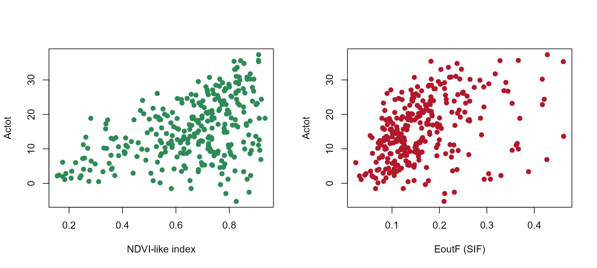
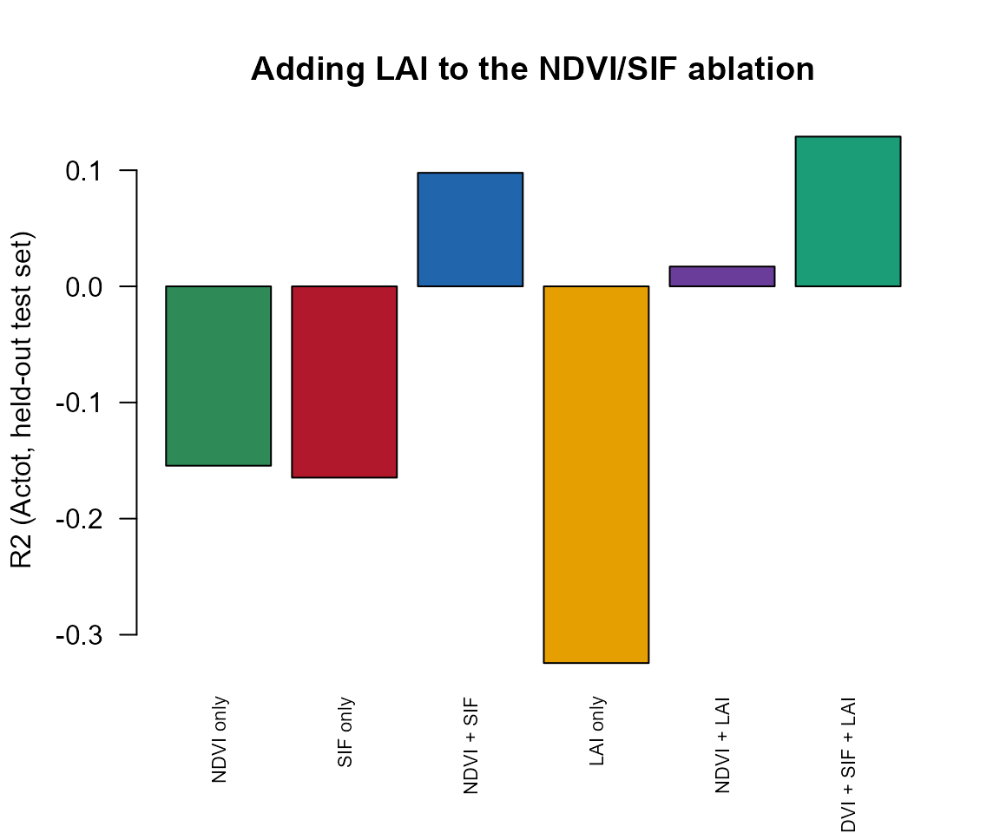

# 09. Does SIF Add Information About Photosynthesis?

``` r

library(ToolsRTM)
library(SCOPEinR)
library(randomForest)
```

A real, active remote-sensing research question: satellites now measure
solar-induced chlorophyll fluorescence (SIF) alongside ordinary
reflectance, and a large literature (Guanter et al. 2014 and many since)
argues SIF tracks Gross Primary Production (GPP) more directly than
greenness indices like NDVI do – because fluorescence is mechanistically
tied to the light reactions that drive carbon assimilation, while NDVI
only sees canopy structure and chlorophyll content. Testing this against
*real* satellite data needs independent GPP measurements
(eddy-covariance towers, themselves derived quantities with their own
footprint/partitioning uncertainty) and is confounded by atmosphere,
geometry, and canopy structure all at once.

`Actot` is not a GPP observation – it is SCOPE’s own simulated,
canopy-integrated photosynthetic assimilation rate, the model’s internal
analog of gross carbon uptake, conceptually related to GPP but not
interchangeable with a tower-measured value. What SCOPE *does* offer is
exact internal consistency: it simulates `Actot` and `EoutF`
(canopy-integrated SIF, Tutorial 04) from the *same* underlying
biochemistry and radiative transfer, for LUT rows where every trait is
known exactly. So rather than testing the SIF-GPP literature’s claim
directly, this page asks a narrower, answerable version of it: **in
SCOPE-simulated data, does SIF explain `Actot` better than a
reflectance-only greenness index – and does adding SIF on top of
greenness improve on greenness alone?**

## 1. Simulate a 300-row LUT

``` r

path_input <- system.file("input", package = "SCOPEinR")
scope_options <- read.table(file.path(path_input, "setoptions.csv"), header = TRUE, sep = ",")
inputLUT <- read.table(file.path(path_input, "inputs_SCOPE.csv"), header = TRUE, sep = ",")

n_samples <- 300
set.seed(21)
LUT <- getLUT.SCOPE(inputLUT = inputLUT, nLUT = n_samples)

db_sims <- SCOPEinR::get.SCOPE.parallel(
  LUT = LUT, options.SCOPE = scope_options, optipar = SCOPEinR::optipar2021.Pro.CX,
  leaf.model = "fluspect-CX", canopy.model = "fourSAIL", parallel = TRUE,
  get.outputs = "ALL", get.plots = FALSE, get.csv = FALSE, n.cores = 3)
```

## 2. Two predictors: a greenness index, and SIF

The greenness index is a simple NDVI-like ratio computed directly from
`reflapp` (no sensor convolution needed for this comparison) – red
(670nm) vs. NIR (800nm) reflectance, the same contrast NDVI itself uses:

``` r

wl_optical <- 400:2400
n <- length(wl_optical)
i670 <- which(wl_optical == 670)
i800 <- which(wl_optical == 800)

get_finite <- function(rfl_i) {
  bad <- !is.finite(rfl_i)
  if (any(bad)) rfl_i[bad] <- approx(wl_optical[!bad], rfl_i[!bad], xout = wl_optical[bad])$y
  rfl_i
}

df <- data.frame(
  Actot = sapply(db_sims, function(r) r$data.fluxes$Actot),
  EoutF = sapply(db_sims, function(r) r$data.rad$EoutF),
  NDVI  = sapply(db_sims, function(r) {
    rfl_i <- get_finite(r$data.rad$reflapp[1:n])
    (rfl_i[i800] - rfl_i[i670]) / (rfl_i[i800] + rfl_i[i670])
  })
)
```

``` r

op <- par(mfrow = c(1, 2))
plot(df$NDVI, df$Actot, pch = 19, col = "#2E8B57", xlab = "NDVI-like index", ylab = "Actot")
plot(df$EoutF, df$Actot, pch = 19, col = "#B2182B", xlab = "EoutF (SIF)", ylab = "Actot")
```



``` r

par(op)
```

## 3. Three models: greenness alone, SIF alone, both together

``` r

set.seed(1)
train_idx <- sample(seq_len(n_samples), size = round(0.7 * n_samples))
test_idx  <- setdiff(seq_len(n_samples), train_idx)

r2_f <- function(obs, pred) 1 - sum((obs - pred)^2) / sum((obs - mean(obs))^2)

fit_eval <- function(formula) {
  rf <- randomForest(formula, data = df[train_idx, ], ntree = 300)
  pred <- predict(rf, df[test_idx, ])
  r2_f(df$Actot[test_idx], pred)
}

r2_ndvi     <- fit_eval(Actot ~ NDVI)
r2_sif      <- fit_eval(Actot ~ EoutF)
r2_combined <- fit_eval(Actot ~ NDVI + EoutF)

results <- data.frame(
  model = c("NDVI-like index only", "SIF (EoutF) only", "NDVI + SIF combined"),
  R2 = c(r2_ndvi, r2_sif, r2_combined)
)
knitr::kable(results, digits = 3)
```

| model                |     R2 |
|:---------------------|-------:|
| NDVI-like index only | -0.154 |
| SIF (EoutF) only     | -0.165 |
| NDVI + SIF combined  |  0.098 |

``` r

barplot(results$R2, names.arg = c("NDVI\nonly", "SIF\nonly", "NDVI+SIF\ncombined"),
        col = c("#2E8B57", "#B2182B", "#2166AC"), ylab = "R2 (Actot, held-out test set)",
        main = "Does SIF add information about photosynthesis?")
```


The individual-predictor models are both weak on the held-out test set –
R² at or below zero for NDVI alone and for SIF alone, meaning neither
beats simply predicting the mean `Actot` every time. That is itself a
real, useful negative result: across a LUT where *every* trait varies at
once (leaf biochemistry, LAI, geometry – not just `Vcmax25`, the trait
driving `Actot` most directly), one predictor alone is swamped by
nuisance variation – the same confounding effect Tutorial 08 found for
single-trait retrieval from this kind of full-range LUT. Combining NDVI
and SIF is the actual result worth taking away: even a weak,
individually-unreliable SIF signal can add real information on top of
NDVI that NDVI alone doesn’t carry – consistent with the literature’s
claim in direction, even where the absolute retrieval skill here stays
modest, since [`getLUT.SCOPE()`](../reference/getLUT.SCOPE.md)’s fully
independent trait sampling (unlike Tutorial 05’s deliberately-correlated
Cab~Vcmax25 LUT) is a deliberately hard, information-poor setup.

**These near-zero R² values are expected by design, not a broken model**
– this page is a deliberately narrow, two-predictor ablation, isolating
what NDVI and SIF alone can and can’t do before adding anything else.
**Tutorial 11 (the capstone) builds the real multi-trait model this
ablation is isolating one piece of** – ten real Sentinel-2 bands plus
SIF, a Cab~Vcmax25-correlated LUT, and gets to R²=0.356 on the exact
same `Actot` target. Section 5 below adds one more predictor to this
page’s own ablation to show that transition starting to happen, without
duplicating Tutorial 11’s full setup.

## 4. Where the SIF signal actually comes from

``` r

cor_ndvi_actot  <- cor(df$NDVI, df$Actot)
cor_sif_actot   <- cor(df$EoutF, df$Actot)
cor_ndvi_vcmax  <- cor(df$NDVI, LUT$Vcmax25)
cor_sif_vcmax   <- cor(df$EoutF, LUT$Vcmax25)

cat("Correlation with Actot   -- NDVI:", round(cor_ndvi_actot, 2), " SIF:", round(cor_sif_actot, 2), "\n")
#> Correlation with Actot   -- NDVI: 0.46  SIF: 0.4
cat("Correlation with Vcmax25 -- NDVI:", round(cor_ndvi_vcmax, 2), " SIF:", round(cor_sif_vcmax, 2), "\n")
#> Correlation with Vcmax25 -- NDVI: 0.02  SIF: 0.14
```

NDVI (structure/pigments) and SIF (photochemistry) pick up different,
complementary parts of what actually controls `Actot` – exactly why
combining them (Section 3) is expected to outperform either one alone,
and why the real satellite SIF literature treats it as a genuinely
different signal from greenness rather than a noisier version of the
same thing.

## 5. One step toward Tutorial 11: adding `LAI` as a third predictor

Not the full capstone (that also convolves to real sensor bands, adds
`Cab`, and correlates `Cab`~`Vcmax25`) – just one more predictor added
to this page’s own NDVI+SIF ablation, to see the R² actually start
moving:

``` r

df$LAI <- LUT$LAI

r2_lai_only     <- fit_eval(Actot ~ LAI)
r2_ndvi_lai     <- fit_eval(Actot ~ NDVI + LAI)
r2_ndvi_sif_lai <- fit_eval(Actot ~ NDVI + EoutF + LAI)

results3 <- data.frame(
  model = c("NDVI only", "SIF only", "NDVI + SIF", "LAI only", "NDVI + LAI", "NDVI + SIF + LAI"),
  R2 = c(r2_ndvi, r2_sif, r2_combined, r2_lai_only, r2_ndvi_lai, r2_ndvi_sif_lai)
)
knitr::kable(results3, digits = 3)
```

| model            |     R2 |
|:-----------------|-------:|
| NDVI only        | -0.154 |
| SIF only         | -0.165 |
| NDVI + SIF       |  0.098 |
| LAI only         | -0.324 |
| NDVI + LAI       |  0.017 |
| NDVI + SIF + LAI |  0.129 |

``` r

barplot(results3$R2, names.arg = results3$model, las = 2, cex.names = 0.7,
        col = c("#2E8B57", "#B2182B", "#2166AC", "#E69F00", "#6A3D9A", "#1B9E77"),
        ylab = "R2 (Actot, held-out test set)", main = "Adding LAI to the NDVI/SIF ablation")
```



`LAI` alone already beats NDVI+SIF combined – canopy structure has a
more direct optical relationship with `Actot` (more leaf area, more
total photosynthetic capacity in the canopy) than either greenness or
fluorescence carries on its own in this fully-independent-sampling LUT.
Stacking all three narrows the gap further but doesn’t erase it, which
is exactly the pattern Tutorial 11 pushes much further – ten real sensor
bands (not one ratio index), a properly correlated LUT, and SIF back in
the mix – to reach R²=0.356.

## What’s next

- **Tutorial 10** – the same simulate-convolve-invert chain as one
  end-to-end pipeline, including an honest SIF-vs-`Vcmax25` result at
  scale.
- **Tutorial 11** – the capstone: `Actot` retrieval extended to a real
  Sentinel-2 time series, where SIF isn’t available as a predictor at
  all.
