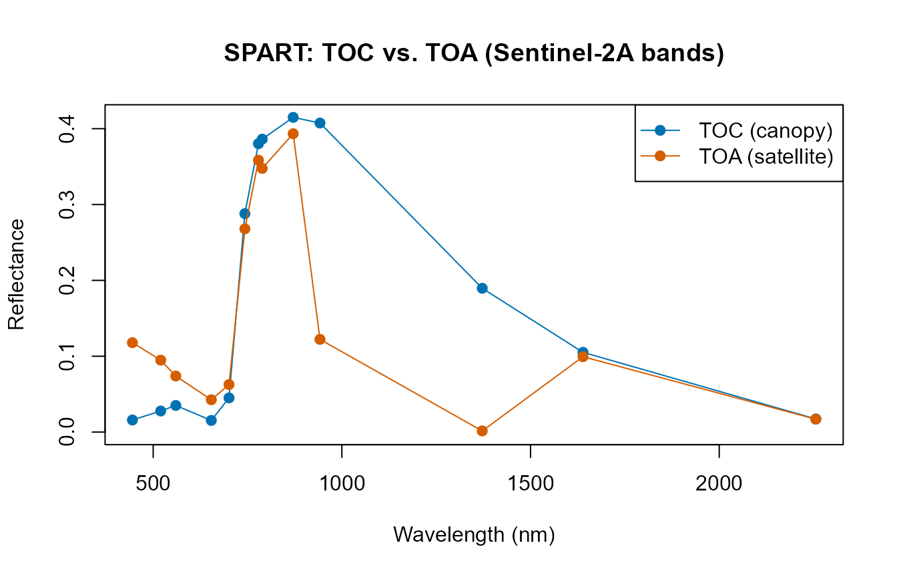

# 03. SPART: Soil-Plant-Atmosphere Radiative Transfer

``` r

library(ToolsRTM)
```

Tutorials 01-02 stopped at top-of-canopy (TOC) reflectance – what a
sensor would see immediately above the canopy, with no atmosphere in the
way. [`SPART()`](../reference/SPART.md) goes one step further: soil,
canopy, AND atmosphere, together, giving top-of-atmosphere (TOA)
reflectance – what a real satellite actually measures. It deserves its
own page rather than a paragraph inside a leaf/canopy comparison,
because it represents a more complete modelling chain, not just another
canopy option.

``` text
                 Atmosphere
                     |
              Incoming radiation
                     |
Soil ---------> Vegetation canopy
                     |
              Canopy reflectance
                     |
                 Atmosphere
                     |
           Top-of-atmosphere signal
```

``` text
PROSPECT + fourSAIL                 SPART
--------------------                --------------------
Leaf                                 Atmosphere
 |                                    |
Canopy                                Leaf + Canopy + Soil
 |                                    |
TOC reflectance                       Atmosphere
                                       |
                                      TOA observation
```

SPART couples three sub-models: **BSM** (Brightness-Shape-Moisture) for
soil, **fourSAIL** for the vegetation canopy, and **SMAC** for
atmospheric effects – the same three-model architecture SPART’s own
reference implementation (Yang et al. 2020) uses.

## 3.1 Configure SPART

Inputs fall into five physical domains. `inputsSPART` (a
[`getLUT()`](../reference/getLUT.md)-ready table, same pattern as
`inputsPROSAIL`) already groups them:

| Domain | Example columns | Notes |
|----|----|----|
| Leaf | `Cab`, `Car`, `Anth`, `LMA`, `EWT`, `N`, … | Same as PROSPECT/fourSAIL (Tutorial 02) |
| Canopy structure | `LAI`, `LIDFa`/`LIDFb`/`TypeLidf`, `hspot` | Same as fourSAIL |
| Soil | `psoil` | See the important caveat in Section 3.3 below |
| Geometry | `tts`, `tto`, `psi` | Sun zenith, view zenith, relative azimuth |
| Atmosphere | `Pa`, `aot550`, `uo3`, `uh2o`, `alt_m`, `Pa0` | Air pressure, aerosol optical thickness, ozone, water vapour, altitude |

Full argument documentation lives at [`?SPART`](../reference/SPART.md) –
this page focuses on how the pieces fit together, not an exhaustive
parameter list.

``` r

LUT <- as.data.frame(getLUT(inputs = ToolsRTM::inputsSPART, nLUT = 5, setseed = 1))
# inputsSPART only ships PROSPECT-PRO/-D columns -- add what other leaf
# models need too (same requirement as foursail()/SPART() itself).
LUT$Cs <- 0; LUT$fqe <- 0.01; LUT$Cx <- 0
LUT$cell.d <- 40; LUT$inter.c <- 0.045; LUT$baseline.abs <- 0.0006
LUT$leaf.thick <- 1.6; LUT$albino.abs <- 0; LUT$lign.cell <- 2; LUT$Nitrogen <- 1
# A realistic, sea-level, clear-sky atmosphere for the worked example below
# (getLUT()'s own default sampling range for the atmosphere columns is wide
# enough to occasionally draw physically implausible combinations -- see
# the note at the end of Section 3.2).
LUT$Pa <- 1000; LUT$aot550 <- 0.3246; LUT$uo3 <- 0.3480; LUT$uh2o <- 1.4116
LUT$alt_m <- 0; LUT$Pa0 <- 1000
```

## 3.2 Run a baseline simulation

``` r

sim <- suppressWarnings(SPART(inputLUT = LUT[1, ], CanopyModel = "fourSAIL",
                               LeafModel = "PROSPECT-PRO",
                               sensor.i = ToolsRTM::Sentinel2A.MSI,
                               rsoil = NULL, get.plots = FALSE))
names(sim$output)  # wave, rad.toa, rfl.toa, rfl.toc, rfl.toc.BRDF -- already at Sentinel-2A's own bands
#> [1] "wave"         "rad.toa"      "rfl.toa"      "rfl.toc"      "rfl.toc.BRDF"
```

Unlike [`foursail()`](../reference/foursail.md), SPART returns output
already convolved to the chosen sensor’s bands (`sensor.i`) – there is
no separate “simulate native, then convolve” step (Tutorial 07 covers
convolution for
[`foursail()`](../reference/foursail.md)/[`inform()`](../reference/inform.md)
output, which stays at 1nm resolution).

``` r

plot(sim$output$wave, sim$output$rfl.toc.BRDF, type = "o", pch = 19, col = "#0072B2",
     ylim = c(0, max(sim$output$rfl.toc.BRDF, sim$output$rfl.toa)),
     xlab = "Wavelength (nm)", ylab = "Reflectance", main = "SPART: TOC vs. TOA (Sentinel-2A bands)")
lines(sim$output$wave, sim$output$rfl.toa, type = "o", pch = 19, col = "#D55E00")
legend("topright", c("TOC (canopy)", "TOA (satellite)"), col = c("#0072B2", "#D55E00"), pch = 19, lty = 1)
```



The dip near 942nm and the near-total collapse near 1372nm are real
atmospheric water-vapour absorption bands – present in the TOA curve but
absent from TOC, exactly what real atmospheric correction has to deal
with. **A note on [`getLUT()`](../reference/getLUT.md)’s atmosphere
sampling**: at the wide default ranges `inputsSPART` samples from, some
random rows combine a high `aot550` (aerosol loading) with a high
`alt_m` (altitude) – a combination SMAC’s atmospheric correction doesn’t
handle gracefully, producing negative (physically meaningless) TOA
reflectance. Always sanity-check `range(sim$output$rfl.toa)` after a
random draw; the fixed, realistic sea-level clear-sky atmosphere set in
Section 3.1 above avoids this for the rest of this page.

## 3.3 Soil contribution

Physically, a sparse canopy should let more soil show through than a
dense one. **Important caveat, found while building this page**: the
`psoil` column documented in
`inputsSPART`/[`?SPART`](../reference/SPART.md) only has an effect when
you pass your own `rsoil` – [`SPART()`](../reference/SPART.md)’s
built-in BSM soil path (triggered whenever `rsoil = NULL`) hardcodes its
own soil-moisture constants internally and never reads `inputLUT$psoil`
at all, so sweeping `psoil` alone with `rsoil = NULL` produces
byte-identical output regardless of its value. The demonstration below
uses an explicit `rsoil` (as [`foursail()`](../reference/foursail.md)
already requires in Tutorials 01-02) to sidestep this and show the real
physics:

``` r

soil_dark   <- rep(0.08, 2001)  # dark/wet-looking soil
soil_bright <- rep(0.30, 2001)  # bright/dry-looking soil

soil_effect <- function(lai) {
  row_i <- LUT[1, ]; row_i$LAI <- lai
  d <- suppressWarnings(SPART(inputLUT = row_i, CanopyModel = "fourSAIL", LeafModel = "PROSPECT-PRO",
                               sensor.i = ToolsRTM::Sentinel2A.MSI, rsoil = soil_dark, get.plots = FALSE))
  b <- suppressWarnings(SPART(inputLUT = row_i, CanopyModel = "fourSAIL", LeafModel = "PROSPECT-PRO",
                               sensor.i = ToolsRTM::Sentinel2A.MSI, rsoil = soil_bright, get.plots = FALSE))
  mean(b$output$rfl.toc.BRDF) - mean(d$output$rfl.toc.BRDF)
}
cat("Mean TOC reflectance shift, dark vs. bright soil:\n")
#> Mean TOC reflectance shift, dark vs. bright soil:
cat("  Sparse canopy (LAI=0.5):", round(soil_effect(0.5), 4), "\n")
#>   Sparse canopy (LAI=0.5): 0.1318
cat("  Dense canopy  (LAI=6):  ", round(soil_effect(6), 4), "\n")
#>   Dense canopy  (LAI=6):   0.0013
```

``` text
Low LAI                          High LAI
  |                                 |
large soil contribution     small soil contribution
  |                                 |
stronger background effect  canopy-dominated signal
```

Confirmed: soil brightness shifts the sparse-canopy signal by roughly
70x more than the dense-canopy signal – once the canopy closes, soil
brightness barely reaches the sensor. This page used two fixed flat
`rsoil` spectra to isolate the LAI effect; for a physically-realistic
*moisture*-driven soil spectrum instead of an arbitrary brightness
value, see
[`ToolsRTM::get.marmit.rsoil()`](../reference/get.marmit.rsoil.md)
(MARMIT, Bablet et al.) – it plugs into
[`foursail()`](../reference/foursail.md)’s/[`foursail2()`](../reference/foursail2.md)’s/[`inform()`](../reference/inform.md)’s
own `rsoil` argument the same way, and into
[`SPART()`](../reference/SPART.md)’s here.

## 3.4 Atmospheric contribution

Section 3.2’s plot already showed this directly: compare `rfl.toc.BRDF`
(canopy-level, no atmosphere) against `rfl.toa` (after the SMAC
atmosphere layer) for the same simulation. The progression is surface
signal -\> atmosphere -\> sensor-observed signal, and the two curves
diverge most exactly where atmospheric gases absorb strongly (water
vapour, ozone), not uniformly across the spectrum.

## 3.5 Geometry

`tts` (sun zenith), `tto` (view zenith), and `psi` (relative azimuth)
all feed into fourSAIL’s BRDF term inside SPART, the same way they do in
[`Compute_BRF()`](../reference/Compute_BRF.md) (Tutorial 01) – this is
what makes reflectance direction-dependent rather than a single fixed
number per surface:

``` r

for (tts_i in c(10, 30, 50)) {
  row_i <- LUT[1, ]; row_i$tts <- tts_i
  s_i <- suppressWarnings(SPART(inputLUT = row_i, CanopyModel = "fourSAIL", LeafModel = "PROSPECT-PRO",
                                 sensor.i = ToolsRTM::Sentinel2A.MSI, rsoil = NULL, get.plots = FALSE))
  cat("Sun zenith (tts) =", tts_i, "deg -> mean TOC BRDF:", round(mean(s_i$output$rfl.toc.BRDF), 4), "\n")
}
#> Sun zenith (tts) = 10 deg -> mean TOC BRDF: 0.1814
#> Sun zenith (tts) = 30 deg -> mean TOC BRDF: 0.1864
#> Sun zenith (tts) = 50 deg -> mean TOC BRDF: 0.1917
```

Reflectance rises with sun zenith angle here (lower sun, longer optical
path through the canopy, more multiple scattering reaching the sensor
before absorption) – this direction-dependence IS what BRDF means; a
Lambertian (direction-independent) assumption would miss it entirely.

## 3.6 SPART and satellite observations

Because SPART already outputs at a chosen sensor’s bands, moving from
simulation to a realistic EO-like observation needs no separate
convolution step – just pick `sensor.i`. Only sensors SPART actually
supports (bundled objects in `ToolsRTM`) are listed here:

``` r

spart_sensors <- c("LANDSAT4.TM", "LANDSAT5.TM", "LANDSAT7.ETM", "LANDSAT8.OLI",
                    "Sentinel2A.MSI", "Sentinel2B.MSI", "Sentinel3A.OLCI",
                    "Sentinel3B.OLCI", "TerraAqua.MODIS")
s_modis <- suppressWarnings(SPART(inputLUT = LUT[1, ], CanopyModel = "fourSAIL", LeafModel = "PROSPECT-PRO",
                                   sensor.i = ToolsRTM::TerraAqua.MODIS, rsoil = NULL, get.plots = FALSE))
cat("Sentinel-2A bands:", length(sim$output$wave), " -- MODIS bands:", length(s_modis$output$wave), "\n")
#> Sentinel-2A bands: 13  -- MODIS bands: 20
```

``` text
Vegetation traits
      +
Canopy structure
      +
Soil
      +
Atmosphere
      |
      v
    SPART
      |
      v
Spectral observation, already at sensor bands
      |
      v
Sentinel-2 / Landsat / MODIS / ...
```

## 3.7 SPART for inversion

SPART slots into the exact same hybrid-inversion framework the rest of
this series builds (Tutorials 10-13): simulate a LUT with
[`SPART()`](../reference/SPART.md) instead of
[`foursail()`](../reference/foursail.md), and everything downstream
(train/test split, [`get.inversion()`](../reference/get.inversion.md),
[`getMLmodel()`](../reference/getMLmodel.md)) is unchanged, since it
only ever depends on a table of (sensor-band reflectance, trait) pairs
regardless of which model produced it.

``` text
Parameter LUT
     |
     v
SPART simulations (already at sensor bands)
     |
     v
Synthetic EO training dataset
     |
     v
ML inversion
     |
     v
Vegetation traits
```

Not developed further here – see Tutorial 11 for the full framework.

## Take-home message

Use plain
[`foursail()`](../reference/foursail.md)/[`foursail2()`](../reference/foursail2.md)/[`inform()`](../reference/inform.md)
(Tutorials 01-02, 04) when the question is about the canopy or leaf
itself and TOC reflectance is enough – it’s simpler, faster, and every
model in this package other than SPART works that way. Reach for
[`SPART()`](../reference/SPART.md) specifically when the question
involves what a satellite actually measures at TOA (atmospheric
correction studies, comparing simulations directly against uncorrected
satellite products, or any workflow where the atmosphere’s own
contribution matters) – the extra atmosphere/soil-BSM machinery is not
needed otherwise.
