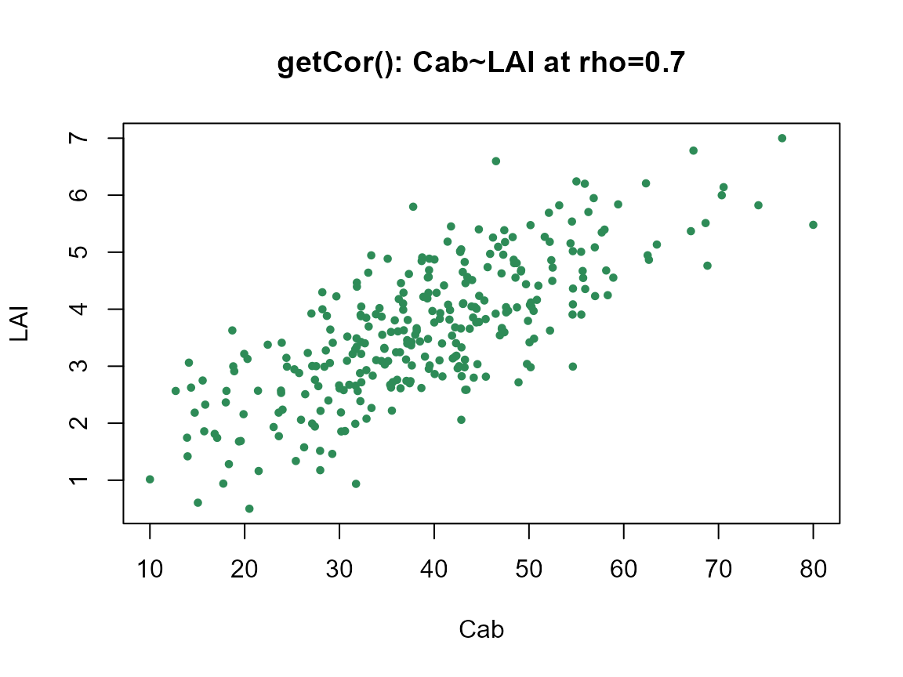
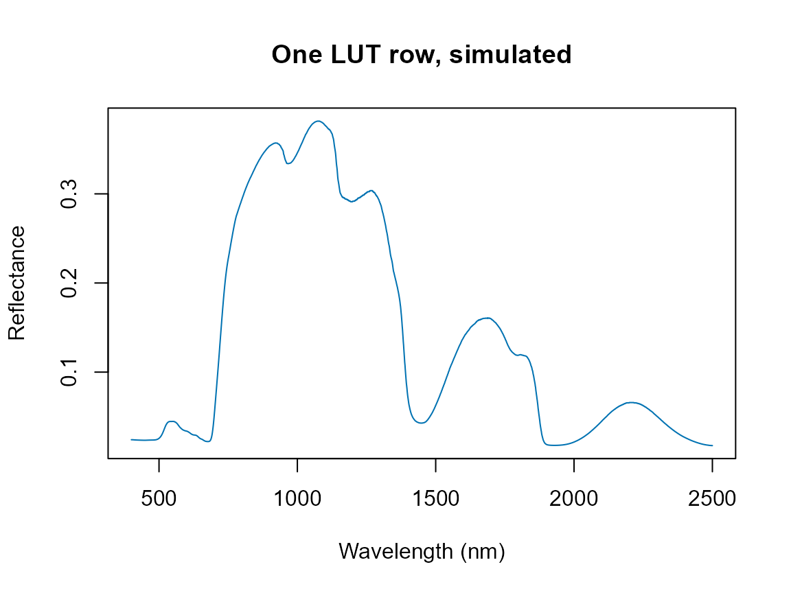

# 05. Building Look-Up Tables

``` r

library(ToolsRTM)
```

Every tutorial so far hand-wrote one row of trait values. A LUT (Look-Up
Table) is one row per simulation, many rows at once – the input every
sensitivity analysis, LUT-matching inversion, and ML-training workflow
in this package starts from. Four functions build one, trading off
control against simplicity differently:

| Function | Distribution per trait | Trait correlation | Typical use |
|----|----|----|----|
| [`getLUT()`](../reference/getLUT.md) | Fixed set (see [`?getLUT`](../reference/getLUT.md)) | Independent | Quick default LUT, no customization needed |
| [`get.LUTfromRanges()`](../reference/get.LUTfromRanges.md) | One distribution (`"uniform"`/`"gauss"`) for every trait, your own min/max | Independent | Custom ranges, same distribution shape for all traits |
| [`get_distributionLUT()`](../reference/get_distributionLUT.md) | Per-trait `"Uniform"`/`"Gaussian"` choice | Car~Cab, optional (`DepCab`) | Different traits need different distribution shapes in the same LUT |
| [`getCor()`](../reference/getCor.md) | Normal or Uniform | Any two traits, any target correlation (`rho`) | General-purpose correlated sampling beyond Car~Cab |

## 1. `getLUT()`: the quick default

``` r

LUT <- as.data.frame(getLUT(inputs = ToolsRTM::inputsPROSAIL, nLUT = 200, setseed = 1234))
dim(LUT)
#> [1] 200  18
knitr::kable(head(LUT, 5))
```

| Cab | Car | Anth | LMA | EWT | Cbrown | Prot | CBC | N | alpha | LIDFa | LIDFb | TypeLidf | LAI | hspot | tts | tto | psi |
|---:|---:|---:|---:|---:|---:|---:|---:|---:|---:|---:|---:|---:|---:|---:|---:|---:|---:|
| 45.38614 | 8.897541 | 1.3267458 | 0 | 0.0266275 | 0.7631390 | 0.0012601 | 0.0157670 | 1.862371 | 40 | 60.16221 | 0 | 2 | 2.531459 | 0 | 0 | 26.55547 | 0 |
| 46.17216 | 8.070285 | 2.1069005 | 0 | 0.0242104 | 0.8591507 | 0.0223563 | 0.0146524 | 1.722682 | 40 | 63.23264 | 0 | 2 | 3.028841 | 0 | 0 | 18.04713 | 0 |
| 58.27738 | 11.439456 | 0.6314292 | 0 | 0.0041352 | 0.4081567 | 0.0245266 | 0.0108471 | 1.990049 | 40 | 39.57890 | 0 | 2 | 4.584734 | 0 | 0 | 17.66566 | 0 |
| 60.95048 | 12.496161 | 4.2965531 | 0 | 0.0016152 | 0.5681268 | 0.0051936 | 0.0082630 | 1.966551 | 40 | 61.05380 | 0 | 2 | 3.545253 | 0 | 0 | 16.17003 | 0 |
| 37.17616 | 6.656451 | 2.2166784 | 0 | 0.0085231 | 0.1100567 | 0.0060146 | 0.0246577 | 2.393448 | 40 | 55.88659 | 0 | 2 | 2.077850 | 0 | 0 | 22.31040 | 0 |

## 2. `get_distributionLUT()`: a different distribution per trait

Real leaf/canopy traits don’t all follow the same distribution shape.
Chlorophyll content (`Cab`) tends to cluster around a typical value
(Gaussian-like); the leaf-angle parameter `LIDFa` has no such tendency
across a mixed canopy (closer to Uniform).
[`get_distributionLUT()`](../reference/get_distributionLUT.md) lets each
trait pick its own shape instead of forcing one distribution on all of
them.

``` r

minval <- data.frame('N' = 1.5, 'Cab' = 5, 'Car' = 0, 'Anth' = 0, 'Cbrown' = 0.0,
                      'EWT' = 0.001, 'Prot' = 0.00001, 'CBC' = 0.00001,
                      'LIDFa' = 0, 'LAI' = 0.5,
                      LAIu = 0, sd = 200, cd = 0.2, h = 5,
                      fraction_brown = 0, diss = 0.1, Cv = 0.3, Zeta = 0)
maxval <- data.frame('N' = 3, 'Cab' = 70, 'Car' = 25, 'Anth' = 7, 'Cbrown' = 0.2,
                      'EWT' = 0.035, 'Prot' = 0.03, 'CBC' = 0.03,
                      'LIDFa' = 70, 'LAI' = 7,
                      LAIu = 0.8, sd = 1000, cd = 7, h = 20,
                      fraction_brown = 1, diss = 1, Cv = 1, Zeta = 0.2)
TypeDistrib <- data.frame('N' = 'Gaussian', 'Cab' = 'Gaussian', 'Car' = 'Gaussian',
                           'Anth' = 'Uniform', 'Cbrown' = 'Uniform',
                           'EWT' = 'Uniform', 'Prot' = 'Uniform', 'CBC' = 'Uniform',
                           'LIDFa' = 'Uniform', 'LAI' = 'Gaussian',
                           LAIu = 'Uniform', sd = 'Uniform', cd = 'Uniform', h = 'Uniform',
                           fraction_brown = 'Uniform', diss = 'Uniform', Cv = 'Uniform', Zeta = 'Uniform')
Mean_gauss <- data.frame('N' = 2.2, 'Cab' = 45, 'Car' = 8, 'LAI' = 2.25)
std_gauss <- Mean_gauss / 2.0

data.LUT <- get_distributionLUT(minval = minval, maxval = maxval, nSamples = 500,
                                 TypeDistrib = TypeDistrib, Mean_gauss = Mean_gauss,
                                 Std_gauss = std_gauss, DepCab = FALSE, setseed = 246)
```

``` r

op <- par(mfrow = c(1, 2))
hist(data.LUT$Cab, breaks = 30, col = "#2E8B57", border = "white",
     main = "Cab (Gaussian, mean=45)", xlab = "Cab")
hist(data.LUT$LIDFa, breaks = 30, col = "#B2182B", border = "white",
     main = "LIDFa (Uniform)", xlab = "LIDFa")
```


``` r

par(op)
```

`Cab` (Gaussian) and `LIDFa` (Uniform) came from the exact same call
above – the histograms show why picking the right distribution per trait
matters.

## 3. Trait correlation

Independently-sampled traits are the default – but real traits co-vary
(e.g. `Car` tracks `Cab`; plants with more of one pigment tend to have
more of the other). Two ways to get correlated traits into a LUT:

### `DepCab`: the built-in Car~Cab correlation

``` r

data.LUT.dep <- get_distributionLUT(minval = minval, maxval = maxval, nSamples = 500,
                                     TypeDistrib = TypeDistrib, Mean_gauss = Mean_gauss,
                                     Std_gauss = std_gauss, DepCab = TRUE, setseed = 246)
cat("Car~Cab correlation, DepCab=FALSE:", round(cor(data.LUT$Cab, data.LUT$Car), 2), "\n")
#> Car~Cab correlation, DepCab=FALSE: 0.03
cat("Car~Cab correlation, DepCab=TRUE: ", round(cor(data.LUT.dep$Cab, data.LUT.dep$Car), 2), "\n")
#> Car~Cab correlation, DepCab=TRUE:  0.98
```

``` r

op <- par(mfrow = c(1, 2))
plot(data.LUT$Cab, data.LUT$Car, pch = 19, col = "#2166AC", cex = 0.6,
     xlab = "Cab", ylab = "Car", main = "DepCab = FALSE (independent)")
plot(data.LUT.dep$Cab, data.LUT.dep$Car, pch = 19, col = "#B2182B", cex = 0.6,
     xlab = "Cab", ylab = "Car", main = "DepCab = TRUE (correlated)")
```


``` r

par(op)
```

### `getCor()`: correlate any two traits, any target strength

``` r

cor_lut <- getCor(n_inputs = 2, nLUT = 300, distribution = "Normal", setseed = 1,
                   rho = 0.7, Varnames = c("Cab", "LAI"),
                   MinRange = c(10, 0.5), MaxRange = c(80, 7))
cat("Target rho: 0.7. Achieved correlation:",
    round(cor(cor_lut$LUT$Cab, cor_lut$LUT$LAI), 2), "\n")
#> Target rho: 0.7. Achieved correlation: 0.75
```

``` r

plot(cor_lut$LUT$Cab, cor_lut$LUT$LAI, pch = 19, col = "#2E8B57", cex = 0.6,
     xlab = "Cab", ylab = "LAI", main = "getCor(): Cab~LAI at rho=0.7")
```



[`getCor()`](../reference/getCor.md) returns a list: `$LUT` (the
correlated trait table to actually use) and `$Covarianza` (the
covariance matrix behind it, for reference). `distribution` accepts
`"Normal"` or `"Uniform"` here – note this is capitalized differently
from [`get.LUTfromRanges()`](../reference/get.LUTfromRanges.md)’s own
`"uniform"`/ `"gauss"`, a real inconsistency in the package worth
knowing about rather than guessing past.

## 4. From LUT rows to spectra

A LUT alone is just trait values – combine it with the models from
Tutorials 01-04 to actually simulate:

``` r

rsoil <- rep(0.15, 2101)
sim1 <- foursail(inputLUT = LUT[1, ], rsoil = rsoil, LeafModel = "PROSPECT-D")
plot(400:2500, sim1$rsot, type = "l", col = "#0072B2",
     xlab = "Wavelength (nm)", ylab = "Reflectance", main = "One LUT row, simulated")
```



## What’s next

- **Tutorial 06** – simulating every row of a LUT efficiently with
  parallel processing, instead of a single row or a small loop.
- **Tutorial 10** – using a LUT as the training data for hybrid trait
  inversion.
