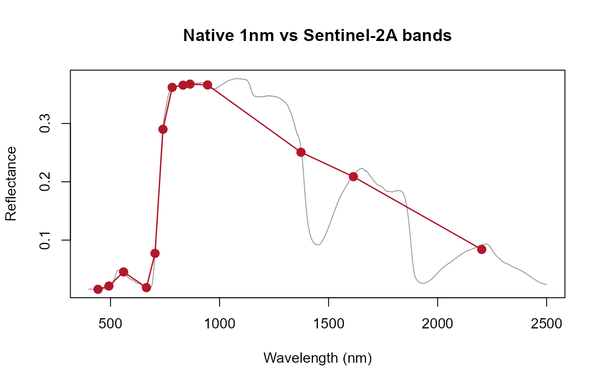
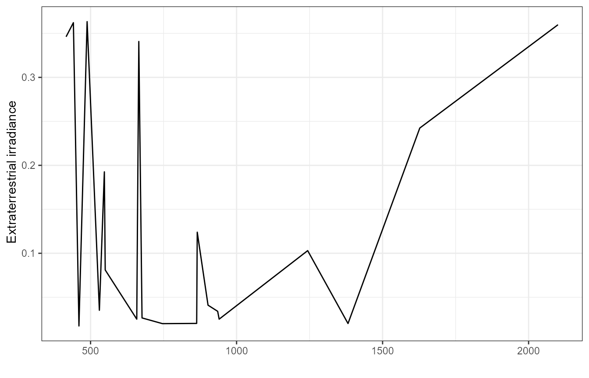

# 07. From RTM Spectra to Satellite Observations: Sensor Convolution

``` r

library(ToolsRTM)
```

Every simulation so far stayed at native 1nm resolution (2101 or 2001
points, Tutorial 02). A real sensor never measures that – it integrates
incoming light over each band’s spectral response function (SRF), giving
far fewer, wider bands. This page converts a native simulation into what
a real sensor would actually report.

``` r

row <- data.frame(
  LAI = 3, hspot = 0.01, LIDFa = -0.35, LIDFb = -0.15, TypeLidf = 1,
  tts = 30, tto = 0, psi = 0,
  N = 1.5, Cab = 40, Car = 8, Anth = 2, Cbrown = 0, EWT = 0.009, LMA = 0.009, alpha = 40
)
rsoil <- 0.5 * dataSpec_PDB[, 11] + 0.5 * dataSpec_PDB[, 12]
sail <- foursail(inputLUT = row, rsoil = rsoil, LeafModel = "PROSPECT-D")
reflectance <- Compute_BRF(rdot = sail$rdot, rsot = sail$rsot, tts = row$tts, data.light = dataSpec_PDB)
```

## Three convolution functions, one for each kind of sensor data

| Function | What it needs | Sensors covered |
|----|----|----|
| [`get.spectral.convolution.srf()`](../reference/get.spectral.convolution.srf.md) | A real, MEASURED per-nm SRF, no atmospheric-correction coefficients | PRISMA, Sentinel-2A, Sentinel-2B (`srf.prisma`/`srf.sentinel2a`/`srf.sentinel2b`) |
| [`get.spectral.convolution.rfl()`](../reference/get.spectral.convolution.rfl.md) | A measured SRF bundled together WITH SMAC atmospheric-correction coefficients | Landsat 4/5/7/8, Sentinel-3A/B OLCI, Terra/Aqua MODIS |
| [`get.spectral.convolution.gaussian()`](../reference/get.spectral.convolution.gaussian.md) | No measured SRF at all – only nominal band characteristics (center + FWHM, or center + edges), approximated as Gaussian | EnMAP, ALI, Hyperion, MODIS (19-band nominal), Quickbird, RapidEye, WorldView-2/3/4, and any sensor/camera you supply `centers`/`fwhm` for yourself |

Only sensors actually bundled/supported are listed above – see
`unique(ToolsRTM::sensor.characteristics$Sensor)` for the full nominal-
characteristics list behind the Gaussian path.

## 1. Measured SRF: Sentinel-2A

``` r

band_values <- get.spectral.convolution.srf(
  df  = data.frame(wave = dataSpec_PDB[, 1], rfl = reflectance),
  srf = ToolsRTM::srf.sentinel2a)
print(band_values)
#>    band        wl fwhm        RFL
#> 1     1  442.6950   19 0.01561206
#> 2     2  492.7152   64 0.02121222
#> 3     3  559.8491   34 0.04542619
#> 4     4  664.6218   29 0.01849372
#> 5     5  704.1149   13 0.07719207
#> 6     6  740.4918   13 0.29011048
#> 7     7  782.7529   18 0.36197427
#> 8     8  832.7904  104 0.36575364
#> 9     9  864.7108   19 0.36756865
#> 10   10  945.0545   18 0.36618153
#> 11   11 1373.4555   29 0.25070480
#> 12   12 1613.6805   89 0.20878414
#> 13   13 2202.3678  173 0.08395820

plot(dataSpec_PDB[, 1], reflectance, type = "l", col = "grey60",
     xlab = "Wavelength (nm)", ylab = "Reflectance", main = "Native 1nm vs Sentinel-2A bands")
points(band_values$wl, band_values$RFL, col = "#B2182B", pch = 19, cex = 1.3)
lines(band_values$wl, band_values$RFL, col = "#B2182B", lwd = 1.5)
```



## 2. SMAC-bundled SRF: MODIS

``` r

modis_bands <- get.spectral.convolution.rfl(
  df = data.frame(wave = dataSpec_PDB[, 1], rfl = reflectance),
  sensor.i = ToolsRTM::TerraAqua.MODIS)
```



``` r

cat("MODIS bands:", nrow(modis_bands), "\n")
#> MODIS bands: 20
```

**A real, documented gotcha with this path**: for
MODIS/Landsat/Sentinel-3 OLCI specifically, the bundled SRF tables are
column-ordered by natural band number rather than by true center
wavelength – confirmed once, fixed at the package source (see
`NEWS`/package changelog for the R bug-fix history); using
[`get.spectral.convolution.rfl()`](../reference/get.spectral.convolution.rfl.md)’s
own band-order output (as above) rather than re-deriving indices by hand
avoids re- hitting it.

## 3. No measured SRF: Gaussian approximation

``` r

enmap_bands <- get.spectral.convolution.gaussian(
  df = data.frame(wave = dataSpec_PDB[, 1], rfl = reflectance), sensor.i = "EnMAP")
cat("EnMAP bands:", nrow(enmap_bands), "\n")
#> EnMAP bands: 242
```

### Worked example: your own sensor or camera

``` r

own_centers <- c(444, 475, 502, 531, 550, 560, 570, 650, 668, 678, 705, 717, 740, 754, 842)
own_fwhm    <- c(28,  32,  18,  14,  12,  27,  14,  16,  14,  14,  10,  12,  18,  10,  57)

df <- data.frame(wave = dataSpec_PDB[, 1], rfl = reflectance)
own_bands <- get.spectral.convolution.gaussian(df, centers = own_centers, fwhm = own_fwhm)

# Centers-only (e.g. copied from an ENVI header's "wavelength = {...}" block,
# no separate "fwhm = {...}" block) -- FWHM estimated from band spacing instead:
headwall_centers <- c(398.0166, 400.247, 402.4774, 404.7078, 406.9382)  # (full header has 272)
headwall_bands <- get.spectral.convolution.gaussian(df, centers = headwall_centers)

own_bands
#>    band  wl fwhm        RFL
#> 1     1 444   28 0.01567923
#> 2     2 475   32 0.01650100
#> 3     3 502   18 0.02098656
#> 4     4 531   14 0.04553117
#> 5     5 550   12 0.04843935
#> 6     6 560   27 0.04530615
#> 7     7 570   14 0.04167810
#> 8     8 650   16 0.02089493
#> 9     9 668   14 0.01787229
#> 10   10 678   14 0.01801478
#> 11   11 705   10 0.08189282
#> 12   12 717   12 0.15184254
#> 13   13 740   18 0.28362162
#> 14   14 754   10 0.32738876
#> 15   15 842   57 0.36633320
```

Same function handles all three cases (a full center+FWHM calibration
sheet, centers-only, or a bundled sensor name) because none of them have
a measured SRF to fall back on, unlike Sections 1-2 above.

## Which one should you use?

``` text
Do you have a measured SRF?
          |
          +-- Yes, plain per-band SRF (no SMAC coeffs)
          |      |
          |      v
          |   get.spectral.convolution.srf()
          |   (PRISMA, Sentinel-2A/2B)
          |
          +-- Yes, bundled with SMAC atmospheric coefficients
          |      |
          |      v
          |   get.spectral.convolution.rfl()
          |   (Landsat 4/5/7/8, Sentinel-3A/B OLCI, MODIS)
          |
          +-- No measured SRF -- only nominal center/FWHM,
                 or your own camera
                 |
                 v
               get.spectral.convolution.gaussian()
```

## What’s next

- **Tutorial 08** – computing vegetation indices from convolved
  sensor-band reflectance (and clarifying which index function to use,
  tabular vs. spatial, full set vs. ML-curated).
- **Tutorial 11** – training an inversion model on convolved,
  sensor-realistic reflectance instead of the native spectrum.
