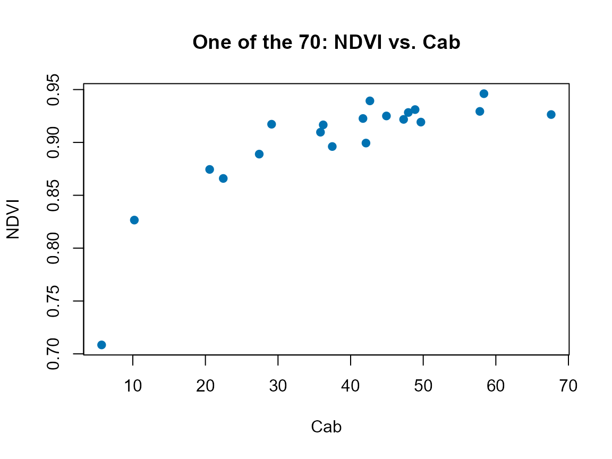

# 08. Vegetation Indices and Spectral Features

``` r

library(ToolsRTM)
```

`ToolsRTM` ships **five** functions with “indices” in the name. They are
not interchangeable, and the package’s own naming doesn’t make the
distinction obvious – this page exists to clear that up before using any
of them.

| Function | Input shape | Spectral basis | Index set | Typical use |
|----|----|----|----|----|
| [`getIndices()`](../reference/getIndices.md) | Tabular: many rows, `R.<wavelength>` columns (native 1nm) | Native spectrum, domain-limited (`"VNIR"`/`"SWIR"`/`"VNIR-SWIR"`) | ~75 indices, full domain-appropriate set | LUTs at native resolution (Tutorials 05-06) |
| [`getIndicesSE2()`](../reference/getIndicesSE2.md) | Tabular: many rows, `B1`-`B12` columns (Sentinel-2 bands) | Sentinel-2A/2B band centers | **70** named indices – the full literature set (NDVI, RDVI, MCARI, REIP, SIPI, …) | Exploratory analysis: which *specific*, citable index correlates with a trait |
| [`getIndicesSE2.ML()`](../reference/getIndicesSE2.ML.md) | Same as [`getIndicesSE2()`](../reference/getIndicesSE2.md) | Same | **31** indices – a curated subset of the 70, decorrelated/simplified for regression, plus two ML-oriented additions (`kNDVI`, `NDVIv`) not in the full set | Feature engineering for [`get.inversion()`](../reference/get.inversion.md)/ML models (Tutorials 10-12) |
| [`getSpectraIndices()`](../reference/getSpectraIndices.md) | **Spatial**: a folder of GeoTIFF images (not a data.frame of spectra) | Sentinel-2A only (currently) | Any one index, or `'All'`, computed per pixel across every image in the folder | Batch/time-series index maps from real imagery |
| [`getSpatial_index()`](../reference/getSpatial_index.md) | **Spatial**: one GeoTIFF image at a time | Sentinel-2A only (currently) | Any one index, or `'All'`, computed per pixel | A single-scene version of the above, used internally by [`getSpatialTrait()`](../reference/getSpatialTrait.md)’s trait-mapping workflow |

Verified directly (same 20-row LUT, convolved to Sentinel-2A, Tutorial
05-07’s own pipeline):
[`getIndicesSE2()`](../reference/getIndicesSE2.md) returned 66
non-constant columns and
[`getIndicesSE2.ML()`](../reference/getIndicesSE2.ML.md) returned 30 on
that particular sample – close to their full 70/31-index design sets,
with a couple dropped as constant or non-finite for this specific draw
(both functions drop those automatically, same defensive pattern used
throughout this package).

## 1. `getIndices()`: native-resolution, tabular

``` r

LUT <- as.data.frame(getLUT(inputs = ToolsRTM::inputsPROSAIL, nLUT = 20, setseed = 1))
rsoil <- rep(0.15, 2101)
refl <- t(sapply(seq_len(20), function(i) {
  foursail(inputLUT = LUT[i, ], rsoil = rsoil, LeafModel = "PROSPECT-D")$rsot
}))
colnames(refl) <- paste0("R.", 400:2500)

idx_native <- suppressMessages(getIndices(as.data.frame(refl), pattern.rfl = "R.", spectral.domain = "VNIR"))
#> [1] "Estimating indices using VNIR domain..."
#>   |                                                                              |                                                                      |   0%  |                                                                              |====                                                                  |   5%  |                                                                              |=======                                                               |  10%  |                                                                              |==========                                                            |  15%  |                                                                              |==============                                                        |  20%  |                                                                              |==================                                                    |  25%  |                                                                              |=====================                                                 |  30%  |                                                                              |========================                                              |  35%  |                                                                              |============================                                          |  40%  |                                                                              |================================                                      |  45%  |                                                                              |===================================                                   |  50%  |                                                                              |======================================                                |  55%  |                                                                              |==========================================                            |  60%  |                                                                              |==============================================                        |  65%  |                                                                              |=================================================                     |  70%  |                                                                              |====================================================                  |  75%  |                                                                              |========================================================              |  80%  |                                                                              |============================================================          |  85%  |                                                                              |===============================================================       |  90%  |                                                                              |==================================================================    |  95%  |                                                                              |======================================================================| 100%
cat("Columns after adding indices:", ncol(idx_native), "(", ncol(refl), "reflectance +", ncol(idx_native) - ncol(refl), "indices)\n")
#> Columns after adding indices: 2176 ( 2101 reflectance + 75 indices)
```

## 2. `getIndicesSE2()` vs. `getIndicesSE2.ML()`: sensor-band, full vs. curated

Both take Sentinel-2 band-named columns (`B1`…`B12`), not the native
spectrum – convolve first (Tutorial 07):

``` r

refl_X <- as.data.frame(refl); colnames(refl_X) <- paste0("X", 400:2500); refl_X <- cbind(id = 1:20, refl_X)
se2a <- suppressMessages(get.spectra.convolved(rfl = refl_X, sensor = "Sentinel2a", plot.spectra = FALSE))
#> [1] "Spectral resampling function to SENTINEL2A is being processed ..."
#>   |                                                                              |                                                                      |   0%  |                                                                              |=====                                                                 |   8%  |                                                                              |===========                                                           |  15%  |                                                                              |================                                                      |  23%  |                                                                              |======================                                                |  31%  |                                                                              |===========================                                           |  38%  |                                                                              |================================                                      |  46%  |                                                                              |======================================                                |  54%  |                                                                              |===========================================                           |  62%  |                                                                              |================================================                      |  69%  |                                                                              |======================================================                |  77%  |                                                                              |===========================================================           |  85%  |                                                                              |=================================================================     |  92%  |                                                                              |======================================================================| 100%
names(se2a) <- c("id", "B1","B2","B3","B4","B5","B6","B7","B8","B8A","B9","B10","B11","B12")
```

``` r

idx_full <- suppressMessages(getIndicesSE2(df = se2a[, -1], sensor = "Sentinel-2a", df.data = NULL, fast.process = TRUE))
#>   |                                                                              |                                                                      |   0%  |                                                                              |====                                                                  |   5%  |                                                                              |=======                                                               |  11%  |                                                                              |===========                                                           |  16%  |                                                                              |===============                                                       |  21%  |                                                                              |==================                                                    |  26%  |                                                                              |======================                                                |  32%  |                                                                              |==========================                                            |  37%  |                                                                              |=============================                                         |  42%  |                                                                              |=================================                                     |  47%  |                                                                              |=====================================                                 |  53%  |                                                                              |=========================================                             |  58%  |                                                                              |============================================                          |  63%  |                                                                              |================================================                      |  68%  |                                                                              |====================================================                  |  74%  |                                                                              |=======================================================               |  79%  |                                                                              |===========================================================           |  84%  |                                                                              |===============================================================       |  89%  |                                                                              |==================================================================    |  95%  |                                                                              |======================================================================| 100%
cat("getIndicesSE2() (full set):", ncol(idx_full), "indices\n")
#> getIndicesSE2() (full set): 66 indices
```

``` r

idx_ml <- suppressMessages(getIndicesSE2.ML(df = se2a[, -1], sensor = "Sentinel-2a", df.data = NULL, fast.process = TRUE))
#>   |                                                                              |                                                                      |   0%  |                                                                              |====                                                                  |   5%  |                                                                              |=======                                                               |  11%  |                                                                              |===========                                                           |  16%  |                                                                              |===============                                                       |  21%  |                                                                              |==================                                                    |  26%  |                                                                              |======================                                                |  32%  |                                                                              |==========================                                            |  37%  |                                                                              |=============================                                         |  42%  |                                                                              |=================================                                     |  47%  |                                                                              |=====================================                                 |  53%  |                                                                              |=========================================                             |  58%  |                                                                              |============================================                          |  63%  |                                                                              |================================================                      |  68%  |                                                                              |====================================================                  |  74%  |                                                                              |=======================================================               |  79%  |                                                                              |===========================================================           |  84%  |                                                                              |===============================================================       |  89%  |                                                                              |==================================================================    |  95%  |                                                                              |======================================================================| 100%
cat("getIndicesSE2.ML() (curated):", ncol(idx_ml), "indices\n")
#> getIndicesSE2.ML() (curated): 30 indices
cat("In the ML set but NOT the full set:", setdiff(names(idx_ml), names(idx_full)), "\n")
#> In the ML set but NOT the full set: CR.Brown NDVIv kNDVI
```

`kNDVI` (kernel NDVI) and `NDVIv` are the two ML-oriented additions –
`kNDVI` in particular is documented in the remote-sensing literature as
behaving better as a regression predictor than plain NDVI (less
saturation at high biomass), which is exactly the kind of index worth
having in a curated ML feature set even though it isn’t one of the
“classic” 70.

``` r

plot(LUT$Cab, idx_full$NDVI, pch = 19, col = "#0072B2",
     xlab = "Cab", ylab = "NDVI", main = "One of the 70: NDVI vs. Cab")
```



## 3. Spatial indices: `getSpectraIndices()` and `getSpatial_index()`

Both work on real GeoTIFF imagery, not simulated spectra – not runnable
here without real Sentinel-2 scenes on disk, but their signatures show
the distinction clearly:

``` r

# getSpectraIndices(): a whole FOLDER of images (e.g. a time series),
# looped per file, with a progress bar and optional export -- Sentinel-2A
# only for now.
getSpectraIndices(rasterFiles = "path/to/tif_folder/", Sensor = "Sentinel2a",
                   SpectraltoCompute = "NDVI", factorR = 1/10000,
                   path.export = "path/to/output/")

# getSpatial_index(): ONE image in, one (or 'All') index map(s) out -- no
# folder loop, no progress bar; the building block getSpatialTrait() itself
# calls internally when producing a spatial trait map.
getSpatial_index(rasterFiles = "path/to/one_scene.tif", Sensor = "Sentinel2a",
                  SpectraltoCompute = "NDVI", factorR = 1/10000)
```

Tutorial 14 uses this spatial path for real, on an actual Sentinel-2
image retrieved via STAC, to produce a genuine 2D index/trait map.

## Which one should you use?

``` text
What are you computing indices from?
          |
          +-- A LUT / many simulated spectra at native (1nm) resolution
          |      |
          |      v
          |   getIndices()
          |
          +-- Sentinel-2 band-level reflectance (simulated or real)
          |      |
          |      +-- Exploring which named index matters
          |      |      -> getIndicesSE2()  (full 70-index set)
          |      |
          |      +-- Feeding indices into an ML/inversion model
          |             -> getIndicesSE2.ML()  (31-index curated set)
          |
          +-- Real GeoTIFF imagery (a spatial map, not a spectrum table)
                 |
                 +-- One scene -> getSpatial_index()
                 +-- Many scenes / a time series -> getSpectraIndices()
```

## What’s next

- **Tutorial 09** – formal sensitivity analysis: which traits actually
  drive which indices and bands, and by how much.
- **Tutorial 11** – using
  [`getIndicesSE2.ML()`](../reference/getIndicesSE2.ML.md)’s curated set
  as ML predictor features alongside raw bands.
