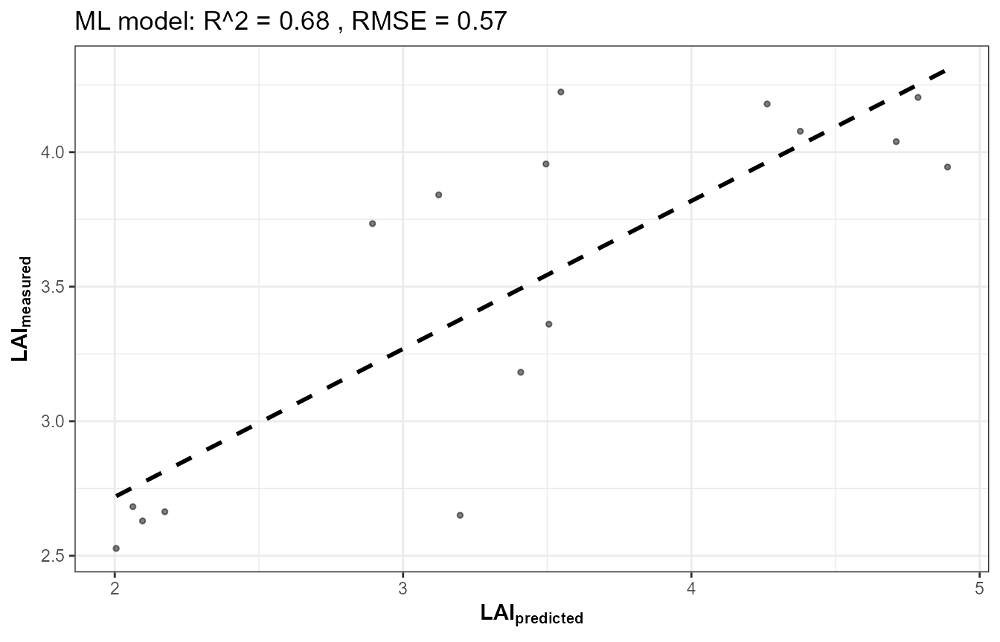
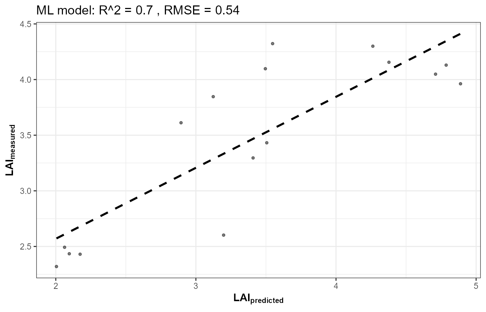
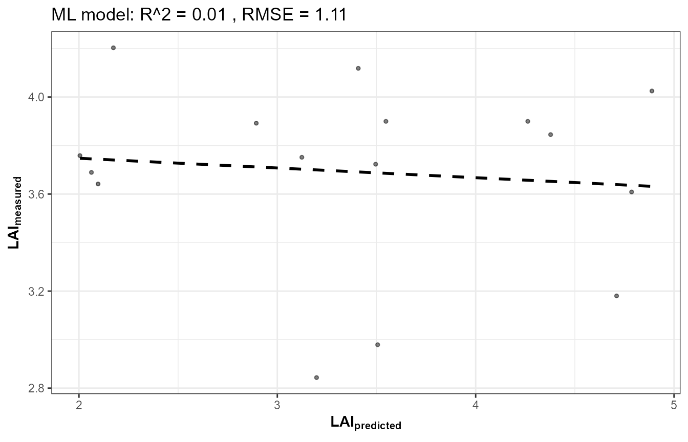
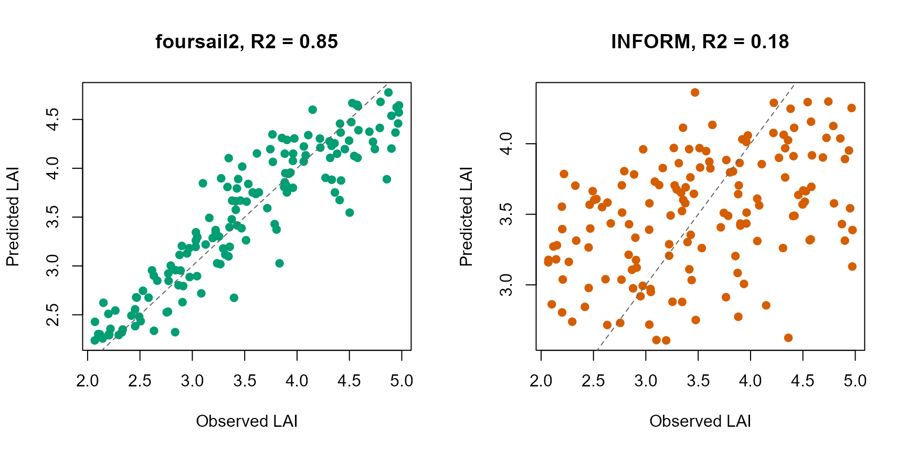

# 13. End-to-End RTM Inversion Pipeline

``` r

library(ToolsRTM)
library(ggplot2)
library(doParallel)
library(foreach)
```

Tutorials 05-12 built the pipeline one stage at a time: LUT, parallel
simulation, sensor convolution, indices, sensitivity, and three flavours
of inversion. This page runs the **whole chain as one coherent
pipeline** – the same shape as this package’s own course scripts
(`Scripts/R/ForPROSAIL/`, `ForFoursail2/`, `ForINFORM/`, `ForSPART/`,
`ForMARMIT/`) – and, more importantly, shows how the *same* pipeline
looks across different canopy models with only a couple of lines
changed.

``` text
getLUT()
   |
   v
simulate_RTM()  (fourSAIL / foursail2 / INFORM)
   |
   v
get.spectra.convolved()  (Sentinel-2A / 2B / PRISMA)
   |
   v
getIndices() / getIndicesSE2()
   |
   v
get.inversion()
   |
   v
Vegetation traits
```

## 1. One function, three canopy models

[`simulate_RTM()`](../reference/simulate_RTM.md) dispatches to
[`foursail()`](../reference/foursail.md)/[`foursail2()`](../reference/foursail2.md)/[`inform()`](../reference/inform.md)
based on `canopy.model` – `canopy.model` is a single variable, not a
separate script per model:

``` r

run_pipeline <- function(canopy.model, leaf.model = "PROSPECT-D", n.samples = 500, seed = 1) {
  LUT <- as.data.frame(getLUT(inputs = ToolsRTM::inputsPROSAIL, nLUT = n.samples, setseed = seed))
  LUT$Cs <- 0; LUT$fqe <- 0.01; LUT$Cx <- 0
  LUT$cell.d <- 40; LUT$inter.c <- 0.045; LUT$baseline.abs <- 0.0006
  LUT$leaf.thick <- 1.6; LUT$albino.abs <- 0; LUT$lign.cell <- 2; LUT$Nitrogen <- 1
  LUT$fraction_brown <- 0.1; LUT$diss <- 0.5; LUT$Cv <- 1; LUT$Zeta <- 0
  LUT$LAIu <- 0.5; LUT$sd <- 650; LUT$cd <- 4.5; LUT$h <- 20; LUT$skyl <- 0.1

  rsoil <- rep(0.15, 2101)
  # 500 simulations per canopy model, x3 models -- parallelized the same way
  # as Tutorial 06, rather than a plain sapply(), to keep this vignette's
  # build time reasonable at this sample size.
  no_cores <- max(1, parallel::detectCores() - 2)
  cl <- makeCluster(no_cores)
  registerDoParallel(cl)
  refl_list <- foreach(i = seq_len(n.samples), .packages = "ToolsRTM") %dopar% {
    suppressMessages(simulate_RTM(inputLUT = LUT[i, ], rsoil = rsoil,
                                   leaf.model = leaf.model, canopy.model = canopy.model))$rsot
  }
  stopCluster(cl)
  refl <- do.call(rbind, refl_list)
  colnames(refl) <- paste0("R.", 400:2500)

  refl_X <- as.data.frame(refl); colnames(refl_X) <- paste0("X", 400:2500); refl_X <- cbind(id = seq_len(n.samples), refl_X)
  se2a <- suppressMessages(get.spectra.convolved(rfl = refl_X, sensor = "Sentinel2a", plot.spectra = FALSE))
  band_names <- paste0("B", seq_along(as.numeric(names(se2a)[-1])))
  names(se2a) <- c("id", band_names)

  train_idx <- sample(seq_len(n.samples), size = round(0.7 * n.samples))
  train_df <- cbind(LUT[train_idx, ], se2a[train_idx, band_names])
  test_df  <- cbind(LUT[-train_idx, ], se2a[-train_idx, band_names])

  fit <- get.inversion(data = train_df, depVar = "LAI", inputs = band_names,
                        algorithm = "RF", n.samples = nrow(train_df), seed = 42)
  pred <- as.numeric(predict(fit$model, newdata = test_df[, c("LAI", band_names)]))
  r2 <- 1 - sum((test_df$LAI - pred)^2) / sum((test_df$LAI - mean(test_df$LAI))^2)

  list(LUT = LUT, refl = refl, obs = test_df$LAI, pred = pred, r2 = r2)
}
```

## 2. Run it for fourSAIL, foursail2, and INFORM

``` r

set.seed(1)
res_foursail  <- run_pipeline("fourSAIL")
```



``` r

set.seed(1)
res_foursail2 <- run_pipeline("foursail2")
```



``` r

set.seed(1)
res_inform    <- run_pipeline("INFORM")
```



``` r

results <- data.frame(
  canopy_model = c("fourSAIL", "foursail2", "INFORM"),
  LAI_R2 = c(res_foursail$r2, res_foursail2$r2, res_inform$r2)
)
knitr::kable(results, digits = 3)
```

| canopy_model | LAI_R2 |
|:-------------|-------:|
| fourSAIL     |  0.829 |
| foursail2    |  0.845 |
| INFORM       |  0.177 |

## A genuine finding, not a bug: INFORM’s LAI barely inverts

``` r

op <- par(mfrow = c(1, 2))
plot(res_foursail2$obs, res_foursail2$pred, pch = 19, col = "#009E73",
     xlab = "Observed LAI", ylab = "Predicted LAI", main = paste("foursail2, R2 =", round(res_foursail2$r2, 2)))
abline(0, 1, lty = 2, col = "grey40")
plot(res_inform$obs, res_inform$pred, pch = 19, col = "#D55E00",
     xlab = "Observed LAI", ylab = "Predicted LAI", main = paste("INFORM, R2 =", round(res_inform$r2, 2)))
abline(0, 1, lty = 2, col = "grey40")
```



``` r

par(op)
```

This isn’t a bug – confirmed by checking `LAI`’s own variance and its
univariate correlation with reflectance in each case. The reason:
`run_pipeline()` above (matching `Scripts/R/ForINFORM/1-simulate_LUT.R`)
holds INFORM’s crown-geometry parameters (`sd`/`cd`/`h`/`LAIu` – stem
density, crown diameter, tree height, understory LAI) **constant**
across every sampled row, so `LAI`’s own signal is weak relative to what
actually dominates forest reflectance variation in this LUT. Want better
LAI retrieval from INFORM? Vary those crown-geometry parameters too, not
just LAI itself – a direct, testable consequence of Tutorial 09’s
sensitivity framework applied to a real inversion result.

## 3. SPART: structurally different, same downstream pipeline

[`SPART()`](../reference/SPART.md) (Tutorial 03) already outputs at
sensor bands directly – there is no separate “simulate native, then
convolve” step, so its own version of this pipeline runs
[`SPART()`](../reference/SPART.md) once per LUT row instead of
[`simulate_RTM()`](../reference/simulate_RTM.md) +
[`get.spectra.convolved()`](../reference/get.spectra.convolved.md), then
feeds the result into the exact same
[`get.inversion()`](../reference/get.inversion.md) call:

``` r

# ForSPART/1-simulate_LUT.R's version of this pipeline, conceptually:
sim_i <- SPART(inputLUT = LUT[i, ], CanopyModel = "fourSAIL", LeafModel = "PROSPECT-PRO",
                sensor.i = ToolsRTM::Sentinel2A.MSI, rsoil = NULL, get.plots = FALSE)
toc_i <- sim_i$output$rfl.toc.BRDF  # already at Sentinel-2A bands -- no convolution step needed
```

## 4. MARMIT: the odd one out, on purpose

`ForMARMIT` in this package’s course scripts has no leaf or canopy model
at all – no `Cab`/`LAI`/`EWT` to invert. Its target trait is `SMC`
(gravimetric soil moisture, via
[`get.marmit.rsoil()`](../reference/get.marmit.rsoil.md)’s own physics),
and it inverts almost perfectly (R² typically 0.9+) since soil
reflectance’s response to moisture is close to deterministic physics,
unlike the noisier proxy relationship trait retrieval from canopy
reflectance usually involves. Not run here (see Tutorial 03’s
soil-contribution section and the `marmit-soil-in-canopy` article for
the underlying MARMIT physics).

## What’s next

- **Tutorial 14** – the same inversion framework applied to real
  Sentinel-2 imagery retrieved via STAC, including a genuine spatial
  map.
