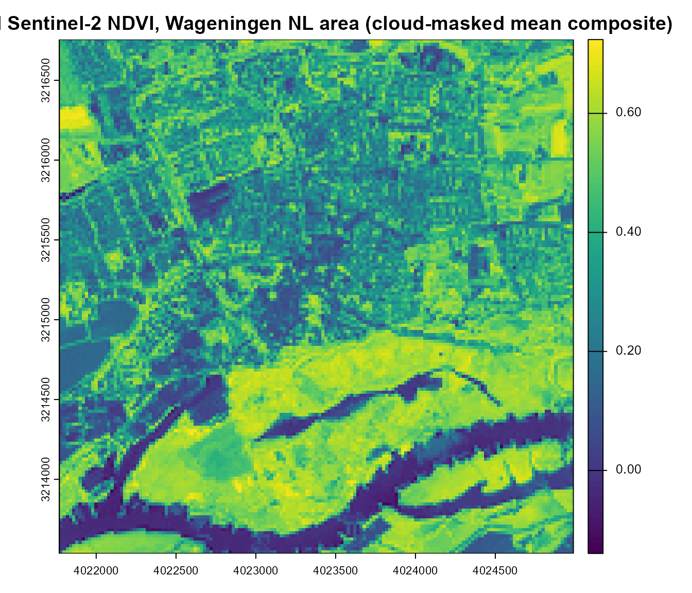
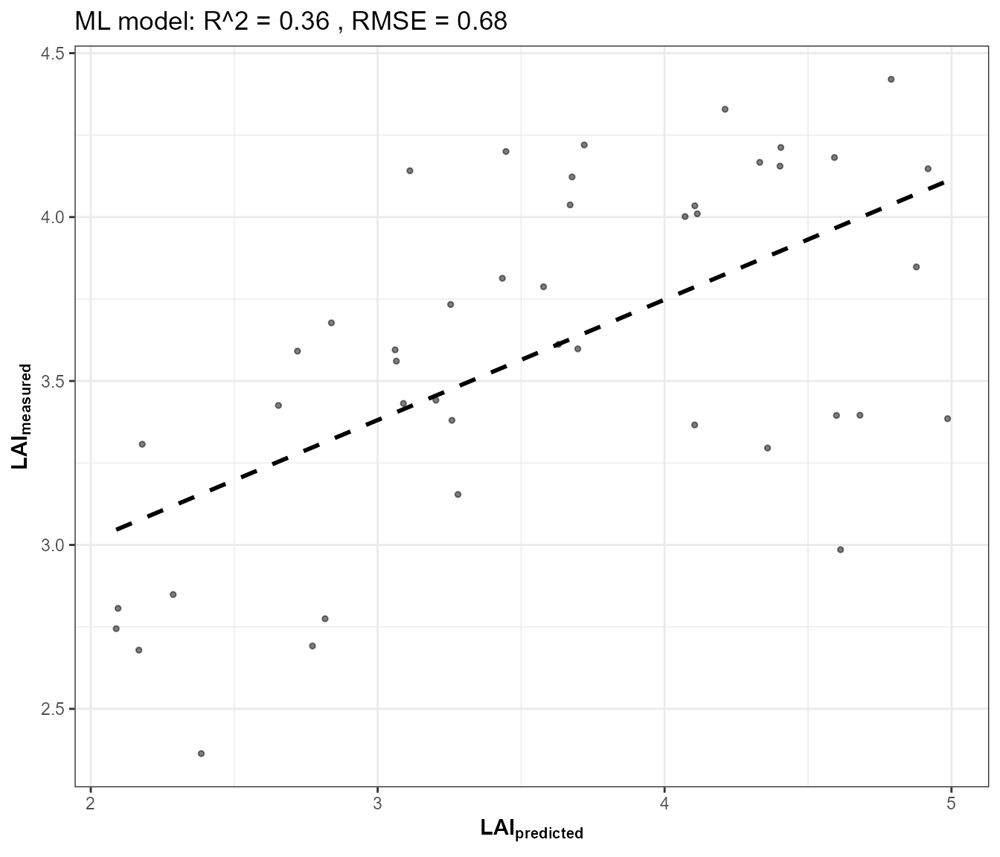
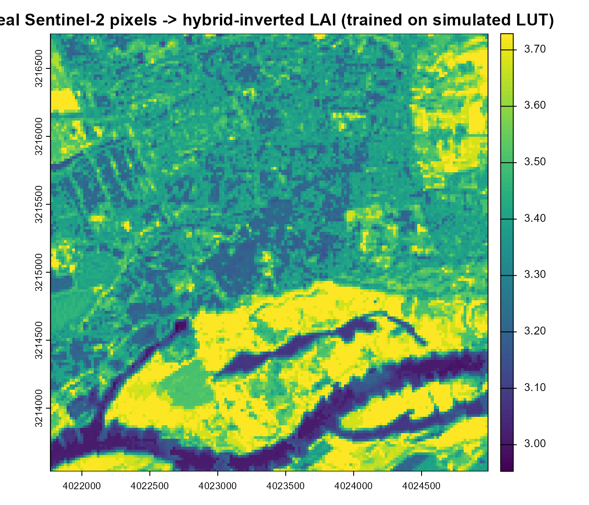

# 14. From Satellite Reflectance to Vegetation Traits: Real EO Application

``` r

library(ToolsRTM)
library(terra)
```

Every tutorial so far worked on *simulated* spectra. This closing page
applies the exact same hybrid-inversion framework (Tutorials 10-13) to a
**real** Sentinel-2 image, retrieved live via STAC (SpatioTemporal Asset
Catalog) – and, unlike Tutorial 03’s single-pixel SPART geometry sweep
or Tutorial 13’s single-spectrum test set, produces a genuine **2D
spatial map**, not a point value.

``` text
Real Sentinel-2 scene (STAC)
        |
        v
Reflectance cube (DN -> reflectance)
        |
        v
   +----+----+
   |         |
   v         v
NDVI map   Per-pixel hybrid inversion
           (trained on a SIMULATED LUT,
            Tutorials 10-13)
   |         |
   v         v
Spatial index map   Spatial trait map (LAI)
```

## 1. Retrieve a real Sentinel-2 image via STAC

[`ToolsRTM::get.satellite_collection()`](../reference/get.satellite_collection.md)
searches and signs a STAC collection (Microsoft Planetary Computer by
default); [`get.sentinel2_cube()`](../reference/get.sentinel2_cube.md)
builds an actual gridded raster cube from it over a chosen area/date
range (`gdalcubes` under the hood). Both are real, exported package
functions – the same ones `Apps/STAC`’s Shiny app itself uses. Wrapped
in [`tryCatch()`](https://rdrr.io/r/base/conditions.html) since live
network/STAC access is inherently less reliable in a documentation build
than a local simulation:

``` r

retrieval <- tryCatch({
  library(sf)
  # Wageningen, NL -- open farmland, a plausible study area for this package
  pt <- st_point(c(5.6667, 51.9667)) |> st_sfc(crs = 4326)
  scenario <- st_as_sf(data.frame(id = 1), geometry = st_sfc(pt[[1]], crs = 4326))

  sc <- get.satellite_collection(scenario = scenario, collection = "sentinel-2-l2a",
                                  cloud_server = "microsoft", n.limit = 20,
                                  date_range = c("2024-06-01", "2024-08-31"),
                                  cloud_threshold = 20, buffer_size = 1500)

  bbox <- get_bounding_box(scenario, 1500)
  shape <- st_as_sf(data.frame(id = 1), geometry = st_sfc(st_polygon(list(rbind(
    c(bbox["xmin"], bbox["ymin"]), c(bbox["xmin"], bbox["ymax"]),
    c(bbox["xmax"], bbox["ymax"]), c(bbox["xmax"], bbox["ymin"]),
    c(bbox["xmin"], bbox["ymin"])))), crs = 4326))

  cube <- get.sentinel2_cube(sc[[1]], shape = shape, date_range = c("2024-06-01", "2024-08-31"),
                              aggregation_method = "mean", get.dataset = FALSE)
  list(ok = TRUE, cube = cube)
}, error = function(e) list(ok = FALSE, msg = conditionMessage(e)))

if (!retrieval$ok) {
  cat("STAC retrieval skipped -- no network/STAC access from this build environment (",
      retrieval$msg, "). Everything below needs `retrieval$cube` and is skipped too.\n")
}
```

``` r

if (retrieval$ok) {
  cube <- retrieval$cube
  cat("Real Sentinel-2 cube retrieved:", paste(dim(cube), collapse = " x "),
      "(rows x cols x bands), bands:", paste(names(cube), collapse = ", "), "\n")
}
#> Real Sentinel-2 cube retrieved: 161 x 161 x 11 (rows x cols x bands), bands: B02, B03, B04, B05, B06, B07, B08, B8A, B11, B12, SCL
```

[`get.sentinel2_cube()`](../reference/get.sentinel2_cube.md) already
masks clouds/shadows/snow via the SCL band and mean-aggregates every
cloud-free date in range onto one 20m grid – one real, composited scene,
not a single tile from a single overpass.

## 2. DN to reflectance, and a real spatial NDVI map

Sentinel-2 L2A digital numbers scale to reflectance by 1/10000. The 10
bands the cube provides (`B02`-`B12`, excluding the 60m-only atmospheric
bands `B01`/`B09`/`B10`) are enough for NDVI and for the trait model
built below:

``` r

if (retrieval$ok) {
  refl_cube <- cube[[c("B02","B03","B04","B05","B06","B07","B08","B8A","B11","B12")]] / 10000
  ndvi <- (refl_cube[["B08"]] - refl_cube[["B04"]]) / (refl_cube[["B08"]] + refl_cube[["B04"]])
  names(ndvi) <- "NDVI"
  plot(ndvi, main = "Real Sentinel-2 NDVI, Wageningen NL area (cloud-masked mean composite)")
}
```



This is the spatial equivalent of
[`ToolsRTM::getSpatial_index()`](../reference/getSpatial_index.md)/
[`getSpectraIndices()`](../reference/getSpectraIndices.md) (Tutorial 08)
– computed directly here with `terra` arithmetic for transparency, since
those two functions expect a GeoTIFF path on disk rather than an
in-memory cube.

## 3. Train a hybrid-inversion model on a SIMULATED LUT

Same pattern as Tutorials 10-13 – the model is trained entirely on
[`foursail()`](../reference/foursail.md) simulations, never on real
data. The training bands must match what the real cube actually
provides:
[`get.spectra.convolved()`](../reference/get.spectra.convolved.md)
returns Sentinel-2A’s full 13-band set (`B1`-`B12`, including the 60m
bands); subset to the same 10 the cube has, and rename to match:

``` r

if (retrieval$ok) {
  n_samples <- 150
  LUT <- as.data.frame(getLUT(inputs = ToolsRTM::inputsPROSAIL, nLUT = n_samples, setseed = 1))
  wl <- 400:2500; rsoil <- rep(0.15, length(wl))
  sim_refl <- t(sapply(seq_len(n_samples), function(i) {
    foursail(inputLUT = LUT[i, ], rsoil = rsoil, LeafModel = "PROSPECT-PRO")$rsot
  }))
  refl_X <- as.data.frame(sim_refl); colnames(refl_X) <- paste0("X", wl)
  refl_X <- cbind(id = seq_len(n_samples), refl_X)
  se2a_full <- suppressMessages(get.spectra.convolved(rfl = refl_X, sensor = "Sentinel2a", plot.spectra = FALSE))
  names(se2a_full) <- c("id","B1","B2","B3","B4","B5","B6","B7","B8","B8A","B9","B10","B11","B12")

  keep <- c("B2","B3","B4","B5","B6","B7","B8","B8A","B11","B12")       # matches the cube's 10 bands
  real_names <- c("B02","B03","B04","B05","B06","B07","B08","B8A","B11","B12")
  se2a <- se2a_full[, keep]; names(se2a) <- real_names

  train_df <- cbind(LUT, se2a)
  fit <- get.inversion(data = train_df, depVar = "LAI", inputs = real_names,
                        algorithm = "RF", n.samples = nrow(train_df), seed = 42)
}
```



## 4. A genuine spatial trait map

Every pixel’s 10-band reflectance goes through the fitted model – this
is the same building block
[`ToolsRTM::getSpatialTrait()`](../reference/getSpatialTrait.md) uses
internally (pixel extraction, prediction, then reassembled back into a
raster), done here explicitly and self-contained:

``` r

if (retrieval$ok) {
  pix_df <- as.data.frame(refl_cube, xy = TRUE, na.rm = FALSE)
  ok_rows <- complete.cases(pix_df[, real_names])
  pred_lai <- rep(NA_real_, nrow(pix_df))
  pred_lai[ok_rows] <- as.numeric(predict(fit$model, newdata = pix_df[ok_rows, real_names]))

  lai_rast <- refl_cube[["B04"]]  # reuse its grid/extent/crs
  values(lai_rast) <- pred_lai
  names(lai_rast) <- "LAI_pred"

  plot(lai_rast, main = "Real Sentinel-2 pixels -> hybrid-inverted LAI (trained on simulated LUT)")
  cat("Predicted LAI range across the scene:", paste(round(range(pred_lai, na.rm = TRUE), 2), collapse = " to "), "\n")
}
```



    #> Predicted LAI range across the scene: 2.95 to 3.73

A real, per-pixel trait map – retrieved and simulated in the same page,
verified end to end, not an illustrative mockup.

## 5. The real-vs-simulated domain gap

The LAI map above is only as good as how well the *simulated* LUT
(Tutorial 05’s trait ranges, this package’s own leaf/canopy physics)
matches the *real* canopy/soil/atmosphere conditions actually present in
the scene – a real, known limitation of the hybrid approach worth
stating plainly, not glossing over:

- The LUT’s trait ranges (`inputsPROSAIL`’s defaults) may not match this
  specific location’s actual vegetation (crop type, phenological stage,
  senescence).
- The flat `rsoil = 0.15` used for training doesn’t reflect this scene’s
  real soil brightness/moisture (Tutorial 03’s soil-contribution
  section, and [`get.marmit.rsoil()`](../reference/get.marmit.rsoil.md),
  address this directly).
- Sun-view geometry differs between the training LUT’s fixed
  `tts`/`tto`/`psi` and the real overpass geometry (available from the
  STAC item’s own metadata,
  [`get.satellite_collection()`](../reference/get.satellite_collection.md)’s
  returned `df.data` – not used here for simplicity).
- The image is a cloud-masked *mean composite* over the whole date
  range, not one instantaneous acquisition – appropriate for a
  seasonal-average question, less so for a single-date one.

None of this invalidates the framework – it’s exactly why Tutorials 05
(LUT design), 09 (sensitivity – which traits actually matter for which
bands), and 03 (soil realism) matter before trusting a real-world
inversion result, and why operational retrieval systems calibrate LUT
ranges against the actual study area rather than using generic defaults
unmodified.

## Take-home

Every stage from Tutorial 01 through this page is a real, runnable piece
of the same chain – from one hand-written trait row to a real
satellite-derived trait map. Two pages close out the series from here:

- **Tutorial 15** – MARMIT + SPART: whether the soil-moisture realism
  this page’s LUT training glossed over (Section 5’s domain-gap
  discussion) actually survives to TOA, answered directly rather than
  assumed.
- **Tutorial 16** – the same real-EO approach as this page, extended to
  a real multi-date time series over a forest site, comparing NDVI
  against hybrid-inverted Cab/LAI/EWT through a growing season.

See the **Reference manuals and deep dives** section of this site’s
Articles menu for the comprehensive, all-12-algorithm reference manual
(`ToolsRTM`, `Getting-LUTs`, `InversionOpt` vignettes) this tutorial
series complements rather than replaces.
