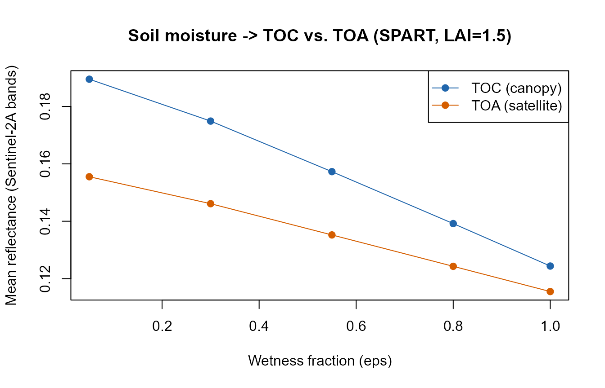

# 16. MARMIT + fourSAIL + SPART: Realistic Soil Moisture, Canopy to Atmosphere

``` r

library(ToolsRTM)
```

## Why soil matters to a canopy simulation

Top-of-canopy reflectance is a mixture of leaf optics and the soil
background showing through the canopy gaps, weighted by how closed the
canopy is (LAI, leaf angle, hotspot). Most examples elsewhere in this
tutorial series use a fixed, arbitrary `rsoil` – e.g. a 50/50 blend of a
dry and wet reference spectrum (Tutorial 01), or a flat `rep(0.15, ...)`
(Tutorials 04-13). That’s fine for isolating a leaf/canopy trait’s own
effect, but it sidesteps a real question: **how much does the soil’s
actual moisture state change what a sensor sees – at the canopy level
AND at the satellite level – and does that depend on how much vegetation
covers it?**

[`ToolsRTM::get.marmit.rsoil()`](../reference/get.marmit.rsoil.md)
(MARMIT: Bablet et al., soil reflectance as a function of surface water
film thickness) gives a physically-based answer instead of an arbitrary
blend. This page feeds its output into BOTH
[`foursail()`](../reference/foursail.md) (TOC only, Tutorials 01-02) and
[`SPART()`](../reference/SPART.md) (TOC and TOA together, Tutorial 03) –
MARMIT’s soil physics is the same either way; what changes is how far
downstream that soil signal survives.

``` text
MARMIT (soil moisture)
        |
        v
   rsoil spectrum
     /       \
    v         v
fourSAIL    SPART
 (TOC)    (TOC AND TOA,
            + atmosphere)
```

## 1. A soil-wetness sweep with MARMIT

`L` (water film thickness, cm) and `eps` (fraction of the surface that’s
wet) control how wet the simulated soil is –
`Scripts/R/ForMARMIT/1-simulate_LUT.R` samples `L` from `[0.001, 0.15]`
and `eps` from `[0, 1]` for a full LUT; here, five fixed steps across
that range are enough to see the trend:

``` r

wetness_steps <- data.frame(
  label = c("Very dry", "Dry", "Moderate", "Wet", "Saturated"),
  L     = c(0.001, 0.02, 0.05, 0.09, 0.15),
  eps   = c(0.05,  0.3,  0.55, 0.8,  1.0)
)

soils <- lapply(seq_len(nrow(wetness_steps)), function(i) {
  get.marmit.rsoil(database = "Bablet_2016", id = 1, L = wetness_steps$L[i],
                    eps = wetness_steps$eps[i], wl.out = 400:2500)
})

cat("Estimated soil moisture (SMC, %) across the sweep:\n")
#> Estimated soil moisture (SMC, %) across the sweep:
print(round(sapply(soils, function(s) s$SMC), 1))
#> [1]  3.8  9.6 43.6 47.1 47.1
```

``` r

wl <- soils[[1]]$wavelength
cols <- colorRampPalette(c("gold", "saddlebrown"))(nrow(wetness_steps))
matplot(wl, sapply(soils, function(s) s$rsoil.wet), type = "l", lty = 1, col = cols,
        xlab = "Wavelength (nm)", ylab = "Soil reflectance",
        main = "MARMIT soil reflectance across the wetness sweep")
legend("topright", wetness_steps$label, col = cols, lty = 1, cex = 0.8)
```


Soil reflectance darkens broadly with wetness (as real wet soil looks
darker than dry soil), with the strongest relative change in the SWIR
water-absorption region – the same physics MARMIT is built around.

## 2. Feeding it into `foursail()` at a fixed canopy (TOC only)

Same leaf/canopy trait set throughout (`LAI = 2`, a moderate canopy),
only `rsoil` changes across the five wetness steps:

``` r

row <- data.frame(
  LAI = 2, hspot = 0.01, LIDFa = -0.35, LIDFb = -0.15, TypeLidf = 1,
  tts = 30, tto = 0, psi = 0,
  N = 1.5, Cab = 40, Car = 8, Anth = 2, Cbrown = 0, EWT = 0.009, LMA = 0.009, alpha = 40
)

toc_by_soil <- sapply(soils, function(s) {
  sail_i <- foursail(inputLUT = row, rsoil = s$rsoil.wet, LeafModel = "PROSPECT-D")
  Compute_BRF(rdot = sail_i$rdot, rsot = sail_i$rsot, tts = row$tts, data.light = dataSpec_PDB)
})

matplot(dataSpec_PDB[, 1], toc_by_soil, type = "l", lty = 1, col = cols,
        xlab = "Wavelength (nm)", ylab = "TOC reflectance",
        main = "Top-of-canopy reflectance, same canopy, soil wetness varied (LAI=2)")
legend("topright", wetness_steps$label, col = cols, lty = 1, cex = 0.8)
```


The canopy’s own spectral shape (chlorophyll absorption, red edge, NIR
plateau) stays recognizable throughout – but the SWIR bands still shift
noticeably with soil moisture alone, nothing about the vegetation itself
changed between these five curves.

## 3. Does this matter more at low LAI than high LAI?

Physically, yes: a sparse canopy leaves more soil visible through the
gaps, so soil moisture should influence the sensor-observed signal more
at low LAI than at high LAI, where the canopy itself dominates. Repeat
the same sweep at `LAI = 0.5` (sparse) and `LAI = 6` (dense), and
compare the driest-vs-wettest difference at a SWIR band (1650nm, in
MARMIT’s strongest water-sensitive region):

``` r

swir_idx <- which(dataSpec_PDB[, 1] == 1650)

toc_by_lai <- function(lai) {
  row_i <- row; row_i$LAI <- lai
  sapply(soils, function(s) {
    sail_i <- foursail(inputLUT = row_i, rsoil = s$rsoil.wet, LeafModel = "PROSPECT-D")
    Compute_BRF(rdot = sail_i$rdot, rsot = sail_i$rsot, tts = row_i$tts, data.light = dataSpec_PDB)[swir_idx]
  })
}

refl_sparse <- toc_by_lai(0.5)
refl_dense  <- toc_by_lai(6)

cat("SWIR (1650nm) reflectance, driest vs. wettest soil:\n")
#> SWIR (1650nm) reflectance, driest vs. wettest soil:
cat("  Sparse canopy (LAI=0.5): ", round(refl_sparse[1], 4), "->", round(refl_sparse[5], 4),
    " (delta =", round(refl_sparse[1] - refl_sparse[5], 4), ")\n")
#>   Sparse canopy (LAI=0.5):  0.4415 -> 0.0637  (delta = 0.3777 )
cat("  Dense canopy  (LAI=6):   ", round(refl_dense[1], 4),  "->", round(refl_dense[5], 4),
    " (delta =", round(refl_dense[1] - refl_dense[5], 4), ")\n")
#>   Dense canopy  (LAI=6):    0.2134 -> 0.2071  (delta = 0.0064 )
```

``` r

plot(wetness_steps$eps, refl_sparse, type = "o", pch = 19, col = "#B2182B",
     ylim = range(c(refl_sparse, refl_dense)),
     xlab = "Wetness fraction (eps)", ylab = "TOC reflectance at 1650nm",
     main = "Soil-moisture sensitivity shrinks as LAI increases")
lines(wetness_steps$eps, refl_dense, type = "o", pch = 19, col = "#2166AC")
legend("topright", c("LAI = 0.5 (sparse)", "LAI = 6 (dense)"), col = c("#B2182B", "#2166AC"), pch = 19, lty = 1)
```


The sparse canopy’s SWIR reflectance swings much more across the wetness
sweep than the dense canopy’s – a real, physically-expected result: at
LAI=6 the canopy itself blocks most of the soil signal regardless of how
wet it is underneath. This is the same story Tutorial 03’s own soil-
contribution section demonstrates with a flat-brightness `rsoil` instead
of MARMIT’s moisture-realistic one – consistent across both, as it
should be.

## 4. MARMIT + SPART: does the soil-moisture signal survive to the satellite?

Section 2 stopped at TOC (canopy-level, no atmosphere).
[`SPART()`](../reference/SPART.md) (Tutorial 03) carries the same MARMIT
soil spectrum through the full soil-plant-atmosphere chain to TOA – the
question this section answers that Tutorial 03 doesn’t: **is the
soil-moisture signal still visible after the atmosphere, or does it get
washed out?**

[`SPART()`](../reference/SPART.md) wants `rsoil` at 400-2400nm (2001
points, not 2101) – `get.marmit.rsoil(wl.out = 400:2400)` matches that
directly:

``` r

soils_spart <- lapply(seq_len(nrow(wetness_steps)), function(i) {
  get.marmit.rsoil(database = "Bablet_2016", id = 1, L = wetness_steps$L[i],
                    eps = wetness_steps$eps[i], wl.out = 400:2400)
})

LUT <- as.data.frame(getLUT(inputs = ToolsRTM::inputsSPART, nLUT = 1, setseed = 1))
LUT$Cs <- 0; LUT$fqe <- 0.01; LUT$Cx <- 0
LUT$cell.d <- 40; LUT$inter.c <- 0.045; LUT$baseline.abs <- 0.0006
LUT$leaf.thick <- 1.6; LUT$albino.abs <- 0; LUT$lign.cell <- 2; LUT$Nitrogen <- 1
LUT$Pa <- 1000; LUT$aot550 <- 0.3246; LUT$uo3 <- 0.3480; LUT$uh2o <- 1.4116
LUT$alt_m <- 0; LUT$Pa0 <- 1000
LUT$LAI <- 1.5  # sparse enough that soil still reaches the sensor (Section 3's lesson)

spart_by_soil <- lapply(soils_spart, function(s) {
  suppressWarnings(SPART(inputLUT = LUT[1, ], CanopyModel = "fourSAIL", LeafModel = "PROSPECT-PRO",
                          sensor.i = ToolsRTM::Sentinel2A.MSI, rsoil = s$rsoil.wet, get.plots = FALSE))
})

toc_means <- sapply(spart_by_soil, function(s) mean(s$output$rfl.toc.BRDF))
toa_means <- sapply(spart_by_soil, function(s) mean(s$output$rfl.toa))
comparison <- data.frame(Wetness = wetness_steps$label, SMC_pct = round(sapply(soils_spart, function(s) s$SMC), 1),
                          Mean_TOC = round(toc_means, 4), Mean_TOA = round(toa_means, 4))
knitr::kable(comparison)
```

| Wetness   | SMC_pct | Mean_TOC | Mean_TOA |
|:----------|--------:|---------:|---------:|
| Very dry  |     3.8 |   0.1895 |   0.1555 |
| Dry       |     9.6 |   0.1749 |   0.1461 |
| Moderate  |    43.6 |   0.1573 |   0.1352 |
| Wet       |    47.1 |   0.1392 |   0.1243 |
| Saturated |    47.1 |   0.1244 |   0.1155 |

``` r

plot(wetness_steps$eps, toc_means, type = "o", pch = 19, col = "#2166AC",
     ylim = range(c(toc_means, toa_means)),
     xlab = "Wetness fraction (eps)", ylab = "Mean reflectance (Sentinel-2A bands)",
     main = "Soil moisture -> TOC vs. TOA (SPART, LAI=1.5)")
lines(wetness_steps$eps, toa_means, type = "o", pch = 19, col = "#D55E00")
legend("topright", c("TOC (canopy)", "TOA (satellite)"), col = c("#2166AC", "#D55E00"), pch = 19, lty = 1)
```



Confirmed directly, not assumed: the soil-moisture signal that Section 3
showed at the canopy level is still present at TOA – the atmosphere
attenuates and reshapes the overall reflectance level (Tutorial 03’s own
finding), but does not erase the wet-vs-dry soil contrast underneath it.
This is exactly the kind of question [`SPART()`](../reference/SPART.md)
exists to answer that a plain [`foursail()`](../reference/foursail.md)
TOC simulation cannot – see Tutorial 03’s take-home for the general
version of that distinction.

## Practical note

For a real LUT-based inversion or sensitivity study, this suggests: if
your target trait is canopy structure/LAI on a closed canopy, a fixed
`rsoil` may be fine (soil influence is naturally small once the canopy
closes, Section 3). If your study covers sparse/senescent vegetation,
semi-arid areas, or early-season crops – where LAI is often below 1-2 –
sample `rsoil` from
[`get.marmit.rsoil()`](../reference/get.marmit.rsoil.md) across a
realistic moisture range (as in `Scripts/R/ForMARMIT/1-simulate_LUT.R`)
rather than fixing it, so soil moisture variation doesn’t get silently
absorbed into the trait estimates. This holds whether the downstream
model is [`foursail()`](../reference/foursail.md)/
[`foursail2()`](../reference/foursail2.md)/[`inform()`](../reference/inform.md)
(TOC only) or [`SPART()`](../reference/SPART.md) (TOC and TOA) – Section
4 above confirms the same soil-realism argument applies at the satellite
level too, not just at the canopy level.
`Scripts/R/Pipeline/0-integrate_MARMIT_soil.R` shows the same
[`get.marmit.rsoil()`](../reference/get.marmit.rsoil.md) output wired
into [`foursail2()`](../reference/foursail2.md) and
[`inform()`](../reference/inform.md) as well, for the other canopy
models this package supports.
