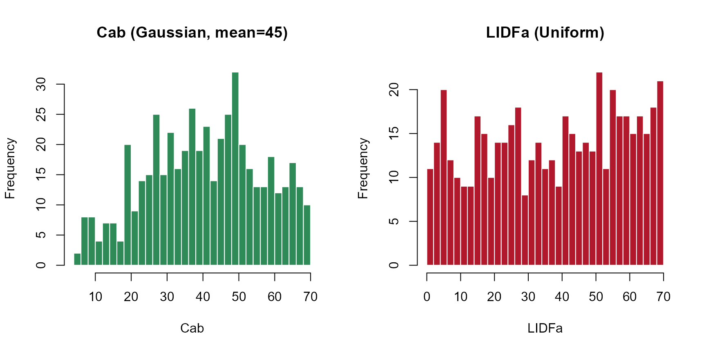
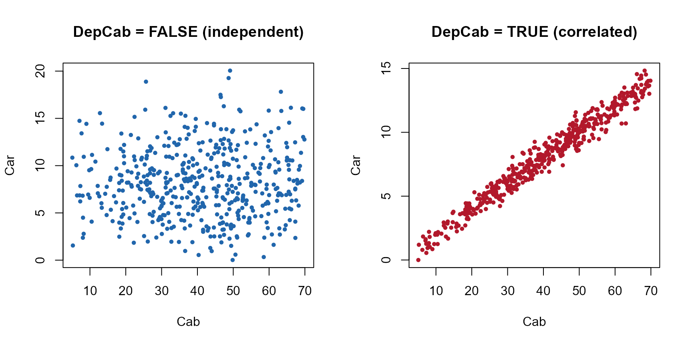
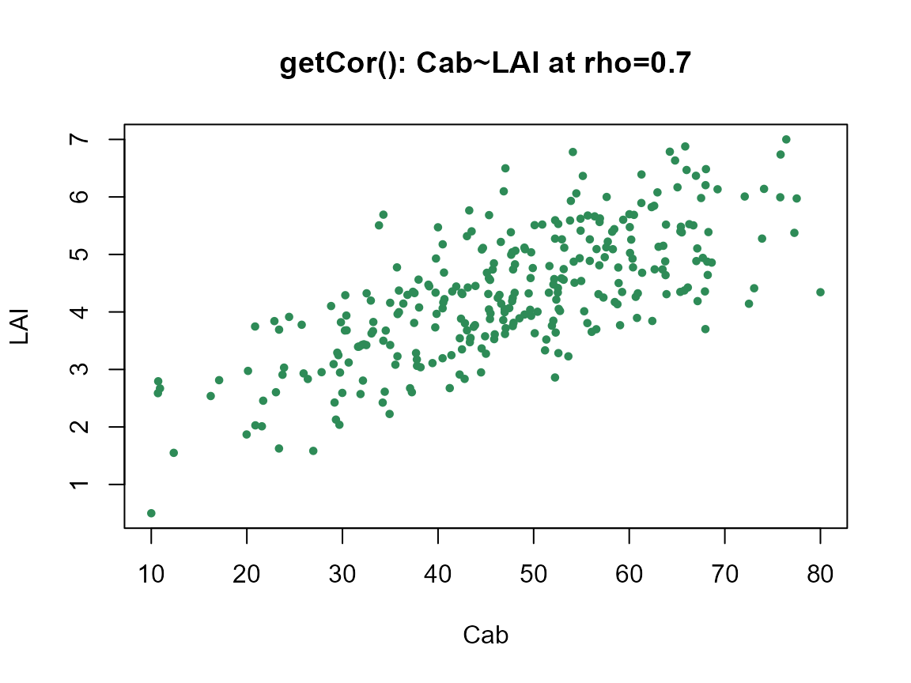

# Getting-LUTs

``` r

library(ToolsRTM)
```

A LUT (Look-Up Table) is one row of trait values per simulated spectrum
– the input every canopy model, sensitivity analysis, and inversion
workflow in this package starts from. Three functions build one, each
trading off control against simplicity differently:

| Function | Distribution per trait | Trait correlation | Typical use |
|----|----|----|----|
| [`getLUT()`](../reference/getLUT.md) | Fixed set (see [`?getLUT`](../reference/getLUT.md)) | Independent | Quick default LUT, no customization needed |
| [`get.LUTfromRanges()`](../reference/get.LUTfromRanges.md) | One distribution (`"uniform"`/`"gauss"`) for every trait, your own min/max | Independent | Custom ranges, same distribution shape for all traits |
| [`get_distributionLUT()`](../reference/get_distributionLUT.md) (this page) | Per-trait `"Uniform"`/`"Gaussian"` choice | Car~Cab, optional (`DepCab`) | Different traits need different distribution shapes in the same LUT |
| [`getCor()`](../reference/getCor.md) | Normal or Uniform | Any two traits, any target correlation (`rho`) | General-purpose correlated sampling beyond Car~Cab |

This page focuses on the last two – per-trait distributions and trait
correlation – since
[`getLUT()`](../reference/getLUT.md)/[`get.LUTfromRanges()`](../reference/get.LUTfromRanges.md)
are covered in the main `ToolsRTM` vignette.

## 1. `get_distributionLUT()`: a different distribution per trait

Real leaf/canopy traits don’t all follow the same distribution shape.
Chlorophyll content (`Cab`) tends to cluster around a typical value
(Gaussian-like); the leaf-angle parameter `LIDFa` has no such tendency
across a mixed canopy (closer to Uniform).
[`get_distributionLUT()`](../reference/get_distributionLUT.md) lets each
trait pick its own shape instead of forcing one distribution on all of
them.

Define the sampling range (`minval`/`maxval`, one column per trait) and,
separately, which distribution each trait uses:

``` r

minval <- data.frame('N' = 1.5, 'Cab' = 5, 'Car' = 0, 'Anth' = 0, 'Cbrown' = 0.0,
                      'EWT' = 0.001, 'Prot' = 0.00001, 'CBC' = 0.00001,
                      'LIDFa' = 0, 'LAI' = 0.5,
                      ### input for INFORM
                      LAIu = 0, sd = 200, cd = 0.2, h = 5,
                      ### input for fourSAIL-2
                      fraction_brown = 0, diss = 0.1, Cv = 0.3, Zeta = 0)

maxval <- data.frame('N' = 3, 'Cab' = 70, 'Car' = 25, 'Anth' = 7, 'Cbrown' = 0.2,
                      'EWT' = 0.035, 'Prot' = 0.03, 'CBC' = 0.03,
                      'LIDFa' = 70, 'LAI' = 7,
                      ### input for INFORM
                      LAIu = 0.8, sd = 1000, cd = 7, h = 20,
                      ### input for fourSAIL-2
                      fraction_brown = 1, diss = 1, Cv = 1, Zeta = 0.2)

TypeDistrib <- data.frame('N' = 'Gaussian', 'Cab' = 'Gaussian', 'Car' = 'Gaussian',
                           'Anth' = 'Uniform', 'Cbrown' = 'Uniform',
                           'EWT' = 'Uniform', 'Prot' = 'Uniform', 'CBC' = 'Uniform',
                           'LIDFa' = 'Uniform', 'LAI' = 'Gaussian',
                           ### input for INFORM
                           LAIu = 'Uniform', sd = 'Uniform', cd = 'Uniform', h = 'Uniform',
                           ### input for fourSAIL-2
                           fraction_brown = 'Uniform', diss = 'Uniform', Cv = 'Uniform', Zeta = 'Uniform')
```

Traits marked `"Gaussian"` need a mean and standard deviation too
(traits left out of `Mean_gauss`/`Std_gauss` – everything `"Uniform"` –
are simply ignored for this part):

``` r

Mean_gauss <- data.frame('N' = 2.2, 'Cab' = 45, 'Car' = 8, 'LAI' = 2.25)
std_gauss <- Mean_gauss / 2.0
```

``` r

nSamples <- 500
data.LUT <- get_distributionLUT(minval = minval, maxval = maxval,
                                 nSamples = nSamples, TypeDistrib = TypeDistrib,
                                 Mean_gauss = Mean_gauss, Std_gauss = std_gauss,
                                 DepCab = FALSE, setseed = 246)
```

### Seeing the difference: Gaussian vs. Uniform

`Cab` (Gaussian, mean 45) and `LIDFa` (Uniform, 0-70) came from the
exact same
[`get_distributionLUT()`](../reference/get_distributionLUT.md) call
above – the histograms show why picking the right distribution per trait
matters:

``` r

op <- par(mfrow = c(1, 2))
hist(data.LUT$Cab, breaks = 30, col = "#2E8B57", border = "white",
     main = "Cab (Gaussian, mean=45)", xlab = "Cab")
hist(data.LUT$LIDFa, breaks = 30, col = "#B2182B", border = "white",
     main = "LIDFa (Uniform)", xlab = "LIDFa")
```



``` r

par(op)
```

## 2. Trait correlation

Independently-sampled traits are the default – but real traits co-vary
(e.g. carotenoid content `Car` tracks chlorophyll `Cab`; plants with
more of one pigment tend to have more of the other). Two ways to get
correlated traits into a LUT:

### `DepCab`: the built-in Car~Cab correlation

Setting `DepCab = TRUE` (instead of `FALSE` above) stops sampling `Car`
independently – it’s redrawn as a function of `Cab` (correlated at r =
0.8, the empirical co-variation reported in leaf pigment data):

``` r

data.LUT.dep <- get_distributionLUT(minval = minval, maxval = maxval,
                                     nSamples = nSamples, TypeDistrib = TypeDistrib,
                                     Mean_gauss = Mean_gauss, Std_gauss = std_gauss,
                                     DepCab = TRUE, setseed = 246)

cat("Car~Cab correlation, DepCab=FALSE:", round(cor(data.LUT$Cab, data.LUT$Car), 2), "\n")
#> Car~Cab correlation, DepCab=FALSE: 0.03
cat("Car~Cab correlation, DepCab=TRUE: ", round(cor(data.LUT.dep$Cab, data.LUT.dep$Car), 2), "\n")
#> Car~Cab correlation, DepCab=TRUE:  0.98
```

``` r

op <- par(mfrow = c(1, 2))
plot(data.LUT$Cab, data.LUT$Car, pch = 19, col = "#2166AC", cex = 0.6,
     xlab = "Cab", ylab = "Car", main = "DepCab = FALSE (independent)")
plot(data.LUT.dep$Cab, data.LUT.dep$Car, pch = 19, col = "#B2182B", cex = 0.6,
     xlab = "Cab", ylab = "Car", main = "DepCab = TRUE (correlated)")
```



``` r

par(op)
```

### `getCor()`: correlate any two traits, any target strength

`DepCab` only covers Car~Cab. For any other trait pair (or a different
target correlation), [`getCor()`](../reference/getCor.md) is the
general-purpose tool – it samples two traits jointly at a chosen
correlation coefficient (`rho`) instead of independently:

``` r

cor_lut <- getCor(n_inputs = 2, nLUT = 300, distribution = "Normal", setseed = 1,
                   rho = 0.7, Varnames = c("Cab", "LAI"),
                   MinRange = c(10, 0.5), MaxRange = c(80, 7))

cat("Target rho: 0.7. Achieved correlation:",
    round(cor(cor_lut$LUT$Cab, cor_lut$LUT$LAI), 2), "\n")
#> Target rho: 0.7. Achieved correlation: 0.71
```

``` r

plot(cor_lut$LUT$Cab, cor_lut$LUT$LAI, pch = 19, col = "#2E8B57", cex = 0.6,
     xlab = "Cab", ylab = "LAI", main = "getCor(): Cab~LAI at rho=0.7")
```



[`getCor()`](../reference/getCor.md) returns a list: `$LUT` (the
correlated trait table to actually use) and `$Covarianza` (the
covariance matrix behind it, for reference). `distribution` accepts
`"Normal"` or `"Uniform"` here – note this is capitalized differently
from [`get.LUTfromRanges()`](../reference/get.LUTfromRanges.md)’s own
`"uniform"`/ `"gauss"`, a real inconsistency in the package worth
knowing about rather than guessing past.

## Summary

- Need one quick default LUT? [`getLUT()`](../reference/getLUT.md).
- Need your own ranges, one distribution shape for everything?
  [`get.LUTfromRanges()`](../reference/get.LUTfromRanges.md).
- Need different traits to have different distribution shapes in the
  same LUT (and optionally the built-in Car~Cab correlation)?
  [`get_distributionLUT()`](../reference/get_distributionLUT.md).
- Need two specific traits correlated at a chosen strength, beyond
  Car~Cab? [`getCor()`](../reference/getCor.md), then splice its columns
  into whichever LUT you built above.
