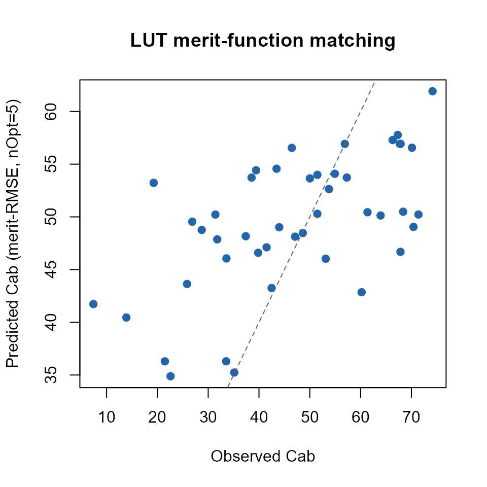
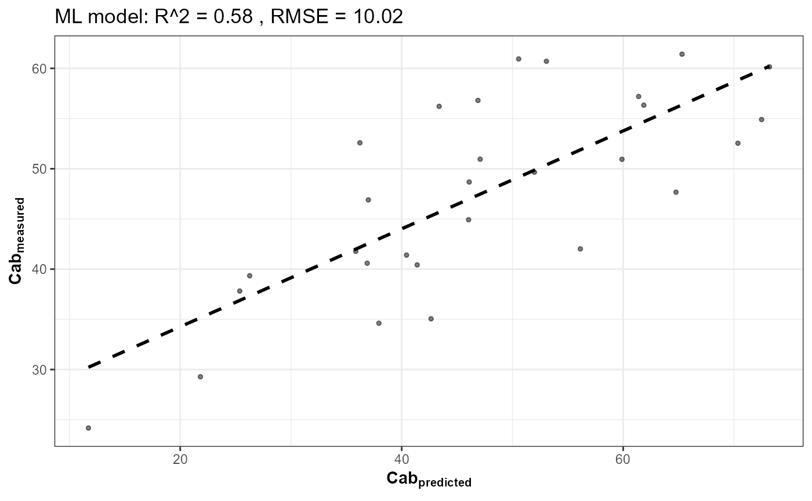

# Trait inversion: merit-function matching, ML, and deep learning

``` r

library(ToolsRTM)
```

## The problem: given a sensor spectrum, retrieve a trait

Every method on this page solves the same task – given ONLY the
sensor-band reflectance a satellite or field spectrometer would measure,
retrieve a biophysical trait (chlorophyll content, `Cab`, here) without
knowing the ground truth – but they get there in fundamentally different
ways:

- **[`get.inversionOpt()`](../reference/get.inversionOpt.md)** (this
  page’s main subject): no model is fit at all. It ranks every spectrum
  in a reference LUT by how closely it matches each observed spectrum
  under a chosen merit function, then averages the trait values of the
  `nOpt` best matches. Pure library search.
- **[`get.inversion()`](../reference/get.inversion.md)**: fits a
  statistical/ML model (Random Forest, PLSR, SVM, … 12 algorithms via
  `caret`) on a training LUT, then predicts on new spectra.
- **[`getMLmodel()`](../reference/getMLmodel.md)**: fits a deep-learning
  model (dense or 1D-CNN, via TensorFlow/Keras) on the same kind of
  data.

To compare them fairly, all three are evaluated on the exact same
held-out test spectra below.

## 1. Simulate a LUT and convolve to Sentinel-2A

``` r

n_samples <- 150
inputs <- ToolsRTM::inputsPROSAIL
LUT <- as.data.frame(getLUT(inputs = inputs, nLUT = n_samples, setseed = 1))

wl <- 400:2500
rsoil <- rep(0.15, length(wl))

refl <- t(sapply(seq_len(n_samples), function(i) {
  sim <- simulate_RTM(inputLUT = LUT[i, ], rsoil = rsoil,
                       leaf.model = "PROSPECT-PRO", canopy.model = "fourSAIL")
  sim$rsot
}))

refl_X <- as.data.frame(refl)
colnames(refl_X) <- paste0("X", wl)
refl_X <- cbind(id = seq_len(nrow(refl_X)), refl_X)

se2a <- get.spectra.convolved(rfl = refl_X, sensor = "Sentinel2a", plot.spectra = FALSE)
#> [1] "Spectral resampling function to SENTINEL2A is being processed ..."
#>   |                                                                              |                                                                      |   0%  |                                                                              |=====                                                                 |   8%  |                                                                              |===========                                                           |  15%  |                                                                              |================                                                      |  23%  |                                                                              |======================                                                |  31%  |                                                                              |===========================                                           |  38%  |                                                                              |================================                                      |  46%  |                                                                              |======================================                                |  54%  |                                                                              |===========================================                           |  62%  |                                                                              |================================================                      |  69%  |                                                                              |======================================================                |  77%  |                                                                              |===========================================================           |  85%  |                                                                              |=================================================================     |  92%  |                                                                              |======================================================================| 100%
wl_bands <- as.numeric(names(se2a)[-1])
band_names <- paste0("B", seq_along(wl_bands))
names(se2a) <- c("id", band_names)
```

150 simulated spectra, convolved down to Sentinel-2A’s 13 real bands –
this is what all three inversion methods below actually see, not the
native 1nm spectrum.

## 2. A train/test split, shared by every method

The same 70/30 split feeds
[`get.inversionOpt()`](../reference/get.inversionOpt.md) (as its
reference LUT vs. its “observed” test spectra),
[`get.inversion()`](../reference/get.inversion.md) (as training data vs.
prediction targets), and [`getMLmodel()`](../reference/getMLmodel.md) –
so the comparison at the end is apples-to-apples.

``` r

set.seed(1)
train_idx <- sample(seq_len(n_samples), size = round(0.7 * n_samples))
test_idx  <- setdiff(seq_len(n_samples), train_idx)

LUT_train <- LUT[train_idx, ]
LUT_test  <- LUT[test_idx, ]
se2a_mat  <- as.matrix(se2a[, band_names])
se2a_train_mat <- se2a_mat[train_idx, ]
se2a_test_mat  <- se2a_mat[test_idx, ]

train_df <- cbind(LUT_train, se2a[train_idx, band_names])
test_df  <- cbind(LUT_test,  se2a[test_idx,  band_names])

r2_f   <- function(obs, pred) 1 - sum((obs - pred)^2) / sum((obs - mean(obs))^2)
rmse_f <- function(obs, pred) sqrt(mean((obs - pred)^2))

cat("Train:", length(train_idx), "spectra. Test (held out):", length(test_idx), "spectra.\n")
#> Train: 105 spectra. Test (held out): 45 spectra.
```

## 3. `get.inversionOpt()`: LUT merit-function matching

`method` picks how “closeness” between two spectra is measured. `nOpt`
controls how many of the closest training spectra get averaged together
for the final trait estimate (`nOpt = 5` below – a compromise between a
single nearest neighbour, which is noisy, and averaging too many, which
smooths out real trait variation):

``` r

opt_rmse <- get.inversionOpt(rfl.sensor = se2a_test_mat, rfl.rtm = se2a_train_mat,
                              LUT = LUT_train, wave = wl_bands, method = "merit-RMSE", nOpt = 5)
opt_fge  <- get.inversionOpt(rfl.sensor = se2a_test_mat, rfl.rtm = se2a_train_mat,
                              LUT = LUT_train, wave = wl_bands, method = "merit-FGE", nOpt = 5)
opt_dwt  <- get.inversionOpt(rfl.sensor = se2a_test_mat, rfl.rtm = se2a_train_mat,
                              LUT = LUT_train, wave = wl_bands, method = "merit-DWT", nOpt = 5)
```

Each call returns a 2-element list: `[[1]]` (`rfl.b`) is the matched
reflectance itself, `[[2]]` (`LUT.best`) is the corresponding trait
table – including the merit-function’s own error value (`merit-RMSE`,
`merit-FGE`, …) and the `Cab` estimate we’re evaluating below:

``` r

opt_metrics <- data.frame(
  method = c("merit-RMSE", "merit-FGE", "merit-DWT"),
  R2   = c(r2_f(LUT_test$Cab, opt_rmse[[2]]$Cab), r2_f(LUT_test$Cab, opt_fge[[2]]$Cab), r2_f(LUT_test$Cab, opt_dwt[[2]]$Cab)),
  RMSE = c(rmse_f(LUT_test$Cab, opt_rmse[[2]]$Cab), rmse_f(LUT_test$Cab, opt_fge[[2]]$Cab), rmse_f(LUT_test$Cab, opt_dwt[[2]]$Cab))
)
knitr::kable(opt_metrics, digits = 3)
```

| method     |    R2 |   RMSE |
|:-----------|------:|-------:|
| merit-RMSE | 0.287 | 14.472 |
| merit-FGE  | 0.590 | 10.977 |
| merit-DWT  | 0.251 | 14.832 |

`merit-RMSE`/`merit-FGE` compare raw band reflectance; `merit-DWT`
compares each spectrum’s discrete wavelet transform coefficients instead
(sensitive to the overall shape of the spectrum rather than each band’s
exact value – can be more robust to band-to-band noise). `merit-NRMSE`,
`merit-MAE`, `merit-NMB` and `merit-1stD` (first-derivative matching,
more sensitive to absorption-feature position/shape than absolute
reflectance) are the remaining built-in options; `custom_stat` accepts
your own `function(sim, obs)` returning a single error value in place of
any of them.

``` r

plot(LUT_test$Cab, opt_rmse[[2]]$Cab, pch = 19, col = "#2166AC",
     xlab = "Observed Cab", ylab = "Predicted Cab (merit-RMSE, nOpt=5)",
     main = "LUT merit-function matching")
abline(0, 1, col = "grey40", lty = 2)
```



## 4. `get.inversion()`: machine learning (Random Forest)

Same train/test split, but now a model is actually fit on `train_df`
first, then applied to `test_df` – no per-observation LUT search at
prediction time:

``` r

ml_res <- get.inversion(data = train_df, depVar = "Cab", inputs = band_names,
                         algorithm = "RF", n.samples = nrow(train_df), seed = 42)
```



``` r

pred_ml_test <- as.numeric(predict(ml_res$model, newdata = test_df[, c("Cab", band_names)]))
```

``` r

cat("ML (RF)  R2:", round(r2_f(LUT_test$Cab, pred_ml_test), 3),
    " RMSE:", round(rmse_f(LUT_test$Cab, pred_ml_test), 3), "\n")
#> ML (RF)  R2: 0.715  RMSE: 9.145
```

`algorithm = "RF"` can be swapped for any of
[`get.inversion()`](../reference/get.inversion.md)’s 12 supported values
(`"PLSR"`, `"SVM"`, `"GB"`, `"NN"`, `"Bayesian"`, `"AdaBag"`, `"BRNN"`,
`"xGB"`, `"RVM"`, `"qLASSO"`, `"Ensemble"`) – the rest of the call is
identical.

## 5. `getMLmodel()`: deep learning (TensorFlow/Keras)

Needs a working Python/TensorFlow/tf-keras stack reachable through
`reticulate` – genuinely machine-specific setup (see
`ToolsRTM_PROSAIL_tutorial.Rmd`’s “Deep learning” section for the full
install sequence), so this is wrapped in
[`tryCatch()`](https://rdrr.io/r/base/conditions.html) to keep the rest
of this vignette buildable on a machine without that stack configured,
while still showing the real, correct calling code:

``` r

dl_result <- tryCatch({
  Sys.setenv(TF_USE_LEGACY_KERAS = "1")
  library(reticulate); library(keras)
  dl_model <- getMLmodel(dataset = train_df, depVar = "Cab", model = "Hidden-layers",
                          optimizer = "adam", n.epochs = 5)
  list(ok = TRUE, model = dl_model)
}, error = function(e) list(ok = FALSE, msg = conditionMessage(e)))
#> [1] "Normalize"

if (dl_result$ok) {
  cat("DL model trained. Final training loss:",
      round(tail(dl_result$model$history$metrics$loss, 1), 3), "\n")
} else {
  first_line <- strsplit(dl_result$msg, "\n", fixed = TRUE)[[1]][1]
  cat("Skipped -- no working Python/TensorFlow/tf-keras stack reachable through",
      "reticulate on this machine (", first_line, "). The calling code above is",
      "correct and unchanged; see ToolsRTM_PROSAIL_tutorial.Rmd for setup.\n")
}
#> Skipped -- no working Python/TensorFlow/tf-keras stack reachable through reticulate on this machine ( infinite or missing values in 'x' ). The calling code above is correct and unchanged; see ToolsRTM_PROSAIL_tutorial.Rmd for setup.
```

## 6. Which one should you use?

| Method | Needs training? | Handles a small LUT well? | Typical use |
|----|----|----|----|
| [`get.inversionOpt()`](../reference/get.inversionOpt.md) (merit-function) | No – pure search | Yes – works from a handful of reference spectra | Quick, physically-grounded retrieval; no ML infrastructure needed |
| [`get.inversion()`](../reference/get.inversion.md) (classic ML) | Yes | Needs enough rows to fit reliably (hundreds+) | Production-scale retrieval, many predictors (e.g. full spectrum + indices) |
| [`getMLmodel()`](../reference/getMLmodel.md) (deep learning) | Yes, more data-hungry | No – needs thousands of rows | Large training sets, CNN over the full spectral shape |

All three were run on the exact same held-out Sentinel-2A test spectra
above – see Sections 3-4 for their actual R²/RMSE on this LUT (deep
learning’s result, when the optional TensorFlow stack is available,
prints its own training loss above rather than a directly comparable
R²/RMSE, since 5 epochs on 105 training rows is a smoke-test, not a
tuned model).
