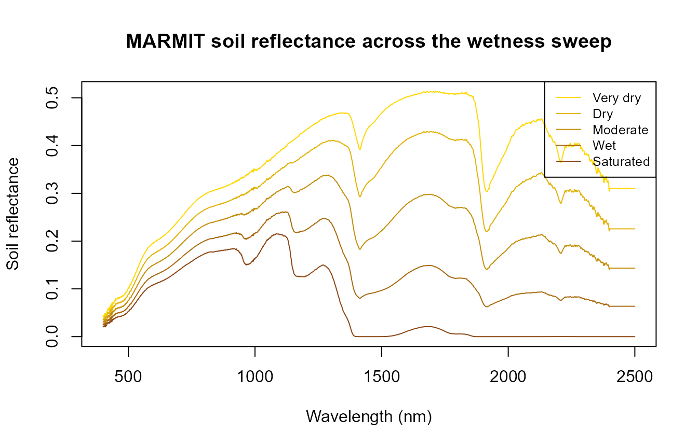
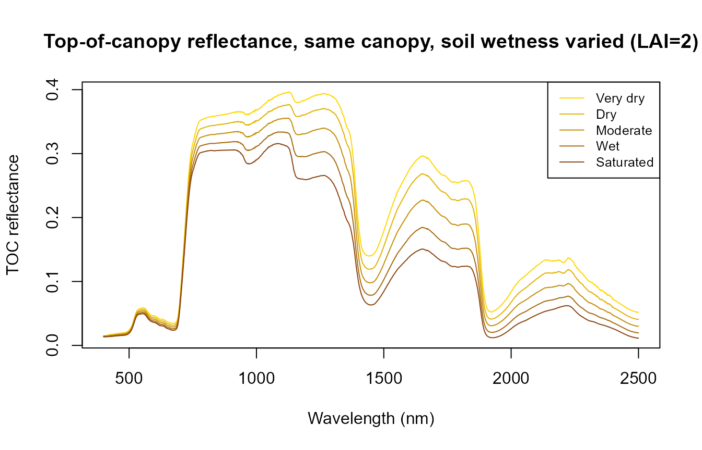
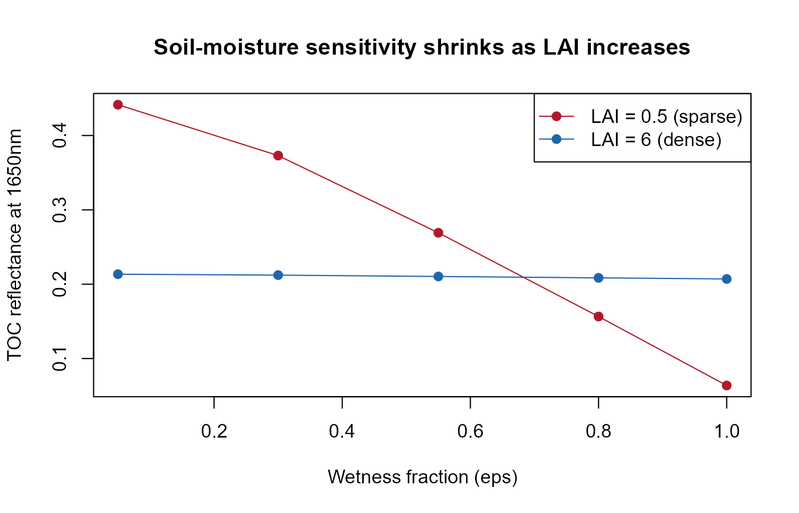

# MARMIT + PROSAIL: realistic soil moisture in canopy simulations

``` r

library(ToolsRTM)
```

## Why soil matters to a canopy simulation

Top-of-canopy reflectance is a mixture of leaf optics and the soil
background showing through the canopy gaps, weighted by how closed the
canopy is (LAI, leaf angle, hotspot). Most examples elsewhere in this
package’s docs use a fixed, arbitrary `rsoil` – e.g. a 50/50 blend of a
dry and wet reference spectrum (`How-in-R.Rmd`), or a flat
`rep(0.15, 2101)` (the ToolsRTM vignette, `InversionOpt.Rmd`). That’s
fine for isolating a leaf/canopy trait’s own effect, but it sidesteps a
real question: **how much does the soil’s actual moisture state change
what a sensor sees, and does that depend on how much vegetation is
covering it?**

[`ToolsRTM::get.marmit.rsoil()`](../reference/get.marmit.rsoil.md)
(MARMIT: Bablet et al., soil reflectance as a function of surface water
film thickness) gives a physically-based answer instead of an arbitrary
blend – this page feeds its output straight into
[`foursail()`](../reference/foursail.md)’s own `rsoil` argument.

## 1. A soil-wetness sweep with MARMIT

`L` (water film thickness, cm) and `eps` (fraction of the surface that’s
wet) control how wet the simulated soil is –
`Scripts/R/ForMARMIT/1-simulate_LUT.R` samples `L` from `[0.001, 0.15]`
and `eps` from `[0, 1]` for a full LUT; here, five fixed steps across
that range are enough to see the trend:

``` r

wetness_steps <- data.frame(
  label = c("Very dry", "Dry", "Moderate", "Wet", "Saturated"),
  L     = c(0.001, 0.02, 0.05, 0.09, 0.15),
  eps   = c(0.05,  0.3,  0.55, 0.8,  1.0)
)

soils <- lapply(seq_len(nrow(wetness_steps)), function(i) {
  get.marmit.rsoil(database = "Bablet_2016", id = 1, L = wetness_steps$L[i],
                    eps = wetness_steps$eps[i], wl.out = 400:2500)
})

cat("Estimated soil moisture (SMC, %) across the sweep:\n")
#> Estimated soil moisture (SMC, %) across the sweep:
print(round(sapply(soils, function(s) s$SMC), 1))
#> [1]  3.8  9.6 43.6 47.1 47.1
```

``` r

wl <- soils[[1]]$wavelength
cols <- colorRampPalette(c("gold", "saddlebrown"))(nrow(wetness_steps))
matplot(wl, sapply(soils, function(s) s$rsoil.wet), type = "l", lty = 1, col = cols,
        xlab = "Wavelength (nm)", ylab = "Soil reflectance",
        main = "MARMIT soil reflectance across the wetness sweep")
legend("topright", wetness_steps$label, col = cols, lty = 1, cex = 0.8)
```



Soil reflectance darkens broadly with wetness (as real wet soil looks
darker than dry soil), with the strongest relative change in the SWIR
water-absorption region – the same physics MARMIT is built around.

## 2. Feeding it into `foursail()` at a fixed canopy

Same leaf/canopy trait set throughout (`LAI = 2`, a moderate canopy),
only `rsoil` changes across the five wetness steps:

``` r

row <- data.frame(
  LAI = 2, hspot = 0.01, LIDFa = -0.35, LIDFb = -0.15, TypeLidf = 1,
  tts = 30, tto = 0, psi = 0,
  N = 1.5, Cab = 40, Car = 8, Anth = 2, Cbrown = 0, EWT = 0.009, LMA = 0.009, alpha = 40
)

toc_by_soil <- sapply(soils, function(s) {
  sail_i <- foursail(inputLUT = row, rsoil = s$rsoil.wet, LeafModel = "PROSPECT-D")
  Compute_BRF(rdot = sail_i$rdot, rsot = sail_i$rsot, tts = row$tts, data.light = dataSpec_PDB)
})

matplot(dataSpec_PDB[, 1], toc_by_soil, type = "l", lty = 1, col = cols,
        xlab = "Wavelength (nm)", ylab = "TOC reflectance",
        main = "Top-of-canopy reflectance, same canopy, soil wetness varied (LAI=2)")
legend("topright", wetness_steps$label, col = cols, lty = 1, cex = 0.8)
```



The canopy’s own spectral shape (chlorophyll absorption, red edge, NIR
plateau) stays recognizable throughout – but the SWIR bands still shift
noticeably with soil moisture alone, nothing about the vegetation itself
changed between these five curves.

## 3. Does this matter more at low LAI than high LAI?

Physically, yes: a sparse canopy leaves more soil visible through the
gaps, so soil moisture should influence the sensor-observed signal more
at low LAI than at high LAI, where the canopy itself dominates. Repeat
the same sweep at `LAI = 0.5` (sparse) and `LAI = 6` (dense), and
compare the driest-vs-wettest difference at a SWIR band (1650nm, in
MARMIT’s strongest water-sensitive region):

``` r

swir_idx <- which(dataSpec_PDB[, 1] == 1650)

toc_by_lai <- function(lai) {
  row_i <- row; row_i$LAI <- lai
  sapply(soils, function(s) {
    sail_i <- foursail(inputLUT = row_i, rsoil = s$rsoil.wet, LeafModel = "PROSPECT-D")
    Compute_BRF(rdot = sail_i$rdot, rsot = sail_i$rsot, tts = row_i$tts, data.light = dataSpec_PDB)[swir_idx]
  })
}

refl_sparse <- toc_by_lai(0.5)
refl_dense  <- toc_by_lai(6)

cat("SWIR (1650nm) reflectance, driest vs. wettest soil:\n")
#> SWIR (1650nm) reflectance, driest vs. wettest soil:
cat("  Sparse canopy (LAI=0.5): ", round(refl_sparse[1], 4), "->", round(refl_sparse[5], 4),
    " (delta =", round(refl_sparse[1] - refl_sparse[5], 4), ")\n")
#>   Sparse canopy (LAI=0.5):  0.4415 -> 0.0637  (delta = 0.3777 )
cat("  Dense canopy  (LAI=6):   ", round(refl_dense[1], 4),  "->", round(refl_dense[5], 4),
    " (delta =", round(refl_dense[1] - refl_dense[5], 4), ")\n")
#>   Dense canopy  (LAI=6):    0.2134 -> 0.2071  (delta = 0.0064 )
```

``` r

plot(wetness_steps$eps, refl_sparse, type = "o", pch = 19, col = "#B2182B",
     ylim = range(c(refl_sparse, refl_dense)),
     xlab = "Wetness fraction (eps)", ylab = "TOC reflectance at 1650nm",
     main = "Soil-moisture sensitivity shrinks as LAI increases")
lines(wetness_steps$eps, refl_dense, type = "o", pch = 19, col = "#2166AC")
legend("topright", c("LAI = 0.5 (sparse)", "LAI = 6 (dense)"), col = c("#B2182B", "#2166AC"), pch = 19, lty = 1)
```



The sparse canopy’s SWIR reflectance swings much more across the wetness
sweep than the dense canopy’s – a real, physically-expected result, not
an artifact of the sweep: at LAI=6 the canopy itself blocks most of the
soil signal regardless of how wet it is underneath.

## Practical note

For a real LUT-based inversion or sensitivity study, this suggests: if
your target trait is canopy structure/LAI, a fixed `rsoil` may be fine
(soil influence is naturally small once the canopy closes). If your
study covers sparse/senescent vegetation, semi-arid areas, or
early-season crops – where LAI is often below 1-2 – sample `rsoil` from
[`get.marmit.rsoil()`](../reference/get.marmit.rsoil.md) across a
realistic moisture range (as in `Scripts/R/ForMARMIT/1-simulate_LUT.R`)
rather than fixing it, so soil moisture variation doesn’t get silently
absorbed into the trait estimates.
`Scripts/R/Pipeline/0-integrate_MARMIT_soil.R` shows the same
[`get.marmit.rsoil()`](../reference/get.marmit.rsoil.md) output wired
into [`foursail2()`](../reference/foursail2.md),
[`inform()`](../reference/inform.md) and
[`SPART()`](../reference/SPART.md) as well, for the other canopy/TOA
models this package supports.
