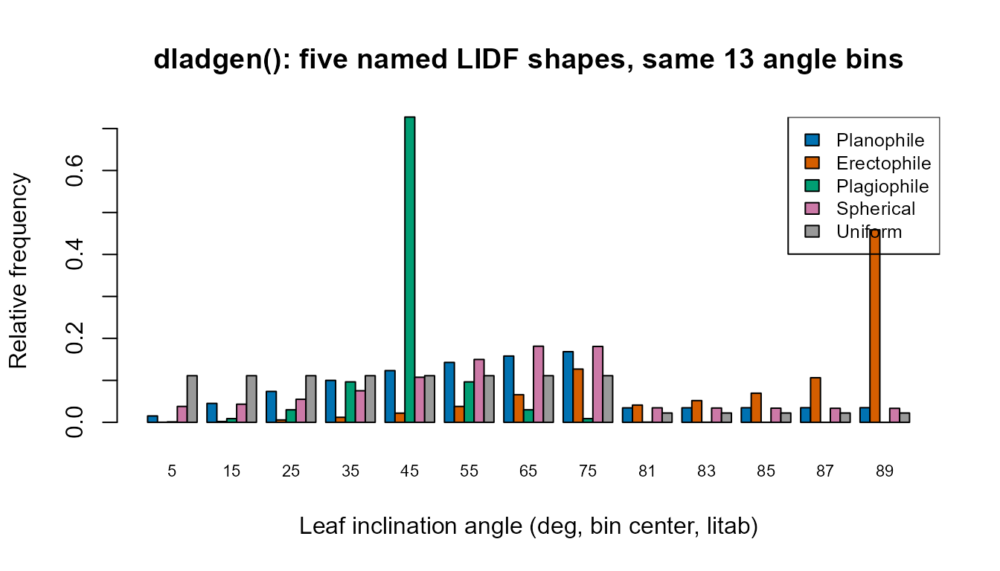

# Parameter & Trait Glossary

``` r

library(ToolsRTM)
```

Every tutorial in this package passes trait values into a leaf, canopy,
soil, or atmosphere model without stopping to explain what each one
physically means or what a realistic value looks like. This page is that
stop: one place with every input’s meaning, units, typical range, and
which model(s) actually use it. It’s a reference to come back to, not a
tutorial to read start to finish.

## 1. Leaf traits

All five leaf models (`prospect_D` – bundled inside
`foursail(..., LeafModel = "PROSPECT-D")`,
[`prospect_PRO()`](../reference/prospect_PRO.md),
[`liberty()`](../reference/liberty.md),
[`getFluspect.B()`](../reference/getFluspect.B.md),
[`getFluspect.Cx()`](../reference/getFluspect.Cx.md)) build on the same
PROSPECT physics: a leaf is treated as a stack of absorbing/scattering
plates, and each trait below is one absorbing constituent (a pigment,
water, dry matter) or one structural parameter of that stack.

| Symbol | Meaning | Units | Typical range | Used by |
|----|----|----|----|----|
| `N` | Leaf structure parameter – effective number of compound-leaf “plates” the PROSPECT mesophyll model integrates over. Higher `N` = more internal scattering = higher NIR reflectance/transmittance, independent of any pigment. | unitless | 1 – 3 (rarely up to 4.5) | PROSPECT-D, PROSPECT-PRO, Fluspect-B/Cx |
| `Cab` | Chlorophyll a+b content. The single strongest driver of visible-light (400-700nm) absorption – healthy green leaves sit high in this range, senescent/stressed leaves low. | ug/cm2 | 0 – 100 (20-80 typical for healthy vegetation) | PROSPECT-D, PROSPECT-PRO, Fluspect-B/Cx |
| `Car` | Carotenoid content (mostly xanthophylls + beta-carotene). Absorbs alongside `Cab` in the blue/green, becomes visually dominant only once `Cab` drops (autumn colours). | ug/cm2 | 0 – 25 | PROSPECT-D, PROSPECT-PRO, Fluspect-B/Cx |
| `Anth` | Anthocyanin content. Usually near zero in healthy green leaves; rises under stress or senescence and adds a distinct absorption feature around 550nm. | ug/cm2 | 0 – 40 (0 – ~7 for typical crop canopies) | PROSPECT-D, PROSPECT-PRO |
| `Cbrown` | Brown-pigment absorption coefficient – a lumped, unitless proxy for senescent/degraded material, not a physical concentration. | unitless (0-1 absorption coeff.) | 0 (green, healthy) – 1 (fully senescent) | PROSPECT-D, PROSPECT-PRO |
| `EWT` (also `Cw`) | Equivalent water thickness – the water column each unit leaf area would form if spread into a uniform film. Drives the SWIR water-absorption features (~1450/1940/2500nm). | cm (equivalent to g/cm2) | 0.002 – 0.05 (0.01-0.02 typical) | PROSPECT-D, PROSPECT-PRO, Fluspect-B/Cx, Liberty |
| `LMA` (also `Cm`) | Leaf mass per area – total dry matter content, lumping cellulose, lignin, protein and everything else that isn’t water or pigment. Drives the flatter SWIR dry-matter absorption. | g/cm2 | 0.002 – 0.02 | PROSPECT-D, Fluspect-B/Cx |
| `alpha` | Leaf-air interface incidence-angle parameter used in the Fresnel-refraction (Stern-Gershun/Allen) part of the PROSPECT solution – not a trait of the leaf’s biochemistry, a geometric-optics constant of the model itself. | degrees | fixed at 40 in virtually all published PROSPECT work | PROSPECT-D, PROSPECT-PRO, Fluspect-B/Cx |
| `Prot` | Protein content – one of the two constituents PROSPECT-PRO splits out of `LMA`. | g/cm2 | 0 – 0.01 | PROSPECT-PRO |
| `CBC` | Carbon-based constituents (cellulose + lignin) – the other constituent PROSPECT-PRO splits out of `LMA`. | g/cm2 | 0 – 0.02 | PROSPECT-PRO |
| `Cs` | Senescent-material absorption coefficient (Fluspect’s own, separate from PROSPECT’s `Cbrown`). | unitless (0-1) | 0 (fresh) – 1 | Fluspect-B, Fluspect-Cx |
| `Cx` | Xanthophyll de-epoxidation state – the violaxanthin-to-zeaxanthin conversion fraction (the photoprotective NPQ pigment pool). `Cx = 0` is fully violaxanthin (relaxed), `Cx = 1` is fully zeaxanthin (photoprotecting). | unitless (0-1) | 0 – 1 | Fluspect-Cx |
| `fqe` | Fluorescence quantum efficiency – how much of absorbed PAR is re-emitted as chlorophyll fluorescence rather than used photochemically or dissipated as heat. | unitless | ~0.01 typical default | Fluspect-B, Fluspect-Cx |

`PROSPECT-PRO` and plain `LMA`-based models (`PROSPECT-D`, Fluspect) are
mutually exclusive dry-matter parameterizations of the *same* leaf –
supplying both `LMA` and non-zero `Prot`/`CBC` in one
[`foursail()`](../reference/foursail.md) LUT row is a modelling choice,
not something the package validates for you
([`getMLmodel()`](../reference/getMLmodel.md)’s R version silently keeps
whichever the leaf-model branch you called actually reads).

### 1.1 LIBERTY-only structural traits

[`liberty()`](../reference/liberty.md) targets conifer needles, not
broadleaves, and needs a different structural parameterization – no
`N`/`alpha` Fresnel-optics layer, but explicit cell geometry instead:

| Symbol | Meaning | Units | Typical range |
|----|----|----|----|
| `cell.d` | Average mesophyll cell diameter. | um | 20 – 60 |
| `inter.c` | Intercellular air-space fraction – controls internal scattering, the needle analogue of PROSPECT’s `N`. | unitless (0-1) | 0.03 – 0.06 |
| `baseline.abs` | Baseline (wavelength-flat) absorption coefficient, a small residual-absorption term. | unitless | ~0.0005 – 0.001 |
| `leaf.thick` | Needle thickness. | relative units (model-internal scale, not mm) | 1 – 2 |
| `albino.abs` | Extra absorption for albino/depigmented tissue – 0 for a normal green needle. | unitless | 0 (typical) |
| `lign.cell` | Lignin+cellulose cell-wall absorption term (LIBERTY’s own dry-matter proxy, distinct from PROSPECT’s `LMA`/`CBC`). | unitless | 1 – 3 |
| `Nitrogen` | Foliar nitrogen content, scaling protein-related absorption. | relative units | ~1 (typical default) |

## 2. Canopy structure and viewing geometry

Once a leaf model produces reflectance/transmittance,
[`foursail()`](../reference/foursail.md),
[`foursail2()`](../reference/foursail2.md), and
[`inform()`](../reference/inform.md) turn it into a canopy-level BRF.
All three share the leaf-angle-distribution and geometry parameters
below; [`foursail2()`](../reference/foursail2.md) and
[`inform()`](../reference/inform.md) each add their own extra layer of
structure.

| Symbol | Meaning | Units | Typical range | Used by |
|----|----|----|----|----|
| `LAI` | Leaf area index – total one-sided leaf area per unit ground area. The single strongest canopy-level driver of NIR-plateau height and visible-band saturation. | m2/m2 | 0.1 – 8 (0 = bare soil) | foursail, foursail2, inform |
| `LIDFa`, `LIDFb` | Leaf inclination distribution function shape parameters (Verhoef 1998’s two-parameter system, `TypeLidf = 1`). `LIDFa` mainly sets the *average* leaf angle (from -1 = horizontal/planophile to +1 = vertical/erectophile); `LIDFb` adjusts the distribution’s bimodality/spread. See Section 3 for the canonical named shapes. | unitless, each in \[-1, 1\] | see Section 3 table | foursail, foursail2, inform |
| `TypeLidf` | Which LIDF parameterization `LIDFa`/`LIDFb` are read as: `1` = Verhoef’s two-parameter system (Section 3); `2` = ellipsoidal, in which case `LIDFa` alone is the mean leaf angle in **degrees** (0-90) and `LIDFb` is ignored. | `1` or `2` | – | foursail, foursail2, inform |
| `hspot` | Hot-spot size parameter – leaf width divided by canopy height, controlling how sharply reflectance peaks when the sun and viewer are aligned (no visible shadows). | unitless | 0.01 – 0.5 | foursail, foursail2, inform |
| `tts` | Sun zenith angle. | degrees | 0 – 90 | foursail, foursail2, inform, spart |
| `tto` | View (sensor) zenith angle. | degrees | 0 – 90 (0 = nadir) | foursail, foursail2, inform, spart |
| `psi` | Relative azimuth between sun and viewer. | degrees | 0 – 180 | foursail, foursail2, inform, spart |

### 2.1 `foursail2()`-only: two-layer (green + brown) canopy

| Symbol | Meaning | Units | Typical range |
|----|----|----|----|
| `fraction_brown` | Fraction of total LAI that is the brown/senescent layer rather than the green layer (each layer can carry its own leaf traits). | unitless (0-1) | 0 – 1 |
| `diss` | Dissociation factor between the two layers’ vertical distributions – how much the green and brown layers overlap vs. separate vertically. | unitless | 0 – 1 |
| `Cv` | Vertical clumping/coverage factor for the canopy. | unitless | ~0.2 – 5 |
| `Zeta` | Structure factor controlling the relative vertical placement of the two layers. | unitless | 0 – 1 |

### 2.2 `inform()`-only: explicit forest-stand geometry

| Symbol | Meaning | Units | Typical range |
|----|----|----|----|
| `LAIu` | Understorey LAI – the ground-layer vegetation beneath the tree crowns, modelled with its own (implicit) fourSAIL run. | m2/m2 | 0 – 3 |
| `sd` | Stem density – trees per unit ground area. | trees/ha (model-internal count) | 200 – 1500 |
| `cd` | Crown diameter. | m | 2 – 10 |
| `h` | Tree height. | m | 5 – 30 |
| `skyl` | Diffuse-light fraction of total incoming irradiance. | unitless (0-1) | ~0.1 (typical clear-sky default) |

[`inform()`](../reference/inform.md)’s canopy-level `LAI` is the
**overstorey** (tree-crown) LAI only – `LAIu` is added as a separate,
independently-varying understorey term, not a component subtracted from
`LAI`.

## 3. Named leaf-angle distributions

`LIDFa`/`LIDFb` rarely need to be hand-tuned: six canonical shapes cover
most real canopies (from [`dladgen()`](../reference/dladgen.md)’s own
documentation, `TypeLidf = 1`):

| Name | `LIDFa` | `LIDFb` | Typical canopy |
|----|----|----|----|
| Planophile | 1 | 0 | Mostly horizontal leaves (many crops, grasses) |
| Erectophile | -1 | 0 | Mostly vertical leaves (some grasses, conifers) |
| Plagiophile | 0 | -1 | Mostly oblique (~45 deg) leaves |
| Extremophile | 0 | 1 | Bimodal horizontal+vertical mix |
| Spherical | -0.35 | -0.15 | Leaf angles distributed as if on a sphere – the most common “no strong prior” default, and this package’s own `common_lut` default in the tutorials |
| Uniform | 0 | 0 | All angles equally likely |

``` r

shapes <- list(Planophile = c(1, 0), Erectophile = c(-1, 0),
               Plagiophile = c(0, -1), Spherical = c(-0.35, -0.15),
               Uniform = c(0, 0))
lidf_result <- lapply(shapes, function(ab) dladgen(ab[1], ab[2]))
angles <- lidf_result[[1]]$litab
lidf_freq <- sapply(lidf_result, function(x) x$lidf)

barplot(t(lidf_freq), beside = TRUE, names.arg = angles,
        col = c("#0072B2", "#D55E00", "#009E73", "#CC79A7", "#999999"),
        xlab = "Leaf inclination angle (deg, bin center, litab)", ylab = "Relative frequency",
        main = "dladgen(): five named LIDF shapes, same 13 angle bins", cex.names = 0.7)
legend("topright", names(shapes),
       fill = c("#0072B2", "#D55E00", "#009E73", "#CC79A7", "#999999"), cex = 0.8)
```



Planophile concentrates mass at low angles (horizontal leaves),
erectophile at high angles (vertical leaves), and spherical spreads
smoothly across the whole range – exactly the qualitative behaviour the
names promise.

## 4. Soil: MARMIT (dry -\> wet)

[`get.marmit.rsoil()`](../reference/get.marmit.rsoil.md) turns a dry
reference soil spectrum into a wet one (Tutorial 03’s soil-brightness
section, Tutorial 16 in full):

| Symbol | Meaning | Units | Typical range |
|----|----|----|----|
| `id` / `soil_id` | Which dry reference spectrum to start from, from a bundled soil-spectral-library database (e.g. `"Bablet_2016"`). | integer index | database-dependent |
| `L` | Water-film optical thickness – how much liquid water coats the soil surface. `L` near 0 is dry; larger `L` is wetter. | cm (thin-film optical path) | 0.001 (dry) – 0.15+ (wet) |
| `eps` | Soil surface roughness/optical-path parameter modulating how the water film scatters light. | unitless | 0.05 (dry/smooth) – 1.0 (wet/rough) |

## 5. Soil + atmosphere: SPART (BSM soil, SMAC atmosphere)

[`SPART()`](../reference/SPART.md)/`spart_toa()`-family functions
(Tutorial 03) use a different soil parameterization (BSM,
Brightness-Shape-Moisture) plus an atmospheric-correction layer (SMAC)
that plain [`foursail()`](../reference/foursail.md) doesn’t need:

| Symbol | Meaning | Units | Typical range |
|----|----|----|----|
| `BSMBrightness` | Overall soil brightness (scales the whole dry-soil spectrum up/down). | unitless | 0.3 – 0.9 |
| `BSMlat` | Soil spectral-shape “latitude” – a BSM-specific empirical shape parameter (not a geographic coordinate), typically 20-40. | degrees (empirical, not geographic) | 20 – 40 |
| `BSMlon` | Soil spectral-shape “longitude” – likewise empirical, not geographic. | degrees (empirical, not geographic) | 45 – 65 |
| `SMp` | Soil moisture, volume percentage. | % | 5 – 55 |
| `SMC` | Soil moisture capacity (field-capacity-like scaling constant). | % | ~25 (recommended default) |
| `film` | Effective optical thickness of a single water film (BSM’s own wetting-physics analogue of MARMIT’s `L`). | cm | ~0.015 (recommended default) |
| `Pa` | Atmospheric pressure at the surface. | hPa | ~900 – 1030 (~1000 sea-level default) |
| `aot550` | Aerosol optical thickness at 550nm – how hazy the atmosphere is. | unitless | 0.05 (clear) – 0.5+ (hazy) |
| `uo3` | Total-column ozone amount. | atm-cm | ~0.3 – 0.4 |
| `uh2o` | Total-column water vapour amount. | g/cm2 | ~1 – 3 |

## 6. Which models actually read which leaf/canopy inputs

A single glance at which of this page’s traits feed which function –
useful when assembling one LUT row meant to drive several models at once
(Tutorial 02’s `common_lut` pattern):

| Trait | PROSPECT-D | PROSPECT-PRO | Liberty | Fluspect-B/Cx | foursail2 | inform |
|:---|:--:|:--:|:--:|:--:|:--:|:--:|
| N | x | x |  | x | x | x |
| Cab | x | x | x | x | x | x |
| Car | x | x |  | x | x | x |
| Anth | x | x |  |  | x | x |
| Cbrown | x | x |  |  | x | x |
| EWT | x | x | x | x | x | x |
| LMA | x |  |  | x | x | x |
| alpha | x | x |  | x | x | x |
| Prot |  | x |  |  |  |  |
| CBC |  | x |  |  |  |  |
| Cs |  |  |  | x |  |  |
| Cx |  |  |  | x |  |  |
| fqe |  |  |  | x |  |  |
| LIDFa/LIDFb/TypeLidf | x | x | x | x | x | x |
| LAI | x | x | x | x | x | x |
| hspot | x | x | x | x | x | x |
| tts/tto/psi | x | x | x | x | x | x |
| fraction_brown/diss/Cv/Zeta |  |  |  |  | x |  |
| LAIu/sd/cd/h/skyl |  |  |  |  |  | x |

(`Prot`/`CBC` only apply when the leaf model actually reads
PROSPECT-PRO’s split; a row that supplies both `LMA` and `Prot`/`CBC`
still works, but only one pathway is actually used depending on which
leaf model the canopy call was configured with.)

## What’s next

- **Tutorial 01/02** – see these traits in action, one leaf model and
  one canopy model at a time, then all five leaf models x three canopy
  models together.
- **Tutorial 03** – SPART/BSM/SMAC soil and atmosphere parameters, end
  to end.
- **Tutorial 16** – MARMIT wet-vs-dry soil, coupled into a full canopy
  simulation.
- **Tutorial 10** – formal sensitivity analysis: which of these traits
  actually matters most, and where in the spectrum.
- For SCOPE’s own (larger) trait set – adding photosynthesis,
  fluorescence, and energy-balance variables on top of everything here –
  see SCOPEinR’s own [Trait & LUT
  Glossary](../../scopeinr/articles/trait-glossary.md).
