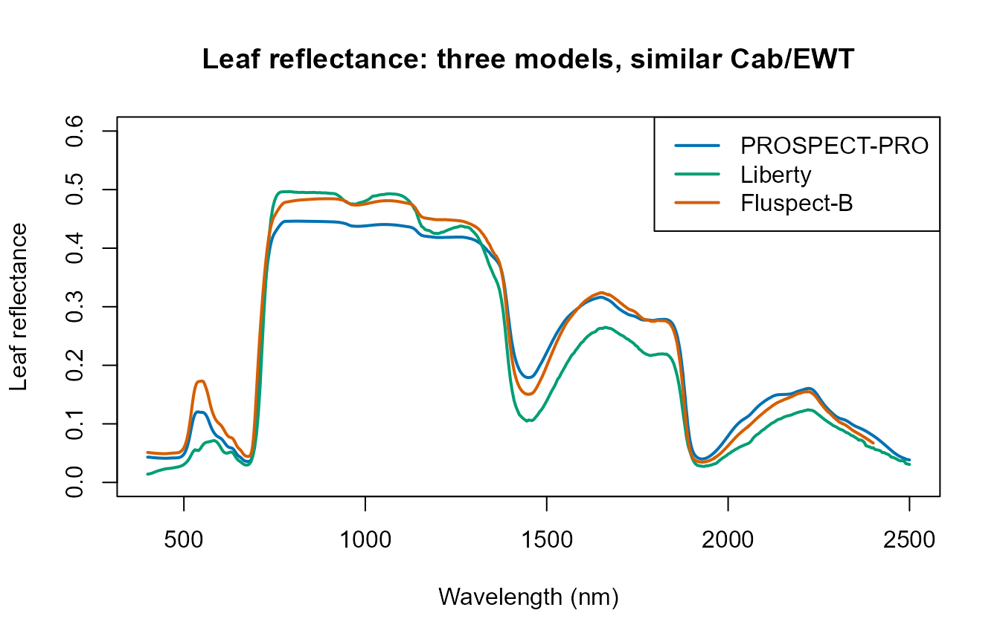
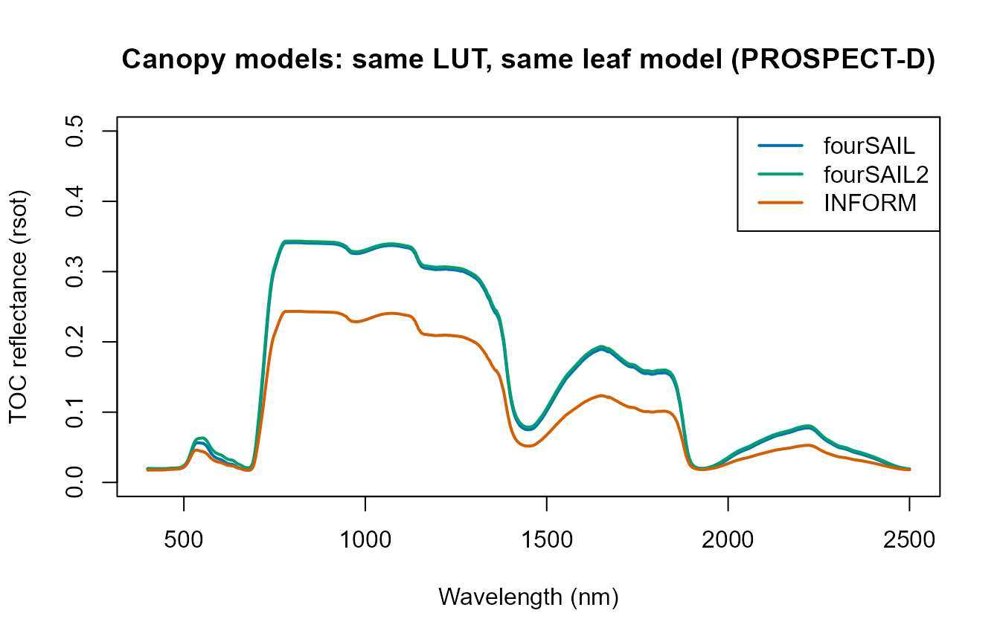
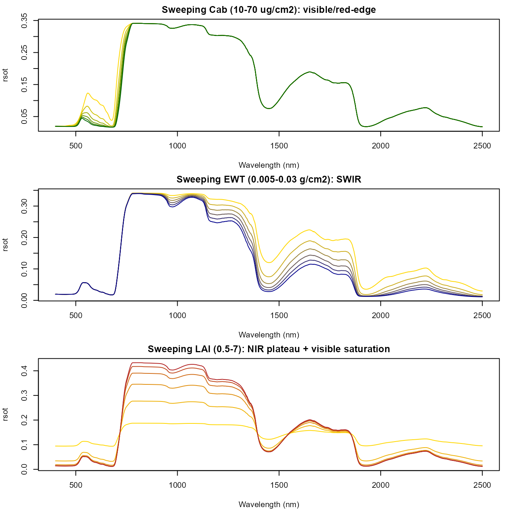

# 02. From Leaf to Canopy Reflectance

``` r

library(ToolsRTM)
```

Tutorial 01 ran ONE leaf model through ONE canopy model. This page opens
both boxes: every leaf model this package implements, every canopy
model, and how a trait change at the leaf level propagates to a change
at the canopy level.

``` text
Leaf biochemical/structural parameters
              |
              v
          Leaf RTM
              |
              v
       Reflectance (rho)
       Transmittance (tau)


Leaf rho / tau
    +
Canopy structure
    +
Sun-view geometry
        |
        v
    Canopy RTM
        |
        v
   Top-of-canopy BRF
```

## 1. Leaf radiative transfer: five models, called standalone

`ToolsRTM` implements five leaf models. Three are exported as standalone
functions (leaf-level only, no canopy); `PROSPECT-D` is only available
bundled inside a canopy call (`foursail(..., LeafModel = "PROSPECT-D")`,
Section 2 below) – a real asymmetry in the package’s exported API worth
knowing rather than guessing past.

| Model | Standalone call | Spectral domain | What it adds over PROSPECT-D |
|----|----|----|----|
| [`prospect_PRO()`](../reference/prospect_PRO.md) | `prospect_PRO(N, Cab, Car, Anth, Cbrown, EWT, LMA, alpha, Prot, CBC)` | 400-2500nm | Splits dry matter into `Prot` (protein) + `CBC` (carbon-based constituents) instead of one `LMA` |
| `liberty(inputLUT)` | one-row `data.frame` in, list out | 400-2500nm (`nwl=420` internally, returned at 2101 points same as PROSPECT) | Built for conifer needles, not broadleaf – cell diameter, intercellular air space, lignin/cellulose |
| `getFluspect.B(inputsLeaf, inputsOptipar, version)` | one-row `data.frame` in | 400-2400nm (2001 points – shorter than PROSPECT’s 2101) | Adds fluorescence emission matrices (`MbI`/`MbII`), needed for SIF |
| `getFluspect.Cx(inputsLeaf, inputsOptipar)` | one-row `data.frame` in | 400-2400nm | Fluspect-B plus a Cx (zeaxanthin/violaxanthin) term |
| PROSPECT-D | only via `foursail(..., LeafModel = "PROSPECT-D")` | 400-2500nm | The reference; standalone leaf-only call not exported |

``` r

pro <- prospect_PRO(N = 1.5, Cab = 40, Car = 8, Anth = 2, Cbrown = 0,
                     EWT = 0.009, LMA = 0.009, alpha = 40, Prot = 0.002, CBC = 0.007)

lib_row <- data.frame(Cab = 40, EWT = 0.009, lign.cell = 2, Nitrogen = 1,
                       cell.d = 40, inter.c = 0.045, baseline.abs = 0.0006,
                       leaf.thick = 1.6, albino.abs = 0)
lib <- liberty(lib_row)

flu_row <- data.frame(N = 1.8, Cab = 40, Car = 10, Anth = 0, EWT = 0.015,
                       LMA = 0.01, Cs = 0.1, fqe = 0.01, Cx = 0, alpha = 40)
flu <- getFluspect.B(inputsLeaf = flu_row, inputsOptipar = ToolsRTM::optipar, version = "D")

plot(pro$lambda, pro$refl, type = "l", col = "#0072B2", lwd = 2, ylim = c(0, 0.6),
     xlab = "Wavelength (nm)", ylab = "Leaf reflectance",
     main = "Leaf reflectance: three models, similar Cab/EWT")
lines(lib$lambda, lib$refl, col = "#009E73", lwd = 2)
lines(flu$lambda, flu$refl, col = "#D55E00", lwd = 2)
legend("topright", c("PROSPECT-PRO", "Liberty", "Fluspect-B"),
       col = c("#0072B2", "#009E73", "#D55E00"), lwd = 2)
```



Liberty (built for needle leaves) reads visibly different from the two
broadleaf-oriented models even at comparable Cab/EWT – a real structural
difference, not a bug, since needle vs. broadleaf internal structure is
what the model represents.

## 2. Canopy radiative transfer: three models

`fourSAIL`, `fourSAIL2`, and `INFORM` all take the same kind of leaf
reflectance/transmittance and turn it into a canopy-level BRF, but
differ in what canopy structure they represent – and, correspondingly,
in what extra parameters the LUT needs:

| Model | Canopy representation | Extra parameters (beyond LAI/LIDFa/hotspot/geometry) | [`foursail()`](../reference/foursail.md)-family call | Return |
|----|----|----|----|----|
| [`foursail()`](../reference/foursail.md) | Single-layer turbid medium (classic PROSAIL) | none | `foursail(inputLUT, rsoil, LeafModel)` | `list(rdot=, rsot=, ...)` |
| [`foursail2()`](../reference/foursail2.md) | Two-layer canopy (green + brown/senescent) | `fraction_brown`, `diss`, `Cv`, `Zeta` | `foursail2(inputLUT, rsoil, LeafModel)` | `list(rdot=, rsot=, ...)` |
| [`inform()`](../reference/inform.md) | Forest: explicit tree crowns over an understory + background | `LAIu`, `sd` (stem density), `cd` (crown diameter), `h` (tree height), `skyl` | `inform(inputLUT, rsoil, LeafModel)` | `rsot` directly (a plain numeric vector, not a list) |

[`inform()`](../reference/inform.md)’s return shape (a bare vector, not
a `list(rdot=, rsot=)`) is a real, useful-to-know inconsistency across
the three canopy functions –
[`simulate_RTM()`](../reference/simulate_RTM.md) (used in later
tutorials) normalizes this away, but the raw functions used directly
here do not.

``` r

common_lut <- data.frame(
  N = 1.5, Cab = 40, Car = 8, Anth = 1, Cbrown = 0, EWT = 0.01, LMA = 0.009, alpha = 40,
  Prot = 0.002, CBC = 0.007, Cs = 0, fqe = 0.01, Cx = 0,
  cell.d = 40, inter.c = 0.045, baseline.abs = 0.0006, leaf.thick = 1.6,
  albino.abs = 0, lign.cell = 2, Nitrogen = 1,
  LIDFa = -0.35, LIDFb = -0.15, TypeLidf = 1, LAI = 3, hspot = 0.01,
  tts = 30, tto = 0, psi = 0,
  fraction_brown = 0.1, diss = 0.5, Cv = 1, Zeta = 0,
  LAIu = 0.5, sd = 650, cd = 4.5, h = 20, skyl = 0.1
)
rsoil <- rep(0.15, 2101)
wl <- 400:2500

sim_foursail  <- foursail(inputLUT = common_lut, rsoil = rsoil, LeafModel = "PROSPECT-D")$rsot
sim_foursail2 <- foursail2(inputLUT = common_lut, rsoil = rsoil, LeafModel = "PROSPECT-D")$rsot
sim_inform    <- inform(inputLUT = common_lut, rsoil = rsoil, LeafModel = "PROSPECT-D")  # bare vector

plot(wl, sim_foursail, type = "l", col = "#0072B2", lwd = 2, ylim = c(0, 0.5),
     xlab = "Wavelength (nm)", ylab = "TOC reflectance (rsot)",
     main = "Canopy models: same LUT, same leaf model (PROSPECT-D)")
lines(wl, sim_foursail2, col = "#009E73", lwd = 2)
lines(wl, sim_inform, col = "#D55E00", lwd = 2)
legend("topright", c("fourSAIL", "fourSAIL2", "INFORM"),
       col = c("#0072B2", "#009E73", "#D55E00"), lwd = 2)
```



INFORM’s forest-level reflectance sits visibly lower than fourSAIL’s –
expected, since INFORM’s explicit crown/shadow geometry isn’t present in
fourSAIL’s turbid-medium assumption. Tutorial 04 makes this comparison
systematic (all 5 leaf models x all 3 canopy models, plus an
agreement/RMSE table); this page is about the mechanism, not the survey.

## 3. How trait changes propagate: leaf sweeps that reach the canopy

Sweep `Cab` and `EWT` one at a time (everything else fixed) and watch
the canopy-level spectrum respond – the leaf-to-canopy chain preserves
each trait’s own spectral signature, just attenuated/reshaped by the
canopy:

``` r

sweep_trait <- function(trait, values) {
  sapply(values, function(v) {
    row2 <- common_lut; row2[[trait]] <- v
    foursail(inputLUT = row2, rsoil = rsoil, LeafModel = "PROSPECT-D")$rsot
  })
}
cab_curves <- sweep_trait("Cab", seq(10, 70, length.out = 6))
ewt_curves <- sweep_trait("EWT", seq(0.005, 0.03, length.out = 6))
lai_curves <- sweep_trait("LAI", seq(0.5, 7, length.out = 6))

op <- par(mfrow = c(3, 1), mar = c(4, 4, 2, 1))
matplot(wl, cab_curves, type = "l", lty = 1, col = colorRampPalette(c("gold", "darkgreen"))(6),
        xlab = "Wavelength (nm)", ylab = "rsot", main = "Sweeping Cab (10-70 ug/cm2): visible/red-edge")
matplot(wl, ewt_curves, type = "l", lty = 1, col = colorRampPalette(c("gold", "darkblue"))(6),
        xlab = "Wavelength (nm)", ylab = "rsot", main = "Sweeping EWT (0.005-0.03 g/cm2): SWIR")
matplot(wl, lai_curves, type = "l", lty = 1, col = colorRampPalette(c("gold", "firebrick"))(6),
        xlab = "Wavelength (nm)", ylab = "rsot", main = "Sweeping LAI (0.5-7): NIR plateau + visible saturation")
```



``` r

par(op)
```

Each trait leaves its signature in a different spectral region – `Cab`
in the visible/red-edge (chlorophyll absorption), `EWT` in the SWIR
(water absorption), `LAI` mainly in the NIR plateau height (more leaf
layers, more multiple scattering) while the visible saturates quickly
once the canopy is closed enough to hide the soil. Tutorial 10
formalizes this with proper global sensitivity analysis (Sobol/Johnson
indices) rather than one-trait-at-a-time sweeps.

## What’s next

- **Tutorial 03** – SPART: when TOC reflectance (this page’s output)
  isn’t enough and the full soil-plant-atmosphere chain to
  top-of-atmosphere is needed instead.
- **Tutorial 04** – the full leaf x canopy comparison grid, an
  agreement/RMSE table, and a practical model-selection guide.
- **Tutorial 05** – building a LUT of many trait rows instead of one
  fixed `common_lut`.
