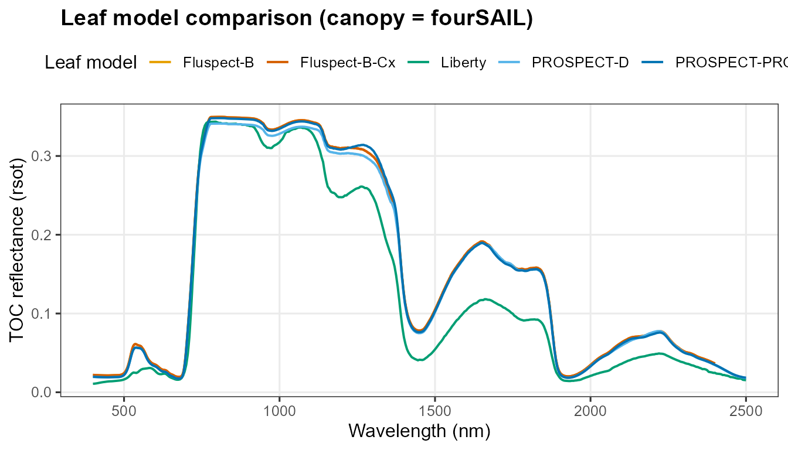
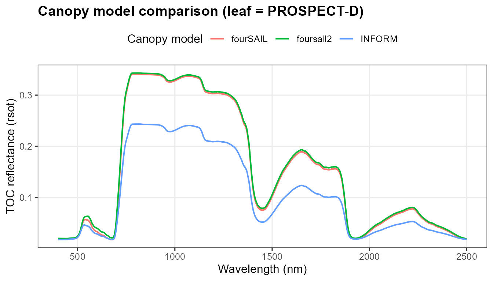
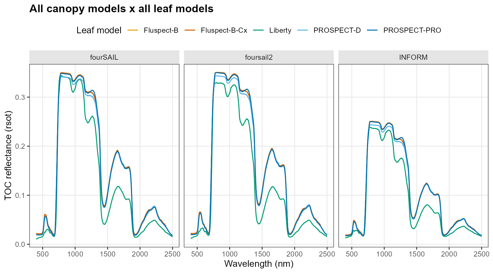
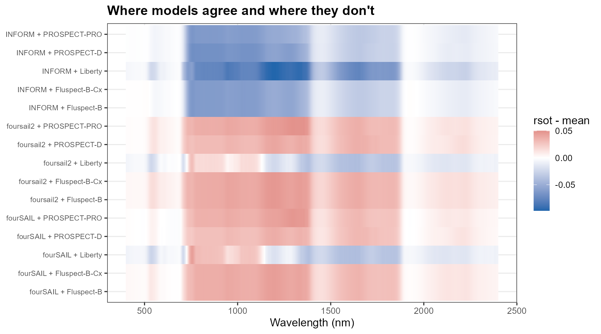

# 04. Comparing Radiative Transfer Models

``` r

library(ToolsRTM)
library(ggplot2)
library(dplyr)
library(tidyr)
```

Tutorial 02 introduced every leaf and canopy model individually. This
page asks a practical question instead: **which combination should you
actually use?** Same LUT (structural/geometric parameters identical) run
through every leaf model, every canopy model, and SPART for context –
with a numeric agreement table, not just a visual comparison.

``` r

common_lut <- data.frame(
  N = 1.5, Cab = 40, Car = 8, Anth = 1, Cbrown = 0, EWT = 0.01, LMA = 0.009, alpha = 40,
  Prot = 0.002, CBC = 0.007, Cs = 0, fqe = 0.01, Cx = 0,
  cell.d = 40, inter.c = 0.045, baseline.abs = 0.0006, leaf.thick = 1.6,
  albino.abs = 0, lign.cell = 2, Nitrogen = 1,
  LIDFa = -0.35, LIDFb = -0.15, TypeLidf = 1, LAI = 3, hspot = 0.01,
  tts = 30, tto = 0, psi = 0,
  fraction_brown = 0.1, diss = 0.5, Cv = 1, Zeta = 0,
  LAIu = 0.5, sd = 650, cd = 4.5, h = 20, skyl = 0.1
)
rsoil_2101 <- rep(0.15, 2101); rsoil_2001 <- rsoil_2101[1:2001]
wl_2101 <- 400:2500; wl_2001 <- 400:2400
leaf_models <- c("PROSPECT-PRO", "PROSPECT-D", "Liberty", "Fluspect-B", "Fluspect-B-Cx")
canopy_models <- c("fourSAIL", "foursail2", "INFORM")

leaf_colors <- c("PROSPECT-PRO" = "#0072B2", "PROSPECT-D" = "#56B4E9", "Liberty" = "#009E73",
                  "Fluspect-B" = "#E69F00", "Fluspect-B-Cx" = "#D55E00")
theme_rtm <- theme_bw(base_size = 12) +
  theme(legend.position = "top", panel.grid.minor = element_blank(),
        strip.background = element_rect(fill = "grey90", color = NA),
        plot.title = element_text(face = "bold"))
```

## Leaf models, fixed canopy (fourSAIL)

``` r

df_leaf <- bind_rows(lapply(leaf_models, function(lm) {
  short_domain <- lm %in% c("Fluspect-B", "Fluspect-B-Cx")
  sim <- foursail(inputLUT = common_lut, rsoil = if (short_domain) rsoil_2001 else rsoil_2101,
                   LeafModel = lm, spectrum.all = !short_domain)
  data.frame(wavelength = if (short_domain) wl_2001 else wl_2101, rsot = sim$rsot, leaf_model = lm)
}))
ggplot(df_leaf, aes(x = wavelength, y = rsot, color = leaf_model)) +
  geom_line(linewidth = 0.7) + scale_color_manual(values = leaf_colors) +
  labs(title = "Leaf model comparison (canopy = fourSAIL)", x = "Wavelength (nm)",
       y = "TOC reflectance (rsot)", color = "Leaf model") + theme_rtm
```



## Canopy models, fixed leaf model (PROSPECT-D)

``` r

sim_foursail  <- foursail(inputLUT = common_lut, rsoil = rsoil_2101, LeafModel = "PROSPECT-D")$rsot
sim_foursail2 <- foursail2(inputLUT = common_lut, rsoil = rsoil_2101, LeafModel = "PROSPECT-D")$rsot
sim_inform    <- inform(inputLUT = common_lut, rsoil = rsoil_2101, LeafModel = "PROSPECT-D")
df_canopy <- bind_rows(
  data.frame(wavelength = wl_2101, rsot = sim_foursail, model = "fourSAIL"),
  data.frame(wavelength = wl_2101, rsot = sim_foursail2, model = "foursail2"),
  data.frame(wavelength = wl_2101, rsot = sim_inform, model = "INFORM")
)
ggplot(df_canopy, aes(x = wavelength, y = rsot, color = model)) +
  geom_line(linewidth = 0.7) +
  labs(title = "Canopy model comparison (leaf = PROSPECT-D)", x = "Wavelength (nm)",
       y = "TOC reflectance (rsot)", color = "Canopy model") + theme_rtm
```



## Full grid + agreement heatmap

Every leaf model x every canopy model that supports it, plus a
deviation-from-ensemble-mean heatmap – white means models agree at that
wavelength, saturated colour means they diverge:

``` r

df_grid <- bind_rows(lapply(canopy_models, function(cm) {
  bind_rows(lapply(leaf_models, function(lm) {
    short_domain <- lm %in% c("Fluspect-B", "Fluspect-B-Cx")
    rsoil <- if (short_domain && cm != "INFORM") rsoil_2001 else rsoil_2101
    sim <- tryCatch({
      if (cm == "fourSAIL") foursail(inputLUT = common_lut, rsoil = rsoil, LeafModel = lm, spectrum.all = !short_domain)$rsot
      else if (cm == "foursail2") foursail2(inputLUT = common_lut, rsoil = rsoil, LeafModel = lm)$rsot
      else inform(inputLUT = common_lut, rsoil = rsoil, LeafModel = lm)
    }, error = function(e) NULL)
    if (is.null(sim)) return(NULL)
    data.frame(wavelength = if (short_domain) wl_2001 else wl_2101, rsot = sim, leaf_model = lm, canopy_model = cm)
  }))
}))
df_grid$combo <- paste(df_grid$canopy_model, df_grid$leaf_model, sep = " + ")

ggplot(df_grid, aes(x = wavelength, y = rsot, color = leaf_model)) +
  geom_line(linewidth = 0.6) + facet_wrap(~canopy_model) + scale_color_manual(values = leaf_colors) +
  labs(title = "All canopy models x all leaf models", x = "Wavelength (nm)",
       y = "TOC reflectance (rsot)", color = "Leaf model") + theme_rtm
```



``` r

df_common <- df_grid[df_grid$wavelength <= 2400, ] %>%
  group_by(wavelength) %>% mutate(ensemble_mean = mean(rsot), deviation = rsot - ensemble_mean) %>% ungroup()

ggplot(df_common, aes(x = wavelength, y = combo, fill = deviation)) +
  geom_raster() +
  scale_fill_gradient2(low = "#2166AC", mid = "white", high = "#B2182B", midpoint = 0, name = "rsot - mean") +
  labs(title = "Where models agree and where they don't", x = "Wavelength (nm)", y = NULL) +
  theme_rtm + theme(legend.position = "right", axis.text.y = element_text(size = 8))
```



## Numeric agreement: RMSE vs. the ensemble mean

``` r

rmse_vs_mean <- df_common %>% group_by(combo) %>%
  summarise(RMSE_vs_ensemble_mean = sqrt(mean(deviation^2)), .groups = "drop") %>%
  arrange(desc(RMSE_vs_ensemble_mean))
knitr::kable(rmse_vs_mean, digits = 4)
```

| combo                     | RMSE_vs_ensemble_mean |
|:--------------------------|----------------------:|
| INFORM + Liberty          |                0.0575 |
| INFORM + PROSPECT-D       |                0.0388 |
| INFORM + PROSPECT-PRO     |                0.0354 |
| INFORM + Fluspect-B       |                0.0352 |
| INFORM + Fluspect-B-Cx    |                0.0352 |
| foursail2 + Fluspect-B    |                0.0291 |
| foursail2 + Fluspect-B-Cx |                0.0291 |
| foursail2 + PROSPECT-PRO  |                0.0286 |
| fourSAIL + Fluspect-B     |                0.0267 |
| fourSAIL + Fluspect-B-Cx  |                0.0267 |
| fourSAIL + PROSPECT-PRO   |                0.0262 |
| foursail2 + PROSPECT-D    |                0.0252 |
| fourSAIL + Liberty        |                0.0229 |
| fourSAIL + PROSPECT-D     |                0.0224 |
| foursail2 + Liberty       |                0.0209 |

INFORM combinations sit furthest from the ensemble mean – expected,
since its explicit forest crown/shadow geometry represents a genuinely
different canopy structure than fourSAIL/foursail2’s turbid-medium
assumption, not a numerical disagreement to be resolved.

## SPART in the picture

SPART (Tutorial 03) isn’t repeated in the grid above – it answers a
different question (TOA, not TOC) and needs its own atmosphere/soil
inputs, so it isn’t directly comparable to a
[`foursail()`](../reference/foursail.md)-family `rsot` on the same axis.
See Tutorial 03 for when to reach for it instead of a plain leaf+canopy
combination.

## Decision guide

``` text
What do I need to simulate?
          |
          +-- Leaf optics
          |      |
          |      v
          |   PROSPECT-D / PRO
          |
          +-- Homogeneous canopy
          |      |
          |      v
          |   fourSAIL
          |
          +-- More complex canopy
          |      |
          |      v
          |   fourSAIL2 / INFORM
          |
          +-- Soil + vegetation + atmosphere
                 |
                 v
               SPART
```

| Model | Physical domain | Principal inputs | Principal outputs | Typical use | Limitations |
|----|----|----|----|----|----|
| PROSPECT-D | Leaf | N, Cab, Car, Anth, Cbrown, EWT, LMA | Leaf rho/tau, 400-2500nm | Leaf-level spectroscopy, calibrating a canopy model’s leaf term | No fluorescence, no canopy structure |
| PROSPECT-PRO | Leaf | Same + Prot, CBC (replaces LMA) | Leaf rho/tau | When protein/carbon-based dry-matter separation matters | Same as PROSPECT-D otherwise |
| Fluspect-B/-B-Cx | Leaf | PROSPECT-like + fqe, Cs, (Cx) | Leaf rho/tau + fluorescence emission matrices | Any SIF (sun-induced fluorescence) workflow | Shorter spectral domain (400-2400nm, 2001 pts) |
| Liberty | Leaf (needle) | cell.d, inter.c, lign.cell, Nitrogen, … | Leaf rho/tau | Conifer/needle canopies | Not for broadleaf; numerically unstable at some parameter combinations near its own bounds |
| fourSAIL | Canopy | LAI, LIDFa/b, hotspot, geometry | TOC rdot/rsot | Default, single-layer turbid-medium canopy | No explicit crown structure, no senescent/green split |
| fourSAIL2 | Canopy | fourSAIL + fraction_brown, diss, Cv, Zeta | TOC rdot/rsot | Mixed green/senescent (two-layer) canopies | More parameters to estimate/assume |
| INFORM | Canopy (forest) | fourSAIL + LAIu, sd, cd, h, skyl | TOC rsot (bare vector) | Forest with explicit crown geometry | LAI can be weakly identifiable if crown-geometry params are held fixed (Tutorial 14) |
| SPART | Soil+canopy+atmosphere | fourSAIL + BSM soil + SMAC atmosphere | TOC and TOA, already at sensor bands | Atmospheric-correction studies, direct comparison to uncorrected satellite products | Needs realistic atmosphere inputs (Tutorial 03’s caveat); `psoil` inert unless `rsoil` supplied |

## What’s next

- **Tutorial 05** – building a proper LUT (many rows, per-trait
  distributions, correlated traits) instead of one fixed `common_lut`.
- **Tutorial 10** – formal sensitivity analysis (Sobol/Johnson), a more
  rigorous version of “which trait matters where” than this page’s
  visual comparison.
