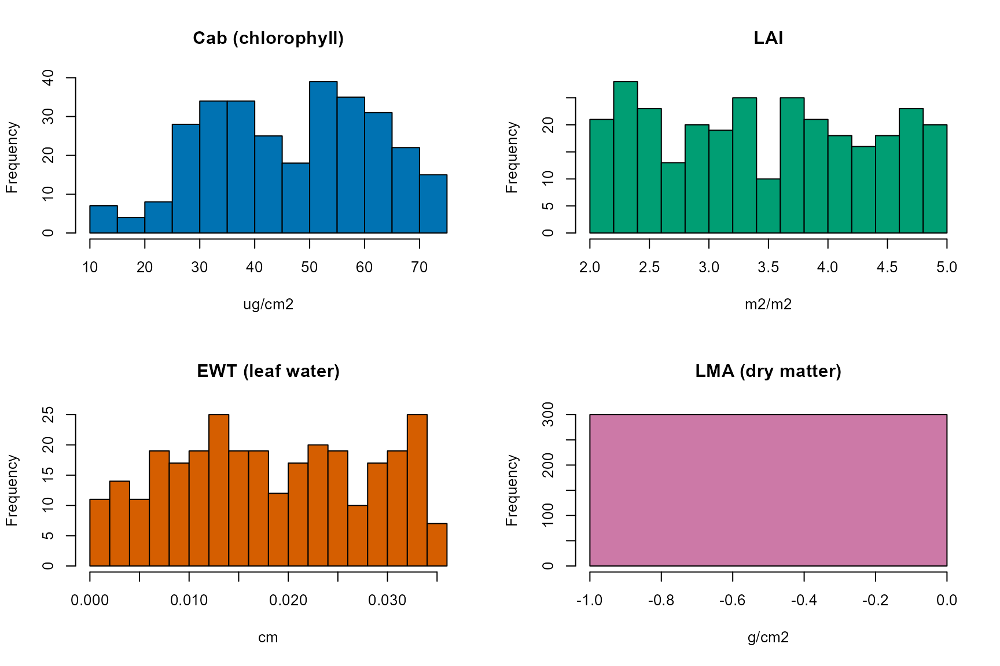
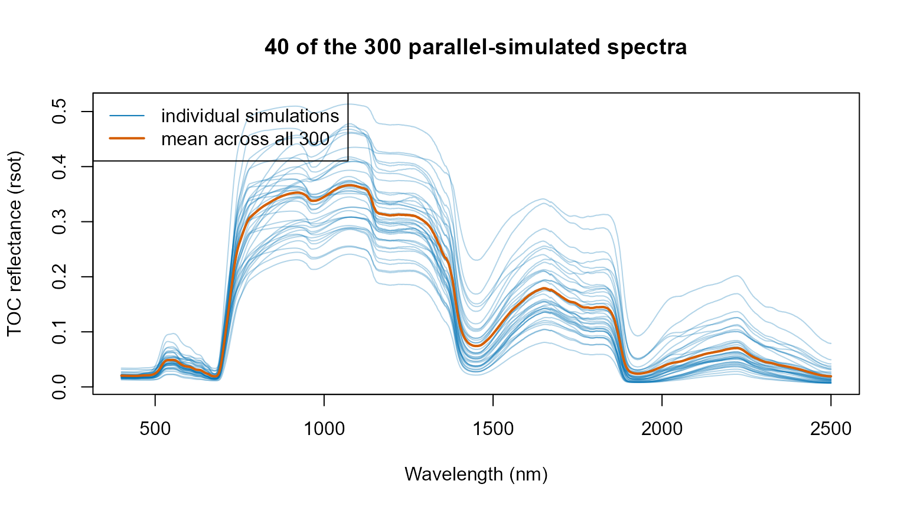

# 06. Large-Scale and Parallel RTM Simulation

``` r

library(ToolsRTM)
library(doParallel)
library(foreach)
```

Every simulation so far used a plain
[`sapply()`](https://rdrr.io/r/base/lapply.html)/loop over LUT rows –
fine for hundreds of rows, slow for thousands. This page shows the
`doParallel`/`foreach` pattern this package’s own course scripts use
(`Scripts/R/ForPROSAIL/1-GetSimulationsLUTs.R`) to distribute
simulations across CPU cores.

**This whole page is forward simulation, not inversion.** Every LUT row
below is a set of *known* leaf/canopy traits fed *into*
[`foursail()`](../reference/foursail.md) to produce a spectrum; nothing
here goes the other way (spectrum -\> trait). Parallelizing that
direction, at scale, is the only subject of this tutorial – inversion
(traits recovered *from* spectra) is Tutorials 11-13’s subject, using
LUTs built the same way as here.

## 1. Build a LUT

``` r

n.samples <- 300
LUT <- as.data.frame(getLUT(inputs = ToolsRTM::inputsPROSAIL, nLUT = n.samples, setseed = 1234))
# inputsPROSAIL's own LMA row is held fixed at 0 by design -- getLUT()
# samples Prot/CBC instead (the dry-matter inputs PROSPECT-PRO uses). This
# page simulates with LeafModel="PROSPECT-D" below, which needs LMA
# directly, so sample it from a typical real-leaf range (0.005-0.02 g/cm2).
set.seed(1235)
LUT$LMA <- runif(n.samples, 0.005, 0.02)
rsoil <- rep(0.15, 2101)
```

### What’s actually varying across these 300 rows

``` r

op <- par(mfrow = c(2, 2))
hist(LUT$Cab, breaks = 20, col = "#0072B2", main = "Cab (chlorophyll)", xlab = "ug/cm2")
hist(LUT$LAI, breaks = 20, col = "#009E73", main = "LAI", xlab = "m2/m2")
hist(LUT$EWT, breaks = 20, col = "#D55E00", main = "EWT (leaf water)", xlab = "cm")
hist(LUT$LMA, breaks = 20, col = "#CC79A7", main = "LMA (dry matter)", xlab = "g/cm2")
```



``` r

par(op)
```

This is the actual sampled input space
[`foursail()`](../reference/foursail.md) runs over below – not just a
row count. [`getLUT()`](../reference/getLUT.md) draws each trait
independently from `inputsPROSAIL`’s own documented ranges/distributions
(Tutorial 01).

## 2. Sequential baseline

``` r

t_seq <- system.time({
  sims_seq <- lapply(seq_len(n.samples), function(i) {
    sail_i <- foursail(inputLUT = LUT[i, ], rsoil = rsoil, LeafModel = "PROSPECT-D")
    sail_i$rsot
  })
})
cat("Sequential:", round(t_seq[["elapsed"]], 2), "s for", n.samples, "simulations\n")
#> Sequential: 1.5 s for 300 simulations
```

## 3. Parallel with `doParallel`/`foreach`

``` r

no_cores <- max(1, parallel::detectCores() - 2)
# CRAN check machines cap parallel workers at 2; respect that limit so this
# vignette rebuilds cleanly under R CMD check --as-cran.
if (nzchar(Sys.getenv("_R_CHECK_LIMIT_CORES_"))) no_cores <- min(no_cores, 2L)
cl <- makeCluster(no_cores)
registerDoParallel(cl)

t_par <- system.time({
  sims_par <- foreach(i = 1:n.samples, .packages = "ToolsRTM") %dopar% {
    sail_i <- foursail(inputLUT = LUT[i, ], rsoil = rsoil, LeafModel = "PROSPECT-D")
    sail_i$rsot
  }
})
stopCluster(cl)

cat("Parallel (", no_cores, "cores):", round(t_par[["elapsed"]], 2), "s for", n.samples, "simulations\n")
#> Parallel ( 10 cores): 4.53 s for 300 simulations
cat("Speedup:", round(t_seq[["elapsed"]] / t_par[["elapsed"]], 2), "x\n")
#> Speedup: 0.33 x
```

Three things matter for this pattern to actually work, not just look
parallel:

- **[`makeCluster()`](https://rdrr.io/r/parallel/makeCluster.html)/[`registerDoParallel()`](https://rdrr.io/pkg/doParallel/man/registerDoParallel.html)/[`stopCluster()`](https://rdrr.io/r/parallel/makeCluster.html)**
  always paired – an unclosed cluster leaks worker processes across the
  whole R session, compounding if this chunk runs more than once
  (e.g. re-knitting interactively).
- **`.packages = "ToolsRTM"`** inside
  [`foreach()`](https://rdrr.io/pkg/foreach/man/foreach.html) – each
  worker process starts fresh, with no packages attached; without this,
  [`foursail()`](../reference/foursail.md) isn’t found on the workers
  and every iteration errors.
- **`no_cores <- detectCores() - 2`**, not
  [`detectCores()`](https://rdrr.io/r/parallel/detectCores.html) itself
  – leaves headroom for the OS and this R session’s own main process, a
  convention this package’s own course scripts (`ForPROSAIL`,
  `Sensibility`) use throughout.

``` r

identical(sims_seq[[1]], sims_par[[1]])  # same result, sequential or parallel
#> [1] TRUE
```

### The simulations themselves

``` r

wave <- 400:2500
spectra_mat <- do.call(rbind, sims_par)
matplot(wave, t(spectra_mat[sample(seq_len(n.samples), 40), ]), type = "l", lty = 1,
        col = adjustcolor("#0072B2", alpha.f = 0.3),
        xlab = "Wavelength (nm)", ylab = "TOC reflectance (rsot)",
        main = "40 of the 300 parallel-simulated spectra")
lines(wave, colMeans(spectra_mat), col = "#D55E00", lwd = 2)
legend("topleft", c("individual simulations", "mean across all 300"), col = c("#0072B2", "#D55E00"), lty = 1, lwd = c(1, 2))
```



This is what the parallel run in Section 3 actually produced – the
spread across the 300 curves is a direct consequence of the trait
histograms above, not noise: every curve is one specific, known
`(Cab, LAI, EWT, LMA, ...)` combination run forward through
[`foursail()`](../reference/foursail.md).

## 4. When parallel is (and isn’t) worth it

``` r

cat("Per-simulation cost: sequential", round(1000 * t_seq[["elapsed"]] / n.samples, 2),
    "ms, parallel", round(1000 * t_par[["elapsed"]] / n.samples, 2), "ms\n")
#> Per-simulation cost: sequential 5 ms, parallel 15.1 ms
```

[`foursail()`](../reference/foursail.md) itself is fast (milliseconds
per call) – the parallel speedup above has to overcome the fixed
overhead of starting a cluster and shipping `ToolsRTM`/data to every
worker, so it only pays off once `n.samples` is large enough (thousands,
not hundreds) or each simulation is individually expensive
(e.g. [`SPART()`](../reference/SPART.md)’s atmosphere calculations,
Tutorial 03; the full SCOPE energy balance, covered in the SCOPEinR
package’s own tutorials). For a few hundred rows, the sequential
[`lapply()`](https://rdrr.io/r/base/lapply.html)/[`sapply()`](https://rdrr.io/r/base/lapply.html)
used throughout Tutorials 01-05 is often simpler and not meaningfully
slower once cluster startup is accounted for.

## 5. Filtering non-finite rows

Large parallel runs sometimes include a few unstable simulations (e.g.
Liberty’s leaf solver, Tutorial 02, near the edges of its own parameter
range) that come back as `NaN` rather than erroring outright. Always
check before using the results downstream:

``` r

spectra_mat <- do.call(rbind, sims_par)
ok <- apply(spectra_mat, 1, function(r) all(is.finite(r)))
cat(sum(!ok), "of", n.samples, "simulations were non-finite and would be dropped.\n")
#> 0 of 300 simulations were non-finite and would be dropped.
spectra_mat <- spectra_mat[ok, , drop = FALSE]
LUT_ok <- LUT[ok, ]
```

## What’s next

- **Tutorial 07** – convolving these simulated spectra onto real sensor
  bands.
- **Tutorial 14** – the same simulate-in-parallel pattern as one step in
  a full end-to-end pipeline.
