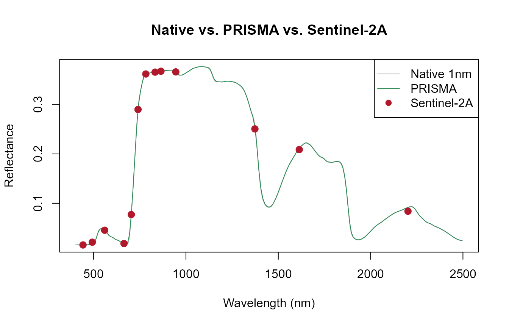
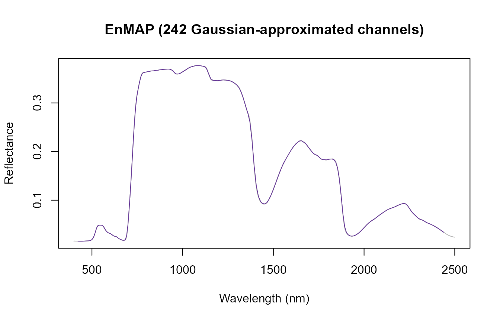
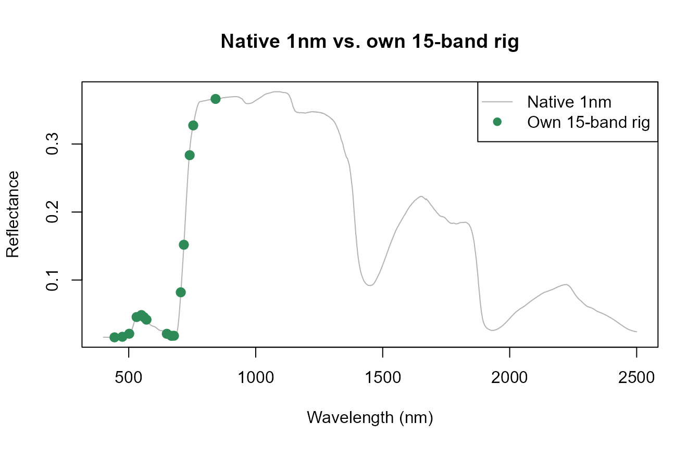
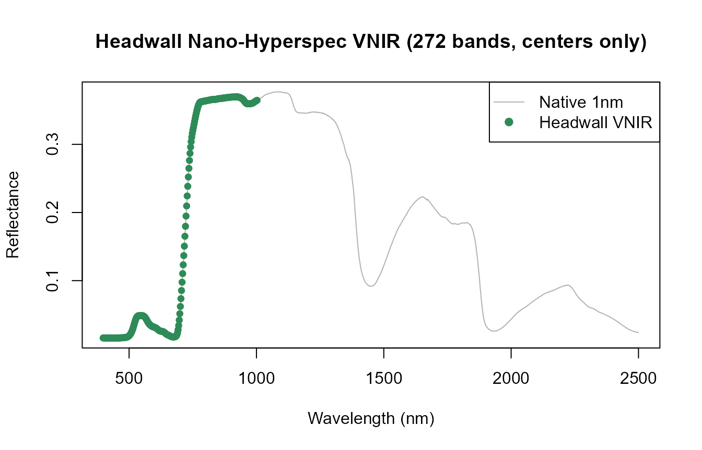
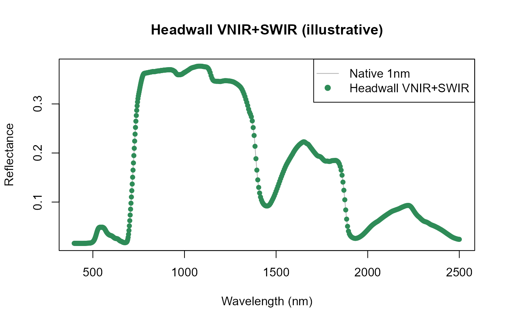
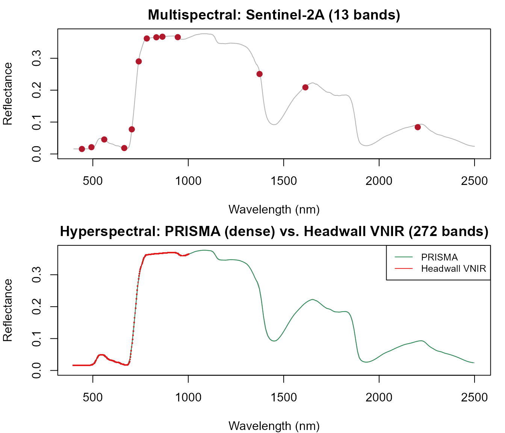

# 08. Hyperspectral and VNIR Sensor Convolution

``` r

library(ToolsRTM)
```

Tutorial 07 covered sensor convolution broadly – multispectral sensors
like Sentinel-2, with 10-13 bands. This page is a deep-dive into the
other end of the spectral-resolution spectrum: hyperspectral and custom
VNIR instruments, from a few hundred narrow bands (PRISMA, EnMAP) down
to real research-grade multi-camera and pushbroom rigs, all through the
same `get.spectral.convolution.*()` family already introduced.

``` r

row <- data.frame(
  LAI = 3, hspot = 0.01, LIDFa = -0.35, LIDFb = -0.15, TypeLidf = 1,
  tts = 30, tto = 0, psi = 0,
  N = 1.5, Cab = 40, Car = 8, Anth = 2, Cbrown = 0, EWT = 0.009, LMA = 0.009, alpha = 40
)
rsoil <- 0.5 * dataSpec_PDB[, 11] + 0.5 * dataSpec_PDB[, 12]
sail <- foursail(inputLUT = row, rsoil = rsoil, LeafModel = "PROSPECT-D")
reflectance <- Compute_BRF(rdot = sail$rdot, rsot = sail$rsot, tts = row$tts, data.light = dataSpec_PDB)
df <- data.frame(wave = dataSpec_PDB[, 1], rfl = reflectance)
```

## 1. Sentinel-2: the multispectral reference point

``` r

se2_bands <- get.spectral.convolution.srf(df = df, srf = ToolsRTM::srf.sentinel2a)
cat("Sentinel-2A:", nrow(se2_bands), "bands\n")
#> Sentinel-2A: 13 bands
```

10-13 discrete bands (Tutorial 07) – everything below samples the same
underlying spectrum far more densely.

## 2. PRISMA: a real hyperspectral satellite mission

``` r

prisma_bands <- get.spectral.convolution.srf(df = df, srf = ToolsRTM::srf.prisma)
cat("PRISMA:", nrow(prisma_bands), "bands\n")
#> PRISMA: 234 bands

plot(df$wave, df$rfl, type = "l", col = "grey70",
     xlab = "Wavelength (nm)", ylab = "Reflectance", main = "Native vs. PRISMA vs. Sentinel-2A")
lines(prisma_bands$wl, prisma_bands$RFL, col = "#2E8B57", lwd = 1)
points(se2_bands$wl, se2_bands$RFL, col = "#B2182B", pch = 19, cex = 1.2)
legend("topright", c("Native 1nm", "PRISMA", "Sentinel-2A"),
       col = c("grey70", "#2E8B57", "#B2182B"), lty = c(1, 1, NA), pch = c(NA, NA, 19))
```



PRISMA is dense enough to nearly retrace the native curve – a real
measured SRF
([`get.spectral.convolution.srf()`](../reference/get.spectral.convolution.srf.md),
same function as Sentinel-2A, Tutorial 07), not an approximation.

## 3. EnMAP: 242 channels, nominal characteristics

EnMAP has no measured SRF bundled in this package – only nominal
center/FWHM characteristics
([`ToolsRTM::EnMap.characteristics`](../reference/EnMap.characteristics.md)),
so it goes through
[`get.spectral.convolution.gaussian()`](../reference/get.spectral.convolution.gaussian.md)
instead (Tutorial 07’s third convolution path):

``` r

enmap_bands <- get.spectral.convolution.gaussian(df, sensor.i = "EnMAP")
cat("EnMAP:", nrow(enmap_bands), "bands\n")
#> EnMAP: 242 bands

plot(df$wave, df$rfl, type = "l", col = "grey70",
     xlab = "Wavelength (nm)", ylab = "Reflectance", main = "EnMAP (242 Gaussian-approximated channels)")
lines(enmap_bands$wl, enmap_bands$RFL, col = "#6A3D9A", lwd = 1)
```



## 4. A real 15-band, 3-camera VNIR rig

Not a hypothetical – this exact center/FWHM table is the same worked
example already verified in `Apps/RTMs/app.R`’s own “How in R” tutorial
tab (a synchronized 3-camera system, one calibration sheet):

``` r

own_centers <- c(444, 475, 502, 531, 550, 560, 570, 650, 668, 678, 705, 717, 740, 754, 842)
own_fwhm    <- c(28,  32,  18,  14,  12,  27,  14,  16,  14,  14,  10,  12,  18,  10,  57)

own_bands <- get.spectral.convolution.gaussian(df, centers = own_centers, fwhm = own_fwhm)
own_bands
#>    band  wl fwhm        RFL
#> 1     1 444   28 0.01567923
#> 2     2 475   32 0.01650100
#> 3     3 502   18 0.02098656
#> 4     4 531   14 0.04553117
#> 5     5 550   12 0.04843935
#> 6     6 560   27 0.04530615
#> 7     7 570   14 0.04167810
#> 8     8 650   16 0.02089493
#> 9     9 668   14 0.01787229
#> 10   10 678   14 0.01801478
#> 11   11 705   10 0.08189282
#> 12   12 717   12 0.15184254
#> 13   13 740   18 0.28362162
#> 14   14 754   10 0.32738876
#> 15   15 842   57 0.36633320

plot(df$wave, df$rfl, type = "l", col = "grey70",
     xlab = "Wavelength (nm)", ylab = "Reflectance", main = "Native 1nm vs. own 15-band rig")
# Points, not a line -- only 15 sparse bands, a line would connect straight
# across large gaps (e.g. 570->650nm) in a way that misrepresents the sensor.
points(own_bands$wl, own_bands$RFL, col = "#2E8B57", pch = 19, cex = 1.2)
legend("topright", c("Native 1nm", "Own 15-band rig"), col = c("grey70", "#2E8B57"), lty = c(1, NA), pch = c(NA, 19))
```



Both center AND FWHM are known here (from the camera rig’s own
calibration sheet) – each band is approximated as a Gaussian response
with that exact center/width. Contrast with the Headwall example next,
where only centers are available.

## 5. Headwall Nano-Hyperspec: VNIR and VNIR+SWIR

A pushbroom hyperspectral camera where only band CENTERS are known –
copied from its ENVI header’s `wavelength = {...}` block, with no
`fwhm = {...}` block alongside it. This is genuinely how these headers
ship:
[`get.spectral.convolution.gaussian()`](../reference/get.spectral.convolution.gaussian.md)
estimates FWHM from band spacing automatically when `fwhm` is omitted.

### VNIR variant

The same real header snippet already used in `Apps/RTMs/app.R`’s
tutorial tab – five bands shown there explicitly
(`# (full header has 272)`), at a fixed step confirmed directly from
those five real values (400.247-398.0166 = 402.4774-400.247 = … =
2.2304nm exactly):

``` r

headwall_step <- 400.247 - 398.0166
cat("Confirmed real step size from the 5-value header snippet:", round(headwall_step, 4), "nm\n")
#> Confirmed real step size from the 5-value header snippet: 2.2304 nm

# Extrapolating the real header's own documented step to its full stated
# length (272 bands) -- not a fabricated instrument, the real spacing
# applied for its full real extent.
headwall_vnir_centers <- 398.0166 + (0:271) * headwall_step
cat("VNIR range:", round(range(headwall_vnir_centers), 1), "nm,", length(headwall_vnir_centers), "bands\n")
#> VNIR range: 398 1002.5 nm, 272 bands

headwall_vnir_bands <- get.spectral.convolution.gaussian(df, centers = headwall_vnir_centers)
plot(df$wave, df$rfl, type = "l", col = "grey70",
     xlab = "Wavelength (nm)", ylab = "Reflectance", main = "Headwall Nano-Hyperspec VNIR (272 bands, centers only)")
# Points, not a solid line -- at 272 bands / 2.23nm spacing a solid line is
# dense enough to fully cover the native grey line underneath; points let
# the native spectrum show through between them. Same green used for the
# hyperspectral/dense-sensor overlay throughout this page (Sections 2-4).
points(headwall_vnir_bands$wl, headwall_vnir_bands$RFL, col = "#2E8B57", pch = 19, cex = 0.8)
legend("topright", c("Native 1nm", "Headwall VNIR"), col = c("grey70", "#2E8B57"), lty = c(1, NA), pch = c(NA, 19))
```



### VNIR+SWIR variant

**A real limitation, stated rather than papered over**: this repository
has no independently-verified SWIR-companion header for this instrument
– only the VNIR header above is a genuine, sourced calibration snippet.
Rather than inventing precise SWIR band centers and presenting them as
if real, the SWIR portion below uses round, clearly-labeled
representative values (typical published Nano-Hyperspec VNIR+SWIR
coverage: extending to ~2500nm at coarser spacing than the VNIR segment)
– **illustrative of the pattern, not an authoritative instrument
header**:

``` r

# Representative only -- see the note above. The VNIR segment is the real
# header from Section 5's VNIR variant; the SWIR segment is a round,
# clearly-marked stand-in for a real second-camera header this repo
# doesn't have verified.
swir_representative_centers <- seq(1000, 2500, by = 5)  # illustrative spacing, NOT a sourced header
headwall_vnirswir_centers <- c(headwall_vnir_centers, swir_representative_centers)

headwall_vnirswir_bands <- get.spectral.convolution.gaussian(df, centers = headwall_vnirswir_centers)
cat("VNIR+SWIR (illustrative):", nrow(headwall_vnirswir_bands), "bands,",
    round(min(headwall_vnirswir_bands$wl)), "-", round(max(headwall_vnirswir_bands$wl)), "nm\n")
#> VNIR+SWIR (illustrative): 573 bands, 398 - 2500 nm

plot(df$wave, df$rfl, type = "l", col = "grey70",
     xlab = "Wavelength (nm)", ylab = "Reflectance", main = "Headwall VNIR+SWIR (illustrative)")
points(headwall_vnirswir_bands$wl, headwall_vnirswir_bands$RFL, col = "#2E8B57", pch = 19, cex = 0.8)
legend("topright", c("Native 1nm", "Headwall VNIR+SWIR"), col = c("grey70", "#2E8B57"), lty = c(1, NA), pch = c(NA, 19))
```



Same
[`get.spectral.convolution.gaussian()`](../reference/get.spectral.convolution.gaussian.md)
call, same centers-only / FWHM-estimated-from-spacing pattern as the
pure VNIR case – only the band list changes.

## 6. Spectral sampling density, side by side

``` r

comparison <- data.frame(
  Sensor = c("Sentinel-2A", "PRISMA", "EnMAP", "Own 15-band rig", "Headwall VNIR", "Headwall VNIR+SWIR (illustrative)"),
  Bands = c(nrow(se2_bands), nrow(prisma_bands), nrow(enmap_bands),
            nrow(own_bands), nrow(headwall_vnir_bands), nrow(headwall_vnirswir_bands)),
  Approx_spacing_nm = c(round(diff(range(se2_bands$wl)) / (nrow(se2_bands) - 1), 0),
                         round(diff(range(prisma_bands$wl)) / (nrow(prisma_bands) - 1), 1),
                         round(diff(range(enmap_bands$wl)) / (nrow(enmap_bands) - 1), 1),
                         NA,
                         round(headwall_step, 2),
                         NA)
)
knitr::kable(comparison)
```

| Sensor                            | Bands | Approx_spacing_nm |
|:----------------------------------|------:|------------------:|
| Sentinel-2A                       |    13 |            147.00 |
| PRISMA                            |   234 |              8.90 |
| EnMAP                             |   242 |              8.40 |
| Own 15-band rig                   |    15 |                NA |
| Headwall VNIR                     |   272 |              2.23 |
| Headwall VNIR+SWIR (illustrative) |   573 |                NA |

`Approx_spacing_nm` is `NA` for the two irregular/mixed-sampling rows –
the 15-band rig places bands at specific absorption features rather than
uniform steps, and the illustrative VNIR+SWIR row mixes the real 2.23nm
VNIR step with the representative 5nm SWIR step, so a single averaged
number would misrepresent both.

``` r

op <- par(mfrow = c(2, 1), mar = c(4, 4, 2, 1))
plot(df$wave, df$rfl, type = "l", col = "grey70", ylim = c(0, max(df$rfl)),
     xlab = "Wavelength (nm)", ylab = "Reflectance", main = "Multispectral: Sentinel-2A (13 bands)")
points(se2_bands$wl, se2_bands$RFL, col = "#B2182B", pch = 19)
plot(df$wave, df$rfl, type = "l", col = "grey70", ylim = c(0, max(df$rfl)),
     xlab = "Wavelength (nm)", ylab = "Reflectance", main = "Hyperspectral: PRISMA (dense) vs. Headwall VNIR (272 bands)")
lines(prisma_bands$wl, prisma_bands$RFL, col = "#2E8B57", lwd = 1)
points(headwall_vnir_bands$wl, headwall_vnir_bands$RFL, col = "#E31A1C", pch = ".", cex = 2)
legend("topright", c("PRISMA", "Headwall VNIR"), col = c("#2E8B57", "#E31A1C"), lty = 1, cex = 0.8)
```



``` r

par(op)
```

What “hyperspectral” buys over multispectral, concretely: Sentinel-2A’s
13 bands can only sample the absorption features and red-edge shape at a
handful of fixed points; PRISMA/EnMAP/the Headwall’s 200+ narrow bands
resolve the actual continuous shape of those features – the difference
that lets hyperspectral data support things multispectral can’t (e.g.
narrowband indices centered exactly on an absorption feature, or fitting
absorption-feature depth/position directly rather than inferring it from
a handful of wide bands).

## What’s next

- **Tutorial 09** – vegetation indices, including which ones need the
  fine spectral sampling this page demonstrated vs. which work fine at
  Sentinel-2 resolution.
- **Tutorial 12** – training an inversion model on convolved,
  sensor-realistic reflectance – try substituting one of this page’s
  hyperspectral sensors for Sentinel-2A there.
