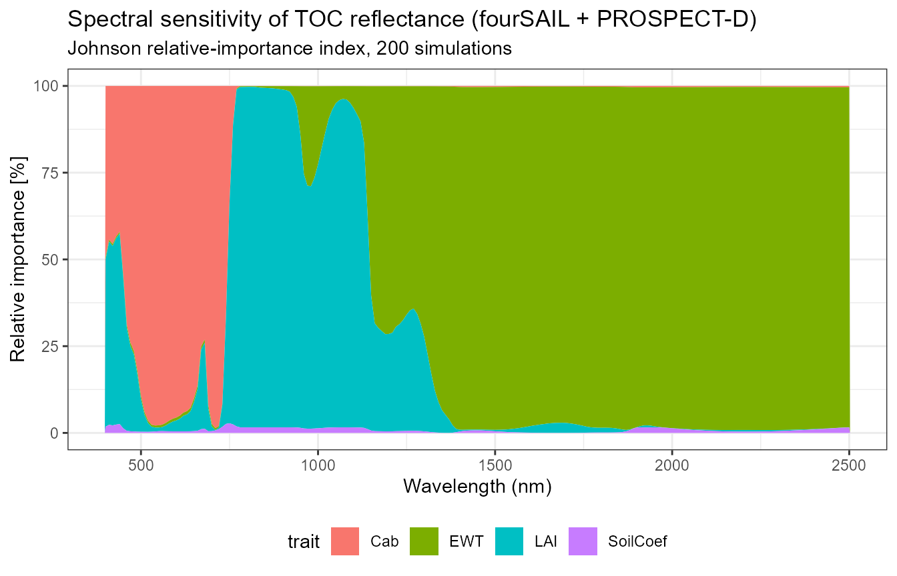
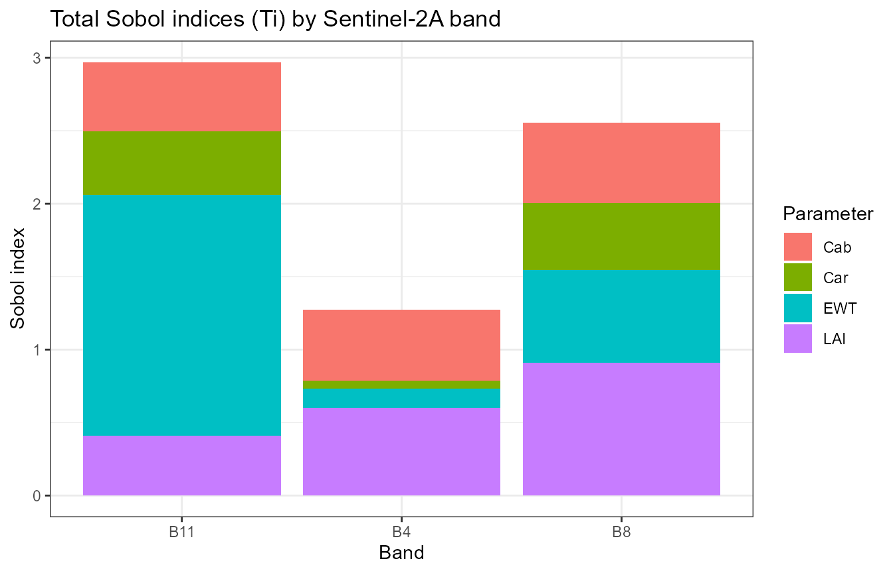
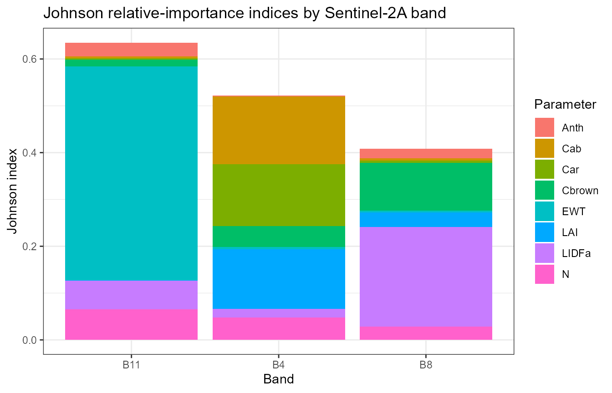

# 10. Understanding RTM Sensitivity

``` r

library(ToolsRTM)
library(ggplot2)
library(dplyr)
```

Tutorial 02 already swept one trait at a time (Cab, EWT, LAI) and
watched the spectrum respond – one-at-a-time (OAT), the simplest and
most intuitive sensitivity method. This page goes further: **global**
sensitivity analysis, where every trait varies simultaneously (capturing
interactions OAT can’t), using three different methods that – when they
agree – give real confidence the result reflects the physics, not one
method’s quirks.

| Method | Function | Scope |
|----|----|----|
| One-at-a-time (OAT) | plain sweep (Tutorial 02) | Sweep one trait, hold others fixed |
| Johnson relative importance, per wavelength | [`get.spectral.sensitivity()`](../reference/get.spectral.sensitivity.md) | Global, full spectrum |
| Sobol Si/Ti, per band | [`sensobol::sobol_matrices()`](https://rdrr.io/pkg/sensobol/man/sobol_matrices.html) + [`foursail()`](../reference/foursail.md) + [`sensobol::sobol_indices()`](https://rdrr.io/pkg/sensobol/man/sobol_indices.html) | Global, discrete sensor bands |
| Johnson relative importance, per band | [`sensitivity::johnson()`](https://rdrr.io/pkg/sensitivity/man/johnson.html) | Regression-based, per band |

## 1. Global sensitivity across the full spectrum: Johnson relative importance

[`get.spectral.sensitivity()`](../reference/get.spectral.sensitivity.md)
runs
[`sensitivity::johnson()`](https://rdrr.io/pkg/sensitivity/man/johnson.html)
(Johnson relative-importance index) once per wavelength – every trait
varies simultaneously per simulation, unlike Tutorial 02’s OAT sweeps.
**A real bug was found and fixed here while building this page**: the
function’s name and an earlier draft of this page both said “Sobol total
index” – [`get.sobol.indices()`](../reference/get.sobol.indices.md)
(which
[`get.spectral.sensitivity()`](../reference/get.spectral.sensitivity.md)
calls internally) does compute a Sobol total index (`STi`), but that
specific column has a genuine formula bug (it accidentally squares the
*output* against itself instead of using the input trait at all, so
every trait came out with nearly the same value – the telltale symptom
was Cab, EWT, and LAI all landing within a percentage point of each
other at every wavelength, including right next to each other at 400 vs
410nm, which has no physical reason to be that flat). Fixed by switching
to [`get.sobol.indices()`](../reference/get.sobol.indices.md)’s
*separately, correctly* computed `I.Johnson_norm` column
([`sensitivity::johnson()`](https://rdrr.io/pkg/sensitivity/man/johnson.html),
a different code path in the same function) – the same metric this
package’s own reference sensitivity scripts already use for this exact
kind of figure. The `STi_pct` column name below is kept for backward
compatibility even though it is Johnson-based now, not Sobol-based.

``` r

si <- get.spectral.sensitivity(n.samples = 200, distribution = "Uniform",
                                traits = c("Cab", "EWT", "LAI"), wl.step = 10,
                                seed = 1, chunk.size = 200, save.path = tempfile())
head(si)
#>   wavelength    trait    STi_pct distribution
#> 1        400      Cab 49.4423550      Uniform
#> 2        400      EWT  0.6056136      Uniform
#> 3        400      LAI 48.1633645      Uniform
#> 4        400 SoilCoef  1.7886668      Uniform
#> 5        410      Cab 44.3162064      Uniform
#> 6        410      EWT  0.5210568      Uniform
```

``` r

ggplot(si, aes(x = wavelength, y = STi_pct, fill = trait)) +
  geom_area(position = "stack") +
  labs(title = "Spectral sensitivity of TOC reflectance (fourSAIL + PROSPECT-D)",
       subtitle = sprintf("Johnson relative-importance index, %d simulations", 200),
       x = "Wavelength (nm)", y = "Relative importance [%]") +
  theme_bw(base_size = 11) + theme(legend.position = "bottom")
```



``` r

cab <- subset(si, trait == "Cab"); ewt <- subset(si, trait == "EWT"); lai <- subset(si, trait == "LAI")
cat("Cab: ", round(mean(cab$STi_pct[cab$wavelength >= 430 & cab$wavelength <= 680]), 1),
    "% in the visible/red absorption region (430-680nm), only ",
    round(mean(cab$STi_pct[cab$wavelength >= 750 & cab$wavelength <= 1300]), 1),
    "% in the NIR plateau (750-1300nm, no chlorophyll absorption feature there)\n", sep = "")
#> Cab: 84.5% in the visible/red absorption region (430-680nm), only 0.9% in the NIR plateau (750-1300nm, no chlorophyll absorption feature there)
cat("EWT: ", round(mean(ewt$STi_pct[ewt$wavelength >= 1400 & ewt$wavelength <= 1500]), 1),
    "% near the 1450nm water-absorption band, only ",
    round(mean(ewt$STi_pct[ewt$wavelength >= 430 & ewt$wavelength <= 680]), 1),
    "% in the visible (no water absorption feature there)\n", sep = "")
#> EWT: 98.8% near the 1450nm water-absorption band, only 0.8% in the visible (no water absorption feature there)
cat("LAI: ", round(mean(lai$STi_pct[lai$wavelength >= 750 & lai$wavelength <= 1300]), 1),
    "% in the NIR plateau (structural multiple scattering) -- the leaf-count/canopy-structure signal\n", sep = "")
#> LAI: 72.8% in the NIR plateau (structural multiple scattering) -- the leaf-count/canopy-structure signal
```

Each number lands exactly where leaf/canopy optics theory says it should
– Cab in the visible, EWT at the water bands, LAI in the NIR – the
concrete confirmation that the fix above produced real physics, not
another plausible-looking but wrong pattern.

`Cab` dominates the visible, `EWT` the SWIR water-absorption region –
consistent with Tutorial 02’s OAT sweeps, but now with every trait
varying jointly rather than one at a time.

## 2. Global Sobol sensitivity, per Sentinel-2A band

A proper quasi-random Sobol design
([`sensobol::sobol_matrices()`](https://rdrr.io/pkg/sensobol/man/sobol_matrices.html)),
giving both first-order (Si) and total (Ti) indices per band rather than
per native wavelength:

``` r

library(sensobol)
params <- c("Cab", "Car", "LAI", "EWT")
N <- 40  # base sample size; total simulations = N * (length(params) + 2)
mat01 <- sobol_matrices(N = N, params = params)
ranges <- list(Cab = c(5, 90), Car = c(0.5, 25), LAI = c(0.5, 7), EWT = c(0.001, 0.035))

LUT_sobol <- as.data.frame(getLUT(inputs = ToolsRTM::inputsPROSAIL, nLUT = nrow(mat01), setseed = 1234))
for (p in params) LUT_sobol[[p]] <- ranges[[p]][1] + mat01[, p] * diff(ranges[[p]])
# inputsPROSAIL's own LMA row is held fixed at 0 by design (getLUT() samples
# Prot/CBC instead, PROSPECT-PRO's dry-matter inputs) -- LeafModel="PROSPECT-D"
# below needs LMA directly, so sample it from a typical real-leaf range.
set.seed(1235)
LUT_sobol$LMA <- runif(nrow(LUT_sobol), 0.005, 0.02)

rsoil <- rep(0.15, 2101)
refl <- t(sapply(seq_len(nrow(LUT_sobol)), function(i) {
  foursail(inputLUT = LUT_sobol[i, ], rsoil = rsoil, LeafModel = "PROSPECT-D")$rsot
}))
colnames(refl) <- paste0("R.", 400:2500)
refl_X <- as.data.frame(refl); colnames(refl_X) <- paste0("X", 400:2500); refl_X <- cbind(id = seq_len(nrow(refl_X)), refl_X)
se2a <- suppressMessages(get.spectra.convolved(rfl = refl_X, sensor = "Sentinel2a", plot.spectra = FALSE))
#> [1] "Spectral resampling function to SENTINEL2A is being processed ..."
#>   |                                                                              |                                                                      |   0%  |                                                                              |=====                                                                 |   8%  |                                                                              |===========                                                           |  15%  |                                                                              |================                                                      |  23%  |                                                                              |======================                                                |  31%  |                                                                              |===========================                                           |  38%  |                                                                              |================================                                      |  46%  |                                                                              |======================================                                |  54%  |                                                                              |===========================================                           |  62%  |                                                                              |================================================                      |  69%  |                                                                              |======================================================                |  77%  |                                                                              |===========================================================           |  85%  |                                                                              |=================================================================     |  92%  |                                                                              |======================================================================| 100%
names(se2a) <- c("id", "B1","B2","B3","B4","B5","B6","B7","B8","B8A","B9","B10","B11","B12")

sobol_df <- do.call(rbind, lapply(c("B4", "B8", "B11"), function(band) {
  ind <- sobol_indices(Y = se2a[[band]], N = N, params = params)
  data.frame(Band = band, Parameter = ind$results$parameters, Index = ind$results$original, Type = ind$results$sensitivity)
}))
```

``` r

ggplot(subset(sobol_df, Type == "Ti"), aes(x = Band, y = Index, fill = Parameter)) +
  geom_bar(stat = "identity", position = "stack") +
  labs(title = "Total Sobol indices (Ti) by Sentinel-2A band", x = "Band", y = "Sobol index") +
  theme_bw()
```



`LAI` dominates the NIR band (B8); pigments (`Cab`/`Car`) dominate the
red band (B4) – exactly what leaf/canopy optics theory predicts.

## 3. Johnson relative importance

A regression-based alternative that doesn’t need a special quasi-random
design – an ordinary random LUT is enough:

``` r

library(sensitivity)
LUT_j <- as.data.frame(getLUT(inputs = ToolsRTM::inputsPROSAIL, nLUT = 100, setseed = 1234))
LUT_j$Cs <- 0; LUT_j$fqe <- 0.01; LUT_j$Cx <- 0
LUT_j$cell.d <- 40; LUT_j$inter.c <- 0.045; LUT_j$baseline.abs <- 0.0006
LUT_j$leaf.thick <- 1.6; LUT_j$albino.abs <- 0; LUT_j$lign.cell <- 2; LUT_j$Nitrogen <- 1

refl_j <- t(sapply(seq_len(100), function(i) {
  sim <- foursail(inputLUT = LUT_j[i, ], rsoil = rsoil, LeafModel = "PROSPECT-PRO")
  Compute_BRF(rdot = sim$rdot, rsot = sim$rsot, tts = LUT_j$tts[i], data.light = dataSpec_PDB)
}))
refl_X_j <- as.data.frame(refl_j); colnames(refl_X_j) <- paste0("X", 400:2500); refl_X_j <- cbind(id = 1:100, refl_X_j)
se2a_j <- suppressMessages(get.spectra.convolved(rfl = refl_X_j, sensor = "Sentinel2a", plot.spectra = FALSE))
#> [1] "Spectral resampling function to SENTINEL2A is being processed ..."
#>   |                                                                              |                                                                      |   0%  |                                                                              |=====                                                                 |   8%  |                                                                              |===========                                                           |  15%  |                                                                              |================                                                      |  23%  |                                                                              |======================                                                |  31%  |                                                                              |===========================                                           |  38%  |                                                                              |================================                                      |  46%  |                                                                              |======================================                                |  54%  |                                                                              |===========================================                           |  62%  |                                                                              |================================================                      |  69%  |                                                                              |======================================================                |  77%  |                                                                              |===========================================================           |  85%  |                                                                              |=================================================================     |  92%  |                                                                              |======================================================================| 100%
names(se2a_j) <- c("id", "B1","B2","B3","B4","B5","B6","B7","B8","B8A","B9","B10","B11","B12")

candidate_traits <- c("Cab", "Car", "Anth", "LMA", "Cbrown", "N", "LIDFa", "LAI", "EWT")
X <- LUT_j[, candidate_traits]
# PROSPECT-PRO leaves LMA constant (uses Prot/CBC for dry matter instead) --
# johnson()'s correlation-matrix step fails outright on a zero-variance
# column, so drop any before calling it.
zero_var <- sapply(X, function(v) sd(v) == 0)
if (any(zero_var)) { cat("Dropping zero-variance trait(s):", paste(names(X)[zero_var], collapse = ", "), "\n"); X <- X[, !zero_var, drop = FALSE] }
#> Dropping zero-variance trait(s): LMA

johnson_df <- do.call(rbind, lapply(c("B4", "B8", "B11"), function(band) {
  j <- johnson(X, se2a_j[[band]])
  data.frame(Band = band, Parameter = rownames(j$johnson), Index = j$johnson$original)
}))
```

``` r

ggplot(johnson_df, aes(x = Band, y = Index, fill = Parameter)) +
  geom_bar(stat = "identity", position = "stack") +
  labs(title = "Johnson relative-importance indices by Sentinel-2A band", x = "Band", y = "Johnson index") +
  theme_bw()
```



`EWT` dominating B11 (SWIR, a classic water-absorption region) agrees
with Section 2’s Sobol result – two different statistical methods
converging on the same physical story is reassuring, not redundant.

## A practical note on zero-variance predictors

Building the Johnson section above surfaced a real, generically-useful
gotcha:
[`johnson()`](https://rdrr.io/pkg/sensitivity/man/johnson.html)’s
correlation-matrix step fails outright
(`eigen(): infinite or missing values`) if any predictor column has zero
variance – e.g. `LMA` is constant when a LUT is built with
`LeafModel = "PROSPECT-PRO"`, since that variant uses `CBC`/`Prot` for
dry matter instead. Always check for and drop constant columns before
feeding a LUT-derived data.frame into a correlation- or regression-based
sensitivity method.

## What’s next

- **Tutorial 11** – turning “which trait drives which band” into an
  actual trait retrieval: hybrid inversion.
- **Tutorial 04** – if the question is “which model” rather than “which
  trait”, see the model-comparison agreement/RMSE table there instead.
