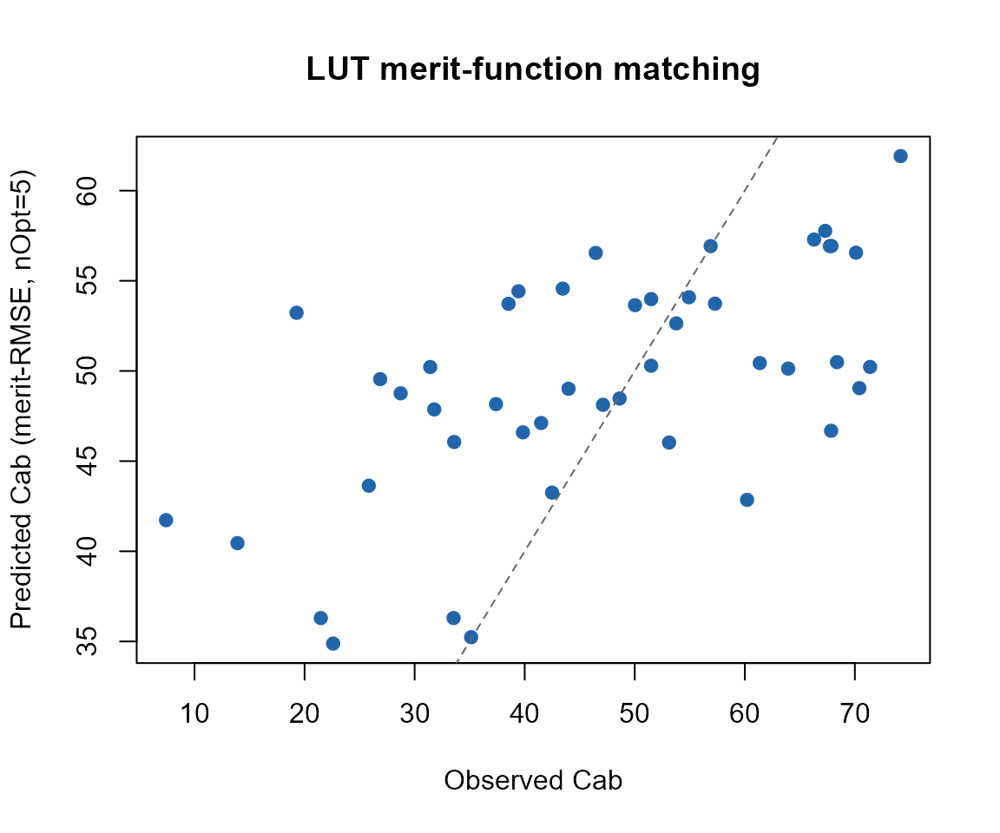

# 11. From Physics to Vegetation Traits: Hybrid Inversion

``` r

library(ToolsRTM)
```

Every tutorial so far ran the forward model: traits in, spectrum out.
**Inversion** goes the other way – given ONLY the sensor-band
reflectance a satellite or field spectrometer would measure, retrieve a
biophysical trait (chlorophyll content, `Cab`, throughout this page)
without knowing the ground truth. This is the **hybrid** approach:
instead of solving the radiative transfer equations analytically (rarely
possible) or field- calibrating an empirical index-to-trait relationship
(needs field data per site/crop), simulate a LUT with the physics you
already have, and learn the reflectance-to-trait relationship from the
simulation itself.

``` text
Parameter LUT
     |
     v
RTM simulations (Tutorials 01-06)
     |
     v
Sensor convolution (Tutorial 07)
     |
     v
Synthetic training dataset (reflectance, trait) pairs
     |
     v
Inversion method
     |
     v
Vegetation traits
```

Three inversion methods share this exact framework, differing only in
the last step:

- **[`get.inversionOpt()`](../reference/get.inversionOpt.md)** (this
  page): no model is fit at all. It ranks every spectrum in a reference
  LUT by how closely it matches an observed spectrum under a chosen
  merit function, then averages the trait values of the closest matches.
  Pure library search.
- **[`get.inversion()`](../reference/get.inversion.md)** (Tutorial 12):
  fits a statistical/ML model (Random Forest, PLSR, SVM, … 12 algorithms
  via `caret`) on a training LUT, then predicts on new spectra.
- **[`getMLmodel()`](../reference/getMLmodel.md)** (Tutorial 13): fits a
  deep-learning model on the same kind of data.

## 1. Simulate a LUT and convolve to Sentinel-2A

``` r

n_samples <- 150
LUT <- as.data.frame(getLUT(inputs = ToolsRTM::inputsPROSAIL, nLUT = n_samples, setseed = 1))

wl <- 400:2500
rsoil <- rep(0.15, length(wl))
refl <- t(sapply(seq_len(n_samples), function(i) {
  foursail(inputLUT = LUT[i, ], rsoil = rsoil, LeafModel = "PROSPECT-PRO")$rsot
}))

refl_X <- as.data.frame(refl); colnames(refl_X) <- paste0("X", wl); refl_X <- cbind(id = seq_len(nrow(refl_X)), refl_X)
se2a <- suppressMessages(get.spectra.convolved(rfl = refl_X, sensor = "Sentinel2a", plot.spectra = FALSE))
#> [1] "Spectral resampling function to SENTINEL2A is being processed ..."
#>   |                                                                              |                                                                      |   0%  |                                                                              |=====                                                                 |   8%  |                                                                              |===========                                                           |  15%  |                                                                              |================                                                      |  23%  |                                                                              |======================                                                |  31%  |                                                                              |===========================                                           |  38%  |                                                                              |================================                                      |  46%  |                                                                              |======================================                                |  54%  |                                                                              |===========================================                           |  62%  |                                                                              |================================================                      |  69%  |                                                                              |======================================================                |  77%  |                                                                              |===========================================================           |  85%  |                                                                              |=================================================================     |  92%  |                                                                              |======================================================================| 100%
wl_bands <- as.numeric(names(se2a)[-1])
band_names <- paste0("B", seq_along(wl_bands))
names(se2a) <- c("id", band_names)
```

150 simulated spectra, convolved to Sentinel-2A’s 13 real bands – this
is what every inversion method below actually sees, not the native 1nm
spectrum.

## 2. A train/test split, shared by every method

``` r

set.seed(1)
train_idx <- sample(seq_len(n_samples), size = round(0.7 * n_samples))
test_idx  <- setdiff(seq_len(n_samples), train_idx)

LUT_train <- LUT[train_idx, ]; LUT_test <- LUT[test_idx, ]
se2a_mat <- as.matrix(se2a[, band_names])
se2a_train_mat <- se2a_mat[train_idx, ]; se2a_test_mat <- se2a_mat[test_idx, ]

r2_f   <- function(obs, pred) 1 - sum((obs - pred)^2) / sum((obs - mean(obs))^2)
rmse_f <- function(obs, pred) sqrt(mean((obs - pred)^2))

cat("Train:", length(train_idx), "spectra. Test (held out):", length(test_idx), "spectra.\n")
#> Train: 105 spectra. Test (held out): 45 spectra.
```

## 3. `get.inversionOpt()`: LUT merit-function matching

`method` picks how “closeness” between two spectra is measured. `nOpt`
controls how many of the closest training spectra get averaged together
for the final trait estimate:

``` r

opt_rmse <- get.inversionOpt(rfl.sensor = se2a_test_mat, rfl.rtm = se2a_train_mat,
                              LUT = LUT_train, wave = wl_bands, method = "merit-RMSE", nOpt = 5)
opt_fge  <- get.inversionOpt(rfl.sensor = se2a_test_mat, rfl.rtm = se2a_train_mat,
                              LUT = LUT_train, wave = wl_bands, method = "merit-FGE", nOpt = 5)
opt_dwt  <- get.inversionOpt(rfl.sensor = se2a_test_mat, rfl.rtm = se2a_train_mat,
                              LUT = LUT_train, wave = wl_bands, method = "merit-DWT", nOpt = 5)
```

Each call returns a 2-element list: `[[1]]` (`rfl.b`) is the matched
reflectance itself, `[[2]]` (`LUT.best`) is the corresponding trait
table:

``` r

opt_metrics <- data.frame(
  method = c("merit-RMSE", "merit-FGE", "merit-DWT"),
  R2   = c(r2_f(LUT_test$Cab, opt_rmse[[2]]$Cab), r2_f(LUT_test$Cab, opt_fge[[2]]$Cab), r2_f(LUT_test$Cab, opt_dwt[[2]]$Cab)),
  RMSE = c(rmse_f(LUT_test$Cab, opt_rmse[[2]]$Cab), rmse_f(LUT_test$Cab, opt_fge[[2]]$Cab), rmse_f(LUT_test$Cab, opt_dwt[[2]]$Cab))
)
knitr::kable(opt_metrics, digits = 3)
```

| method     |    R2 |   RMSE |
|:-----------|------:|-------:|
| merit-RMSE | 0.287 | 14.472 |
| merit-FGE  | 0.590 | 10.977 |
| merit-DWT  | 0.251 | 14.832 |

`merit-RMSE`/`merit-FGE` compare raw band reflectance; `merit-DWT`
compares each spectrum’s discrete wavelet transform coefficients instead
(sensitive to overall spectral shape rather than each band’s exact
value). `merit-NRMSE`, `merit-MAE`, `merit-NMB`, and `merit-1stD`
(first-derivative matching) are the remaining built-in options;
`custom_stat` accepts your own `function(sim, obs)`.

``` r

plot(LUT_test$Cab, opt_rmse[[2]]$Cab, pch = 19, col = "#2166AC",
     xlab = "Observed Cab", ylab = "Predicted Cab (merit-RMSE, nOpt=5)",
     main = "LUT merit-function matching")
abline(0, 1, col = "grey40", lty = 2)
```



## Why this method, and when

[`get.inversionOpt()`](../reference/get.inversionOpt.md) needs no
training step – a quick, physically- grounded retrieval with no ML
infrastructure. Its limitation: accuracy is capped by how well the
reference LUT covers the true trait space, and it re-searches the whole
reference LUT for every new observation (no learned model to reuse).
Tutorial 12 builds actual fitted models instead, trading that simplicity
for better accuracy at scale.

## 4. Is 150 samples actually enough?

**No – and the numbers above prove it, not just assert it.** A
LUT-search method’s accuracy is capped by how densely its reference LUT
covers the trait space; PROSAIL-hybrid-inversion literature typically
recommends LUT sizes in the thousands (often tens of thousands for
operational retrieval) for reliable coverage of even a handful of free
parameters. 150 rows – 105 of them used as the search reference after
the train/test split – is far below that. To make the effect concrete
rather than just cite a number, here is
[`get.inversionOpt()`](../reference/get.inversionOpt.md) run at ~5% of a
modest 2000-sample recommended minimum (100 rows) against the full 2000:

``` r

run_experiment <- function(n_samples, seed = 1) {
  LUT_n <- as.data.frame(getLUT(inputs = ToolsRTM::inputsPROSAIL, nLUT = n_samples, setseed = seed))
  refl_n <- t(sapply(seq_len(n_samples), function(i) {
    foursail(inputLUT = LUT_n[i, ], rsoil = rsoil, LeafModel = "PROSPECT-PRO")$rsot
  }))
  refl_X_n <- as.data.frame(refl_n); colnames(refl_X_n) <- paste0("X", wl)
  refl_X_n <- cbind(id = seq_len(nrow(refl_X_n)), refl_X_n)
  se2a_n <- suppressMessages(get.spectra.convolved(rfl = refl_X_n, sensor = "Sentinel2a", plot.spectra = FALSE))
  names(se2a_n) <- c("id", band_names)

  set.seed(seed)
  train_idx_n <- sample(seq_len(n_samples), size = round(0.7 * n_samples))
  test_idx_n  <- setdiff(seq_len(n_samples), train_idx_n)
  se2a_n_mat <- as.matrix(se2a_n[, band_names])

  opt_n <- get.inversionOpt(rfl.sensor = se2a_n_mat[test_idx_n, ], rfl.rtm = se2a_n_mat[train_idx_n, ],
                             LUT = LUT_n[train_idx_n, ], wave = wl_bands, method = "merit-RMSE", nOpt = 5)
  data.frame(n = n_samples, n_train = length(train_idx_n),
             R2 = r2_f(LUT_n[test_idx_n, ]$Cab, opt_n[[2]]$Cab),
             RMSE = rmse_f(LUT_n[test_idx_n, ]$Cab, opt_n[[2]]$Cab))
}
sample_size_results <- rbind(run_experiment(100), run_experiment(2000))
#> [1] "Spectral resampling function to SENTINEL2A is being processed ..."
#>   |                                                                              |                                                                      |   0%  |                                                                              |=====                                                                 |   8%  |                                                                              |===========                                                           |  15%  |                                                                              |================                                                      |  23%  |                                                                              |======================                                                |  31%  |                                                                              |===========================                                           |  38%  |                                                                              |================================                                      |  46%  |                                                                              |======================================                                |  54%  |                                                                              |===========================================                           |  62%  |                                                                              |================================================                      |  69%  |                                                                              |======================================================                |  77%  |                                                                              |===========================================================           |  85%  |                                                                              |=================================================================     |  92%  |                                                                              |======================================================================| 100%
#>   |                                                                              |                                                                      |   0%  |                                                                              |==                                                                    |   3%  |                                                                              |=====                                                                 |   7%  |                                                                              |=======                                                               |  10%  |                                                                              |=========                                                             |  13%  |                                                                              |============                                                          |  17%  |                                                                              |==============                                                        |  20%  |                                                                              |================                                                      |  23%  |                                                                              |===================                                                   |  27%  |                                                                              |=====================                                                 |  30%  |                                                                              |=======================                                               |  33%  |                                                                              |==========================                                            |  37%  |                                                                              |============================                                          |  40%  |                                                                              |==============================                                        |  43%  |                                                                              |=================================                                     |  47%  |                                                                              |===================================                                   |  50%  |                                                                              |=====================================                                 |  53%  |                                                                              |========================================                              |  57%  |                                                                              |==========================================                            |  60%  |                                                                              |============================================                          |  63%  |                                                                              |===============================================                       |  67%  |                                                                              |=================================================                     |  70%  |                                                                              |===================================================                   |  73%  |                                                                              |======================================================                |  77%  |                                                                              |========================================================              |  80%  |                                                                              |==========================================================            |  83%  |                                                                              |=============================================================         |  87%  |                                                                              |===============================================================       |  90%  |                                                                              |=================================================================     |  93%  |                                                                              |====================================================================  |  97%  |                                                                              |======================================================================| 100%
#> [1] "Spectral resampling function to SENTINEL2A is being processed ..."
#>   |                                                                              |                                                                      |   0%  |                                                                              |=====                                                                 |   8%  |                                                                              |===========                                                           |  15%  |                                                                              |================                                                      |  23%  |                                                                              |======================                                                |  31%  |                                                                              |===========================                                           |  38%  |                                                                              |================================                                      |  46%  |                                                                              |======================================                                |  54%  |                                                                              |===========================================                           |  62%  |                                                                              |================================================                      |  69%  |                                                                              |======================================================                |  77%  |                                                                              |===========================================================           |  85%  |                                                                              |=================================================================     |  92%  |                                                                              |======================================================================| 100%
#>   |                                                                              |                                                                      |   0%  |                                                                              |                                                                      |   1%  |                                                                              |=                                                                     |   1%  |                                                                              |=                                                                     |   2%  |                                                                              |==                                                                    |   2%  |                                                                              |==                                                                    |   3%  |                                                                              |==                                                                    |   4%  |                                                                              |===                                                                   |   4%  |                                                                              |===                                                                   |   5%  |                                                                              |====                                                                  |   5%  |                                                                              |====                                                                  |   6%  |                                                                              |=====                                                                 |   6%  |                                                                              |=====                                                                 |   7%  |                                                                              |=====                                                                 |   8%  |                                                                              |======                                                                |   8%  |                                                                              |======                                                                |   9%  |                                                                              |=======                                                               |   9%  |                                                                              |=======                                                               |  10%  |                                                                              |=======                                                               |  11%  |                                                                              |========                                                              |  11%  |                                                                              |========                                                              |  12%  |                                                                              |=========                                                             |  12%  |                                                                              |=========                                                             |  13%  |                                                                              |=========                                                             |  14%  |                                                                              |==========                                                            |  14%  |                                                                              |==========                                                            |  15%  |                                                                              |===========                                                           |  15%  |                                                                              |===========                                                           |  16%  |                                                                              |============                                                          |  16%  |                                                                              |============                                                          |  17%  |                                                                              |============                                                          |  18%  |                                                                              |=============                                                         |  18%  |                                                                              |=============                                                         |  19%  |                                                                              |==============                                                        |  19%  |                                                                              |==============                                                        |  20%  |                                                                              |==============                                                        |  21%  |                                                                              |===============                                                       |  21%  |                                                                              |===============                                                       |  22%  |                                                                              |================                                                      |  22%  |                                                                              |================                                                      |  23%  |                                                                              |================                                                      |  24%  |                                                                              |=================                                                     |  24%  |                                                                              |=================                                                     |  25%  |                                                                              |==================                                                    |  25%  |                                                                              |==================                                                    |  26%  |                                                                              |===================                                                   |  26%  |                                                                              |===================                                                   |  27%  |                                                                              |===================                                                   |  28%  |                                                                              |====================                                                  |  28%  |                                                                              |====================                                                  |  29%  |                                                                              |=====================                                                 |  29%  |                                                                              |=====================                                                 |  30%  |                                                                              |=====================                                                 |  31%  |                                                                              |======================                                                |  31%  |                                                                              |======================                                                |  32%  |                                                                              |=======================                                               |  32%  |                                                                              |=======================                                               |  33%  |                                                                              |=======================                                               |  34%  |                                                                              |========================                                              |  34%  |                                                                              |========================                                              |  35%  |                                                                              |=========================                                             |  35%  |                                                                              |=========================                                             |  36%  |                                                                              |==========================                                            |  36%  |                                                                              |==========================                                            |  37%  |                                                                              |==========================                                            |  38%  |                                                                              |===========================                                           |  38%  |                                                                              |===========================                                           |  39%  |                                                                              |============================                                          |  39%  |                                                                              |============================                                          |  40%  |                                                                              |============================                                          |  41%  |                                                                              |=============================                                         |  41%  |                                                                              |=============================                                         |  42%  |                                                                              |==============================                                        |  42%  |                                                                              |==============================                                        |  43%  |                                                                              |==============================                                        |  44%  |                                                                              |===============================                                       |  44%  |                                                                              |===============================                                       |  45%  |                                                                              |================================                                      |  45%  |                                                                              |================================                                      |  46%  |                                                                              |=================================                                     |  46%  |                                                                              |=================================                                     |  47%  |                                                                              |=================================                                     |  48%  |                                                                              |==================================                                    |  48%  |                                                                              |==================================                                    |  49%  |                                                                              |===================================                                   |  49%  |                                                                              |===================================                                   |  50%  |                                                                              |===================================                                   |  51%  |                                                                              |====================================                                  |  51%  |                                                                              |====================================                                  |  52%  |                                                                              |=====================================                                 |  52%  |                                                                              |=====================================                                 |  53%  |                                                                              |=====================================                                 |  54%  |                                                                              |======================================                                |  54%  |                                                                              |======================================                                |  55%  |                                                                              |=======================================                               |  55%  |                                                                              |=======================================                               |  56%  |                                                                              |========================================                              |  56%  |                                                                              |========================================                              |  57%  |                                                                              |========================================                              |  58%  |                                                                              |=========================================                             |  58%  |                                                                              |=========================================                             |  59%  |                                                                              |==========================================                            |  59%  |                                                                              |==========================================                            |  60%  |                                                                              |==========================================                            |  61%  |                                                                              |===========================================                           |  61%  |                                                                              |===========================================                           |  62%  |                                                                              |============================================                          |  62%  |                                                                              |============================================                          |  63%  |                                                                              |============================================                          |  64%  |                                                                              |=============================================                         |  64%  |                                                                              |=============================================                         |  65%  |                                                                              |==============================================                        |  65%  |                                                                              |==============================================                        |  66%  |                                                                              |===============================================                       |  66%  |                                                                              |===============================================                       |  67%  |                                                                              |===============================================                       |  68%  |                                                                              |================================================                      |  68%  |                                                                              |================================================                      |  69%  |                                                                              |=================================================                     |  69%  |                                                                              |=================================================                     |  70%  |                                                                              |=================================================                     |  71%  |                                                                              |==================================================                    |  71%  |                                                                              |==================================================                    |  72%  |                                                                              |===================================================                   |  72%  |                                                                              |===================================================                   |  73%  |                                                                              |===================================================                   |  74%  |                                                                              |====================================================                  |  74%  |                                                                              |====================================================                  |  75%  |                                                                              |=====================================================                 |  75%  |                                                                              |=====================================================                 |  76%  |                                                                              |======================================================                |  76%  |                                                                              |======================================================                |  77%  |                                                                              |======================================================                |  78%  |                                                                              |=======================================================               |  78%  |                                                                              |=======================================================               |  79%  |                                                                              |========================================================              |  79%  |                                                                              |========================================================              |  80%  |                                                                              |========================================================              |  81%  |                                                                              |=========================================================             |  81%  |                                                                              |=========================================================             |  82%  |                                                                              |==========================================================            |  82%  |                                                                              |==========================================================            |  83%  |                                                                              |==========================================================            |  84%  |                                                                              |===========================================================           |  84%  |                                                                              |===========================================================           |  85%  |                                                                              |============================================================          |  85%  |                                                                              |============================================================          |  86%  |                                                                              |=============================================================         |  86%  |                                                                              |=============================================================         |  87%  |                                                                              |=============================================================         |  88%  |                                                                              |==============================================================        |  88%  |                                                                              |==============================================================        |  89%  |                                                                              |===============================================================       |  89%  |                                                                              |===============================================================       |  90%  |                                                                              |===============================================================       |  91%  |                                                                              |================================================================      |  91%  |                                                                              |================================================================      |  92%  |                                                                              |=================================================================     |  92%  |                                                                              |=================================================================     |  93%  |                                                                              |=================================================================     |  94%  |                                                                              |==================================================================    |  94%  |                                                                              |==================================================================    |  95%  |                                                                              |===================================================================   |  95%  |                                                                              |===================================================================   |  96%  |                                                                              |====================================================================  |  96%  |                                                                              |====================================================================  |  97%  |                                                                              |====================================================================  |  98%  |                                                                              |===================================================================== |  98%  |                                                                              |===================================================================== |  99%  |                                                                              |======================================================================|  99%  |                                                                              |======================================================================| 100%
knitr::kable(sample_size_results, digits = 3, row.names = FALSE)
```

|    n | n_train |     R2 |   RMSE |
|-----:|--------:|-------:|-------:|
|  100 |      70 | -0.080 | 15.183 |
| 2000 |    1400 |  0.648 |  9.465 |

At 100 samples (~5% of a 2000-sample recommended minimum), R² is
effectively zero or negative – the method has no real skill, matching
random guessing. At 2000, real, usable skill emerges. **The 150-sample
LUT used throughout Sections 1-3 above is a deliberately small
demonstration size, chosen to keep this page’s build time reasonable –
not a size to copy for real trait retrieval.** For actual applications,
build a LUT of at least a few thousand rows (Tutorial 06 covers
parallelizing exactly that).

## What’s next

- **Tutorial 12** – [`get.inversion()`](../reference/get.inversion.md):
  12 ML algorithms, compared on this same LUT.
- **Tutorial 13** – [`getMLmodel()`](../reference/getMLmodel.md): deep
  learning on the same data.
- **Tutorial 14** – the full pipeline end-to-end, LUT to trait maps.
