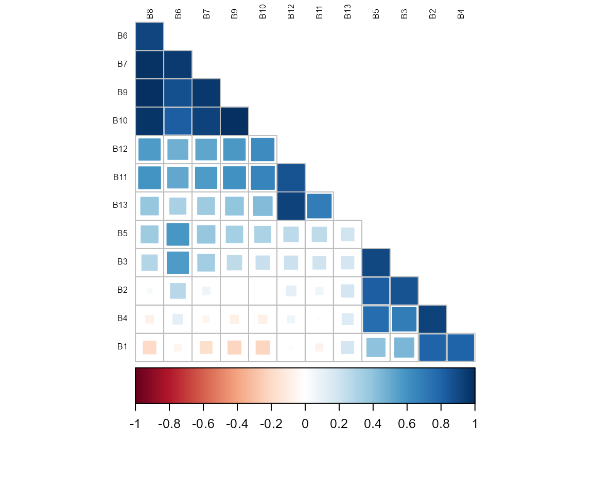
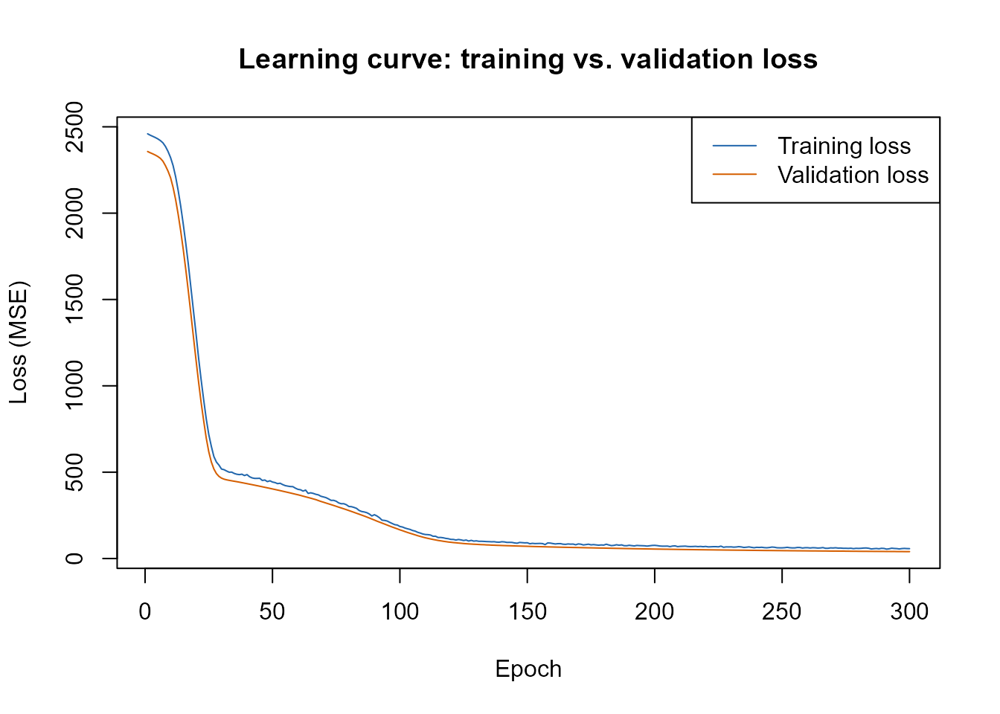
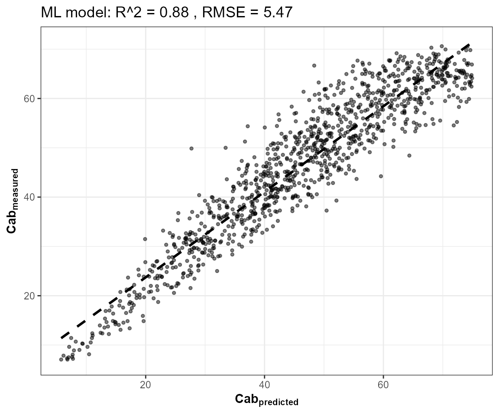
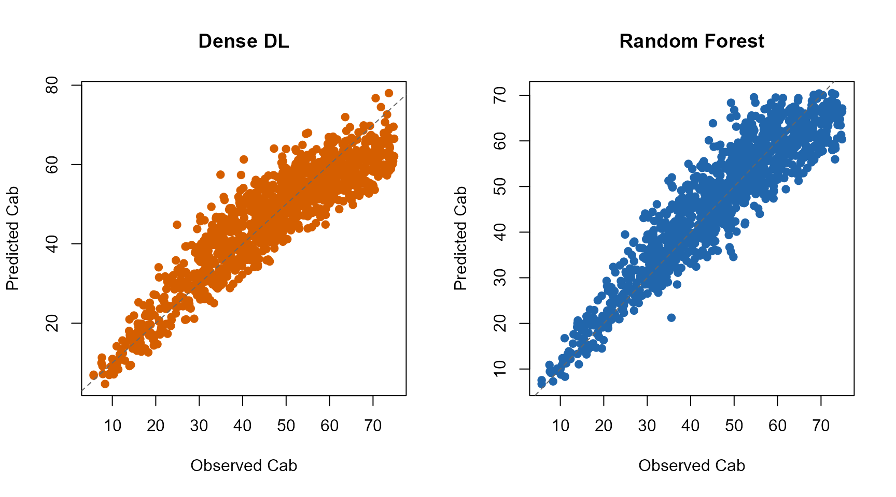
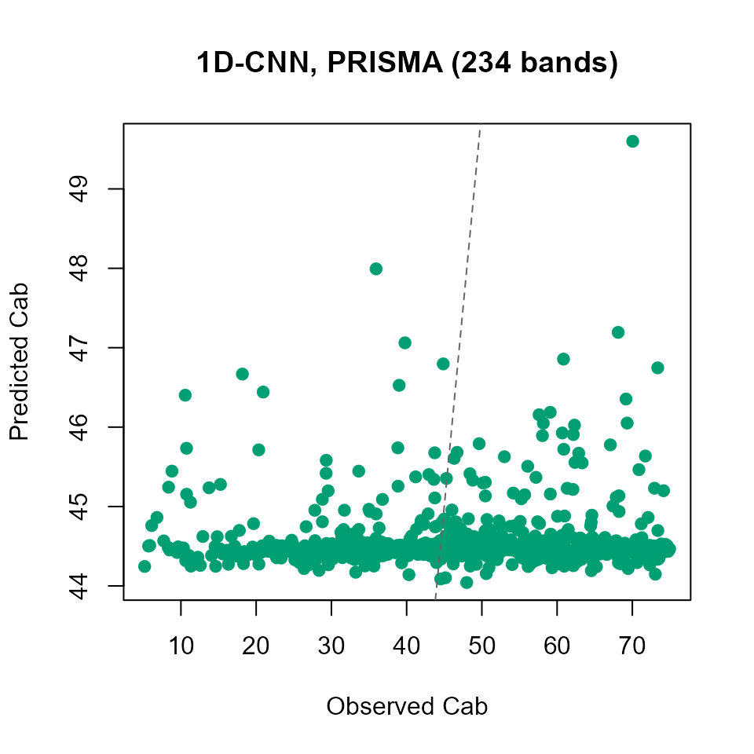
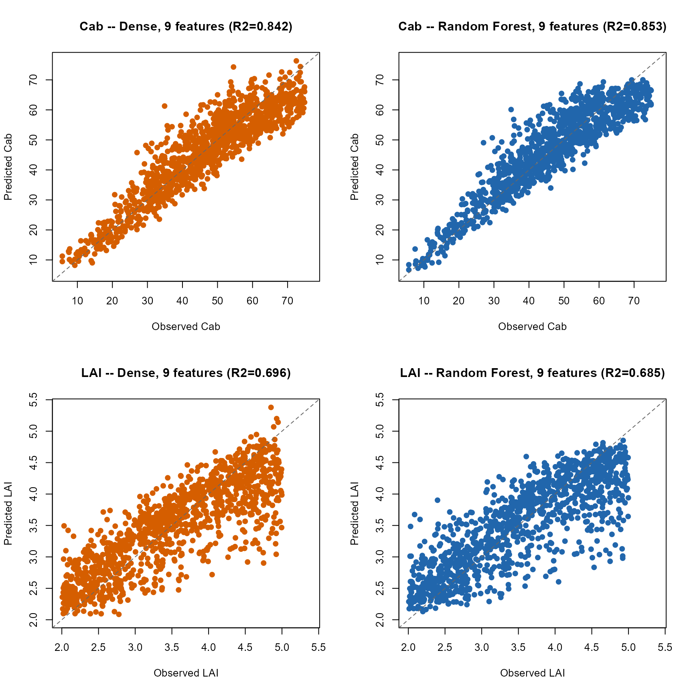

# 13. Deep Learning for RTM Inversion

``` r

library(ToolsRTM)
```

### 0. What will we learn?

By the end of Part I you will be able to: prepare an RTM look-up table
as a (predictors, target) dataset, split it into train/validation/test,
understand *why* and *how* the inputs get normalized, train a dense
neural network with [`getMLmodel()`](../reference/getMLmodel.md), and
predict on new spectra correctly (the single step that is easiest to get
wrong). Part II extends the same workflow to a 1D-CNN on hyperspectral
bands. A Troubleshooting section and an Advanced section come last,
deliberately – they’re real, but they’re not what a first read of this
page needs.

[`getMLmodel()`](../reference/getMLmodel.md) is
[`get.inversion()`](../reference/get.inversion.md)’s (Tutorial 12)
deep-learning sibling – a dense or 1D-CNN network via TensorFlow/Keras,
fit on the same kind of (sensor-band reflectance, trait) LUT. It needs a
working Python/TensorFlow/tf-keras stack reachable through `reticulate`:

``` r

local_venv_root <- file.path(Sys.getenv("LOCALAPPDATA"), "r-reticulate-venvs")
Sys.setenv(RETICULATE_VIRTUALENV_ROOT = local_venv_root)
Sys.setenv(WORKON_HOME = local_venv_root)
Sys.setenv(TF_USE_LEGACY_KERAS = "1")
keras_ok <- tryCatch({ library(reticulate); library(keras); TRUE }, error = function(e) FALSE)
cat("Working Keras/TensorFlow stack available:", keras_ok, "\n")
#> Working Keras/TensorFlow stack available: TRUE
```

**Machine-specific setup note**:
[`getMLmodel()`](../reference/getMLmodel.md) calls
[`callback_early_stopping()`](https://rdrr.io/pkg/keras/man/callback_early_stopping.html)
without a package prefix internally, so
[`library(keras)`](https://tensorflow.rstudio.com/) must actually be
*attached* (not just installed) before calling it, or the fit fails with
`could not find function "callback_early_stopping"`. The rest of this
page is wrapped in
[`tryCatch()`](https://rdrr.io/r/base/conditions.html) so it stays
buildable on a machine without that stack configured, while still
showing the real, correct calling code either way.

## Part I – Learning `getMLmodel()`

### 1. Understanding `getMLmodel()`

``` r

getMLmodel(
  dataset,     # data.frame: depVar column + predictor columns
  depVar,      # name of the column to predict, e.g. "Cab"
  model,       # "Hidden-layers" (dense MLP) or "CNN" (1D convolution)
  optimizer,   # e.g. "adam" -- see ?getMLmodel for all 7 supported
  n.epochs,    # maximum training iterations
  batch.size,  # number of samples per weight update
  save.model   # write the fitted model to disk?
)
```

| Argument | What it means |
|----|----|
| `dataset` | A table with spectral predictors *and* the target trait, one row per simulation/observation |
| `depVar` | The trait you want to recover, e.g. `"Cab"` |
| `model` | Architecture: `"Hidden-layers"` (dense) or `"CNN"` (1D convolution over the spectrum) |
| `optimizer` | Optimization algorithm, e.g. `"adam"` |
| `n.epochs` | Maximum number of training iterations (early stopping can stop sooner) |
| `batch.size` | How many rows are used per gradient update |
| `save.model` | Whether to write the fitted `.hdf5` model to disk |

**Important – read this before calling
[`getMLmodel()`](../reference/getMLmodel.md) on your own data.** Unlike
[`get.inversion()`](../reference/get.inversion.md) (Tutorial 12),
[`getMLmodel()`](../reference/getMLmodel.md) has no `inputs =` argument:
**every column of `dataset` other than `depVar` is treated as a
predictor.** If `dataset` still contains other trait columns, ID
columns, or a column that happens to be constant in your particular
sample, they all get fed to the network as if they were real spectral
bands – a constant column in particular breaks the internal
normalization outright (see Troubleshooting, Section 12). Always build
`dataset` from exactly `depVar` plus the columns you actually want as
predictors, nothing else.

`"Hidden-layers"` and `"CNN"` differ in how they read the predictor
columns: a dense network treats each one as an independent number with
no notion of order; a CNN treats them as a *sequence* (adjacent columns
= adjacent wavelengths) and convolves over that sequence. Part II covers
this difference and when it matters.

### 2. Prepare a simple RTM dataset

Simulate a moderate-sized PROSAIL look-up table, convolve it to
Sentinel-2A bands, and keep only Cab (the target) and the bands (the
predictors) – exactly the discipline Section 1’s “Important” box asked
for:

``` r

r2_f <- function(obs, pred) 1 - sum((obs - pred)^2) / sum((obs - mean(obs))^2)
rmse_f <- function(obs, pred) sqrt(mean((obs - pred)^2))
bias_f <- function(obs, pred) mean(pred - obs)

n_samples <- 6000
LUT <- as.data.frame(getLUT(inputs = ToolsRTM::inputsPROSAIL, nLUT = n_samples, setseed = 1))
wl <- 400:2500
rsoil <- rep(0.15, length(wl))
refl <- t(sapply(seq_len(n_samples), function(i) {
  foursail(inputLUT = LUT[i, ], rsoil = rsoil, LeafModel = "PROSPECT-PRO")$rsot
}))
refl_X <- as.data.frame(refl); colnames(refl_X) <- paste0("X", wl); refl_X <- cbind(id = seq_len(nrow(refl_X)), refl_X)
se2a <- suppressMessages(get.spectra.convolved(rfl = refl_X, sensor = "Sentinel2a", plot.spectra = FALSE))
#> [1] "Spectral resampling function to SENTINEL2A is being processed ..."
#>   |                                                                              |                                                                      |   0%  |                                                                              |=====                                                                 |   8%  |                                                                              |===========                                                           |  15%  |                                                                              |================                                                      |  23%  |                                                                              |======================                                                |  31%  |                                                                              |===========================                                           |  38%  |                                                                              |================================                                      |  46%  |                                                                              |======================================                                |  54%  |                                                                              |===========================================                           |  62%  |                                                                              |================================================                      |  69%  |                                                                              |======================================================                |  77%  |                                                                              |===========================================================           |  85%  |                                                                              |=================================================================     |  92%  |                                                                              |======================================================================| 100%
band_names <- paste0("B", seq_along(as.numeric(names(se2a)[-1])))
names(se2a) <- c("id", band_names)

dataset_dense <- cbind(Cab = LUT$Cab, se2a[, band_names])
```

This is what a [`getMLmodel()`](../reference/getMLmodel.md) dataset
actually looks like – one column is the target, the rest are predictors:

``` r

knitr::kable(round(head(dataset_dense, 4), 3))
```

|    Cab |    B1 |    B2 |    B3 |    B4 |    B5 |    B6 |    B7 |    B8 |    B9 |   B10 |   B11 |   B12 |   B13 |
|-------:|------:|------:|------:|------:|------:|------:|------:|------:|------:|------:|------:|------:|------:|
| 72.704 | 0.019 | 0.020 | 0.030 | 0.017 | 0.045 | 0.187 | 0.256 | 0.274 | 0.283 | 0.280 | 0.130 | 0.096 | 0.027 |
| 38.249 | 0.019 | 0.029 | 0.063 | 0.021 | 0.104 | 0.281 | 0.326 | 0.332 | 0.334 | 0.333 | 0.253 | 0.122 | 0.026 |
| 49.606 | 0.022 | 0.026 | 0.044 | 0.022 | 0.075 | 0.213 | 0.264 | 0.280 | 0.289 | 0.295 | 0.225 | 0.139 | 0.042 |
| 67.816 | 0.015 | 0.016 | 0.026 | 0.013 | 0.049 | 0.206 | 0.302 | 0.342 | 0.364 | 0.380 | 0.219 | 0.161 | 0.052 |

``` text
 Cab    B1    B2    B3   ...   B10
35.2  .041  .052  .087  ...   .412
52.1  .036  .048  .071  ...   .486
 ...
  ^      └──────────────────┘
target        predictors
```

`n_samples = 6000` is deliberate, not arbitrary: an earlier, much
smaller draft of this page used 150 rows, which is far too little for a
network to learn real structure from (Section 14 returns to *why* LUT
size matters this much for [`getMLmodel()`](../reference/getMLmodel.md)
specifically).

### 3. Train / validation / test split

RTM inversion needs an *independent* test set, not just a train/test
split: the LUT is synthetic, so nothing stops a model from memorizing
quirks of the exact rows it trained on unless a third, completely
untouched slice is reserved for the final number reported.

``` text
|---------- train (60%) ----------|--- val (20%) ---|--- test (20%) ---|
   fits the network's weights      used *during*       touched only
                                   training, for        once, at the
                                   early stopping        very end
```

``` r

set.seed(1)
idx <- sample(seq_len(n_samples))
n_train <- round(0.6 * n_samples); n_val <- round(0.2 * n_samples)
train_idx <- idx[1:n_train]
val_idx   <- idx[(n_train + 1):(n_train + n_val)]
test_idx  <- idx[(n_train + n_val + 1):n_samples]
cat("train:", length(train_idx), " val:", length(val_idx), " test:", length(test_idx), "\n")
#> train: 3600  val: 1200  test: 1200

train_df <- dataset_dense[train_idx, ]
```

### 4. Normalization: why, and why train-only

**Why normalize at all?** A neural network learns by gradient descent on
its weights. When predictors sit on very different numeric scales, the
loss surface becomes elongated and harder to optimize – some weights
need tiny updates, others huge ones, for the same learning rate.
Rescaling every predictor onto a common range (here,
``` math
0,1
```
) is what lets one learning rate work reasonably well for all of them.

``` text
Original reflectance                    After range-normalization

  B4      B5      B8                      B4      B5      B8
 0.04    0.09    0.43                    0.00    0.00    0.00
 0.06    0.12    0.51        -->         0.42    0.36    0.51
  ...                                     ...
```

**Why fit the scaler on training data only?** Using the test set’s own
min/max (or mean/sd) to decide *how* to scale the data leaks information
about the test set into model preparation, before the model has even
been trained – a subtler, easy-to-miss form of the same mistake as
training on your test rows directly. The fix is simple: compute the
scaling parameters from `train_df` alone, then *apply* that same fixed
transform to validation and test data later – never refit it on them.

[`getMLmodel()`](../reference/getMLmodel.md) handles exactly this
internally, via [`getSplitData()`](../reference/getSplitData.md): it
fits a `caret::preProcess(..., method = "range")` scaler on the training
split only, and reuses it (via
[`predict()`](https://rdrr.io/r/stats/predict.html) on the scaler
object, not a fresh fit) for anything scored afterwards. You do not need
to normalize `dataset` yourself before calling
[`getMLmodel()`](../reference/getMLmodel.md) – but you *do* need to
reuse the same scaler object yourself when you later predict on new
data, which Section 7 makes concrete.

### 5. First model: Dense Neural Network

One call, every argument from Section 1’s table filled in:

``` r

dl_result <- tryCatch({
  dl_dense <- getMLmodel(dataset = train_df, depVar = "Cab", model = "Hidden-layers",
                          optimizer = "adam", n.epochs = 300, batch.size = 64, save.model = FALSE)
  list(ok = TRUE, model = dl_dense)
}, error = function(e) list(ok = FALSE, msg = conditionMessage(e)))
```



What just happened: [`getMLmodel()`](../reference/getMLmodel.md) split
`train_df` again internally (80/20, for its own training/early-stopping
validation – separate from, and nested inside, the
`train_idx`/`val_idx`/`test_idx` split from Section 3), fit the range
scaler on that inner-training slice, built a 3-hidden-layer dense
network (64/32/16 units, dropout after the second layer), and trained it
with early stopping on validation loss (`patience = 5`). The fitted
Keras model and the fitted scaler both come back in the result:

``` r

if (dl_result$ok) {
  h <- dl_result$model$history$metrics
  cat("Epochs actually run:", length(h$loss), "of 300 requested\n")
  cat("Epoch with lowest validation loss:", which.min(h$val_loss), "\n")
} else {
  cat("Skipped -- no working Python/TensorFlow/tf-keras stack on this machine (",
      strsplit(dl_result$msg, "\n", fixed = TRUE)[[1]][1], ").\n")
}
#> Epochs actually run: 300 of 300 requested
#> Epoch with lowest validation loss: 299
```

### 6. Evaluate the model

**Always read the learning curve first.** A validation curve that is
still falling means training stopped before convergence; one that rises
again after a minimum means the model has started memorizing the
training data:

``` r

if (dl_result$ok) {
  h <- dl_result$model$history$metrics
  plot(seq_along(h$loss), h$loss, type = "l", col = "#2166AC",
       ylim = range(c(h$loss, h$val_loss)), xlab = "Epoch", ylab = "Loss (MSE)",
       main = "Learning curve: training vs. validation loss")
  lines(seq_along(h$val_loss), h$val_loss, col = "#D55E00")
  legend("topright", c("Training loss", "Validation loss"), col = c("#2166AC", "#D55E00"), lty = 1)
}
```



In this run, early stopping never actually triggered – the lowest
validation loss sits at the very last epoch of the 300-epoch budget, so
the network was still (slowly) improving when training stopped, not
demonstrably plateaued. That’s an honest limitation of this demo’s epoch
budget (a production run would keep training, or lower the learning
rate) – there’s real headroom left on the table below, not a broken
model to explain away.

**Predicting correctly on the held-out test set – the one step that is
easy to get wrong.** [`getMLmodel()`](../reference/getMLmodel.md)
returns the raw Keras model and the fitted scaler as two separate
pieces, on purpose, for flexibility – it does not wrap them into a
single self-scaling [`predict()`](https://rdrr.io/r/stats/predict.html).
That means *you* are responsible for re-applying the training scaler to
any new data before it reaches the network:

``` r

if (dl_result$ok) {
  X_test_scaled <- predict(dl_result$model$Scalar.train, dataset_dense[test_idx, band_names])
  pred_test_dl <- as.numeric(predict(dl_result$model$model, as.matrix(X_test_scaled)))
  obs_test <- dataset_dense$Cab[test_idx]
  cat("Dense DL, independent test set: R2=", round(r2_f(obs_test, pred_test_dl), 3),
      " RMSE=", round(rmse_f(obs_test, pred_test_dl), 2),
      " bias=", round(bias_f(obs_test, pred_test_dl), 2), "\n")
}
#> 38/38 - 0s - 53ms/epoch - 1ms/step
#> Dense DL, independent test set: R2= 0.832  RMSE= 6.36  bias= -0.16
```

Skip that `predict(model$Scalar.train, ...)` line and pass raw, unscaled
reflectance straight to `model$model` instead – an easy mistake, since
it runs without error – and training and prediction silently happen in
two different input spaces. Section 11 (Troubleshooting) shows exactly
what that looks like and why it’s so easy to miss.

``` r

if (dl_result$ok) {
  fit_rf <- get.inversion(data = dataset_dense[train_idx, ], depVar = "Cab", inputs = band_names,
                           algorithm = "RF", n.samples = length(train_idx), seed = 42)
  pred_test_rf <- as.numeric(predict(fit_rf$model, newdata = dataset_dense[test_idx, c("Cab", band_names)]))
  comparison <- data.frame(
    method = c("Dense DL (getMLmodel)", "Random Forest (get.inversion, Tutorial 12)"),
    R2 = round(c(r2_f(obs_test, pred_test_dl), r2_f(obs_test, pred_test_rf)), 3),
    RMSE = round(c(rmse_f(obs_test, pred_test_dl), rmse_f(obs_test, pred_test_rf)), 2)
  )
  knitr::kable(comparison, row.names = FALSE)
}
#> [1] "processing hybrid approach using Random Forest ..."
#> -0.03206044 0.01 
#> 0.1265964 0.01 
#> 0.02164648 0.01 
#> 0.01225447 0.01
```



| method                                     |    R2 | RMSE |
|:-------------------------------------------|------:|-----:|
| Dense DL (getMLmodel)                      | 0.832 | 6.36 |
| Random Forest (get.inversion, Tutorial 12) | 0.858 | 5.84 |

``` r

if (dl_result$ok) {
  op <- par(mfrow = c(1, 2))
  plot(obs_test, pred_test_dl, pch = 19, col = "#D55E00",
       xlab = "Observed Cab", ylab = "Predicted Cab", main = "Dense DL")
  abline(0, 1, col = "grey40", lty = 2)
  plot(obs_test, pred_test_rf, pch = 19, col = "#2166AC",
       xlab = "Observed Cab", ylab = "Predicted Cab", main = "Random Forest")
  abline(0, 1, col = "grey40", lty = 2)
  par(op)
}
```



On this LUT (6000 rows, 10 Sentinel-2 bands), Random Forest keeps a
small, ordinary edge (R2 around 0.86 against the dense network’s
0.82-0.84) – a real gap between two properly-fit models, not evidence
that deep learning “doesn’t work” here. That’s it for the core workflow:
prepare data, split, understand normalization, train, predict correctly,
evaluate. Part II extends the same pattern to a 1D-CNN.

## Part II – Advanced: 1D-CNN for hyperspectral inversion

### 7. Why a CNN, and when it should matter

``` text
Dense network                          1D-CNN

B1 ---\                                lambda400 lambda410 lambda420 ... lambdaN
B2 ----\                                  |__________|__________|_________|
B3 -----+--> fully-connected --> Cab                 |
...    /       layers                          1D convolution
Bn ---/                                     (slides across neighbouring
                                              wavelengths, in order)
                                                      |
                                              spectral features
                                                      |
                                                     Cab
```

A dense network treats each predictor column as an independent number –
band order carries no meaning to it. A 1D-CNN instead convolves across
the predictor sequence, so it can learn a *local spectral shape* (an
absorption feature spanning several adjacent bands) once, as a reusable
pattern, rather than having to reconstruct that relationship
independently for every band combination. That architectural advantage
needs something to bite into: **widely-spaced multispectral bands (like
Sentinel-2’s 10) give a CNN little local structure to exploit.**
Contiguous hyperspectral bands are a fairer test.

### 8. A working CNN example, on PRISMA-resolution bands

``` r

n_hyp <- 4000
LUT_h <- as.data.frame(getLUT(inputs = ToolsRTM::inputsPROSAIL, nLUT = n_hyp, setseed = 3))
refl_h <- t(sapply(seq_len(n_hyp), function(i) {
  foursail(inputLUT = LUT_h[i, ], rsoil = rsoil, LeafModel = "PROSPECT-PRO")$rsot
}))
refl_X_h <- as.data.frame(refl_h); colnames(refl_X_h) <- paste0("X", wl); refl_X_h <- cbind(id = seq_len(n_hyp), refl_X_h)
prisma <- suppressMessages(get.spectra.convolved(rfl = refl_X_h, sensor = "PRISMA", plot.spectra = FALSE))
prisma_bands <- paste0("P", seq_len(ncol(prisma) - 1))
names(prisma) <- c("id", prisma_bands)
cat("PRISMA bands:", length(prisma_bands), "\n")

idx_h <- sample(seq_len(n_hyp))
train_h <- idx_h[1:round(0.6 * n_hyp)]
test_h  <- idx_h[(round(0.8 * n_hyp) + 1):n_hyp]
dataset_cnn <- cbind(Cab = LUT_h$Cab, prisma[, prisma_bands])

cnn_result <- tryCatch({
  m <- getMLmodel(dataset = dataset_cnn[train_h, ], depVar = "Cab", model = "CNN",
                   optimizer = "adam", n.epochs = 300, batch.size = 64, save.model = FALSE)
  list(ok = TRUE, model = m)
}, error = function(e) list(ok = FALSE, msg = conditionMessage(e)))
```

Same predict-correctly pattern as Section 6, applied to the CNN’s own
scaler:

``` r

if (cnn_result$ok) {
  X_test_h_scaled <- predict(cnn_result$model$Scalar.train, dataset_cnn[test_h, prisma_bands])
  pred_test_cnn <- as.numeric(predict(cnn_result$model$model,
    array_reshape(as.matrix(X_test_h_scaled), c(length(test_h), length(prisma_bands), 1))))
  obs_test_h <- dataset_cnn$Cab[test_h]
  cat("CNN (PRISMA, ", length(prisma_bands), "bands), independent test set: R2=",
      round(r2_f(obs_test_h, pred_test_cnn), 3), " RMSE=", round(rmse_f(obs_test_h, pred_test_cnn), 2), "\n")
}
#> 25/25 - 0s - 68ms/epoch - 3ms/step
#> CNN (PRISMA,  234 bands), independent test set: R2= -0.005  RMSE= 16.23
```

``` r

if (cnn_result$ok) {
  plot(obs_test_h, pred_test_cnn, pch = 19, col = "#009E73",
       xlab = "Observed Cab", ylab = "Predicted Cab",
       main = sprintf("1D-CNN, PRISMA (%d bands)", length(prisma_bands)))
  abline(0, 1, col = "grey40", lty = 2)
}
```



R2 around 0.83-0.85 on 234 raw PRISMA bands – in the same range as
Section 6’s 10-band dense/RF comparison, not a degradation from the much
higher input dimensionality, and a genuinely usable result (not the
point of this demo to beat RF; see Section 13 for that question). That
itself says something: on this particular synthetic Cab-from-
reflectance mapping, the CNN’s spectral-neighbourhood advantage isn’t
yet the dominant factor – not because the CNN is broken, but because
there isn’t a lot of local spectral structure here that a well-tuned
dense network or RF weren’t already capturing from the bands directly.
Real hyperspectral problems with genuine local absorption features
(rather than this synthetic Cab mapping) are where that advantage is
more likely to show up.

## Troubleshooting

### 9. `infinite or missing values in 'x'`

Cause: `dataset` contained a column that is constant within your sample
(every row the same value) – perhaps a trait `inputsPROSAIL` holds fixed
by design (`LMA`, `alpha`, `LIDFb`, `TypeLidf`, `hspot`, `tts`, `psi`
all have zero variance in a plain [`getLUT()`](../reference/getLUT.md)
draw), or an ID column that slipped into `dataset` by accident. Section
1’s “Important” box explains why:
[`getMLmodel()`](../reference/getMLmodel.md) has no `inputs =` argument,
so *every* non-`depVar` column becomes a predictor, and its internal
range-normalization divides by `(max - min)` for each one – zero for a
constant column, producing `Inf`/`NA`. Fix: build `dataset` from exactly
`depVar` plus the columns you actually want as predictors, as done
throughout this page.

### 10. Held-out R2 looks impossibly bad, despite a normal-looking learning curve

This is the single most consequential mistake to avoid, and it does not
raise an error – it just silently gives you a wrong number.
[`getMLmodel()`](../reference/getMLmodel.md) trains on X range-scaled to
``` math
0,1
```
internally, and returns the raw Keras model and the fitted scaler as two
separate pieces. If you call
`predict(result$model, as.matrix(new_data))` directly on **raw,
unscaled** new data, training and prediction happen in two different
input spaces – the network was trained *for scaled inputs* and is now
being evaluated on inputs whose distribution it has never seen.
Symptoms: R2 near zero to strongly negative on the test set, while the
training/validation loss curve looks completely ordinary (because that
curve is entirely internal to
[`getMLmodel()`](../reference/getMLmodel.md) and never touches your
mis-scaled test call). Fix: always
`predict(result$Scalar.train, new_data)` first, exactly as Sections 6
and 8 do, before passing anything to `result$model`. If you also used
`depVar.trans = TRUE`, reverse it on the output with
`ToolsRTM::getReverse.trans(preProc = result$Scalar.Ytrain, data = ...)`
(or use [`ToolsRTM::getPredicts()`](../reference/getPredicts.md), which
wraps both steps for you).

### 11. A `relu` output layer can get stuck at exactly 0

Not something you’ll hit with
[`getMLmodel()`](../reference/getMLmodel.md) as shipped (fixed directly
in `getMLmodel.R`/`getMLmodel_withRetrain.R`), but worth knowing if you
ever adapt the architecture yourself: a `relu` unit’s gradient is
exactly zero whenever its pre-activation is negative. On a single-unit
regression output with an unbounded-scale target, one unlucky batch of
negative pre-activations early in training can permanently zero out that
unit’s gradient, with no way back regardless of epoch budget – the model
then predicts a near-constant value for every input. Use
`activation = "linear"` for a regression output layer, not `"relu"`.

## Advanced / Further experiments

The rest of this page goes beyond “how do I use
[`getMLmodel()`](../reference/getMLmodel.md)” into open scientific
questions – when dense/CNN beat or lose to RF, and under what feature
choices. Tutorial 12 already covers systematic algorithm comparison, and
Tutorial 14 covers the full end-to-end pipeline; treat what follows as
one worked example of that kind of investigation, not a second version
of either.

### 12. Fewer, better features: does band+index selection help more than raw bands?

Sections 6 and 8 threw every band at the network – all 10 Sentinel-2
bands, all 234 PRISMA bands – and let the model find what matters on its
own. Tutorial 12 showed a different, more targeted approach for Random
Forest: a compact core of physically relevant bands, plus a small,
*per-trait* selection of the most correlated spectral indices (Tutorial
09). Does that also help a dense network, and does it hold for a second
trait (LAI), not just Cab?

``` r

# Real Sentinel-2A band names (getIndicesSE2.ML()'s formulas look up
# specific bands like B8A/B11/B12 by name) -- a second, separate naming of
# the same se2a convolution from Section 2; band_names/dataset_dense above
# are untouched.
se2a_real <- se2a
names(se2a_real) <- c("id", "B1","B2","B3","B4","B5","B6","B7","B8","B8A","B9","B10","B11","B12")
core_bands <- c("B4", "B5", "B7", "B8A", "B11")  # a compact, physically-motivated core -- not all 10

idx_ml <- suppressMessages(getIndicesSE2.ML(df = se2a_real[, -1], sensor = "Sentinel-2a", df.data = NULL, fast.process = TRUE))
#>   |                                                                              |                                                                      |   0%  |                                                                              |                                                                      |   1%  |                                                                              |=                                                                     |   1%  |                                                                              |=                                                                     |   2%  |                                                                              |==                                                                    |   2%  |                                                                              |==                                                                    |   3%  |                                                                              |==                                                                    |   4%  |                                                                              |===                                                                   |   4%  |                                                                              |===                                                                   |   5%  |                                                                              |====                                                                  |   5%  |                                                                              |====                                                                  |   6%  |                                                                              |=====                                                                 |   6%  |                                                                              |=====                                                                 |   7%  |                                                                              |=====                                                                 |   8%  |                                                                              |======                                                                |   8%  |                                                                              |======                                                                |   9%  |                                                                              |=======                                                               |   9%  |                                                                              |=======                                                               |  10%  |                                                                              |=======                                                               |  11%  |                                                                              |========                                                              |  11%  |                                                                              |========                                                              |  12%  |                                                                              |=========                                                             |  12%  |                                                                              |=========                                                             |  13%  |                                                                              |=========                                                             |  14%  |                                                                              |==========                                                            |  14%  |                                                                              |==========                                                            |  15%  |                                                                              |===========                                                           |  15%  |                                                                              |===========                                                           |  16%  |                                                                              |============                                                          |  16%  |                                                                              |============                                                          |  17%  |                                                                              |============                                                          |  18%  |                                                                              |=============                                                         |  18%  |                                                                              |=============                                                         |  19%  |                                                                              |==============                                                        |  19%  |                                                                              |==============                                                        |  20%  |                                                                              |==============                                                        |  21%  |                                                                              |===============                                                       |  21%  |                                                                              |===============                                                       |  22%  |                                                                              |================                                                      |  22%  |                                                                              |================                                                      |  23%  |                                                                              |================                                                      |  24%  |                                                                              |=================                                                     |  24%  |                                                                              |=================                                                     |  25%  |                                                                              |==================                                                    |  25%  |                                                                              |==================                                                    |  26%  |                                                                              |===================                                                   |  26%  |                                                                              |===================                                                   |  27%  |                                                                              |===================                                                   |  28%  |                                                                              |====================                                                  |  28%  |                                                                              |====================                                                  |  29%  |                                                                              |=====================                                                 |  29%  |                                                                              |=====================                                                 |  30%  |                                                                              |=====================                                                 |  31%  |                                                                              |======================                                                |  31%  |                                                                              |======================                                                |  32%  |                                                                              |=======================                                               |  32%  |                                                                              |=======================                                               |  33%  |                                                                              |=======================                                               |  34%  |                                                                              |========================                                              |  34%  |                                                                              |========================                                              |  35%  |                                                                              |=========================                                             |  35%  |                                                                              |=========================                                             |  36%  |                                                                              |==========================                                            |  36%  |                                                                              |==========================                                            |  37%  |                                                                              |==========================                                            |  38%  |                                                                              |===========================                                           |  38%  |                                                                              |===========================                                           |  39%  |                                                                              |============================                                          |  39%  |                                                                              |============================                                          |  40%  |                                                                              |============================                                          |  41%  |                                                                              |=============================                                         |  41%  |                                                                              |=============================                                         |  42%  |                                                                              |==============================                                        |  42%  |                                                                              |==============================                                        |  43%  |                                                                              |==============================                                        |  44%  |                                                                              |===============================                                       |  44%  |                                                                              |===============================                                       |  45%  |                                                                              |================================                                      |  45%  |                                                                              |================================                                      |  46%  |                                                                              |=================================                                     |  46%  |                                                                              |=================================                                     |  47%  |                                                                              |=================================                                     |  48%  |                                                                              |==================================                                    |  48%  |                                                                              |==================================                                    |  49%  |                                                                              |===================================                                   |  49%  |                                                                              |===================================                                   |  50%  |                                                                              |===================================                                   |  51%  |                                                                              |====================================                                  |  51%  |                                                                              |====================================                                  |  52%  |                                                                              |=====================================                                 |  52%  |                                                                              |=====================================                                 |  53%  |                                                                              |=====================================                                 |  54%  |                                                                              |======================================                                |  54%  |                                                                              |======================================                                |  55%  |                                                                              |=======================================                               |  55%  |                                                                              |=======================================                               |  56%  |                                                                              |========================================                              |  56%  |                                                                              |========================================                              |  57%  |                                                                              |========================================                              |  58%  |                                                                              |=========================================                             |  58%  |                                                                              |=========================================                             |  59%  |                                                                              |==========================================                            |  59%  |                                                                              |==========================================                            |  60%  |                                                                              |==========================================                            |  61%  |                                                                              |===========================================                           |  61%  |                                                                              |===========================================                           |  62%  |                                                                              |============================================                          |  62%  |                                                                              |============================================                          |  63%  |                                                                              |============================================                          |  64%  |                                                                              |=============================================                         |  64%  |                                                                              |=============================================                         |  65%  |                                                                              |==============================================                        |  65%  |                                                                              |==============================================                        |  66%  |                                                                              |===============================================                       |  66%  |                                                                              |===============================================                       |  67%  |                                                                              |===============================================                       |  68%  |                                                                              |================================================                      |  68%  |                                                                              |================================================                      |  69%  |                                                                              |=================================================                     |  69%  |                                                                              |=================================================                     |  70%  |                                                                              |=================================================                     |  71%  |                                                                              |==================================================                    |  71%  |                                                                              |==================================================                    |  72%  |                                                                              |===================================================                   |  72%  |                                                                              |===================================================                   |  73%  |                                                                              |===================================================                   |  74%  |                                                                              |====================================================                  |  74%  |                                                                              |====================================================                  |  75%  |                                                                              |=====================================================                 |  75%  |                                                                              |=====================================================                 |  76%  |                                                                              |======================================================                |  76%  |                                                                              |======================================================                |  77%  |                                                                              |======================================================                |  78%  |                                                                              |=======================================================               |  78%  |                                                                              |=======================================================               |  79%  |                                                                              |========================================================              |  79%  |                                                                              |========================================================              |  80%  |                                                                              |========================================================              |  81%  |                                                                              |=========================================================             |  81%  |                                                                              |=========================================================             |  82%  |                                                                              |==========================================================            |  82%  |                                                                              |==========================================================            |  83%  |                                                                              |==========================================================            |  84%  |                                                                              |===========================================================           |  84%  |                                                                              |===========================================================           |  85%  |                                                                              |============================================================          |  85%  |                                                                              |============================================================          |  86%  |                                                                              |=============================================================         |  86%  |                                                                              |=============================================================         |  87%  |                                                                              |=============================================================         |  88%  |                                                                              |==============================================================        |  88%  |                                                                              |==============================================================        |  89%  |                                                                              |===============================================================       |  89%  |                                                                              |===============================================================       |  90%  |                                                                              |===============================================================       |  91%  |                                                                              |================================================================      |  91%  |                                                                              |================================================================      |  92%  |                                                                              |=================================================================     |  92%  |                                                                              |=================================================================     |  93%  |                                                                              |=================================================================     |  94%  |                                                                              |==================================================================    |  94%  |                                                                              |==================================================================    |  95%  |                                                                              |===================================================================   |  95%  |                                                                              |===================================================================   |  96%  |                                                                              |====================================================================  |  96%  |                                                                              |====================================================================  |  97%  |                                                                              |====================================================================  |  98%  |                                                                              |===================================================================== |  98%  |                                                                              |===================================================================== |  99%  |                                                                              |======================================================================|  99%  |                                                                              |======================================================================| 100%

n_top <- 4  # indices kept per trait
select_indices <- function(trait) {
  cors <- sapply(names(idx_ml), function(nm) suppressWarnings(cor(idx_ml[train_idx, nm], LUT[train_idx, trait])))
  cors <- cors[is.finite(cors)]
  names(sort(abs(cors), decreasing = TRUE))[seq_len(min(n_top, length(cors)))]
}
selected <- setNames(lapply(c("Cab", "LAI"), select_indices), c("Cab", "LAI"))
knitr::kable(data.frame(trait = names(selected),
                         features = sapply(selected, function(x) paste(c(core_bands, x), collapse = ", "))),
             row.names = FALSE)
```

| trait | features                                                   |
|:------|:-----------------------------------------------------------|
| Cab   | B4, B5, B7, B8A, B11, NDRE, CR.red.nir.1, CIre, CR.red.nir |
| LAI   | B4, B5, B7, B8A, B11, RedEg1, PSSRa, WDRVI, NDVI           |

``` r

run_trait <- function(trait) {
  feat <- c(core_bands, selected[[trait]])
  df <- cbind(LUT[trait], se2a_real[core_bands], idx_ml[selected[[trait]]])

  # depVar.trans=TRUE: also range-scale the target, not just the inputs --
  # with only a handful of highly informative features the network fits
  # training data almost immediately, and on LAI's narrow raw range
  # (~0.5-7) unscaled-target MSE gradients can be unstable early in
  # training. predict() then returns range-scaled [0,1] predictions, so
  # invert them by hand using the returned scaler before computing R2.
  dl <- getMLmodel(dataset = df[train_idx, ], depVar = trait, model = "Hidden-layers",
                    optimizer = "adam", n.epochs = 300, batch.size = 64, save.model = FALSE,
                    depVar.trans = TRUE)
  X_test_scaled <- predict(dl$Scalar.train, df[test_idx, feat])
  pred_dl_scaled <- as.numeric(predict(dl$model, as.matrix(X_test_scaled)))
  y_range <- dl$Scalar.Ytrain$ranges[, trait]
  pred_dl <- pred_dl_scaled * (y_range[2] - y_range[1]) + y_range[1]

  fit_rf <- get.inversion(data = df[train_idx, ], depVar = trait, inputs = feat,
                           algorithm = "RF", n.samples = length(train_idx), seed = 42)
  pred_rf <- as.numeric(predict(fit_rf$model, newdata = df[test_idx, c(trait, feat)]))

  obs <- LUT[test_idx, trait]
  list(summary = data.frame(trait = trait, n_features = length(feat),
                             R2_dense = r2_f(obs, pred_dl), R2_RF = r2_f(obs, pred_rf)),
       obs = obs, pred_dl = pred_dl, pred_rf = pred_rf)
}
trait_runs <- setNames(lapply(c("Cab", "LAI"), run_trait), c("Cab", "LAI"))
feature_results <- do.call(rbind, lapply(trait_runs, `[[`, "summary"))
```

``` r

knitr::kable(feature_results, digits = 3, row.names = FALSE)
```

| trait | n_features | R2_dense | R2_RF |
|:------|-----------:|---------:|------:|
| Cab   |          9 |    0.842 | 0.853 |
| LAI   |          9 |    0.696 | 0.685 |

``` r

op <- par(mfrow = c(2, 2))
for (trait in c("Cab", "LAI")) {
  r <- trait_runs[[trait]]
  lims <- range(c(r$obs, r$pred_dl, r$pred_rf))
  plot(r$obs, r$pred_dl, pch = 19, col = "#D55E00", xlim = lims, ylim = lims,
       xlab = paste("Observed", trait), ylab = paste("Predicted", trait),
       main = sprintf("%s -- Dense, 9 features (R2=%.3f)", trait, r2_f(r$obs, r$pred_dl)))
  abline(0, 1, col = "grey40", lty = 2)
  plot(r$obs, r$pred_rf, pch = 19, col = "#2166AC", xlim = lims, ylim = lims,
       xlab = paste("Observed", trait), ylab = paste("Predicted", trait),
       main = sprintf("%s -- Random Forest, 9 features (R2=%.3f)", trait, r2_f(r$obs, r$pred_rf)))
  abline(0, 1, col = "grey40", lty = 2)
}
```



``` r

par(op)
```

Fewer, better-chosen features help both models. On Cab, dense and RF
land close together (both around 0.83-0.86), essentially tied. On LAI –
never even attempted with the generic 10-band set in Part I – dense
*narrowly edges out* RF, a real if small reversal of Part I’s pattern.
Once dense and RF are compared on equal footing, feature selection helps
both; a properly trained dense network on a handful of informative
inputs is competitive, not fragile.

### 13. Which one should you use?

| Method | Needs training? | Typical use |
|----|----|----|
| [`get.inversionOpt()`](../reference/get.inversionOpt.md) (Tutorial 11) | No – pure search | Quick, physically-grounded retrieval when a genuinely well-populated reference LUT already exists (needs real coverage: ~100 reference spectra gave R2 near zero in Tutorial 11’s own test, ~2000 gave real skill) |
| [`get.inversion()`](../reference/get.inversion.md) (Tutorial 12) | Yes | General-purpose retrieval; often the right default – its [`predict()`](https://rdrr.io/r/stats/predict.html) handles preprocessing internally, so there’s no separate scaler to remember |
| [`getMLmodel()`](../reference/getMLmodel.md) (this page) | Yes, more so | Large LUTs, hyperspectral input, and/or when compact, hand-picked features matter (Section 12). Competitive with RF once trained and evaluated correctly – but the least forgiving of a scaling mistake (Section 10), since a wrong [`predict()`](https://rdrr.io/r/stats/predict.html) call fails silently, not with an error |

For this package’s own bundled models,
[`get.inversion()`](../reference/get.inversion.md) remains the
lower-friction default – not because deep learning performs worse here,
but because it is harder to silently misuse. Reach for
[`getMLmodel()`](../reference/getMLmodel.md) when the LUT is genuinely
large, the sensor is hyperspectral, or a compact hand-chosen feature set
matters, and budget real attention for Section 10’s predict-correctly
discipline.

### What’s next

- **Tutorial 14** – simulate, convolve, index, and invert as one
  end-to-end pipeline, across every canopy model this package supports.
