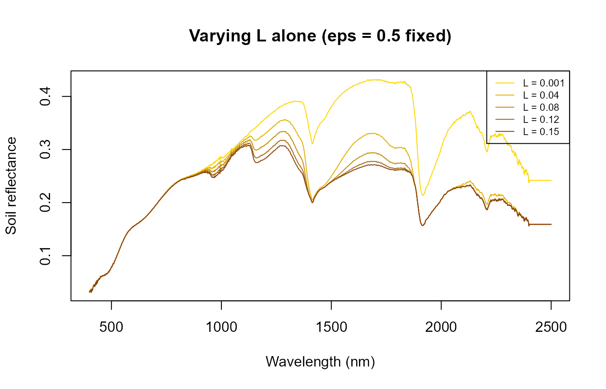
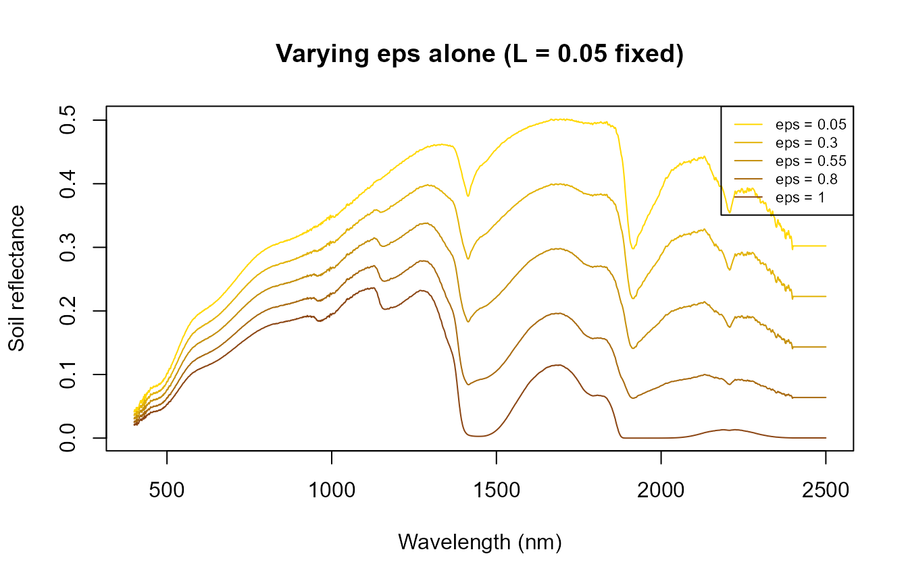
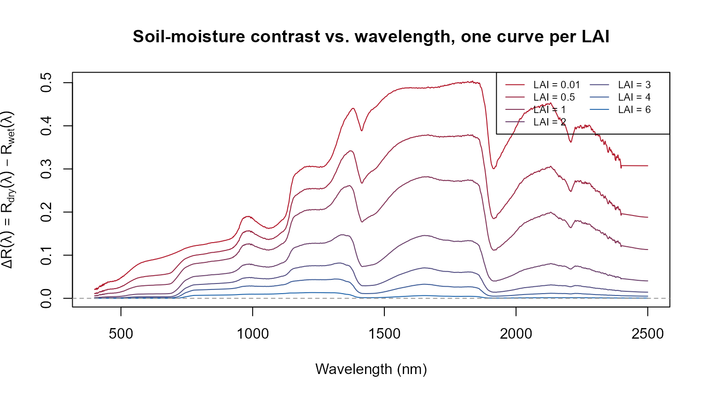
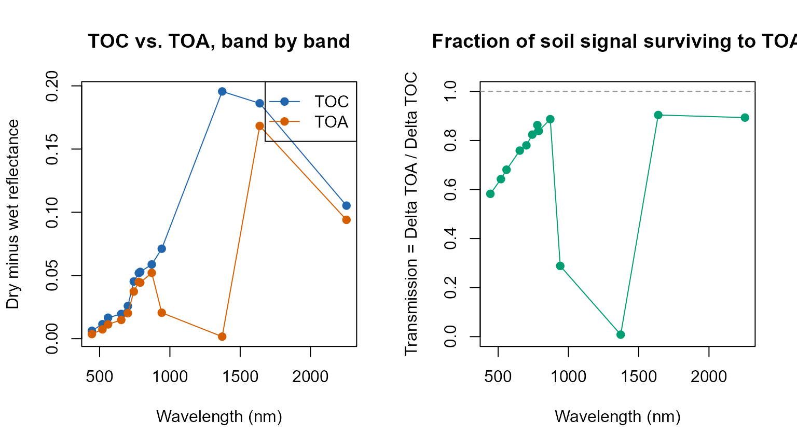

# 16. MARMIT + fourSAIL + SPART: Realistic Soil Moisture, Canopy to Atmosphere

``` r

library(ToolsRTM)
```

## Why soil matters to a canopy simulation

Top-of-canopy reflectance is a mixture of leaf optics and the soil
background showing through the canopy gaps, weighted by how closed the
canopy is (LAI, leaf angle, hotspot). Most examples elsewhere in this
tutorial series use a fixed, arbitrary `rsoil` – e.g. a 50/50 blend of a
dry and wet reference spectrum (Tutorial 01), or a flat `rep(0.15, ...)`
(Tutorials 04-13). That’s fine for isolating a leaf/canopy trait’s own
effect, but it sidesteps a real question: **how much does the soil’s
actual moisture state change what a sensor sees – at the canopy level
AND at the satellite level – and does that depend on how much vegetation
covers it?**

[`ToolsRTM::get.marmit.rsoil()`](../reference/get.marmit.rsoil.md)
(MARMIT: Bablet et al., soil reflectance as a function of surface water
film thickness) gives a physically-based answer instead of an arbitrary
blend – see the [Parameter & Trait
Glossary](parameter-glossary.html#soil-marmit-dry---wet) for what `L`
and `eps` mean and their realistic ranges. This page works through the
sensitivity progression **L -\> eps -\> LAI -\> wavelength -\> TOC/TOA
-\> atmospheric variability**, then feeds MARMIT’s output into BOTH
[`foursail()`](../reference/foursail.md) (TOC only, Tutorials 01-02) and
[`SPART()`](../reference/SPART.md) (TOC and TOA together, Tutorial 03) –
MARMIT’s soil physics is the same either way; what changes is how far
downstream that soil signal survives.

``` text
MARMIT: L (water film) and eps (wet fraction), separately first
        |
        v
   rsoil spectrum
     /       \
    v         v
fourSAIL    SPART
 (TOC)    (TOC AND TOA,
            + atmosphere)
```

## 1. `L` and `eps` are two different knobs – vary them one at a time first

MARMIT’s wetness is controlled by two physically distinct parameters:
`L` (water film thickness, cm) and `eps` (fraction of the surface that’s
wet). Varying both at once (as a “wetness sweep” – Section 3 does this,
deliberately, as a realistic combined scenario) makes it impossible to
tell which one is actually driving a given change. Vary each alone
first:

``` r

L_seq <- c(0.001, 0.04, 0.08, 0.12, 0.15)
soils_L <- lapply(L_seq, function(l) get.marmit.rsoil(database = "Bablet_2016", id = 1, L = l, eps = 0.5, wl.out = 400:2500))
cat("L alone (eps fixed at 0.5) -- SMC (%):", round(sapply(soils_L, function(s) s$SMC), 1), "\n")
#> L alone (eps fixed at 0.5) -- SMC (%): 4.1 36 46.7 47.1 47.1

cols_L <- colorRampPalette(c("gold", "saddlebrown"))(length(L_seq))
matplot(soils_L[[1]]$wavelength, sapply(soils_L, function(s) s$rsoil.wet), type = "l", lty = 1, col = cols_L,
        xlab = "Wavelength (nm)", ylab = "Soil reflectance", main = "Varying L alone (eps = 0.5 fixed)")
legend("topright", paste("L =", L_seq), col = cols_L, lty = 1, cex = 0.7)
```



``` r

eps_seq <- c(0.05, 0.3, 0.55, 0.8, 1.0)
soils_eps <- lapply(eps_seq, function(e) get.marmit.rsoil(database = "Bablet_2016", id = 1, L = 0.05, eps = e, wl.out = 400:2500))
cat("eps alone (L fixed at 0.05) -- SMC (%):", round(sapply(soils_eps, function(s) s$SMC), 1), "\n")
#> eps alone (L fixed at 0.05) -- SMC (%): 5.6 26.7 43.6 46.7 47

cols_eps <- colorRampPalette(c("gold", "saddlebrown"))(length(eps_seq))
matplot(soils_eps[[1]]$wavelength, sapply(soils_eps, function(s) s$rsoil.wet), type = "l", lty = 1, col = cols_eps,
        xlab = "Wavelength (nm)", ylab = "Soil reflectance", main = "Varying eps alone (L = 0.05 fixed)")
legend("topright", paste("eps =", eps_seq), col = cols_eps, lty = 1, cex = 0.7)
```



Both `L` alone and `eps` alone can drive SMC across nearly the whole
range (roughly 4% to 47%) – neither parameter is redundant with the
other; a thicker water film and a larger wet fraction are genuinely
different physical situations that MARMIT’s model treats separately,
even though both ultimately darken the soil.

### Why do “Wet” and “Saturated” report almost the same SMC below, despite different spectra?

Worth explaining before the combined sweep in Section 2, since it looks
like a discrepancy otherwise: internally,
[`get.marmit.rsoil()`](../reference/get.marmit.rsoil.md) computes
`phi <- L * eps`, then estimates `SMC` from `phi` through a **sigmoid**
function (`SMC = K / (1 + a * exp(-psi * phi))`) that saturates toward
its ceiling `K` as `phi` grows. For this soil’s calibrated sigmoid
parameters, that ceiling is essentially reached by `phi` around
0.07-0.08 – so “Wet” (`L=0.09, eps=0.8`, `phi=0.072`) and “Saturated”
(`L=0.15, eps=1.0`, `phi=0.15`) land on nearly the same `SMC` (both
~47.1%) even though `phi` itself still differs by a factor of two. **The
reflectance spectra are not identical** (`rsoil.wet` differs by up to
0.13 in reflectance between the two) – `L` and `eps` still each
influence the optical model directly, independent of what the single
scalar `SMC` summary reports. Treat `SMC` as a useful one-number summary
of overall wetness, not a complete description of the soil’s optical
state.

## 2. A combined wetness sweep, as a realistic scenario

With Section 1 establishing that `L` and `eps` each matter on their own,
sweeping both together now represents a plausible real drying/wetting
sequence rather than an unexplained joint change:

``` r

wetness_steps <- data.frame(
  label = c("Very dry", "Dry", "Moderate", "Wet", "Saturated"),
  L     = c(0.001, 0.02, 0.05, 0.09, 0.15),
  eps   = c(0.05,  0.3,  0.55, 0.8,  1.0)
)

soils <- lapply(seq_len(nrow(wetness_steps)), function(i) {
  get.marmit.rsoil(database = "Bablet_2016", id = 1, L = wetness_steps$L[i],
                    eps = wetness_steps$eps[i], wl.out = 400:2500)
})

cat("Estimated soil moisture (SMC, %) across the sweep:\n")
#> Estimated soil moisture (SMC, %) across the sweep:
print(round(sapply(soils, function(s) s$SMC), 1))
#> [1]  3.8  9.6 43.6 47.1 47.1
```

``` r

wl <- soils[[1]]$wavelength
cols <- colorRampPalette(c("gold", "saddlebrown"))(nrow(wetness_steps))
matplot(wl, sapply(soils, function(s) s$rsoil.wet), type = "l", lty = 1, col = cols,
        xlab = "Wavelength (nm)", ylab = "Soil reflectance",
        main = "MARMIT soil reflectance across the wetness sweep")
legend("topright", wetness_steps$label, col = cols, lty = 1, cex = 0.8)
```


Soil reflectance darkens broadly with wetness (as real wet soil looks
darker than dry soil), with the strongest relative change in the SWIR
water-absorption region – the same physics MARMIT is built around.

## 3. Feeding it into `foursail()` at a fixed canopy (TOC only)

Same leaf/canopy trait set throughout (`LAI = 2`, a moderate canopy),
only `rsoil` changes across the five wetness steps:

``` r

row <- data.frame(
  LAI = 2, hspot = 0.01, LIDFa = -0.35, LIDFb = -0.15, TypeLidf = 1,
  tts = 30, tto = 0, psi = 0,
  N = 1.5, Cab = 40, Car = 8, Anth = 2, Cbrown = 0, EWT = 0.009, LMA = 0.009, alpha = 40
)

toc_by_soil <- sapply(soils, function(s) {
  sail_i <- foursail(inputLUT = row, rsoil = s$rsoil.wet, LeafModel = "PROSPECT-D")
  Compute_BRF(rdot = sail_i$rdot, rsot = sail_i$rsot, tts = row$tts, data.light = dataSpec_PDB)
})

matplot(dataSpec_PDB[, 1], toc_by_soil, type = "l", lty = 1, col = cols,
        xlab = "Wavelength (nm)", ylab = "TOC reflectance",
        main = "Top-of-canopy reflectance, same canopy, soil wetness varied (LAI=2)")
legend("topright", wetness_steps$label, col = cols, lty = 1, cex = 0.8)
```


The canopy’s own spectral shape (chlorophyll absorption, red edge, NIR
plateau) stays recognizable throughout – but the SWIR bands still shift
noticeably with soil moisture alone, nothing about the vegetation itself
changed between these five curves.

## 4. The central result: how the dry-minus-wet signal fades as LAI increases

The single figure that shows this whole page’s physics at once: the
full-spectrum difference between the driest and wettest soil from
Section 2, at seven LAI values from bare-ish soil to closed canopy – not
just two extremes:

``` r

dry_soil <- soils[[1]]  # "Very dry"
wet_soil <- soils[[5]]  # "Saturated"

lai_seq <- c(0.01, 0.5, 1, 2, 3, 4, 6)  # 0.01 stands in for LAI=0 (foursail needs >0)
delta_by_lai <- sapply(lai_seq, function(lai) {
  row_i <- row; row_i$LAI <- lai
  d <- foursail(inputLUT = row_i, rsoil = dry_soil$rsoil.wet, LeafModel = "PROSPECT-D")
  w <- foursail(inputLUT = row_i, rsoil = wet_soil$rsoil.wet, LeafModel = "PROSPECT-D")
  brf_d <- Compute_BRF(rdot = d$rdot, rsot = d$rsot, tts = row_i$tts, data.light = dataSpec_PDB)
  brf_w <- Compute_BRF(rdot = w$rdot, rsot = w$rsot, tts = row_i$tts, data.light = dataSpec_PDB)
  brf_d - brf_w  # Delta R(lambda) = R_dry(lambda) - R_wet(lambda)
})
```

``` r

cols_lai <- colorRampPalette(c("#B2182B", "#2166AC"))(length(lai_seq))
matplot(dataSpec_PDB[, 1], delta_by_lai, type = "l", lty = 1, col = cols_lai,
        xlab = "Wavelength (nm)", ylab = expression(Delta*R(lambda) == R[dry](lambda) - R[wet](lambda)),
        main = "Soil-moisture contrast vs. wavelength, one curve per LAI")
legend("topright", paste("LAI =", lai_seq), col = cols_lai, lty = 1, cex = 0.7, ncol = 2)
abline(h = 0, lty = 2, col = "grey60")
```



``` r

cat("Delta R at 1650nm (SWIR, MARMIT's strongest water-sensitive region) across LAI:\n")
#> Delta R at 1650nm (SWIR, MARMIT's strongest water-sensitive region) across LAI:
print(round(setNames(delta_by_lai[dataSpec_PDB[, 1] == 1650, ], paste0("LAI=", lai_seq)), 4))
#> LAI=0.01  LAI=0.5    LAI=1    LAI=2    LAI=3    LAI=4    LAI=6 
#>   0.4873   0.3777   0.2815   0.1456   0.0705   0.0327   0.0064
```

The soil-moisture contrast is largest across the whole spectrum at
near-bare soil (LAI=0.01) and attenuates progressively as LAI rises –
not a single-wavelength effect, and not a two-point comparison: the SWIR
region (1500-1800nm, 2000-2400nm) carries the strongest contrast at
every LAI, consistent with MARMIT’s own water-absorption physics, while
the attenuation with canopy closure is visible across the full spectrum.
**Under this canopy configuration**, the contribution of
soil-moisture-induced reflectance differences becomes very small by
LAI=6 – not “blocked regardless of wetness” as a general rule, but a
specific, quantified attenuation for this LIDF/hotspot/geometry setup.

## 5. MARMIT + SPART: does the soil-moisture signal survive to the satellite?

Section 4 stopped at TOC (canopy-level, no atmosphere).
[`SPART()`](../reference/SPART.md) (Tutorial 03) carries the same MARMIT
soil spectrum through the full soil-plant-atmosphere chain to TOA.
Band-by-band, not averaged – different Sentinel-2 bands sit in very
different atmospheric transmission windows, so a mean would hide exactly
the effect worth seeing:

``` r

soils_spart <- lapply(seq_len(nrow(wetness_steps)), function(i) {
  get.marmit.rsoil(database = "Bablet_2016", id = 1, L = wetness_steps$L[i],
                    eps = wetness_steps$eps[i], wl.out = 400:2400)
})

LUT <- as.data.frame(getLUT(inputs = ToolsRTM::inputsSPART, nLUT = 1, setseed = 1))
LUT$Cs <- 0; LUT$fqe <- 0.01; LUT$Cx <- 0
LUT$cell.d <- 40; LUT$inter.c <- 0.045; LUT$baseline.abs <- 0.0006
LUT$leaf.thick <- 1.6; LUT$albino.abs <- 0; LUT$lign.cell <- 2; LUT$Nitrogen <- 1
LUT$Pa <- 1000; LUT$aot550 <- 0.3246; LUT$uo3 <- 0.3480; LUT$uh2o <- 1.4116
LUT$alt_m <- 0; LUT$Pa0 <- 1000
LUT$BSMBrightness <- 0.5; LUT$BSMlat <- 25; LUT$BSMlon <- 45; LUT$SMp <- 15
LUT$LAI <- 1.5  # sparse enough that soil still reaches the sensor (Section 4's lesson)

spart_by_soil <- lapply(soils_spart, function(s) {
  suppressWarnings(SPART(inputLUT = LUT[1, ], CanopyModel = "fourSAIL", LeafModel = "PROSPECT-PRO",
                          sensor.i = ToolsRTM::Sentinel2A.MSI, rsoil = s$rsoil.wet, get.plots = FALSE))
})

sim_dry <- spart_by_soil[[1]]; sim_wet <- spart_by_soil[[5]]
delta_toc <- sim_dry$output$rfl.toc.BRDF - sim_wet$output$rfl.toc.BRDF
delta_toa <- sim_dry$output$rfl.toa - sim_wet$output$rfl.toa
# Transmission: how much of the TOC soil-moisture contrast survives to TOA, per band.
transmission <- delta_toa / delta_toc

band_table <- data.frame(band_nm = sim_dry$output$wave, Delta_TOC = round(delta_toc, 4),
                          Delta_TOA = round(delta_toa, 4), Transmission = round(transmission, 3))
knitr::kable(band_table, row.names = FALSE)
```

| band_nm | Delta_TOC | Delta_TOA | Transmission |
|--------:|----------:|----------:|-------------:|
|     445 |    0.0062 |    0.0036 |        0.582 |
|     520 |    0.0115 |    0.0074 |        0.643 |
|     560 |    0.0166 |    0.0113 |        0.681 |
|     654 |    0.0196 |    0.0148 |        0.759 |
|     701 |    0.0258 |    0.0201 |        0.780 |
|     743 |    0.0452 |    0.0373 |        0.824 |
|     779 |    0.0520 |    0.0448 |        0.863 |
|     789 |    0.0528 |    0.0443 |        0.839 |
|     871 |    0.0587 |    0.0521 |        0.887 |
|     942 |    0.0712 |    0.0205 |        0.288 |
|    1372 |    0.1956 |    0.0016 |        0.008 |
|    1639 |    0.1862 |    0.1683 |        0.904 |
|    2256 |    0.1052 |    0.0940 |        0.893 |

``` r

op <- par(mfrow = c(1, 2))
plot(sim_dry$output$wave, delta_toc, type = "o", pch = 19, col = "#2166AC",
     ylim = range(c(delta_toc, delta_toa)),
     xlab = "Wavelength (nm)", ylab = "Dry minus wet reflectance", main = "TOC vs. TOA, band by band")
lines(sim_dry$output$wave, delta_toa, type = "o", pch = 19, col = "#D55E00")
legend("topright", c("TOC", "TOA"), col = c("#2166AC", "#D55E00"), pch = 19, lty = 1)
plot(sim_dry$output$wave, transmission, type = "o", pch = 19, col = "#009E73",
     xlab = "Wavelength (nm)", ylab = "Transmission = Delta TOA / Delta TOC",
     main = "Fraction of soil signal surviving to TOA", ylim = c(0, 1))
abline(h = 1, lty = 2, col = "grey60")
```



``` r

par(op)
```

**Be precise about what “survives” means here – it depends on
wavelength.** Most Sentinel-2 bands (B02-B8A, B11, B12) transmit roughly
60-90% of the TOC soil-moisture contrast to TOA – the atmosphere
attenuates and reshapes the signal but doesn’t erase it. The two bands
sitting inside strong water-vapour absorption windows are the opposite
story: at 942nm, only ~29% of the TOC signal survives; at 1372nm,
**essentially none of it does** (transmission ~0.008) – the atmosphere
is nearly opaque there regardless of what the soil is doing. So “the
atmosphere does not erase the soil signal” is true for most of the
spectrum under this fixed atmosphere, but false at the specific bands
where atmospheric absorption itself dominates – a spectrally dependent
statement, not a blanket one, and specific to this one (realistic,
sea-level, clear-sky) atmospheric state.

## 6. Does atmospheric variability rival the soil-moisture signal?

Section 5 fixed the atmosphere (`aot550`, `uh2o`, `uo3`, all at one
realistic value). Real scenes don’t have a fixed atmosphere – compare
the soil-moisture TOA signal against a realistic swing in aerosol
loading, same dry soil both times:

``` r

run_atm <- function(aot, uh2o, rsoil) {
  r <- LUT[1, ]; r$aot550 <- aot; r$uh2o <- uh2o
  suppressWarnings(SPART(inputLUT = r, CanopyModel = "fourSAIL", LeafModel = "PROSPECT-PRO",
                          sensor.i = ToolsRTM::Sentinel2A.MSI, rsoil = rsoil, get.plots = FALSE))$output$rfl.toa
}
toa_dry_lowaot  <- run_atm(0.05, 1.4116, soils_spart[[1]]$rsoil.wet)
toa_dry_highaot <- run_atm(1.00, 1.4116, soils_spart[[1]]$rsoil.wet)
aot_signal <- toa_dry_lowaot - toa_dry_highaot

atm_vs_soil <- data.frame(band_nm = sim_dry$output$wave,
                           soil_moisture_signal = round(delta_toa, 4),
                           aerosol_signal_aot0.05_vs_1.0 = round(aot_signal, 4))
knitr::kable(atm_vs_soil, row.names = FALSE)
```

| band_nm | soil_moisture_signal | aerosol_signal_aot0.05_vs_1.0 |
|--------:|---------------------:|------------------------------:|
|     445 |               0.0036 |                       -0.0260 |
|     520 |               0.0074 |                       -0.0197 |
|     560 |               0.0113 |                       -0.0109 |
|     654 |               0.0148 |                       -0.0065 |
|     701 |               0.0201 |                        0.0061 |
|     743 |               0.0373 |                        0.0288 |
|     779 |               0.0448 |                        0.0375 |
|     789 |               0.0443 |                        0.0382 |
|     871 |               0.0521 |                        0.0453 |
|     942 |               0.0205 |                        0.0158 |
|    1372 |               0.0016 |                        0.0005 |
|    1639 |               0.1683 |                        0.0474 |
|    2256 |               0.0940 |                        0.0155 |

In the blue/visible bands (B02-B05), the aerosol swing is **comparable
to or larger than** the soil-moisture signal itself – aerosol scattering
dominates the shorter wavelengths the same way it did in Tutorial 03’s
own atmosphere sensitivity section. In the NIR/SWIR bands, the soil-
moisture signal is clearly the larger effect. **A single fixed
atmosphere, as used in Section 5, cannot support a general claim about
“the” soil-moisture signal at TOA** – whether it’s the dominant or a
minor contributor depends on both the band and the actual atmospheric
state at acquisition time.

## 7. When does MARMIT matter?

Not a fixed rule – a practical guide, following directly from Sections
4-6’s actual numbers rather than asserted independently of them:

- **Bare soil or LAI below ~1**: soil-moisture contrast is large
  (Section
  4.  and mostly survives to TOA outside the water-vapour bands (Section
  5.  – MARMIT-realistic soil is worth using, especially for any study
      where soil brightness/moisture itself might be confounded with a
      vegetation trait.
- **Intermediate canopy (roughly LAI 1-3)**: both soil and canopy
  contribute meaningfully (Section 4’s middle LAI values) – whether
  MARMIT realism changes your specific conclusion depends on which trait
  you’re retrieving and which bands drive it (Tutorial 10’s sensitivity
  framework is the way to check for a specific case).
- **Dense, closed canopy (LAI above ~4-5)**: soil contribution shrinks
  progressively (Section 4) – **an approximation whose validity depends
  on canopy architecture, wavelength, and target variable**, not an
  automatic “soil doesn’t matter here.” A fixed `rsoil` is a reasonable
  simplification for a dense, structurally simple canopy at bands away
  from strong soil-sensitive wavelengths; it’s a weaker assumption for
  senescent/open canopies (next point) or SWIR-band-dependent traits
  even at moderate-high LAI.
- **Senescent or structurally open canopies** (post-harvest stubble,
  open-crown forest, sparse shrubland): even at LAI values that would
  otherwise suggest “canopy-dominated,” gaps and structural openness let
  soil signal back in – treat these cases more like the low-LAI end of
  Section 4’s curve than the LAI number alone would suggest.

This holds whether the downstream model is
[`foursail()`](../reference/foursail.md)/[`foursail2()`](../reference/foursail2.md)/
[`inform()`](../reference/inform.md) (TOC only) or
[`SPART()`](../reference/SPART.md) (TOC and TOA) – Section 5-6 confirm
the same soil-realism argument applies at the satellite level too, band-
dependently, not just at the canopy level.
`Scripts/R/Pipeline/0-integrate_MARMIT_soil.R` shows the same
[`get.marmit.rsoil()`](../reference/get.marmit.rsoil.md) output wired
into [`foursail2()`](../reference/foursail2.md) and
[`inform()`](../reference/inform.md) as well, for the other canopy
models this package supports; `Scripts/R/ForMARMIT/1-simulate_LUT.R`
samples `L` and `eps` across a full LUT rather than the five fixed steps
used for clarity throughout this page.
