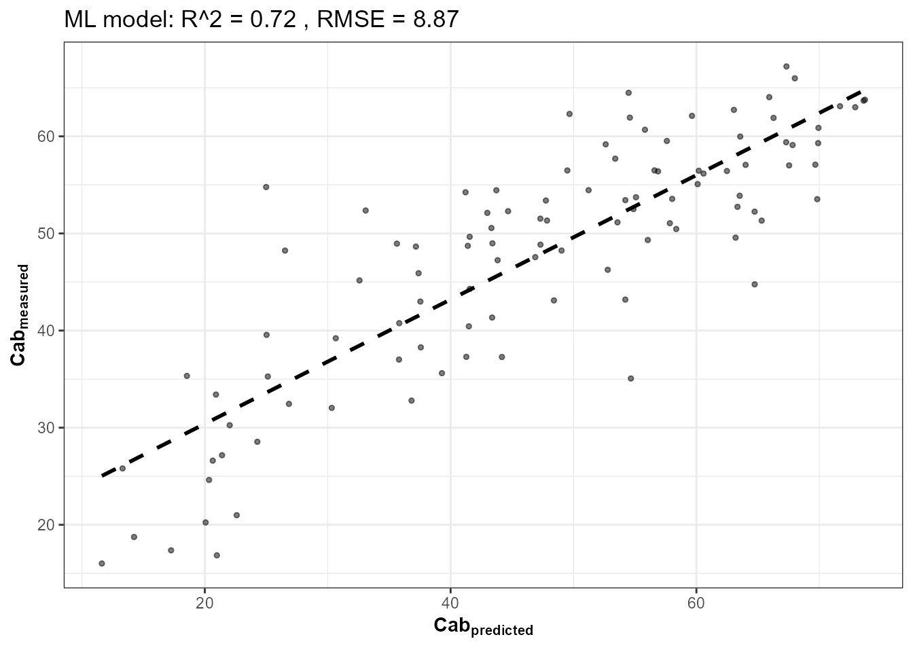
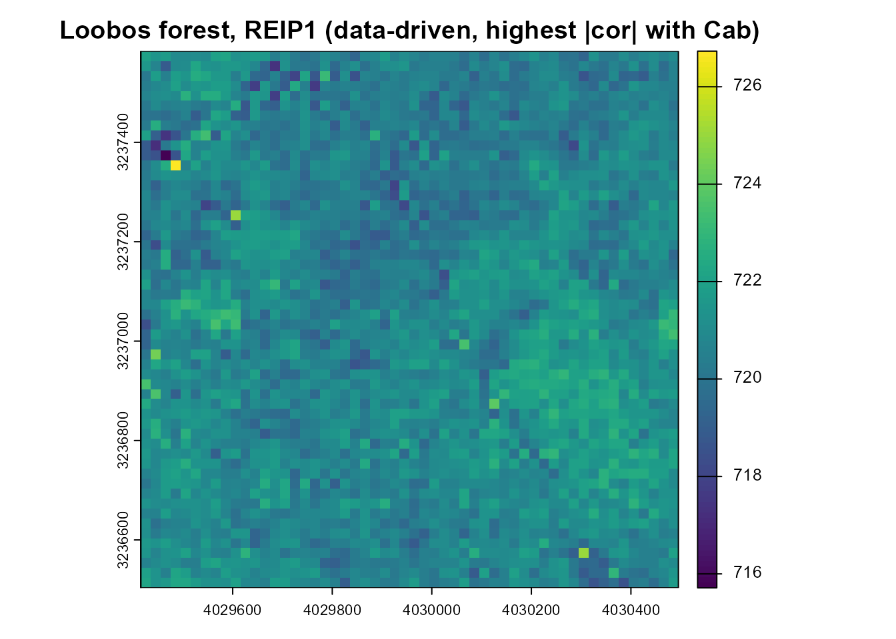
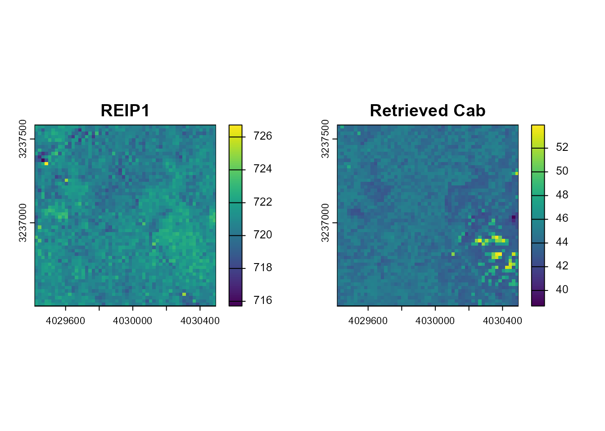

# 18. Data-Driven Spatial Index Mapping with getSpatial_index()

``` r

library(ToolsRTM)
```

Tutorial 09 introduced
[`getSpatial_index()`](../reference/getSpatial_index.md) as the spatial
(raster-in, raster-out) counterpart to the tabular index functions – one
real GeoTIFF in, one index map out. This closing tutorial uses it for
real, but doesn’t guess which index to map: it simulates a LUT, inverts
`Cab` from it (Tutorial 12’s own rigor), finds which spectral index
actually correlates best with the *retrieved* trait, and only then maps
that winning index – and `Cab` itself – spatially, over a real
Sentinel-2 image.

``` text
Simulated LUT (500 rows)
      |
      v
Hybrid-invert Cab (RF, Tutorial 12)
      |
      v
Rank every spectral index by correlation with Cab
      |
      v
Winning index (data-driven, not assumed)
      |                                    Real Sentinel-2 image (STAC,
      |                                    NL-Loo/Loobos forest, NL)
      |                                          |
      v                                          v
      +------------------ getSpatial_index() ----+
                            |
                            v
              Winning index map + Cab trait map
```

## 1. Simulate a 500-row LUT and invert Cab

Same rigor as Tutorial 12 – 500 simulations, Sentinel-2A convolution,
Random Forest, held-out test set. Three settings are chosen to cover the
real scene this LUT will later be applied to (Section 3): **LAI down to
0.3** (`inputsPROSAIL`’s own default lower bound of 2 assumes a canopy
always dense enough to be optically closed – too narrow for a real
forest, which includes gaps, edges and understory in the same
500m-radius footprint), **a realistic non-zero sun zenith** (25-45°,
matching a July midday acquisition at 52°N, rather than the package
default `tts = 0`, i.e. sun directly overhead), and **variable soil
brightness** (0.05-0.30, Tutorial 03’s BSM range, rather than one flat
`rsoil = 0.15`). Together these widen the simulated reflectance envelope
enough to actually contain the real Sentinel-2 pixel values retrieved in
Section 3 – a hybrid-inversion model can only be trusted on inputs that
fall inside the range it was trained on:

``` r

n_samples <- 500
LUT <- as.data.frame(getLUT(inputs = ToolsRTM::inputsPROSAIL, nLUT = n_samples, setseed = 1))
wl <- 400:2500
set.seed(3)
LUT$LAI <- runif(n_samples, 0.3, 5)
LUT$tts <- runif(n_samples, 25, 45)
soil_brightness <- runif(n_samples, 0.05, 0.30)
refl <- t(sapply(seq_len(n_samples), function(i) {
  rsoil_i <- rep(soil_brightness[i], length(wl))
  foursail(inputLUT = LUT[i, ], rsoil = rsoil_i, LeafModel = "PROSPECT-PRO")$rsot
}))
refl_X <- as.data.frame(refl); colnames(refl_X) <- paste0("X", wl); refl_X <- cbind(id = seq_len(n_samples), refl_X)
se2a_full <- suppressMessages(get.spectra.convolved(rfl = refl_X, sensor = "Sentinel2a", plot.spectra = FALSE))
names(se2a_full) <- c("id","B1","B2","B3","B4","B5","B6","B7","B8","B8A","B9","B10","B11","B12")

keep <- c("B2","B3","B4","B5","B6","B7","B8","B8A","B11","B12")
real_names <- c("B02","B03","B04","B05","B06","B07","B08","B8A","B11","B12")
se2a <- se2a_full[, keep]; names(se2a) <- real_names

set.seed(1)
train_idx <- sample(seq_len(n_samples), size = round(0.7 * n_samples))
train_df <- cbind(LUT[train_idx, ], se2a[train_idx, ])
fit_cab <- get.inversion(data = train_df, depVar = "Cab", inputs = real_names,
                          algorithm = "RF", n.samples = nrow(train_df), seed = 42)
```



## 2. Which index correlates best with Cab? Computed, not assumed

``` r

se2a_indexed <- se2a
names(se2a_indexed) <- c("B2","B3","B4","B5","B6","B7","B8","B8A","B11","B12")  # getIndicesSE2's own naming
indices_full <- suppressMessages(getIndicesSE2(df = se2a_indexed, sensor = "Sentinel-2a",
                                                df.data = NULL, fast.process = TRUE))
#>   |                                                                              |                                                                      |   0%  |                                                                              |                                                                      |   1%  |                                                                              |=                                                                     |   1%  |                                                                              |=                                                                     |   2%  |                                                                              |==                                                                    |   2%  |                                                                              |==                                                                    |   3%  |                                                                              |===                                                                   |   4%  |                                                                              |===                                                                   |   5%  |                                                                              |====                                                                  |   5%  |                                                                              |====                                                                  |   6%  |                                                                              |=====                                                                 |   7%  |                                                                              |=====                                                                 |   8%  |                                                                              |======                                                                |   8%  |                                                                              |======                                                                |   9%  |                                                                              |=======                                                               |   9%  |                                                                              |=======                                                               |  10%  |                                                                              |=======                                                               |  11%  |                                                                              |========                                                              |  11%  |                                                                              |========                                                              |  12%  |                                                                              |=========                                                             |  12%  |                                                                              |=========                                                             |  13%  |                                                                              |==========                                                            |  14%  |                                                                              |==========                                                            |  15%  |                                                                              |===========                                                           |  15%  |                                                                              |===========                                                           |  16%  |                                                                              |============                                                          |  16%  |                                                                              |============                                                          |  17%  |                                                                              |============                                                          |  18%  |                                                                              |=============                                                         |  18%  |                                                                              |=============                                                         |  19%  |                                                                              |==============                                                        |  19%  |                                                                              |==============                                                        |  20%  |                                                                              |==============                                                        |  21%  |                                                                              |===============                                                       |  21%  |                                                                              |===============                                                       |  22%  |                                                                              |================                                                      |  22%  |                                                                              |================                                                      |  23%  |                                                                              |=================                                                     |  24%  |                                                                              |=================                                                     |  25%  |                                                                              |==================                                                    |  25%  |                                                                              |==================                                                    |  26%  |                                                                              |===================                                                   |  26%  |                                                                              |===================                                                   |  27%  |                                                                              |===================                                                   |  28%  |                                                                              |====================                                                  |  28%  |                                                                              |====================                                                  |  29%  |                                                                              |=====================                                                 |  29%  |                                                                              |=====================                                                 |  30%  |                                                                              |=====================                                                 |  31%  |                                                                              |======================                                                |  31%  |                                                                              |======================                                                |  32%  |                                                                              |=======================                                               |  32%  |                                                                              |=======================                                               |  33%  |                                                                              |========================                                              |  34%  |                                                                              |========================                                              |  35%  |                                                                              |=========================                                             |  35%  |                                                                              |=========================                                             |  36%  |                                                                              |==========================                                            |  36%  |                                                                              |==========================                                            |  37%  |                                                                              |==========================                                            |  38%  |                                                                              |===========================                                           |  38%  |                                                                              |===========================                                           |  39%  |                                                                              |============================                                          |  39%  |                                                                              |============================                                          |  40%  |                                                                              |============================                                          |  41%  |                                                                              |=============================                                         |  41%  |                                                                              |=============================                                         |  42%  |                                                                              |==============================                                        |  42%  |                                                                              |==============================                                        |  43%  |                                                                              |===============================                                       |  44%  |                                                                              |===============================                                       |  45%  |                                                                              |================================                                      |  45%  |                                                                              |================================                                      |  46%  |                                                                              |=================================                                     |  46%  |                                                                              |=================================                                     |  47%  |                                                                              |=================================                                     |  48%  |                                                                              |==================================                                    |  48%  |                                                                              |==================================                                    |  49%  |                                                                              |===================================                                   |  49%  |                                                                              |===================================                                   |  50%  |                                                                              |===================================                                   |  51%  |                                                                              |====================================                                  |  51%  |                                                                              |====================================                                  |  52%  |                                                                              |=====================================                                 |  52%  |                                                                              |=====================================                                 |  53%  |                                                                              |=====================================                                 |  54%  |                                                                              |======================================                                |  54%  |                                                                              |======================================                                |  55%  |                                                                              |=======================================                               |  55%  |                                                                              |=======================================                               |  56%  |                                                                              |========================================                              |  57%  |                                                                              |========================================                              |  58%  |                                                                              |=========================================                             |  58%  |                                                                              |=========================================                             |  59%  |                                                                              |==========================================                            |  59%  |                                                                              |==========================================                            |  60%  |                                                                              |==========================================                            |  61%  |                                                                              |===========================================                           |  61%  |                                                                              |===========================================                           |  62%  |                                                                              |============================================                          |  62%  |                                                                              |============================================                          |  63%  |                                                                              |============================================                          |  64%  |                                                                              |=============================================                         |  64%  |                                                                              |=============================================                         |  65%  |                                                                              |==============================================                        |  65%  |                                                                              |==============================================                        |  66%  |                                                                              |===============================================                       |  67%  |                                                                              |===============================================                       |  68%  |                                                                              |================================================                      |  68%  |                                                                              |================================================                      |  69%  |                                                                              |=================================================                     |  69%  |                                                                              |=================================================                     |  70%  |                                                                              |=================================================                     |  71%  |                                                                              |==================================================                    |  71%  |                                                                              |==================================================                    |  72%  |                                                                              |===================================================                   |  72%  |                                                                              |===================================================                   |  73%  |                                                                              |===================================================                   |  74%  |                                                                              |====================================================                  |  74%  |                                                                              |====================================================                  |  75%  |                                                                              |=====================================================                 |  75%  |                                                                              |=====================================================                 |  76%  |                                                                              |======================================================                |  77%  |                                                                              |======================================================                |  78%  |                                                                              |=======================================================               |  78%  |                                                                              |=======================================================               |  79%  |                                                                              |========================================================              |  79%  |                                                                              |========================================================              |  80%  |                                                                              |========================================================              |  81%  |                                                                              |=========================================================             |  81%  |                                                                              |=========================================================             |  82%  |                                                                              |==========================================================            |  82%  |                                                                              |==========================================================            |  83%  |                                                                              |==========================================================            |  84%  |                                                                              |===========================================================           |  84%  |                                                                              |===========================================================           |  85%  |                                                                              |============================================================          |  85%  |                                                                              |============================================================          |  86%  |                                                                              |=============================================================         |  87%  |                                                                              |=============================================================         |  88%  |                                                                              |==============================================================        |  88%  |                                                                              |==============================================================        |  89%  |                                                                              |===============================================================       |  89%  |                                                                              |===============================================================       |  90%  |                                                                              |===============================================================       |  91%  |                                                                              |================================================================      |  91%  |                                                                              |================================================================      |  92%  |                                                                              |=================================================================     |  92%  |                                                                              |=================================================================     |  93%  |                                                                              |==================================================================    |  94%  |                                                                              |==================================================================    |  95%  |                                                                              |===================================================================   |  95%  |                                                                              |===================================================================   |  96%  |                                                                              |====================================================================  |  97%  |                                                                              |====================================================================  |  98%  |                                                                              |===================================================================== |  98%  |                                                                              |===================================================================== |  99%  |                                                                              |======================================================================|  99%  |                                                                              |======================================================================| 100%

# getSpatial_index() only implements a subset of index names -- only rank
# among indices that can actually be mapped spatially in Section 4 below,
# not the full 70-index tabular set Tutorial 09 covers.
spatial_index_names <- c("ARI","ARV2","ARVI","AVI","BAI","BAIS2","CIg","CIgreen","CIre","CR_SWIR",
                          "EVI","GM1","GM2","GNDVI","Greeness","IRECI","MCARI","MCARI1","MCARI2",
                          "MNDVI","MSAVI","MSR","MTVI1","MTVI2","NBR","NDRE","NDVI","NDWI","NDWI2",
                          "OSAVI","PSSRa","PVI","RDVI","REIP1","REIP2","RVI","RedEg1","RedEg2",
                          "Redness","S2REP","SIPI","SR","TCARI","TCARI_OSAVI","TVI","WDRVI")
candidate_names <- intersect(names(indices_full), spatial_index_names)

cor_table <- data.frame(
  index = candidate_names,
  abs_cor_with_Cab = sapply(candidate_names, function(nm) abs(cor(indices_full[[nm]], LUT$Cab[seq_len(n_samples)], use = "complete.obs")))
)
cor_table <- cor_table[order(-cor_table$abs_cor_with_Cab), ]
knitr::kable(head(cor_table, 10), row.names = FALSE, digits = 3)
```

| index       | abs_cor_with_Cab |
|:------------|-----------------:|
| REIP1       |            0.787 |
| REIP2       |            0.787 |
| TCARI       |            0.655 |
| TCARI_OSAVI |            0.583 |
| GM2         |            0.582 |
| CIre        |            0.574 |
| NDRE        |            0.529 |
| MCARI       |            0.512 |
| CIg         |            0.386 |
| CIgreen     |            0.386 |

``` r


winning_index <- cor_table$index[1]
cat("Winning index (highest |correlation| with Cab, among those getSpatial_index() supports):", winning_index, "\n")
#> Winning index (highest |correlation| with Cab, among those getSpatial_index() supports): REIP1
```

## 3. Retrieve a real Sentinel-2 image: NL-Loo (Loobos), Netherlands

A real ICOS station: **Loobos (NL-Loo)**, an evergreen needleleaf forest
(Scots pine, *Pinus sylvestris*) near Kootwijk on the Veluwe, Gelderland
– not to be confused with Speulderbos (Tutorials 15/17, a different site
a few km away). Planted around 1909 on sand dunes to fight erosion and
left largely unmanaged since, it’s one of the world’s longest
continuously running eddy-covariance flux-tower records (ICOS station
class 2, PI Michiel van der Molen). Official station coordinates, from
the [ICOS Carbon Portal station
page](https://meta.icos-cp.eu/resources/stations/ES_NL-Loo):
52.166447°N, 5.74355°E, 33 m elevation. Same STAC retrieval code already
verified in Tutorials 15/17, a different real site:

``` r

library(sf); library(terra)
pt <- st_point(c(5.7436, 52.1666)) |> st_sfc(crs = 4326)
scenario <- st_as_sf(data.frame(id = 1), geometry = st_sfc(pt[[1]], crs = 4326))
bbox <- get_bounding_box(scenario, 500)
shape <- st_as_sf(data.frame(id = 1), geometry = st_sfc(st_polygon(list(rbind(
  c(bbox["xmin"], bbox["ymin"]), c(bbox["xmin"], bbox["ymax"]),
  c(bbox["xmax"], bbox["ymax"]), c(bbox["xmax"], bbox["ymin"]),
  c(bbox["xmin"], bbox["ymin"])))), crs = 4326))

sc <- get.satellite_collection(scenario = scenario, collection = "sentinel-2-l2a",
                                cloud_server = "microsoft", n.limit = 20,
                                date_range = c("2024-07-01", "2024-07-31"),
                                cloud_threshold = 40, buffer_size = 500)
cube <- get.sentinel2_cube(sc[[1]], shape = shape, date_range = c("2024-07-01", "2024-07-31"),
                            aggregation_method = "mean", get.dataset = FALSE)
cat("Real cube retrieved:", paste(dim(cube), collapse = " x "), "(rows x cols x bands), bands:",
    paste(names(cube), collapse = ", "), "\n")
```

## 4. `getSpatial_index()` needs a file on disk, and all 12 nominal bands

[`getSpatial_index()`](../reference/getSpatial_index.md) reads a GeoTIFF
path (not an in-memory object) and assumes the full nominal 12-band SMAC
order (`B01`…`B12`).
[`get.sentinel2_cube()`](../reference/get.sentinel2_cube.md)
deliberately excludes the two 60m-only bands (`B01`, `B09`) that don’t
carry vegetation signal at this resolution (same convention as Tutorials
15/17) – filled here with their nearest real spectral neighbor as a
placeholder so the function can run on genuinely real reflectance rather
than needing bands this pipeline never collects. Neither `B01` nor `B09`
enters the winning index formula for any of Section 2’s top candidates,
so this placeholder doesn’t affect the result below:

``` r

refl <- cube[[real_names]] / 10000

full12 <- c(refl[["B02"]], refl[["B02"]], refl[["B03"]], refl[["B04"]], refl[["B05"]], refl[["B06"]],
            refl[["B07"]], refl[["B08"]], refl[["B8A"]], refl[["B8A"]], refl[["B11"]], refl[["B12"]])
names(full12) <- c("B01","B02","B03","B04","B05","B06","B07","B08","B8A","B09","B11","B12")

tmp_tif <- tempfile(fileext = ".tif")
terra::writeRaster(full12, tmp_tif, overwrite = TRUE)
```

## 5. The winning index, mapped over a real image

``` r

idx_map <- getSpatial_index(rasterFiles = tmp_tif, Sensor = "Sentinel2a",
                             SpectraltoCompute = winning_index, factorR = 1)
plot(idx_map[[1]], main = paste0("Loobos forest, ", winning_index, " (data-driven, highest |cor| with Cab)"))
```



``` r

cat(winning_index, "range over the scene:", paste(round(range(terra::values(idx_map[[1]]), na.rm = TRUE), 3), collapse = " to "), "\n")
#> REIP1 range over the scene: 715.713 to 726.731
```

## 6. Cab itself, mapped – the same per-pixel pattern as Tutorials 15/17

``` r

pix_df <- as.data.frame(refl, xy = TRUE, na.rm = FALSE)
ok_rows <- stats::complete.cases(pix_df[, real_names])
Cab_pixels <- rep(NA_real_, nrow(pix_df))
Cab_pixels[ok_rows] <- as.numeric(predict(fit_cab$model, pix_df[ok_rows, real_names]))

cab_map <- refl[["B04"]]
terra::values(cab_map) <- Cab_pixels
names(cab_map) <- "Cab_pred"

op <- par(mfrow = c(1, 2))
plot(idx_map[[1]], main = winning_index)
plot(cab_map, main = "Retrieved Cab")
```



``` r

par(op)

cat("Correlation between the mapped", winning_index, "and mapped Cab, pixel-by-pixel:",
    round(cor(as.numeric(terra::values(idx_map[[1]])), Cab_pixels, use = "complete.obs"), 2), "\n")
#> Correlation between the mapped REIP1 and mapped Cab, pixel-by-pixel: -0.01
```

Two independent pixel-by-pixel outputs over the same real scene – one a
plain spectral index, the other a full hybrid-inversion trait retrieval
– their spatial agreement (or disagreement) is itself informative, not
assumed: a strong correlation here means the simple index is largely
capturing the same signal the more expensive ML model is; a weak one
means the ML model is picking up something the index alone misses.

## Series complete

``` text
01 Getting Started -> ... -> 17 Forest Time Series -> 18 Spatial Index Mapping (this page)
```

Two real forest sites now mapped across this series – Speulderbos
(Tutorials 15, 17) and Loobos (this page) – both real ICOS/flux-tower
locations in the Netherlands, both retrieved live via STAC, both fed
through this package’s own hybrid-inversion machinery end to end.
