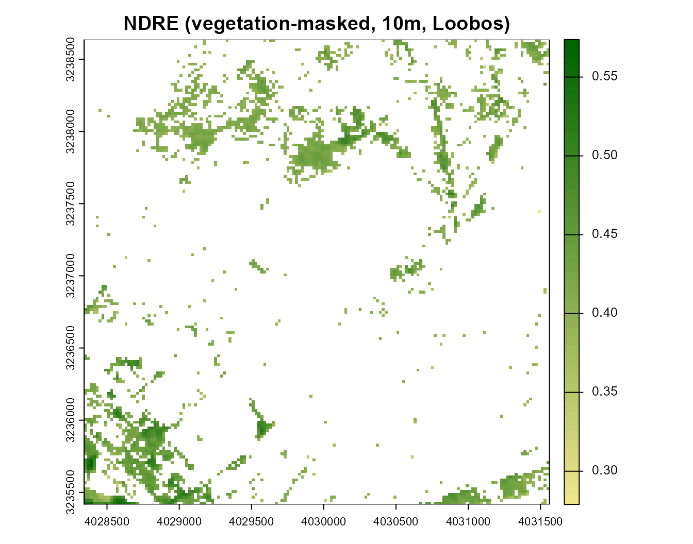
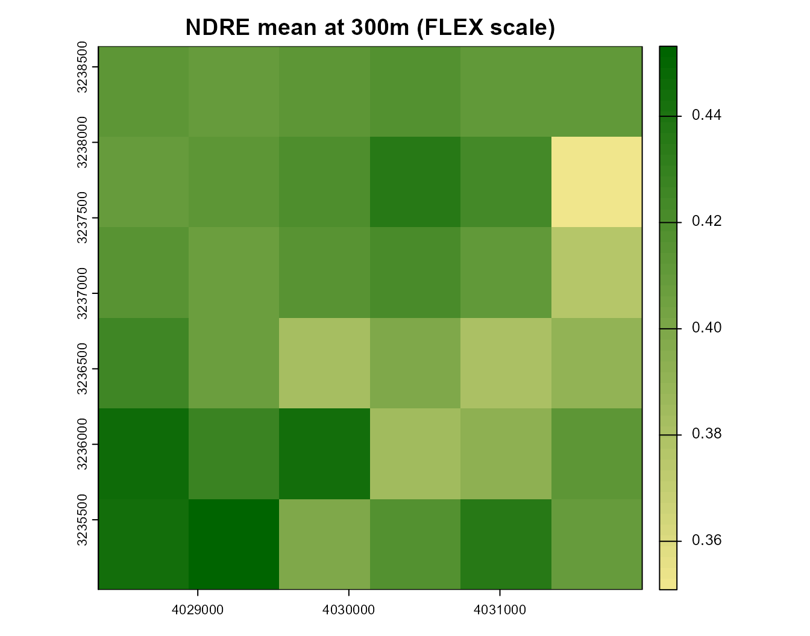
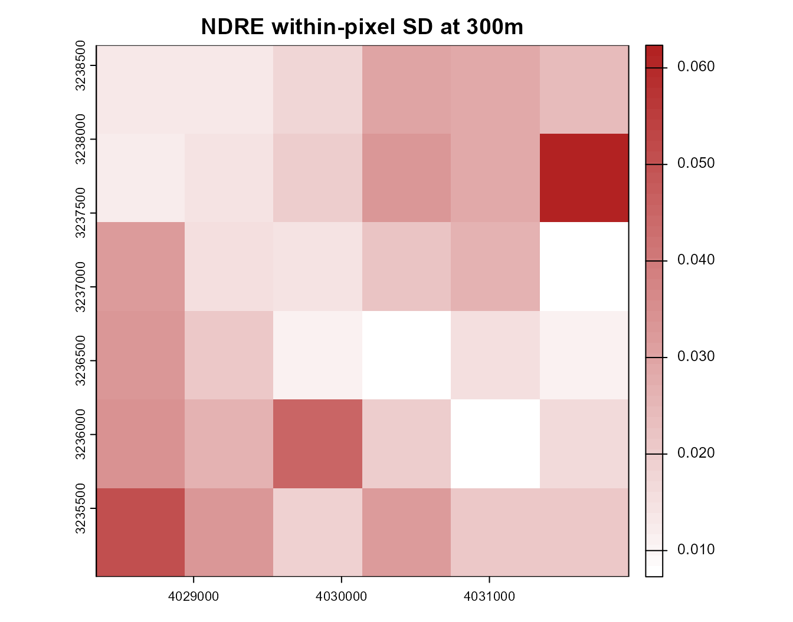
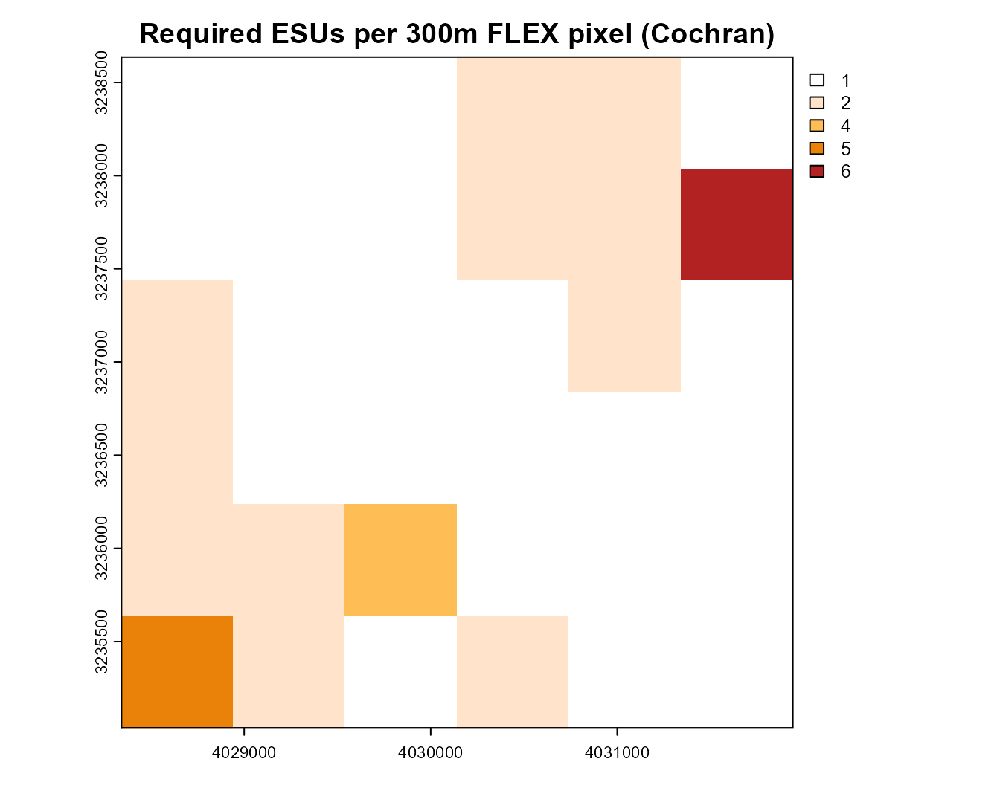
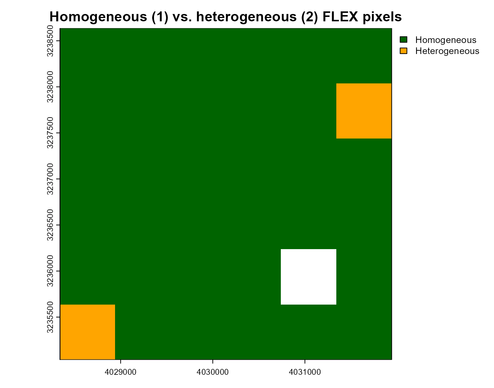
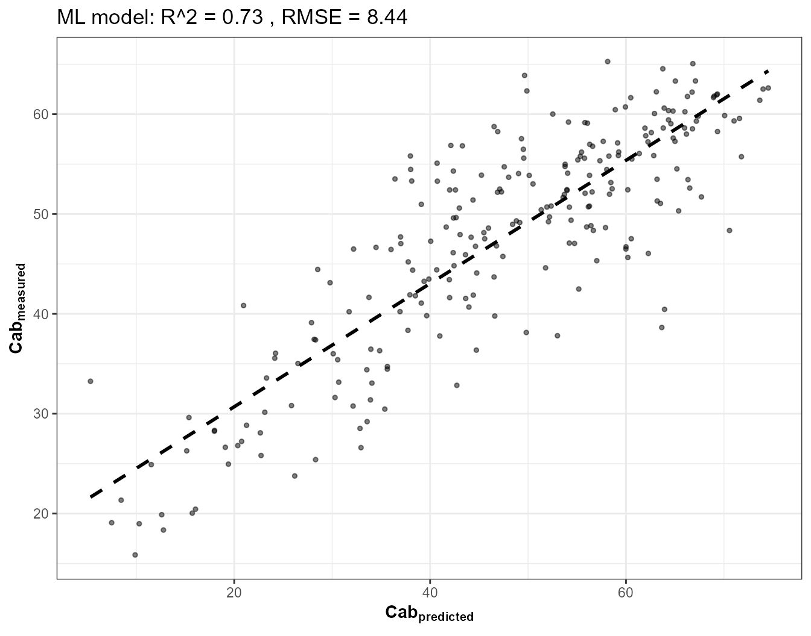
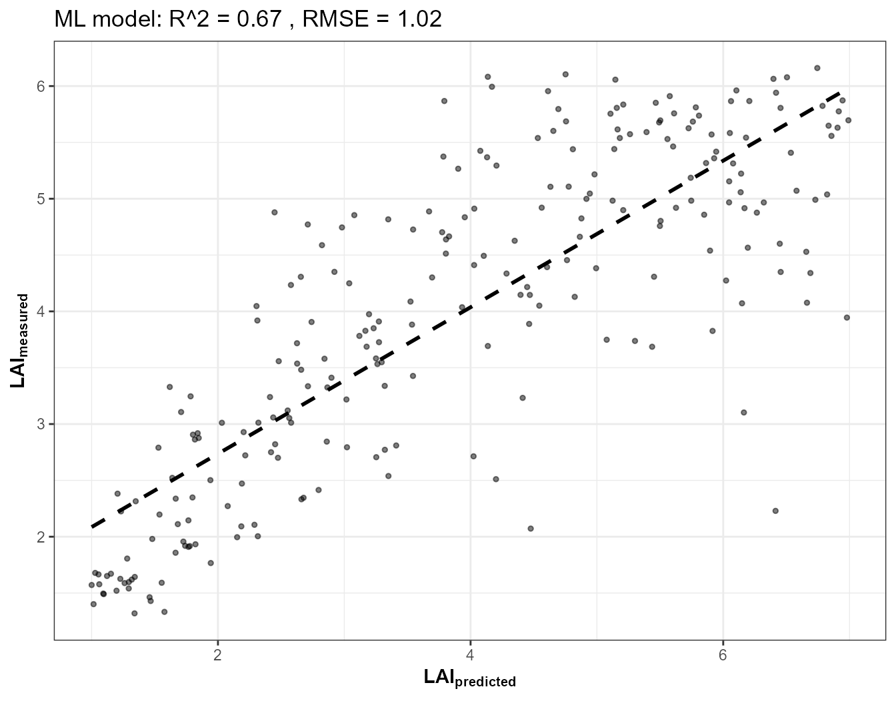
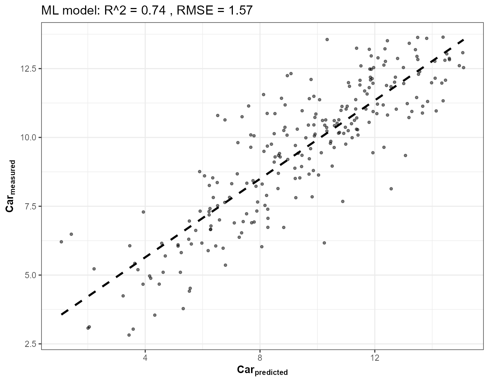
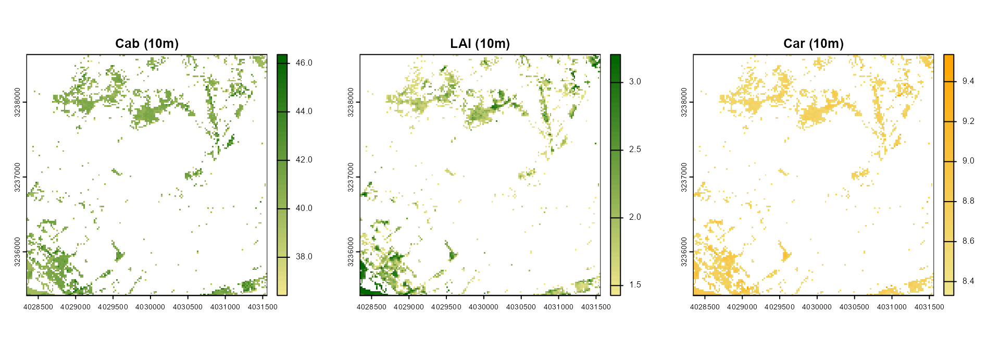
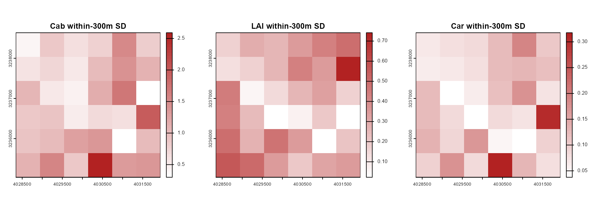

# 19. FLEX Cal/Val: ESU Heterogeneity Mapping and Trait Retrieval at FLEX Scale

``` r

library(ToolsRTM)
library(sf); library(terra)
```

ESA’s **FLEX** mission (launch expected 2026) measures solar-induced
chlorophyll fluorescence (SIF) at a native ground pixel of roughly **300
m** – large enough that a single FLEX pixel routinely covers a mix of
forest, understory gaps, clearings, and non-vegetated surfaces. Cal/Val
campaigns need to know, *before* committing ground Elementary Sampling
Units (ESUs) to a site, how heterogeneous each candidate 300 m pixel
actually is: a homogeneous pixel needs only a handful of ESUs to
characterize; a heterogeneous one needs many more, spread out to capture
the real within-pixel variability.

This tutorial builds that heterogeneity map from a real Sentinel-2 image
(10 m, ~30x finer than FLEX) over the same **Loobos (NL-Loo)**
ICOS/FLUXNET forest site used in Tutorial 17 – then goes one step
further than a spectral-index heterogeneity map alone: it retrieves
**Cab, LAI, and Car** via hybrid inversion at native 10 m resolution and
aggregates *those* physically-meaningful trait maps to FLEX scale too,
so heterogeneity can be read directly in trait units, not just an index.

``` text
Sentinel-2 (STAC, 10m) -> SCL vegetation mask -> NDVI/S2REP (getSpatial_index) + NDRE
        |
        v
Aggregate 10m -> 300m (FLEX native scale)
        |
        +--> within-300m SD -> Cochran ESU sample size -> homogeneous/heterogeneous map
        |
        +--> RF-inverted Cab/LAI/Car (10m) -> aggregated to 300m -> trait heterogeneity map
```

## 1. Site and a real Sentinel-2 pull via STAC

Same site as Tutorial 17 (the Loobos ICOS tower), but a wider buffer
here (1.5 km) so the FLEX-scale grid below actually contains multiple
300 m pixels to compare, not just one:

``` r

pt <- st_point(c(5.74355, 52.166447)) |> st_sfc(crs = 4326)
scenario <- st_as_sf(data.frame(id = 1), geometry = pt)
bbox <- get_bounding_box(scenario, 1500)
shape <- st_as_sf(data.frame(id = 1), geometry = st_sfc(st_polygon(list(rbind(
  c(bbox["xmin"], bbox["ymin"]), c(bbox["xmin"], bbox["ymax"]),
  c(bbox["xmax"], bbox["ymax"]), c(bbox["xmax"], bbox["ymin"]),
  c(bbox["xmin"], bbox["ymin"])))), crs = 4326))
real_names <- c("B02","B03","B04","B05","B06","B07","B08","B8A","B11","B12")

sc <- get.satellite_collection(scenario = scenario, collection = "sentinel-2-l2a",
                                cloud_server = "microsoft", n.limit = 20,
                                date_range = c("2024-06-01","2024-08-31"),
                                cloud_threshold = 20, buffer_size = 1500)
#> [1] 20
#> Images found: 20 
#> [1] "Asset names:"
#>  [1] "AOT"                "B01"                "B02"               
#>  [4] "B03"                "B04"                "B05"               
#>  [7] "B06"                "B07"                "B08"               
#> [10] "B09"                "B11"                "B12"               
#> [13] "B8A"                "SCL"                "WVP"               
#> [16] "visual"             "safe-manifest"      "granule-metadata"  
#> [19] "inspire-metadata"   "product-metadata"   "datastrip-metadata"
#> [22] "tilejson"           "rendered_preview"
cube <- get.sentinel2_cube(sc[[1]], shape = shape,
                            date_range = c("2024-06-01","2024-08-31"),
                            aggregation_method = "mean", get.dataset = FALSE)
#> [1] "The reflectance are processing ---"
#>  [1] "B02" "B03" "B04" "B05" "B06" "B07" "B08" "B8A" "B11" "B12" "SCL"
refl10 <- cube[[real_names]] / 10000
cat("Real Sentinel-2 pull:", nrow(refl10), "x", ncol(refl10), "pixels at 10m\n")
#> Real Sentinel-2 pull: 161 x 161 pixels at 10m
```

## 2. Vegetation mask and spectral indices at native resolution

[`get.sentinel2_cube()`](../reference/get.sentinel2_cube.md) already
applies Sentinel-2’s own SCL cloud/shadow/snow mask internally (Tutorial
15). NDVI separates vegetated from non-vegetated pixels within the
buffer – roads, clearings, water. Computed two ways here, deliberately:
a direct formula, and independently via the real package function
[`getSpatial_index()`](../reference/getSpatial_index.md) (which expects
the standard 12-band Sentinel-2 layout, so the two missing 60m-only
bands this pipeline doesn’t retrieve – B01, B09 – are padded with `NA`
first; they aren’t used by the NDVI calculation itself):

``` r

ndvi10 <- (refl10[["B08"]] - refl10[["B04"]]) / (refl10[["B08"]] + refl10[["B04"]])
names(ndvi10) <- "NDVI"
veg_mask <- ndvi10 > 0.5

# Cross-check against getSpatial_index(), the real package function
b01_na <- b09_na <- refl10[["B02"]]; terra::values(b01_na) <- NA; terra::values(b09_na) <- NA
r12 <- c(b01_na, refl10[["B02"]], refl10[["B03"]], refl10[["B04"]], refl10[["B05"]],
         refl10[["B06"]], refl10[["B07"]], refl10[["B08"]], refl10[["B8A"]], b09_na,
         refl10[["B11"]], refl10[["B12"]])
names(r12) <- c("B01","B02","B03","B04","B05","B06","B07","B08","B8A","B09","B11","B12")
tmp12 <- tempfile(fileext = ".tif")
terra::writeRaster(r12 * 10000, tmp12, overwrite = TRUE)  # getSpatial_index expects raw DN, applies its own factorR
ndvi_pkg <- getSpatial_index(rasterFiles = tmp12, Sensor = "Sentinel2a", SpectraltoCompute = "NDVI", factorR = 1/10000)[[1]]
max_diff <- max(abs(terra::values(ndvi10) - terra::values(ndvi_pkg)), na.rm = TRUE)
cat("Max abs diff, hand-computed NDVI vs. getSpatial_index():", max_diff, "\n")
#> Max abs diff, hand-computed NDVI vs. getSpatial_index(): 3.695741e-08

ndre10 <- (refl10[["B8A"]] - refl10[["B05"]]) / (refl10[["B8A"]] + refl10[["B05"]])
names(ndre10) <- "NDRE"
ndre_veg <- terra::mask(ndre10, veg_mask, maskvalue = FALSE)

plot(ndre_veg, main = "NDRE (vegetation-masked, 10m, Loobos)", col = colorRampPalette(c("khaki","darkgreen"))(50))
```



## 3. Aggregate to FLEX’s native 300 m scale

Sentinel-2’s 10 m grid aggregates to 300 m with a factor-30 mean/SD –
the mean is the FLEX-equivalent pixel value a coarse sensor would see;
the SD is exactly the within-pixel heterogeneity a coarse sensor
*cannot* see, which is the whole Cal/Val problem this page is about:

``` r

ndre_300_mean <- terra::aggregate(ndre_veg, fact = 30, fun = "mean", na.rm = TRUE)
ndre_300_sd   <- terra::aggregate(ndre_veg, fact = 30, fun = "sd", na.rm = TRUE)

plot(ndre_300_mean, main = "NDRE mean at 300m (FLEX scale)", col = colorRampPalette(c("khaki","darkgreen"))(50))
```



``` r

plot(ndre_300_sd, main = "NDRE within-pixel SD at 300m", col = colorRampPalette(c("white","firebrick"))(50))
```



## 4. Cochran sample size: how many ESUs does each FLEX pixel need?

`n = (Z * sigma / E)^2` – the classic sample-size formula for estimating
a mean to within an absolute tolerance `E`, at confidence `Z` (1.96 for
95%), given the population SD `sigma`. Here `sigma` is each 300 m
pixel’s own real within-pixel NDRE SD from Section 3 – a pixel with more
internal variability genuinely needs more ESUs to characterize to the
same precision:

``` r

Z <- 1.96
E_abs <- 0.05
n_per_flex <- ceiling((Z * ndre_300_sd / E_abs)^2)
n_per_flex[is.infinite(n_per_flex)] <- NA

plot(n_per_flex, main = "Required ESUs per 300m FLEX pixel (Cochran)",
     col = colorRampPalette(c("white","peachpuff","orange","firebrick"))(50))
```



``` r

cat("ESUs required, scene summary:\n")
#> ESUs required, scene summary:
print(summary(terra::values(n_per_flex)))
#>       NDRE      
#>  Min.   :1.000  
#>  1st Qu.:1.000  
#>  Median :1.000  
#>  Mean   :1.657  
#>  3rd Qu.:2.000  
#>  Max.   :6.000  
#>  NA's   :1
```

## 5. Homogeneous vs. heterogeneous FLEX pixels

A simple, transparent threshold on the same within-pixel SD used above
(adjust `sd_threshold` for your own site/index/tolerance):

``` r

sd_threshold <- 0.05
flex_class <- terra::classify(ndre_300_sd, matrix(c(-Inf, sd_threshold, 1, sd_threshold, Inf, 2), ncol = 3, byrow = TRUE))
plot(flex_class, col = c("darkgreen","orange"), main = "Homogeneous (1) vs. heterogeneous (2) FLEX pixels",
     type = "classes", levels = c("Homogeneous","Heterogeneous"))
```



## 6. Trait retrieval (Cab, LAI, Car) at 10 m, aggregated to FLEX scale

A spectral index is a proxy; the traits themselves are what a Cal/Val
campaign is actually trying to validate. Train RF hybrid-inversion
models (same [`get.inversion()`](../reference/get.inversion.md) pattern
as Tutorials 15/17) for Cab, LAI, and Car on a realistic LUT, apply them
**per pixel** at native 10 m resolution, then aggregate the trait maps
to 300 m the same way the index was aggregated above – so heterogeneity
is expressed directly in trait units:

``` r

n_samples <- 800
LUT <- as.data.frame(getLUT(inputs = ToolsRTM::inputsPROSAIL, nLUT = n_samples, setseed = 5))
LUT$LAI <- runif(n_samples, 1, 7)
wl <- 400:2500
set.seed(6)
soil_b <- runif(n_samples, 0.05, 0.30)
sim_refl <- t(sapply(seq_len(n_samples), function(i) {
  foursail(inputLUT = LUT[i, ], rsoil = rep(soil_b[i], length(wl)), LeafModel = "PROSPECT-PRO")$rsot
}))
refl_X <- as.data.frame(sim_refl); colnames(refl_X) <- paste0("X", wl)
refl_X <- cbind(id = seq_len(n_samples), refl_X)
se2a_full <- suppressMessages(get.spectra.convolved(rfl = refl_X, sensor = "Sentinel2a", plot.spectra = FALSE))
names(se2a_full) <- c("id","B1","B2","B3","B4","B5","B6","B7","B8","B8A","B9","B10","B11","B12")
keep <- c("B2","B3","B4","B5","B6","B7","B8","B8A","B11","B12")
se2a <- se2a_full[, keep]; names(se2a) <- real_names
train_df <- cbind(LUT, se2a)

fits <- lapply(c("Cab", "LAI", "Car"), function(trait) {
  get.inversion(data = train_df, depVar = trait, inputs = real_names,
                algorithm = "RF", n.samples = nrow(train_df), seed = 42)
})
```



``` r

names(fits) <- c("Cab", "LAI", "Car")

pix_df <- as.data.frame(refl10, na.rm = FALSE)
ok_rows <- stats::complete.cases(pix_df)
trait_maps <- ndre_veg  # template raster for geometry
trait_rasters <- list()
for (trait in c("Cab", "LAI", "Car")) {
  vals <- rep(NA_real_, nrow(pix_df))
  vals[ok_rows] <- as.numeric(predict(fits[[trait]]$model, newdata = pix_df[ok_rows, real_names]))
  r <- ndre10
  terra::values(r) <- vals
  r <- terra::mask(r, veg_mask, maskvalue = FALSE)
  trait_rasters[[trait]] <- r
}
```

``` r

op <- par(mfrow = c(1, 3))
plot(trait_rasters$Cab, main = "Cab (10m)", col = colorRampPalette(c("khaki","darkgreen"))(50))
plot(trait_rasters$LAI, main = "LAI (10m)", col = colorRampPalette(c("khaki","darkgreen"))(50))
plot(trait_rasters$Car, main = "Car (10m)", col = colorRampPalette(c("khaki","orange"))(50))
```



``` r

par(op)
```

``` r

trait_300_sd <- lapply(trait_rasters, terra::aggregate, fact = 30, fun = "sd", na.rm = TRUE)
op <- par(mfrow = c(1, 3))
plot(trait_300_sd$Cab, main = "Cab within-300m SD", col = colorRampPalette(c("white","firebrick"))(50))
plot(trait_300_sd$LAI, main = "LAI within-300m SD", col = colorRampPalette(c("white","firebrick"))(50))
plot(trait_300_sd$Car, main = "Car within-300m SD", col = colorRampPalette(c("white","firebrick"))(50))
```



``` r

par(op)
```

## 7. Does spectral heterogeneity track trait heterogeneity?

The whole point of going beyond a single index: check whether the
NDRE-based heterogeneity map from Section 3 actually agrees with the
trait-based one – if a pixel reads “heterogeneous” in NDRE but
“homogeneous” in Cab/LAI, that’s a real, useful finding for Cal/Val
planning, not something to average away.

``` r

common <- !is.na(terra::values(ndre_300_sd)) & !is.na(terra::values(trait_300_sd$LAI))
cor_ndre_lai <- stats::cor(terra::values(ndre_300_sd)[common], terra::values(trait_300_sd$LAI)[common])
cat("Correlation, NDRE-SD vs. LAI-SD across FLEX pixels:", round(cor_ndre_lai, 3), "\n")
#> Correlation, NDRE-SD vs. LAI-SD across FLEX pixels: 0.869
```

## Take-home for FLEX Cal/Val

- A FLEX pixel’s required ESU count is not a fixed number – it depends
  on the pixel’s own real within-pixel variability, directly computable
  from a much finer-resolution sensor already in orbit (Sentinel-2).
- Spectral-index heterogeneity (NDRE) and trait heterogeneity
  (Cab/LAI/Car, from a real hybrid-inversion model, not a proxy) can and
  do disagree at the pixel level – checking both, not just one, before
  committing ESUs to a candidate validation site is the more defensible
  practice.
- This entire pipeline uses the same real, verified building blocks as
  Tutorials 15/17/18
  ([`get.satellite_collection()`](../reference/get.satellite_collection.md),
  [`get.sentinel2_cube()`](../reference/get.sentinel2_cube.md),
  [`getSpatial_index()`](../reference/getSpatial_index.md),
  [`get.inversion()`](../reference/get.inversion.md)) – nothing here is
  FLEX-specific in the package itself; FLEX’s 300m scale is simply the
  aggregation factor chosen for this analysis, easily changed for any
  other mission’s native pixel size.
