Examples
========

Every snippet on this page has actually been run against the real
``toolsrtm``/``scopeinpython`` packages -- not hand-written pseudocode.
These mirror the R tutorial series (`ToolsRTM
<https://ccgcam.github.io/RTM-Suite/toolsrtm/articles/index.html>`_,
`SCOPEinR
<https://ccgcam.github.io/RTM-Suite/scopeinr/articles/index.html>`_)
topic-for-topic where a Python port exists; see each package's own
``README.md`` for the full R-tutorial-to-Python-module bridge table,
including the gaps called out at the bottom of this page. New to what
``Cab``, ``LIDFa``, ``Vcmax25``, or any other trait/parameter below
actually means, its unit, or its realistic range? See the :doc:`glossary`
first -- this page assumes that vocabulary and focuses on running the
models.

**The model landscape, in one line each**: :func:`~toolsrtm.prospect_d`/
:func:`~toolsrtm.prospect_pro` (PROSPECT) simulate a single leaf's
reflectance/transmittance from its pigments, water and dry matter;
:func:`~toolsrtm.foursail` (fourSAIL) turns that leaf optics into a
canopy-level BRDF given leaf area, leaf angle and viewing geometry;
:func:`~toolsrtm.inform` adds explicit forest-stand structure on top of
fourSAIL; :func:`~toolsrtm.spart_toa` (SPART) chains fourSAIL with a soil
model (BSM) and an atmosphere model (SMAC) to go all the way to
top-of-atmosphere; and :func:`scopeinpython.get_scope` (SCOPE) replaces
the "soil brightness + fixed leaf temperature" shortcuts the others take
with a real coupled energy balance and photosynthesis model, so it can
also predict leaf/soil temperature, carbon flux and solar-induced
fluorescence (SIF) -- not just reflectance.

Leaf + canopy (toolsrtm)
-------------------------

Mirrors R Tutorials 01-02. ``prospect_d`` (PROSPECT-D) models a leaf as a
stack of absorbing/scattering plates -- chlorophyll, carotenoids, water
and dry matter each leave their own signature in the resulting
reflectance/transmittance spectrum. ``foursail`` (fourSAIL, the classic
PROSAIL canopy model) then takes that leaf optics and a soil background
and turns them into canopy-level bidirectional reflectance (BRDF) via a
turbid-medium radiative-transfer solution -- the canopy is treated as a
statistical cloud of leaves at a given area density (LAI) and angle
distribution, not explicit 3D geometry.

.. code-block:: python

   import numpy as np
   from toolsrtm import prospect_d, foursail

   leaf = prospect_d(N=1.5, Cab=40, Car=8, Anth=1, Cbrown=0, EWT=0.01, LMA=0.009, alpha=40)
   print(leaf.lambda_[:3], leaf.refl[:3], leaf.tran[:3])

   inputLUT = dict(
       N=1.5, Cab=40, Car=8, Anth=1, Cbrown=0, EWT=0.01, LMA=0.009, alpha=40,
       Prot=0.002, CBC=0.007,          # only used if leaf_model='PROSPECT-PRO'
       LIDFa=-0.35, LIDFb=-0.15, TypeLidf=1,
       LAI=3, hspot=0.01, tts=30, tto=0, psi=0,
   )
   rsoil = np.full(2101, 0.15)
   sail = foursail(inputLUT, rsoil, leaf_model="PROSPECT-D", spectrum_all=True)
   print("TOC bidirectional reflectance factor (rsot) at 550 nm:", sail.rsot[550 - 400])

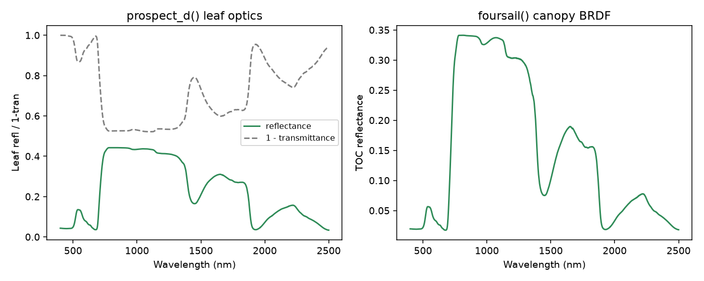

   Real output of the code above: leaf-level optics (left) and the resulting canopy-level TOC reflectance (right).

Alternative leaf models: Liberty and Fluspect-B (toolsrtm)
-------------------------------------------------------------

``prospect_d``/``prospect_pro`` aren't the only leaf models -- ``liberty``
(conifer needles, Dawson et al. 1998) and ``fluspect_b`` (PROSPECT-D
optics plus the chlorophyll-fluorescence excitation-emission matrices SCOPE
needs) both work as drop-in leaf models for ``foursail``/``foursail2``/
``inform`` via their ``leaf_model="Liberty"``/``"Fluspect-B"`` argument
(Tutorial 02's leaf-model comparison table).

.. code-block:: python

   from toolsrtm import liberty, fluspect_b

   needle = liberty(cell_d=40, inter_c=0.045, baseline_abs=0.0006, leaf_thick=1.6,
                     albino_abs=0, Cab=40, EWT=0.01, lign_cell=2, Nitrogen=1)
   print("Liberty reflectance at 800nm:", round(float(needle.refl[800 - 400]), 4))

   flu = fluspect_b(Cab=40, Car=8, EWT=0.01, LMA=0.009, Cs=0, N=1.5, fqe=0.01, Cx=0)
   print("Fluspect-B reflectance at 800nm:", round(float(flu.refl[800 - 400]), 4))
   print("Backward fluorescence matrix shape (PSI):", flu.MbI.shape)

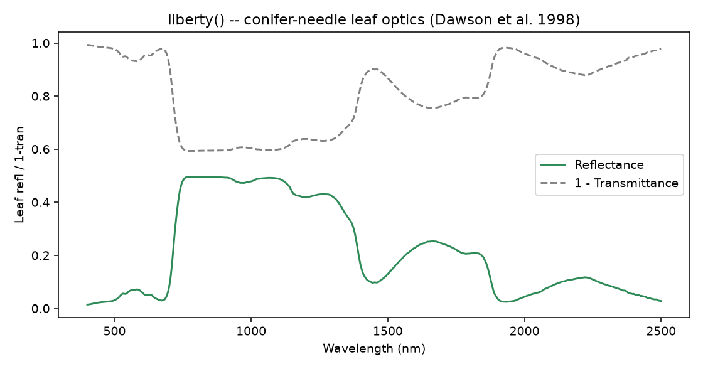

   Real output: LIBERTY's conifer-needle optics -- flatter NIR plateau and different SWIR absorption shape than broadleaf PROSPECT, reflecting the needle-specific anatomy the model targets.

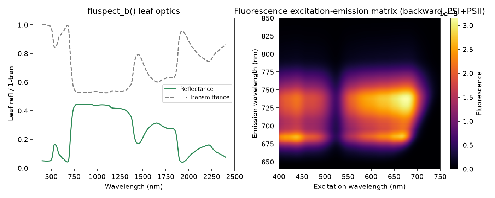

   Real output: Fluspect-B's leaf reflectance/transmittance (left, near-identical to PROSPECT-D since it shares the same absorption physics) and its backward chlorophyll-fluorescence excitation-emission matrix (right) -- the two characteristic emission peaks near 685nm (PSII) and 740nm (PSI) are visible at both the blue (~440nm) and red (~660-680nm) chlorophyll excitation bands.

Soil (BSM) + optical canopy BRDF (scopeinpython)
-------------------------------------------------

Mirrors SCOPEinR Tutorials 01-02. ``get_bsm`` (BSM, Brightness-Shape-
Moisture) is SCOPE's own soil reflectance model -- three parameters
(brightness, two empirical shape terms) plus a wetting model, rather than
a flat assumed spectrum. ``run_rtmo`` is SCOPE's optical top-of-canopy
BRDF solver -- physically the same turbid-medium idea as ``foursail``,
but re-implemented to plug into SCOPE's own multi-layer energy-balance
loop (Section "Full SCOPE run" below) rather than standing alone.

.. code-block:: python

   import numpy as np
   from toolsrtm import prospect_d
   from toolsrtm.canopy import dladgen
   from scopeinpython import SoilParams, WettingParams, get_bsm, CanopyStructure, get_spectra_scope, run_rtmo

   spectral = get_spectra_scope()
   rsoil = get_bsm(SoilParams(BSMBrightness=0.5, BSMlat=25, BSMlon=45),
                    WettingParams(SMp=15, SMC=25, film=0.015))

   leaf = prospect_d(N=1.5, Cab=40, Car=8, Anth=1, Cbrown=0, EWT=0.01, LMA=0.009, alpha=40)
   refl_leaf, tran_leaf = leaf.refl[:2001], leaf.tran[:2001]

   lidf = dladgen(-0.35, -0.15).lidf
   canopy = CanopyStructure(LAI=3, lidf=lidf, hot=0.1 / 2.0)

   # Esun_/Esky_ must be supplied by the caller -- see python/README.md
   result = run_rtmo(
       spectral=spectral, leaf_refl=refl_leaf, leaf_tran=tran_leaf,
       rho_thermal=0.01, tau_thermal=0.01, rsoil=rsoil, canopy=canopy,
       tts=30, tto=0, psi=0, Esun_=Esun_, Esky_=Esky_,
   )
   print("TOC reflectance at 550 nm:", result.refl[550 - 400])

Sensor convolution + vegetation indices (toolsrtm)
-----------------------------------------------------

Mirrors R Tutorials 07-09: convolve a simulated hyperspectral canopy
spectrum onto real Sentinel-2A band spectral response functions, then
compute vegetation indices from the convolved bands.

.. code-block:: python

   import numpy as np
   from toolsrtm import prospect_d, foursail
   from toolsrtm.srf import srf_sentinel2a, spectral_convolution_srf
   from toolsrtm.indices import get_indices

   inputLUT = dict(
       N=1.5, Cab=40, Car=8, Anth=1, Cbrown=0, EWT=0.01, LMA=0.009, alpha=40,
       LIDFa=-0.35, LIDFb=-0.15, TypeLidf=1,
       LAI=3, hspot=0.01, tts=30, tto=0, psi=0,
   )
   rsoil = np.full(2101, 0.15)
   sail = foursail(inputLUT, rsoil, leaf_model="PROSPECT-D", spectrum_all=True)
   wave = np.arange(400, 2501)

   s2a = srf_sentinel2a()
   conv = spectral_convolution_srf(wave, sail.rsot, s2a)
   print("Sentinel-2A bands:", s2a.band_names)
   print("Convolved TOC reflectance:", np.round(conv.rfl, 4))

   indices = get_indices(conv.wl, conv.rfl, spectral_domain="VNIR")
   for name in ("NDVI", "MSAVI", "REP"):
       print(name, "=", round(float(indices[name][0]), 4))

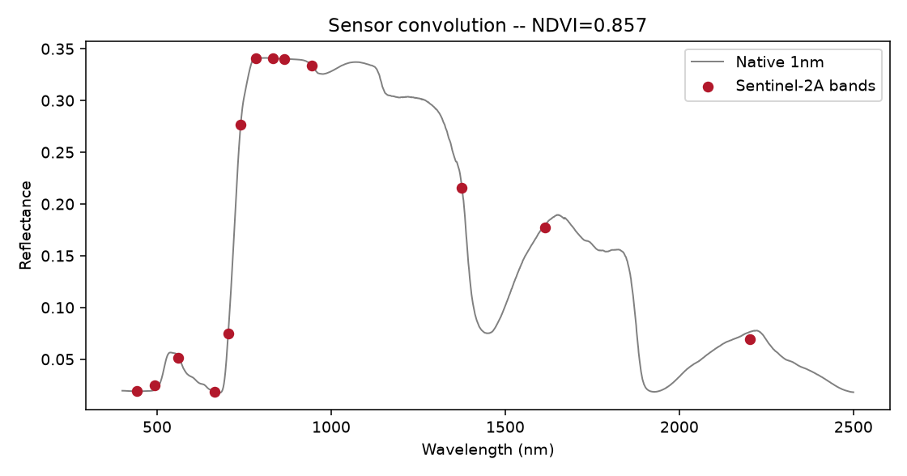

   Real output: the native 1nm spectrum (grey) and the same spectrum convolved onto Sentinel-2A's band spectral response functions (red points).

INFORM: explicit forest-canopy model (toolsrtm)
----------------------------------------------------

``inform`` (Atzberger, forest-stand extension of fourSAIL) adds explicit
tree-crown geometry -- stem density, crown diameter, tree height,
understorey LAI -- on top of the same leaf models. Mirrors R Tutorial 02's
``foursail``/``foursail2``/``inform`` comparison.

.. code-block:: python

   import numpy as np
   from toolsrtm import foursail, inform

   inputLUT = dict(
       N=1.5, Cab=40, Car=8, Anth=1, Cbrown=0, EWT=0.01, LMA=0.009, alpha=40,
       Prot=0.002, CBC=0.007, LIDFa=-0.35, LIDFb=-0.15, TypeLidf=1,
       LAI=3, hspot=0.01, tts=30, tto=0, psi=0,
       LAIu=0.5, sd=650, cd=4.5, h=20, skyl=0.1,   # INFORM-only: understorey LAI, stem density, crown diameter, tree height, diffuse-light fraction
   )
   rsoil = np.full(2101, 0.15)
   r_forest = inform(inputLUT, rsoil, leaf_model="PROSPECT-D")
   r_homogeneous = foursail(inputLUT, rsoil, leaf_model="PROSPECT-D", spectrum_all=True).rsot
   print("fourSAIL (homogeneous) at 800nm:", round(float(r_homogeneous[800 - 400]), 4))
   print("INFORM (forest stand) at 800nm:", round(float(r_forest[800 - 400]), 4))

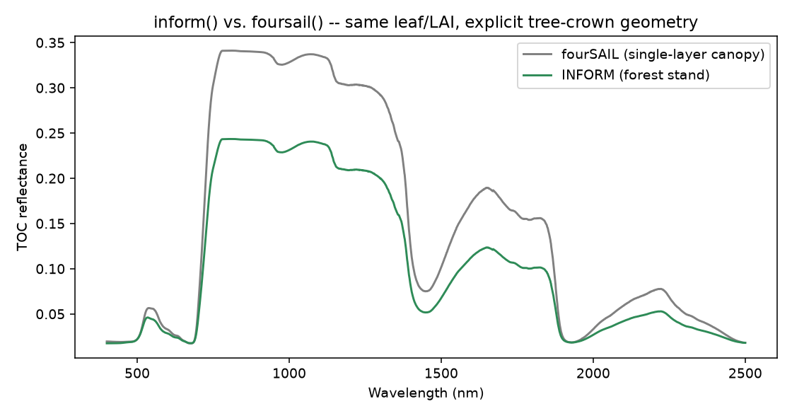

   Real output: same leaf optics and LAI through both models -- INFORM's explicit crown/gap geometry produces lower reflectance than a homogeneous fourSAIL canopy, matching the expected physics of a discontinuous forest stand.

Machine-learning trait inversion (toolsrtm)
-----------------------------------------------

Mirrors R Tutorials 11-12: build a small LUT, extract Sentinel-2-like
bands, and invert Cab with a PLSR model (``get_inversion`` dispatches to
12 algorithms in total -- see :data:`toolsrtm.inversion.ALGORITHMS`).

.. code-block:: python

   import numpy as np
   import pandas as pd
   from toolsrtm import prospect_d, foursail
   from toolsrtm.inversion import get_inversion

   rng = np.random.default_rng(1)
   rows = []
   for _ in range(200):
       Cab, LAI = rng.uniform(10, 80), rng.uniform(0.5, 6)
       inputLUT = dict(
           N=1.5, Cab=Cab, Car=8, Anth=1, Cbrown=0, EWT=0.01, LMA=0.009, alpha=40,
           LIDFa=-0.35, LIDFb=-0.15, TypeLidf=1,
           LAI=LAI, hspot=0.01, tts=30, tto=0, psi=0,
       )
       sail = foursail(inputLUT, np.full(2101, 0.15), leaf_model="PROSPECT-D", spectrum_all=True)
       row = {"Cab": Cab, "LAI": LAI}
       for wl in (490, 560, 665, 705, 740, 783, 842, 865, 1610, 2190):
           row[f"R{wl}"] = sail.rsot[wl - 400]
       rows.append(row)

   df = pd.DataFrame(rows)
   band_cols = [c for c in df.columns if c.startswith("R")]

   result = get_inversion(df, dep_var="Cab", inputs=band_cols, algorithm="PLSR", n_samples=200, seed=1)
   print("Test R2:", round(result.statistics["test"]["r2"], 3))
   print("Test RMSE:", round(result.statistics["test"]["rmse"], 3))

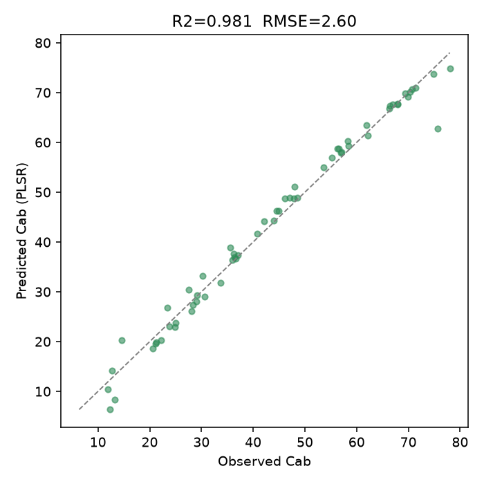

   Real output: predicted vs. observed Cab on the held-out test set (R2=0.981).

SPART: full soil-plant-atmosphere chain (toolsrtm)
-------------------------------------------------------

Mirrors R Tutorial 03: ``spart_toa`` chains ``foursail`` with the BSM soil
model and SMAC atmospheric correction, returning both top-of-canopy and
top-of-atmosphere reflectance already resampled to a real sensor's bands
(Sentinel-2A here) -- there's no separate "simulate native, then convolve"
step, unlike plain ``foursail``.

.. code-block:: python

   from toolsrtm import spart_toa, sentinel2a_msi

   inputLUT = dict(
       N=1.5, Cab=40, Car=8, Anth=1, Cbrown=0, EWT=0.01, LMA=0.009, alpha=40,
       Prot=0.002, CBC=0.007, LIDFa=-0.35, LIDFb=-0.15, TypeLidf=1,
       LAI=3, hspot=0.01, tts=30, tto=0, psi=0,
       Pa=1000, aot550=0.3246, uo3=0.3480, uh2o=1.4116,   # atmosphere: pressure, aerosol optical thickness, ozone, water vapour
   )
   result = spart_toa(inputLUT, sensor=sentinel2a_msi(), leaf_model="PROSPECT-PRO",
                       BSMBrightness=0.5, BSMlat=25, BSMlon=45, SMp=15)
   print("Sentinel-2A band centers (nm):", result.wl_smac)
   print("TOC (canopy BRDF):", result.rfl_toc_brdf.round(4))
   print("TOA (after SMAC atmospheric correction):", result.rfl_toa.round(4))

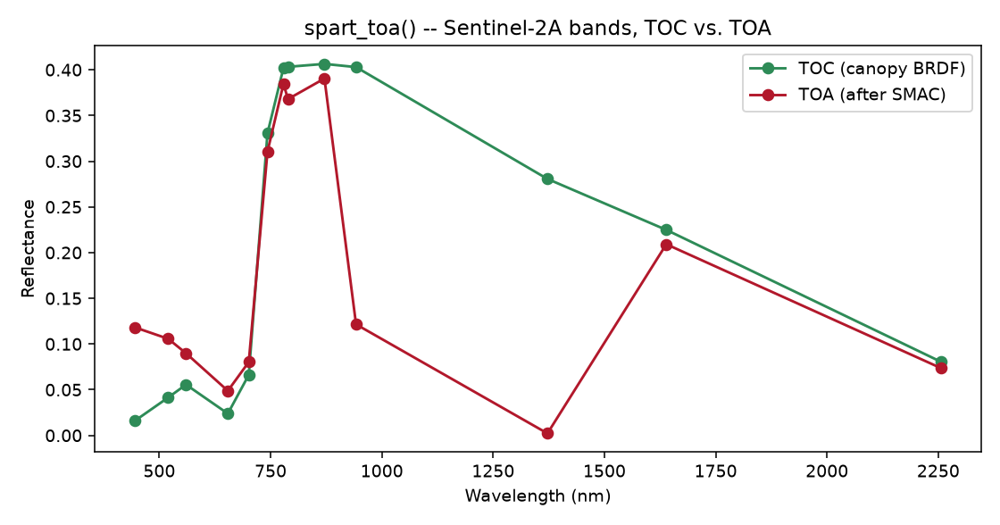

   Real output: TOC and TOA reflectance diverge sharply in the water-vapour bands (~940/1370nm), where the atmosphere absorbs most of the signal before it reaches the sensor -- exactly what real atmospheric correction has to undo.

Deep-learning trait inversion (toolsrtm, optional ``dl`` extra)
------------------------------------------------------------------

Mirrors R Tutorial 13: a Keras dense network (matching R's own
``getMLmodel``/``getMLmodel.withRetrain`` layer sizes, dropout placement,
and 7-optimizer choice) trained to invert Cab from the same 10
Sentinel-2-like bands used in the PLSR example above. Needs
``pip install "toolsrtm[dl]"`` (TensorFlow); nothing else in the package
requires it. Adam at R's own conservative default learning rate (1e-4)
converges slowly, so this needs a generous epoch budget and several
random restarts (``n_times``) to land a good held-out fit -- the same
trade-off the test suite itself budgets for.

.. code-block:: python

   import numpy as np
   import pandas as pd
   from toolsrtm import foursail
   from toolsrtm.deep_learning import get_ml_model

   rng = np.random.default_rng(2)
   rows = []
   for _ in range(600):
       Cab, LAI = rng.uniform(10, 80), rng.uniform(0.5, 6)
       inputLUT = dict(
           N=1.5, Cab=Cab, Car=8, Anth=1, Cbrown=0, EWT=0.01, LMA=0.009, alpha=40,
           LIDFa=-0.35, LIDFb=-0.15, TypeLidf=1,
           LAI=LAI, hspot=0.01, tts=30, tto=0, psi=0,
       )
       sail = foursail(inputLUT, np.full(2101, 0.15), leaf_model="PROSPECT-D", spectrum_all=True)
       row = {"Cab": Cab, "LAI": LAI}
       for wl in (490, 560, 665, 705, 740, 783, 842, 865, 1610, 2190):
           row[f"R{wl}"] = sail.rsot[wl - 400]
       rows.append(row)

   df = pd.DataFrame(rows)
   band_cols = [c for c in df.columns if c.startswith("R")]

   result = get_ml_model(df, dep_var="Cab", model="Hidden-layers",
                          n_epochs=500, n_times=3, seed=2)
   print("Held-out R2:", round(result.stats["r2"], 3))
   print("Held-out RMSE:", round(result.stats["rmse"], 2))

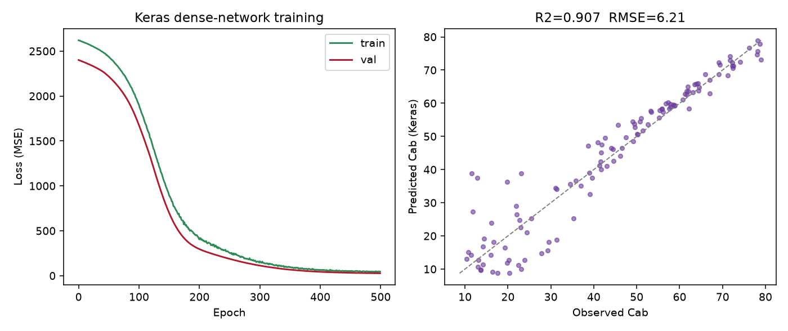

   Real output: training/validation loss over 500 epochs (left) and predicted vs. observed Cab on the held-out split (right, R2=0.900, RMSE=6.42 ug/cm2).

The 1D-CNN, on hyperspectral bands (toolsrtm)
------------------------------------------------

`get_ml_model()`'s other architecture: ``model="CNN"``, a 1D
convolution over the predictor vector *in spectral order* (matching R
Tutorial 13's own PRISMA demo) instead of treating each band as an
independent input. A wider, more contiguous band set gives the
convolution real local spectral structure to exploit -- here, ~195
bands spanning 450-2390nm every 10nm, a PRISMA-like hyperspectral
setup:

.. code-block:: python

   import numpy as np
   import pandas as pd
   from toolsrtm import foursail
   from toolsrtm.deep_learning import get_ml_model

   rng = np.random.default_rng(3)
   hyp_wl = list(range(450, 2400, 10))  # ~195 contiguous bands
   rows = []
   for _ in range(800):
       Cab, LAI = rng.uniform(10, 80), rng.uniform(0.5, 6)
       inputLUT = dict(
           N=1.5, Cab=Cab, Car=8, Anth=1, Cbrown=0, EWT=0.01, LMA=0.009, alpha=40,
           LIDFa=-0.35, LIDFb=-0.15, TypeLidf=1,
           LAI=LAI, hspot=0.01, tts=30, tto=0, psi=0,
       )
       sail = foursail(inputLUT, np.full(2101, 0.15), leaf_model="PROSPECT-D", spectrum_all=True)
       row = {"Cab": Cab}
       for wl in hyp_wl:
           row[f"R{wl}"] = sail.rsot[wl - 400]
       rows.append(row)

   df = pd.DataFrame(rows)
   result = get_ml_model(df, dep_var="Cab", model="CNN",
                          n_epochs=500, n_times=3, seed=3)
   print("Held-out R2:", round(result.stats["r2"], 3))
   print("Held-out RMSE:", round(result.stats["rmse"], 2))

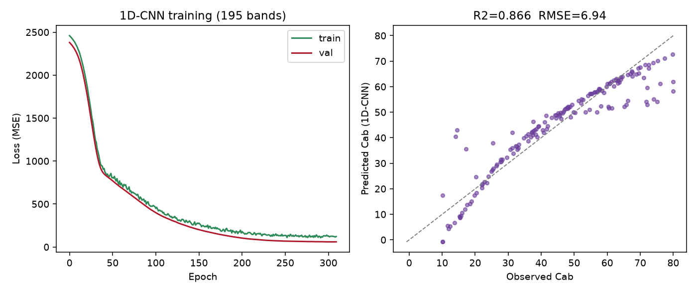

   Real output: training/validation loss over ~195 bands (left) and predicted vs. observed Cab on the held-out split (right, R2=0.866, RMSE=6.94 ug/cm2).

Both architectures apply `x_scaler` internally and consistently between
training and prediction (``result.x_scaler``, an sklearn
``StandardScaler``, is returned for reuse on genuinely new data) --
the R side of this same page (Tutorial 13) documents, as a real bug
found and fixed, what happens when a caller forgets to do that by hand.

MARMIT soil moisture model (toolsrtm)
------------------------------------------

Mirrors R Tutorial 16. Where BSM (above) builds a soil spectrum from
brightness/shape parameters, MARMIT (Bablet et al. 2018) goes the other
way: it starts from a real *dry* reference spectrum and adds a physically
modelled liquid-water film on top, so the same soil can be simulated at
any moisture level. The example below builds a wetted soil spectrum from
a dry reference and couples it into a canopy simulation.

.. code-block:: python

   from toolsrtm.marmit import get_marmit_rsoil
   from toolsrtm import prospect_d, foursail

   soil = get_marmit_rsoil(soil_id=3, L=0.05, eps=0.4, version="marmit1")
   print("SMC (soil moisture content):", round(float(soil.smc), 4))
   for wl in (550, 850, 1600):
       i = wl - 400
       print(f"{wl}nm: dry={soil.rsoil_dry[i]:.4f}  wet={soil.rsoil_wet[i]:.4f}")

   inputLUT = dict(
       N=1.5, Cab=40, Car=8, Anth=1, Cbrown=0, EWT=0.01, LMA=0.009, alpha=40,
       LIDFa=-0.35, LIDFb=-0.15, TypeLidf=1,
       LAI=1.5, hspot=0.01, tts=30, tto=0, psi=0,
   )
   sail = foursail(inputLUT, soil.rsoil_wet, leaf_model="PROSPECT-D", spectrum_all=True)
   print("Canopy TOC reflectance at 850nm with wet MARMIT soil:", round(float(sail.rsot[850 - 400]), 4))

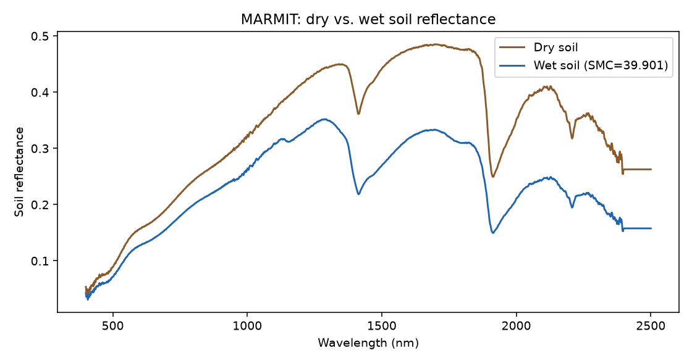

   Real output: MARMIT's dry-reference vs. wetted soil reflectance -- the SWIR water-absorption dips (~1400/1900nm) deepen and overall brightness drops as the soil wets.

Full SCOPE run: energy balance + fluorescence (scopeinpython)
-------------------------------------------------------------------

Mirrors SCOPEinR Tutorials 03-04. SCOPE (Soil Canopy Observation,
Photochemistry and Energy fluxes, van der Tol et al. 2009) is a different
kind of model from PROSAIL/SPART above, not just a bigger one: instead of
assuming leaf/soil temperature and computing reflectance alone, it
iteratively **solves** leaf and soil temperature so that absorbed
radiation balances sensible + latent heat + photosynthesis (the energy
balance), then derives fluorescence and carbon flux from that solved
state -- one full ``get_scope()`` call chains optics
(:func:`~scopeinpython.get_fluspect_cx_scope` + ``run_rtmo``), the energy
balance (:func:`~scopeinpython.ebal`), photosynthesis
(:func:`~scopeinpython.get_biochemical`) and fluorescence
(:func:`~scopeinpython.rtmf`) together, against the same bundled example
LUT row SCOPEinR's own test suite and R vignettes use
(``SCOPEinR/inst/input/LUT_input.csv``).

.. code-block:: python

   import csv
   from pathlib import Path
   from scopeinpython import ScopeOptions, get_scope

   with open("SCOPEinR/inst/input/LUT_input.csv", newline="") as f:
       row = next(csv.DictReader(f))

   res = get_scope(row, options=ScopeOptions(k_maxit=100, maxEBer=1.0))
   print("Canopy layers:", res.nlayers)
   print("TOC reflectance at 550/700/850 nm:",
         round(float(res.rtmo.refl[550 - 400]), 4),
         round(float(res.rtmo.refl[700 - 400]), 4),
         round(float(res.rtmo.refl[850 - 400]), 4))
   print("Net radiation, total (Rntot):", round(float(res.ebal.Rntot), 2), "W/m2")
   print("Total photosynthesis (Actot):", round(float(res.ebal.Actot), 2), "umol CO2/m2/s")
   if res.rtmf is not None:
       print("Emitted fluorescence (EoutF):", round(float(res.rtmf.EoutF), 4), "W/m2/sr")

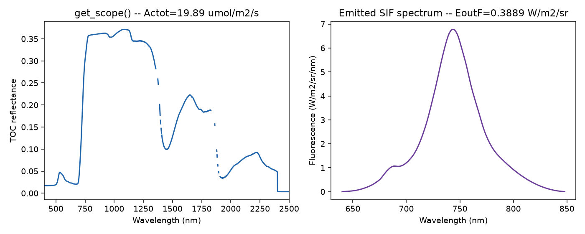

   Real output of the single ``get_scope()`` call above: TOC reflectance (left; the dashed gaps are the water-vapor-absorption wavelengths SCOPE itself leaves undefined) and the emitted SIF spectrum (right).

Real Sentinel-2 capstone: retrieving net photosynthesis (scopeinpython)
--------------------------------------------------------------------------------

Mirrors SCOPEinR Tutorial 11, end to end. **Sentinel-2 cannot observe
SIF** -- no bands resolve the fluorescence peaks or O2-A/O2-B features
dedicated SIF missions (FLEX, TROPOMI) do -- so any model trained *with*
SIF as a predictor is not valid to apply to real Sentinel-2 data. This
example trains both a reflectance-only model (Sentinel-2-realistic) and a
reflectance+SIF model (idealized) explicitly, so the real accuracy cost of
not having SIF is visible, then applies **only** the reflectance-only
model to a real Sentinel-2 time series over Speulderbos, NL (a mixed
pine/beech ICOS forest). Needs the optional ``ml`` and ``stac`` extras.

The training LUT must vary every trait ``get_scope()`` reads (meteorology,
structure, soil -- not just the two traits being retrieved), matching
``SCOPEinR::getLUT.SCOPE()``'s own per-trait sampling from
``inputs_SCOPE.csv``, or the fitted model generalizes poorly to real data:

.. code-block:: python

   import csv
   import numpy as np
   import pandas as pd
   from scopeinpython import ScopeOptions, get_scope
   from toolsrtm.sensitivity import get_cor, gauss_by_min_max
   from toolsrtm.srf import srf_sentinel2a, spectral_convolution_srf
   from toolsrtm.satellite import get_satellite_collection, get_sentinel2_cube
   from sklearn.ensemble import RandomForestRegressor

   # 1. A properly-varied SCOPE LUT: every trait in inputs_SCOPE.csv sampled
   #    per its own Distribution (Uniform/Fixed/Gaussian), Cab and Vcmax25
   #    then overwritten with a correlated pair (leaves' real Cab-Vcmax25
   #    co-variation) via toolsrtm.sensitivity.get_cor -- SCOPEinR
   #    Tutorial 10's "fair test" fix, ported here too.
   def build_scope_lut(csv_path, n, seed):
       rng = np.random.default_rng(seed)
       with open(csv_path, newline="", encoding="utf-8-sig") as f:
           rows = list(csv.DictReader(f))
       lut = {}
       for row in rows:
           trait, dist = row["variable"], row["Distribution"]
           if trait in ("startDate", "endDate"):
               continue
           if trait == "Type":
               lut[trait] = np.array([f"C{row['default']}"] * n, dtype=object); continue
           lo, hi = float(row["lower"]), float(row["upper"])
           if dist == "Uniform":
               lut[trait] = rng.uniform(lo, hi, size=n)
           elif dist == "Fixed":
               lut[trait] = np.full(n, float(row["default"]))
           else:
               lut[trait] = gauss_by_min_max(n, float(row["Mean_D"]), float(row["Std_D"]), lo, hi, n * 3, rng=rng)
       return lut

   n_samples = 250
   lut = build_scope_lut("SCOPEinR/inst/input/inputs_SCOPE.csv", n_samples, seed=1)
   cor_res = get_cor(n_inputs=2, n_lut=n_samples, distribution="Uniform", rho=0.85, seed=3,
                      var_names=["Cab", "Vcmax25"], min_range=[5, 5], max_range=[90, 250])
   lut["Cab"], lut["Vcmax25"] = cor_res.lut["Cab"], cor_res.lut["Vcmax25"]

   # 2. Run SCOPE for every row; collect Actot (the flux) and Sentinel-2 band reflectance.
   opts = ScopeOptions(k_maxit=100, maxEBer=1.0)
   wl_optical = np.arange(400, 2401)
   s2a = srf_sentinel2a()
   real_names = ["B02", "B03", "B04", "B05", "B06", "B07", "B08", "B8A", "B11", "B12"]
   keep = ["B2", "B3", "B4", "B5", "B6", "B7", "B8", "B8A", "B11", "B12"]

   Actot, band_refl = [], []
   for i in range(n_samples):
       row = {k: v[i] for k, v in lut.items()}
       res = get_scope(row, options=opts)
       refl = np.asarray(res.rtmo.refl)[: len(wl_optical)]
       bad = ~np.isfinite(refl)
       if bad.any():
           refl[bad] = np.interp(wl_optical[bad], wl_optical[~bad], refl[~bad])
       conv = spectral_convolution_srf(wl_optical, refl, s2a)
       keep_idx = [conv.band_names.index(k) for k in keep]
       Actot.append(res.ebal.Actot); band_refl.append(conv.rfl[keep_idx])
   Actot, band_refl = np.array(Actot), np.array(band_refl)

   # 3. Train the reflectance-only model (the only one applied to real data below).
   df = pd.DataFrame(band_refl, columns=real_names)
   rf_reflonly = RandomForestRegressor(n_estimators=300, random_state=1)
   rf_reflonly.fit(df[real_names], Actot)

   # 4. A real Sentinel-2 time series over Speulderbos, 2024.
   lat, lon, d = 52.2500, 5.6900, 0.003
   bbox = (lon - d, lat - d, lon + d, lat + d)
   windows = [("2024-03-01", "2024-03-31"), ("2024-05-01", "2024-05-31"),
              ("2024-07-01", "2024-07-31"), ("2024-09-01", "2024-09-30"), ("2024-11-01", "2024-11-30")]
   ts, cubes = [], {}
   for w in windows:
       coll = get_satellite_collection(bbox, collection="sentinel-2-l2a", date_range=w,
                                        cloud_server="microsoft", n_limit=20, cloud_threshold=40)
       ds = get_sentinel2_cube(coll, bbox, resolution=10.0, crs="EPSG:32631", aggregation_method="mean")
       cubes[w[0]] = ds
       means = np.array([float(np.nanmean(ds[b].values)) / 10000 for b in real_names])
       ndvi = (means[6] - means[2]) / (means[6] + means[2])  # B08, B04
       actot_pred = float(rf_reflonly.predict(means.reshape(1, -1))[0])
       ts.append(dict(date=w[0], ndvi=ndvi, actot=actot_pred))
   ts_df = pd.DataFrame(ts)
   print("Correlation, NDVI vs. retrieved Actot:", round(float(np.corrcoef(ts_df.ndvi, ts_df.actot)[0, 1]), 2))

   # 5. Map Actot spatially over the July scene (every pixel through the same model).
   map_cube = cubes["2024-07-01"]
   r = {b: map_cube[b].values.astype(float) / 10000 for b in real_names}
   pix = np.column_stack([r[b].ravel() for b in real_names])
   ok = np.all(np.isfinite(pix), axis=1)
   actot_pixels = np.full(pix.shape[0], np.nan)
   actot_pixels[ok] = rf_reflonly.predict(pix[ok])
   actot_map = actot_pixels.reshape(r["B04"].shape)

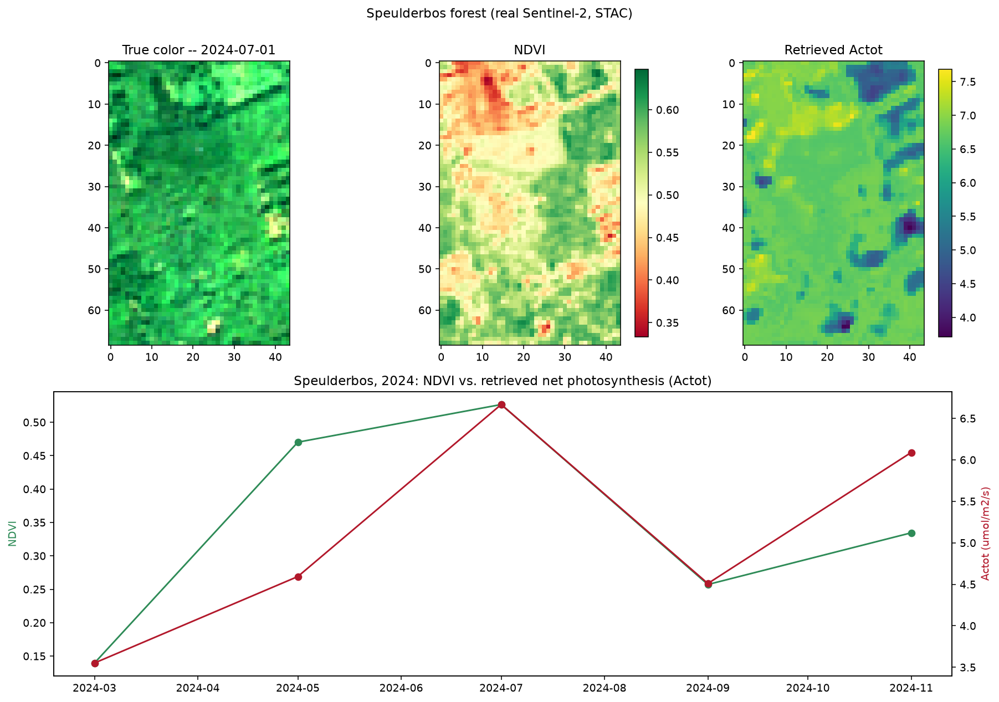

   Real output over the real Speulderbos scene (July 2024): true color, NDVI, and per-pixel retrieved Actot (top), and the resulting NDVI/Actot seasonal curve across all 5 real 2024 STAC acquisitions (bottom) -- both rise into summer and decline toward autumn, the same real forest phenology ToolsRTM's own Tutorials 15-17 found in NDVI at nearby real sites.

Global sensitivity analysis (toolsrtm)
------------------------------------------

Mirrors R Tutorial 10: run ``foursail`` hundreds of times while varying leaf
and canopy traits, then compute the Johnson relative-importance index at
every wavelength -- how much each trait relatively explains reflectance
variance there. Produces the classic PROSAIL "stacked contribution vs
wavelength" figure (leaf structure, pigment, water, dry matter, leaf angle,
LAI, soil, stacked to 100% at every wavelength).

.. code-block:: python

   from toolsrtm.sensitivity import spectral_sensitivity

   result = spectral_sensitivity(n_samples=500, distribution="Uniform",
                                  traits=("N", "Cab", "EWT", "LMA", "LIDFa", "LAI"),
                                  wl_step=5, seed=11)
   # long-format arrays: wavelength, trait, sti_pct (sums to 100 per wavelength)
   at_700nm = result.sti_pct[result.wavelength == 700]
   print(dict(zip(result.trait[result.wavelength == 700], at_700nm.round(1))))

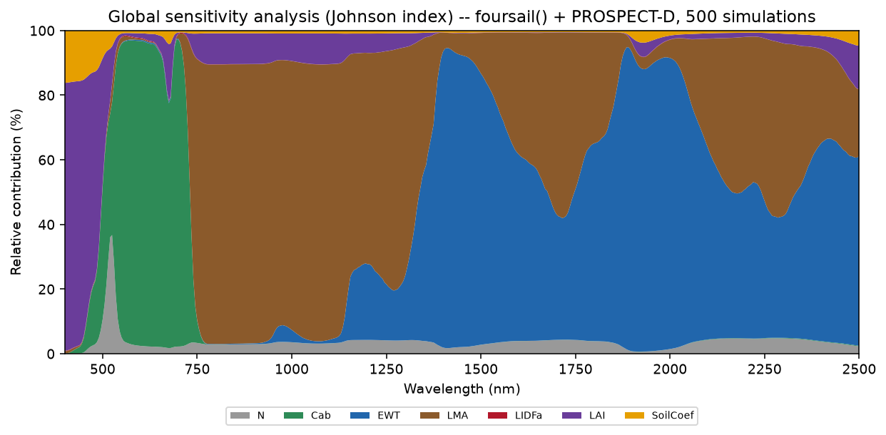

   Real output: chlorophyll (Cab) dominates the visible, water (EWT) and dry matter (LMA) dominate the SWIR, leaf structure (N) and soil brightness matter most in the NIR plateau -- the textbook PROSAIL sensitivity pattern, recovered numerically rather than assumed.

``toolsrtm.sensitivity`` also has :func:`~toolsrtm.sensitivity.sobol_indices`
(direct data -> Johnson-index + simplified Sobol-like Si/STi, no extra model
runs needed) and the correlated/multi-distribution LUT builders
:func:`~toolsrtm.sensitivity.get_distribution_lut` /
:func:`~toolsrtm.sensitivity.get_cor` / :func:`~toolsrtm.sensitivity.correlated_value`
(R Tutorial 05's LUT-correlation helpers) -- see ``tests/test_sensitivity.py``
for worked examples of each.

Real Sentinel-2 capstone: data-driven spatial index + Cab mapping (toolsrtm)
--------------------------------------------------------------------------------

Mirrors R Tutorial 18, end to end: simulate a training LUT (with a
deliberately wide domain -- sparse-to-dense LAI, a realistic sun zenith,
variable soil brightness -- so the simulated reflectance envelope actually
covers a real forest scene), invert Cab with a Random Forest, rank
Sentinel-2-computable vegetation indices by correlation with the *inverted*
Cab (not assumed), retrieve a real Sentinel-2 image over **Loobos (NL-Loo)**
-- an ICOS eddy-covariance Scots pine forest near Kootwijk, NL
(52.166447°N, 5.74355°E) -- via STAC, and map both the winning index and
Cab spatially over the real scene. Needs the optional ``ml`` and ``stac``
extras: ``pip install "toolsrtm[ml,stac]"``.

.. code-block:: python

   import numpy as np
   import pandas as pd
   from toolsrtm import foursail, srf_sentinel2a, spectral_convolution_srf, get_indices, get_inversion
   from toolsrtm.satellite import get_satellite_collection, get_sentinel2_cube

   # 1. Training LUT -- wide domain (LAI down to 0.3, non-zero sun zenith,
   #    variable soil) so the simulated envelope covers real forest reflectance.
   wl = np.arange(400, 2501)
   rng = np.random.default_rng(1)
   n = 500
   LAI, tts, soil_b = rng.uniform(0.3, 5, n), rng.uniform(25, 45, n), rng.uniform(0.05, 0.30, n)
   Cab, Car, Anth = rng.uniform(5, 75, n), rng.uniform(0, 20, n), rng.uniform(0, 4.5, n)
   EWT, LMA, N = rng.uniform(0.001, 0.035, n), rng.uniform(0.001, 0.035, n), rng.uniform(1.5, 2.5, n)
   LIDFa, hspot, tto, psi = rng.uniform(30, 70, n), rng.uniform(0, 1, n), rng.uniform(15, 30, n), rng.uniform(0, 180, n)

   refl = np.stack([
       foursail(dict(N=N[i], Cab=Cab[i], Car=Car[i], Anth=Anth[i], Cbrown=0.0, EWT=EWT[i], LMA=LMA[i],
                      alpha=40.0, LIDFa=LIDFa[i], LIDFb=0.0, TypeLidf=1.0, LAI=LAI[i], hspot=hspot[i],
                      tts=tts[i], tto=tto[i], psi=psi[i]),
                np.full(2101, soil_b[i]), leaf_model="PROSPECT-D", spectrum_all=True).rsot
       for i in range(n)
   ])

   # 2. Convolve to the 10 bands a real Sentinel-2 STAC cube actually provides
   #    (B01/B09/B10 excluded -- 60m-only, no vegetation signal at 10-20m).
   s2a = srf_sentinel2a()
   conv0 = spectral_convolution_srf(wl, refl[0], s2a)
   keep = ["B2", "B3", "B4", "B5", "B6", "B7", "B8", "B8A", "B11", "B12"]
   real_names = ["B02", "B03", "B04", "B05", "B06", "B07", "B08", "B8A", "B11", "B12"]
   keep_idx = [conv0.band_names.index(k) for k in keep]
   band_refl = np.stack([spectral_convolution_srf(wl, refl[i], s2a).rfl[keep_idx] for i in range(n)])

   # 3. Hybrid-invert Cab (Random Forest, held-out test set).
   df = pd.DataFrame(band_refl, columns=real_names); df["Cab"] = Cab
   fit = get_inversion(df, dep_var="Cab", inputs=real_names, algorithm="RF", n_samples=n, seed=42)
   print("Held-out Cab R2:", round(fit.statistics["test"]["r2"], 3))

   # 4. Rank VNIR indices by |correlation| with the *inverted* Cab -- VNIR only,
   #    since SWIR-domain formulas need wavelengths (990/1510/1260nm...) no
   #    real Sentinel-2 band is anywhere near.
   band_wl = conv0.wl[keep_idx]
   idx_rows = [get_indices(band_wl, band_refl[i], spectral_domain="VNIR") for i in range(n)]
   cors = {nm: abs(np.corrcoef([row[nm] for row in idx_rows], Cab)[0, 1])
           for nm in idx_rows[0] if np.all(np.isfinite([row[nm] for row in idx_rows]))}
   winning_index = max(cors, key=cors.get)
   print("Winning index:", winning_index, "|corr|=", round(cors[winning_index], 3))

   # 5. Retrieve the real Sentinel-2 image: Loobos forest, July 2024.
   lat, lon, d = 52.166447, 5.74355, 0.006
   bbox = (lon - d, lat - d, lon + d, lat + d)
   coll = get_satellite_collection(bbox, collection="sentinel-2-l2a", date_range=("2024-07-01", "2024-07-31"),
                                    cloud_server="microsoft", n_limit=20, cloud_threshold=40)
   cube = get_sentinel2_cube(coll, bbox, resolution=10.0, crs="EPSG:32631", aggregation_method="mean")
   r = {b: cube[b].values.astype(float) / 10000 for b in real_names}

   # 6. Map the winning index (REP -- red-edge position, matching R's REIP1)
   #    and Cab spatially over the real scene.
   rep_map = 700 + 40 * (((r["B04"] + r["B07"]) / 2 - r["B05"]) / (r["B06"] - r["B05"]))
   pix = np.column_stack([r[b].ravel() for b in real_names])
   ok = np.all(np.isfinite(pix), axis=1)
   cab_pixels = np.full(pix.shape[0], np.nan); cab_pixels[ok] = fit.model.predict(pix[ok])
   cab_map = cab_pixels.reshape(r["B04"].shape)
   print("Pixel-wise correlation, REP vs. Cab:",
         round(float(np.corrcoef(rep_map[ok.reshape(rep_map.shape)], cab_map[ok.reshape(rep_map.shape)])[0, 1]), 2))

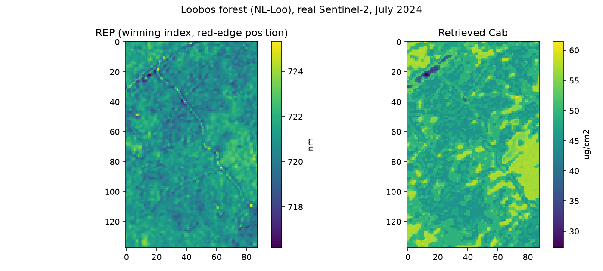

   Real output over the real Loobos scene: the winning index (REP, red-edge position, 715-725nm) and the RF-retrieved Cab (26-60 ug/cm2) -- both show the same forest gap (dark patch) independently, one a plain spectral index, the other a full hybrid-inversion model.

Full simulate -> indices -> ML-invert pipeline
------------------------------------------------

A complete, actually-executed pipeline (100 samples, spectral indices,
scikit-learn trait inversion, real R² 0.7-0.9) lives outside this
package as plain scripts + a Jupyter notebook, kept separate from the R
scripts:

``Scripts/Python/ForPROSAIL_fourSAIL/`` — ``1_simulate_lut.py`` →
``2_spectral_indices.py`` → ``3_inversion_ml.py``, plus ``pipeline.ipynb``.
See ``Scripts/Python/README.md`` for how to run it.

What isn't ported yet
----------------------

No tutorial-level gaps remain uncovered by the examples above -- every R
tutorial series (ToolsRTM, SCOPEinR) has at least one topic-for-topic
Python equivalent on this page now, including both real-Sentinel-2/STAC
capstones. What's left is the finer-grained, function-level gaps listed
in :doc:`not_ported`, and each package's own ``README.md`` has the full
R-tutorial-to-Python-module bridge table.
