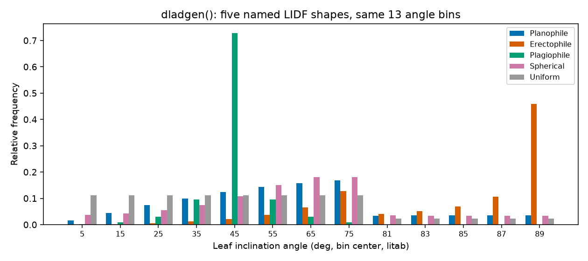
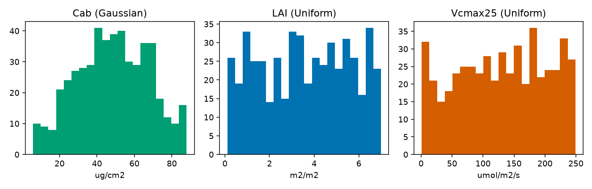

Parameter & Trait Glossary
============================

Every example on this site passes trait values into a leaf, canopy,
soil, atmosphere, or SCOPE model without stopping to explain what each
one physically means or what a realistic value looks like. This page is
that stop: one place with every input's meaning, units, typical range,
and which model(s) actually use it. It mirrors the R side's own
`ToolsRTM Parameter & Trait Glossary
<https://ccgcam.github.io/RTM-Suite/toolsrtm/articles/parameter-glossary.html>`_
and `SCOPEinR Trait & LUT Glossary
<https://ccgcam.github.io/RTM-Suite/scopeinr/articles/trait-glossary.html>`_
-- same models, same physics, same parameter names, Python calling
convention.

What each model *is* (not just its parameters) now has its own page:
:doc:`models` covers every leaf/canopy/soil/atmosphere/SCOPE model's
identity and how it differs from its siblings, with a one-line-per-model
summary table up top. This page stays focused on the *inputs* those
models read.

1. Leaf traits
---------------

All leaf models (:func:`toolsrtm.leaf.prospect_d`, :func:`toolsrtm.leaf.prospect_pro`,
:func:`toolsrtm.liberty.liberty`, :func:`toolsrtm.fluspect.fluspect_b`) build on the same
PROSPECT physics: a leaf is treated as a stack of absorbing/scattering
plates, and each trait below is one absorbing constituent (a pigment,
water, dry matter) or one structural parameter of that stack.

.. list-table::
   :header-rows: 1
   :widths: 8 40 12 20 20

   * - Symbol
     - Meaning
     - Units
     - Typical range
     - Used by
   * - ``N``
     - Leaf structure parameter -- effective number of compound-leaf
       "plates" the PROSPECT mesophyll model integrates over. Higher
       ``N`` = more internal scattering = higher NIR reflectance/
       transmittance, independent of any pigment.
     - unitless
     - 1 -- 3 (rarely up to 4.5)
     - prospect_d, prospect_pro, fluspect_b
   * - ``Cab``
     - Chlorophyll a+b content. The single strongest driver of visible-
       light (400-700nm) absorption -- healthy green leaves sit high in
       this range, senescent/stressed leaves low.
     - ug/cm2
     - 0 -- 100 (20-80 typical, healthy)
     - prospect_d, prospect_pro, fluspect_b
   * - ``Car``
     - Carotenoid content (mostly xanthophylls + beta-carotene). Absorbs
       alongside ``Cab`` in the blue/green, becomes visually dominant
       once ``Cab`` drops (autumn colours).
     - ug/cm2
     - 0 -- 25
     - prospect_d, prospect_pro, fluspect_b
   * - ``Anth``
     - Anthocyanin content. Usually near zero in healthy green leaves;
       rises under stress or senescence.
     - ug/cm2
     - 0 -- 40 (0 -- ~7 typical crop)
     - prospect_d, prospect_pro
   * - ``Cbrown``
     - Brown-pigment absorption coefficient -- a lumped, unitless proxy
       for senescent/degraded material, not a physical concentration.
     - unitless (0-1)
     - 0 (green) -- 1 (senescent)
     - prospect_d, prospect_pro
   * - ``EWT``
     - Equivalent water thickness -- the water column each unit leaf
       area would form if spread into a uniform film. Drives the SWIR
       water-absorption features (~1450/1940/2500nm).
     - cm (equiv. g/cm2)
     - 0.002 -- 0.05 (0.01-0.02 typical)
     - prospect_d, prospect_pro, fluspect_b, liberty
   * - ``LMA``
     - Leaf mass per area -- total dry matter content, lumping
       cellulose, lignin, protein and everything else that isn't water
       or pigment.
     - g/cm2
     - 0.002 -- 0.02
     - prospect_d, fluspect_b
   * - ``alpha``
     - Leaf-air interface incidence-angle parameter (Fresnel refraction,
       Stern-Gershun/Allen) -- a geometric-optics constant of the model
       itself, not a leaf biochemistry trait.
     - degrees
     - fixed at 40 in virtually all published PROSPECT work
     - prospect_d, prospect_pro, fluspect_b
   * - ``Prot``
     - Protein content -- one of two constituents ``prospect_pro``
       splits out of ``LMA``.
     - g/cm2
     - 0 -- 0.01
     - prospect_pro
   * - ``CBC``
     - Carbon-based constituents (cellulose + lignin) -- the other
       constituent ``prospect_pro`` splits out of ``LMA``.
     - g/cm2
     - 0 -- 0.02
     - prospect_pro
   * - ``Cs``
     - Senescent-material absorption coefficient (Fluspect's own,
       separate from PROSPECT's ``Cbrown``).
     - unitless (0-1)
     - 0 (fresh) -- 1
     - fluspect_b
   * - ``Cx``
     - Xanthophyll de-epoxidation state -- violaxanthin-to-zeaxanthin
       conversion fraction (the photoprotective NPQ pigment pool).
     - unitless (0-1)
     - 0 (relaxed) -- 1 (photoprotecting)
     - fluspect_b
   * - ``fqe``
     - Fluorescence quantum efficiency -- how much absorbed PAR is
       re-emitted as chlorophyll fluorescence.
     - unitless
     - ~0.01 typical default
     - fluspect_b

``prospect_pro`` and plain ``LMA``-based models are mutually exclusive
dry-matter parameterizations of the *same* leaf -- supplying both
``LMA`` and non-zero ``Prot``/``CBC`` in one call is a modelling choice,
not something the package validates for you.

LIBERTY-only structural traits
~~~~~~~~~~~~~~~~~~~~~~~~~~~~~~~~

:func:`toolsrtm.liberty.liberty` targets conifer needles, not broadleaves, and
needs explicit cell geometry instead of PROSPECT's ``N``/``alpha``
Fresnel-optics layer:

.. list-table::
   :header-rows: 1
   :widths: 12 50 15 23

   * - Symbol
     - Meaning
     - Units
     - Typical range
   * - ``cell_d``
     - Average mesophyll cell diameter.
     - um
     - 20 -- 60
   * - ``inter_c``
     - Intercellular air-space fraction -- the needle analogue of
       PROSPECT's ``N``.
     - unitless (0-1)
     - 0.03 -- 0.06
   * - ``baseline_abs``
     - Baseline (wavelength-flat) absorption coefficient.
     - unitless
     - ~0.0005 -- 0.001
   * - ``leaf_thick``
     - Needle thickness.
     - relative units
     - 1 -- 2
   * - ``albino_abs``
     - Extra absorption for albino/depigmented tissue.
     - unitless
     - 0 (typical)
   * - ``lign_cell``
     - Lignin+cellulose cell-wall absorption term.
     - unitless
     - 1 -- 3
   * - ``Nitrogen``
     - Foliar nitrogen content, scaling protein-related absorption.
     - relative units
     - ~1 (typical default)

2. Canopy structure and viewing geometry
-------------------------------------------

Once a leaf model produces reflectance/transmittance,
:func:`toolsrtm.canopy.foursail`, ``foursail2``, and :func:`toolsrtm.inform.inform` turn
it into a canopy-level BRF, sharing the geometry/LIDF parameters below:

.. list-table::
   :header-rows: 1
   :widths: 15 45 15 25

   * - Symbol
     - Meaning
     - Units
     - Typical range
   * - ``LAI``
     - Leaf area index -- total one-sided leaf area per unit ground
       area. The strongest canopy-level driver of NIR-plateau height
       and visible-band saturation.
     - m2/m2
     - 0.1 -- 8 (0 = bare soil)
   * - ``LIDFa``, ``LIDFb``
     - Leaf inclination distribution shape parameters (Verhoef 1998,
       ``TypeLidf=1``). ``LIDFa`` mainly sets the average leaf angle
       (-1 = horizontal to +1 = vertical); ``LIDFb`` adjusts bimodality/
       spread. See Section 4 for named shapes.
     - unitless, each in [-1, 1]
     - see Section 4
   * - ``TypeLidf``
     - ``1`` = Verhoef two-parameter system; ``2`` = ellipsoidal, where
       ``LIDFa`` alone is the mean leaf angle in **degrees**.
     - ``1`` or ``2``
     - --
   * - ``hspot``
     - Hot-spot size parameter -- leaf width / canopy height.
     - unitless
     - 0.01 -- 0.5
   * - ``tts`` / ``tto`` / ``psi``
     - Sun zenith / view zenith / relative azimuth.
     - degrees
     - 0-90 / 0-90 / 0-180

3. Named leaf-angle distributions
-------------------------------------

.. code-block:: python

   from toolsrtm.canopy import dladgen

   spherical = dladgen(-0.35, -0.15)   # this package's own "no strong prior" default
   print(spherical.lidf, spherical.litab)

.. list-table::
   :header-rows: 1
   :widths: 20 12 12 40

   * - Name
     - ``LIDFa``
     - ``LIDFb``
     - Typical canopy
   * - Planophile
     - 1
     - 0
     - Mostly horizontal leaves (many crops, grasses)
   * - Erectophile
     - -1
     - 0
     - Mostly vertical leaves (some grasses, conifers)
   * - Plagiophile
     - 0
     - -1
     - Mostly oblique (~45 deg) leaves
   * - Extremophile
     - 0
     - 1
     - Bimodal horizontal+vertical mix
   * - Spherical
     - -0.35
     - -0.15
     - Sphere-distributed angles -- most common default, used throughout
       this site's own examples
   * - Uniform
     - 0
     - 0
     - All angles equally likely

   Real output: ``dladgen()``'s relative frequency per leaf-angle bin, for five named shapes. Planophile concentrates mass at low angles (horizontal leaves), erectophile at high angles (vertical leaves), spherical spreads smoothly across the whole range.

4. Soil: MARMIT (dry -> wet)
--------------------------------

:func:`toolsrtm.marmit.get_marmit_rsoil` turns a dry reference soil spectrum into
a wet one:

.. list-table::
   :header-rows: 1
   :widths: 15 50 35

   * - Symbol
     - Meaning
     - Typical range
   * - ``soil_id``
     - Which dry reference spectrum to start from, from a bundled soil-
       spectral-library database.
     - database-dependent
   * - ``L``
     - Water-film optical thickness (cm). Near 0 is dry, larger is wetter.
     - 0.001 (dry) -- 0.15+ (wet)
   * - ``eps``
     - Soil surface roughness/optical-path parameter.
     - 0.05 (dry/smooth) -- 1.0 (wet/rough)

5. Soil + atmosphere: SPART (BSM soil, SMAC atmosphere)
------------------------------------------------------------

:func:`toolsrtm.spart.spart_toa` (and :func:`scopeinpython.soil.get_bsm`) use BSM
soil plus SMAC atmospheric correction:

.. list-table::
   :header-rows: 1
   :widths: 18 50 32

   * - Symbol
     - Meaning
     - Typical range
   * - ``BSMBrightness``
     - Overall soil brightness.
     - 0.3 -- 0.9
   * - ``BSMlat``, ``BSMlon``
     - Soil spectral-shape "latitude"/"longitude" -- BSM-specific
       empirical shape parameters, not geographic coordinates.
     - 20-40 / 45-65
   * - ``SMp``
     - Soil moisture, volume percentage.
     - 5 -- 55 %
   * - ``SMC``
     - Soil moisture capacity.
     - ~25 (recommended)
   * - ``film``
     - Effective optical thickness of a single water film.
     - ~0.015 (recommended)
   * - ``Pa``
     - Atmospheric surface pressure.
     - ~900-1030 hPa
   * - ``aot550``
     - Aerosol optical thickness at 550nm.
     - 0.05 (clear) -- 0.5+ (hazy)
   * - ``uo3``
     - Total-column ozone.
     - ~0.3-0.4 atm-cm
   * - ``uh2o``
     - Total-column water vapour.
     - ~1-3 g/cm2

6. SCOPE traits: leaf + photosynthesis + fluorescence + energy balance
---------------------------------------------------------------------------

:func:`scopeinpython.scope.get_scope` isn't one model -- it's five
distinct components chained together (leaf optics, optical BRDF, energy
balance, photosynthesis, fluorescence); see :doc:`models`'s "Energy
balance / fluorescence: SCOPE" section for what each one does and how
they depend on each other. ``get_scope()`` runs all five for one LUT row
and returns everything together. Its leaf-biochemistry traits are exactly
Section 1's PROSPECT/Fluspect traits -- the traits genuinely unique to
SCOPE:

.. list-table::
   :header-rows: 1
   :widths: 20 45 15 20

   * - Symbol
     - Meaning
     - Units
     - Typical range
   * - ``Vcmax25``
     - Maximum carboxylation capacity of Rubisco at 25degC -- the
       biggest driver of photosynthetic capacity (and fluorescence
       yield). Low (<20) = stressed/senescent; 40-120 = typical healthy.
     - umol/m2/s
     - 0.75 -- 250
   * - ``BallBerrySlope`` / ``BallBerry0``
     - Ball-Berry stomatal conductance model: steeper slope tracks
       photosynthesis more tightly; ``BallBerry0`` is the residual
       (cuticular) conductance at zero assimilation.
     - unitless / mol H2O/m2/s
     - 1-20 / 0.01-0.05
   * - ``kV``
     - Canopy-depth extinction coefficient for ``Vcmax`` (shaded lower
       leaves down-regulate photosynthetic capacity).
     - unitless
     - ~0.64 typical
   * - ``Rdparam``
     - Dark respiration as a fraction of ``Vcmax25``.
     - unitless
     - ~0.015 typical
   * - ``Kn0``/``Knalpha``/``Knbeta``, ``beta``
     - Non-photochemical-quenching (NPQ) response constants (van der
       Tol et al. 2014); ``beta`` is the PAR fraction to PSII (default
       0.51).
     - unitless
     - published SCOPE defaults
   * - ``kNPQs``/``qLs``/``stressfactor``
     - *Sustained* (stress-related) quenching terms, defaulted "off"
       (``kNPQs=0``, ``qLs=1``, ``stressfactor=1``).
     - unitless
     - 0/1/1 = unstressed
   * - ``hc``
     - Canopy height -- needed for the aerodynamic-resistance chain
       plain optical-only fourSAIL never needs.
     - m
     - 0.5 -- 5
   * - ``Ca``, ``Oa``
     - Atmospheric CO2 (ppm) / O2 concentration -- both feed the
       Farquhar Ci-solver directly.
     - ppm / mbar-equiv.
     - ~410 / ~209

The full ~65-variable table, straight from the package's own bundled
``inputs_SCOPE.csv`` (units, range, distribution, default -- nothing
re-typed by hand), lives in the R side's `SCOPEinR Trait & LUT Glossary
<https://ccgcam.github.io/RTM-Suite/scopeinr/articles/trait-glossary.html>`_
-- the same CSV drives both the R and Python capstone examples on
:doc:`examples`.

7. A real LUT: sampling and inspecting a few traits
--------------------------------------------------------

Each row of ``inputs_SCOPE.csv`` carries its own ``Distribution``
(``Uniform``/``Gaussian``/``Fixed``) plus ``lower``/``upper`` bounds --
the same table :func:`scopeinpython.scope.get_scope`'s Sentinel-2 capstone
example (:doc:`examples`) samples from:

.. code-block:: python

   import csv
   import numpy as np

   def build_scope_lut(csv_path, n, seed):
       rng = np.random.default_rng(seed)
       with open(csv_path, newline="", encoding="utf-8-sig") as f:
           rows = list(csv.DictReader(f))
       lut = {}
       for row in rows:
           trait, dist = row["variable"], row["Distribution"]
           if trait in ("startDate", "endDate", "Type"):
               continue
           lo, hi = float(row["lower"]), float(row["upper"])
           if dist == "Uniform":
               lut[trait] = rng.uniform(lo, hi, size=n)
           elif dist == "Fixed":
               lut[trait] = np.full(n, float(row["default"]))
           else:  # Gaussian, clipped to [lo, hi]
               mean, std = float(row["Mean_D"]), float(row["Std_D"])
               vals = rng.normal(mean, std, size=n * 3)
               lut[trait] = vals[(vals >= lo) & (vals <= hi)][:n]
       return lut

   lut = build_scope_lut("SCOPEinR/inst/input/inputs_SCOPE.csv", n=500, seed=1)
   print(lut["Cab"].mean(), lut["LAI"].min(), lut["LAI"].max())

   Real output: ``Cab``'s histogram is visibly bell-shaped (``Distribution="Gaussian"``, ``Mean_D=50``, ``Std_D=20``, clipped to ``[5, 90]``), while ``LAI`` and ``Vcmax25`` (both ``"Uniform"``) are flat across their own ranges.

What's next
-----------------

- :doc:`models` -- what each named model actually *is*, not just its
  input traits.
- :doc:`lut_generation` -- the general LUT-building workflow (sampling
  distributions, constraints, adding noise, train/validation/test
  splits) this page's Section 7 only previews.
- :doc:`examples` -- every model in this glossary, used in a runnable,
  verified example.
- `ToolsRTM Parameter & Trait Glossary
  <https://ccgcam.github.io/RTM-Suite/toolsrtm/articles/parameter-glossary.html>`_
  and `SCOPEinR Trait & LUT Glossary
  <https://ccgcam.github.io/RTM-Suite/scopeinr/articles/trait-glossary.html>`_
  -- this page's R-side counterparts, with the full ~65-variable SCOPE
  table and named-LIDF bar chart in R.
- :doc:`toolsrtm/index` / :doc:`scopeinpython/index` -- the full function
  reference, each page now with its own runnable Quick example.
