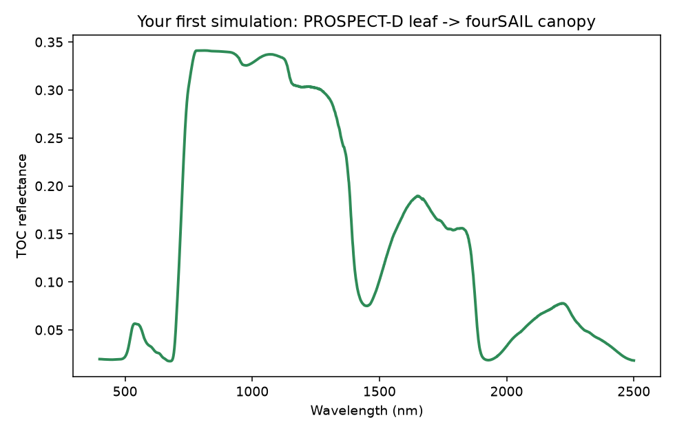

01. Getting Started
========================

What you will learn
------------------------

- Install and import ``toolsrtm``.
- Run the simplest scientifically meaningful RTM simulation: a leaf
  model feeding a canopy model.
- Plot the result.
- Understand exactly what the returned objects contain.

Concept
-----------

Every simulation on this site follows the same two-step shape: a **leaf
model** turns leaf traits (pigments, water, dry matter) into a
reflectance/transmittance spectrum, and a **canopy model** turns that
leaf spectrum plus canopy structure (leaf area, leaf angle, viewing
geometry) into a top-of-canopy (TOC) reflectance spectrum -- what a
sensor above the canopy would see. This chapter runs that chain once,
end to end, with :func:`~toolsrtm.leaf.prospect_d` (PROSPECT-D) and
:func:`~toolsrtm.canopy.foursail` (fourSAIL) -- the two most widely used
models in the package, and the baseline every later chapter builds on.

Python tools used
----------------------

.. list-table::
   :header-rows: 1
   :widths: 30 70

   * - Function
     - What it does
   * - :func:`~toolsrtm.leaf.prospect_d`
     - Leaf reflectance/transmittance from pigment/water/dry-matter
       traits. Returns a :class:`~toolsrtm.leaf.LeafOptics` object with
       ``lambda_`` (wavelength, nm), ``refl``, ``tran`` -- each a
       2101-element array, 400-2500nm at 1nm steps.
   * - :func:`~toolsrtm.canopy.foursail`
     - Canopy top-of-canopy BRDF from leaf optics + canopy structure +
       soil background. Takes a trait dict, a soil reflectance array,
       and ``leaf_model`` (which leaf model to run internally). Returns
       an object whose ``rsot`` field is the TOC bidirectional
       reflectance factor, same 2101-element wavelength grid.

Run the example
--------------------

.. code-block:: python

   import numpy as np
   from toolsrtm import prospect_d, foursail

   # 1. Leaf optics: pigments, water, dry matter, leaf structure
   leaf = prospect_d(N=1.5, Cab=40, Car=8, Anth=1, Cbrown=0, EWT=0.01, LMA=0.009, alpha=40)
   print(leaf.refl.shape, leaf.refl[150])   # reflectance at 550nm

   # 2. Canopy: same leaf traits + structure + geometry + soil background
   inputLUT = dict(
       N=1.5, Cab=40, Car=8, Anth=1, Cbrown=0, EWT=0.01, LMA=0.009, alpha=40,
       LIDFa=-0.35, LIDFb=-0.15, TypeLidf=1,   # leaf angle distribution (spherical)
       LAI=3, hspot=0.01, tts=30, tto=0, psi=0,  # leaf area, hot-spot, sun/view geometry
   )
   rsoil = np.full(2101, 0.15)   # flat soil background, 400-2500nm
   sail = foursail(inputLUT, rsoil, leaf_model="PROSPECT-D", spectrum_all=True)
   print(sail.rsot.shape, sail.rsot[150])   # TOC reflectance at 550nm

   import matplotlib.pyplot as plt
   wl = np.arange(400, 2501)
   plt.plot(wl, sail.rsot)
   plt.xlabel("Wavelength (nm)"); plt.ylabel("TOC reflectance")
   plt.title("Your first simulation: PROSPECT-D leaf -> fourSAIL canopy")

Result
----------

   Real output of the code above.

Printed output (your own run will match exactly -- both calls are
deterministic, no random seed involved)::

   (2101,) 0.13359835005159199   # leaf.refl[150], leaf reflectance at 550nm
   (2101,) 0.05584955522593193   # sail.rsot[150], TOC reflectance at 550nm

Interpretation
-------------------

The curve has the classic vegetation shape: low reflectance in the
visible (400-700nm, chlorophyll absorption, with a small local "green
peak" around 550nm -- exactly where we just sampled), a sharp rise at
the "red edge" (~700-750nm), a high, fairly flat NIR plateau
(750-1300nm, multiple scattering between leaf layers -- the reason
healthy vegetation looks so bright in the near-infrared), and two SWIR
water-absorption dips (~1450nm, ~1940nm).

The leaf-level (0.134) and canopy-level (0.056) values at 550nm are
*not* close, and that gap is itself informative: the green peak is a
sharp, narrow leaf-level feature, and at a canopy scale it gets diluted
by everything a single leaf spectrum doesn't capture -- the soil
background showing through gaps between leaves, shading between leaf
layers, and the sun/view geometry (``tts=30``, ``tto=0``) all pull the
canopy-level value down from the pure single-leaf value. A leaf
spectrum is not a scaled-down canopy spectrum; that's exactly why a
separate canopy model exists. Chapter 04 makes the soil/LAI side of
that gap an explicit experiment.

Try it yourself
--------------------

- Set ``rsoil`` to a much darker (``0.03``) or brighter (``0.30``) flat
  value and see how much the visible/SWIR bands shift.
- Change ``Cab`` from 40 to 10 (stressed/senescent) or 70 (very healthy)
  and watch the visible/red-edge region respond.
- Set ``LAI`` to ``0.3`` (sparse canopy) and compare against the ``LAI=3``
  result -- the canopy value should move much closer to the bare-soil
  value.

Common mistakes
--------------------

- ``rsoil`` must be a 2101-element array (400-2500nm, 1nm step) matching
  the leaf/canopy wavelength grid -- a scalar or wrong-length array will
  error or silently broadcast incorrectly.
- ``leaf_model="PROSPECT-D"`` inside ``foursail()`` re-runs the leaf
  model internally from the same ``inputLUT`` dict -- the separate
  ``prospect_d()`` call above is only there to show the leaf-level step
  explicitly; ``foursail()`` alone is enough for a normal simulation.
- Angles (``tts``, ``tto``, ``psi``, and ``LIDFa`` under
  ``TypeLidf=2``) are in **degrees**, not radians.

Next
--------

:doc:`t02-parameters-traits` -- what every trait above (``N``, ``Cab``,
``LIDFa``, ...) actually means, its unit, and its realistic range.

----

Using R? -> `ToolsRTM Tutorial 01: Getting Started
<https://ccgcam.github.io/RTM-Suite/toolsrtm/articles/t01-getting-started.html>`_
