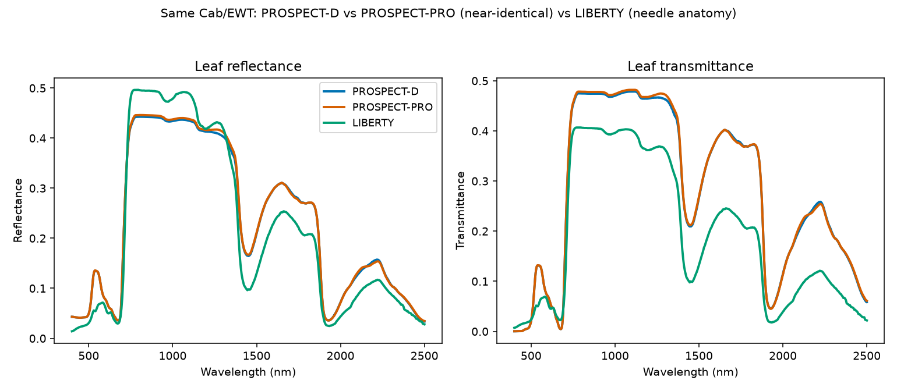

03. Leaf Radiative Transfer Models
=======================================

What you will learn
------------------------

- What each of the four leaf models simulates, and the one structural
  difference that actually separates them.
- Which inputs matter for each.
- How to run, plot, and scientifically interpret all four side by side.

Concept
-----------

A leaf model turns a handful of biochemical/structural traits into a
reflectance and transmittance spectrum. All four models here share the
same core idea (light absorbed by pigments/water/dry matter, scattered
by internal cell-wall/air-space interfaces) but differ in exactly what
they add on top of that core:

.. list-table::
   :header-rows: 1
   :widths: 20 45 35

   * - Model
     - What it simulates
     - What makes it different
   * - PROSPECT-D
     - Reflectance/transmittance from pigments (``Cab``/``Car``/``Anth``),
       water (``EWT``), and one lumped dry-matter term (``LMA``).
     - The reference broadleaf model.
   * - PROSPECT-PRO
     - Same physics, but splits ``LMA`` into ``Prot`` (protein) +
       ``CBC`` (cellulose/lignin).
     - Only the dry-matter parameterization differs.
   * - Fluspect-B / Fluspect-Cx
     - PROSPECT-D's optics *plus* chlorophyll-fluorescence excitation-
       emission matrices; Fluspect-Cx additionally adds a
       photoprotection (``Cx``) term.
     - Adds fluorescence -- needed wherever solar-induced fluorescence
       (SIF) matters, e.g. :doc:`t06-scope`.
   * - LIBERTY
     - Reflectance/transmittance for **conifer needles**, from explicit
       cell geometry instead of PROSPECT's Fresnel-refraction layer.
     - Not a PROSPECT variant -- a structurally different model, built
       for needle anatomy.

Python tools used
----------------------

.. list-table::
   :header-rows: 1
   :widths: 25 75

   * - Function
     - Key arguments
   * - :func:`~toolsrtm.leaf.prospect_d`
     - ``N, Cab, Car, Anth, Cbrown, EWT, LMA, alpha`` -- see :doc:`t02-parameters-traits`.
   * - :func:`~toolsrtm.leaf.prospect_pro`
     - Same as above but ``LMA`` replaced by ``Prot, CBC`` (pass ``LMA=0.0`` explicitly).
   * - :func:`~toolsrtm.fluspect.fluspect_b`
     - ``Cab, Car, EWT, LMA, Cs, N, fqe, Cx`` (positional) -- returns
       ``.MbI``/``.MbII`` (211x351 excitation-emission matrices, PSI/PSII).
   * - :func:`~toolsrtm.fluspect.fluspect_cx`
     - Adds ``Prot, CBC, Anth`` on top of ``fluspect_b``'s arguments --
       returns a single combined ``.Mb`` (211x351) instead of separate PSI/PSII.
   * - :func:`~toolsrtm.liberty.liberty`
     - ``cell_d, inter_c, baseline_abs, leaf_thick, albino_abs, Cab, EWT, lign_cell, Nitrogen``
       -- see :doc:`t02-parameters-traits`.

Run the example
--------------------

.. code-block:: python

   from toolsrtm import prospect_d, prospect_pro, liberty, fluspect_b, fluspect_cx

   pro_d = prospect_d(N=1.5, Cab=40, Car=8, Anth=1, Cbrown=0, EWT=0.01, LMA=0.009, alpha=40)
   pro_pro = prospect_pro(N=1.5, Cab=40, Car=8, Anth=1, Cbrown=0, EWT=0.01, LMA=0.0,
                           alpha=40, Prot=0.002, CBC=0.007)
   lib = liberty(cell_d=40, inter_c=0.045, baseline_abs=0.0006, leaf_thick=1.6,
                 albino_abs=0, Cab=40, EWT=0.01, lign_cell=2, Nitrogen=1)
   flu_b = fluspect_b(N=1.5, Cab=40, Car=8, Anth=1, EWT=0.01, LMA=0.009, Cs=0, fqe=0.01, Cx=0)
   flu_cx = fluspect_cx(N=1.5, Cab=40, Car=8, Anth=1, EWT=0.01, LMA=0.009, Cs=0,
                         fqe=0.01, Cx=0.3, Prot=0.0, CBC=0.0)

   print("PROSPECT-D  reflectance at 550nm:", pro_d.refl[150])
   print("PROSPECT-PRO reflectance at 550nm:", pro_pro.refl[150])
   print("LIBERTY     reflectance at 550nm:", lib.refl[150])
   print("Fluspect-B  reflectance at 550nm:", flu_b.refl[150])
   print("Fluspect-Cx reflectance at 550nm:", flu_cx.refl[150])
   print("Fluspect-B fluorescence matrix (MbI) shape:", flu_b.MbI.shape)

   import matplotlib.pyplot as plt
   for name, r, c in [("PROSPECT-D", pro_d, "#0072B2"), ("PROSPECT-PRO", pro_pro, "#D55E00"),
                       ("LIBERTY", lib, "#009E73")]:
       plt.plot(r.lambda_, r.refl, color=c, label=name)
   plt.legend(); plt.xlabel("Wavelength (nm)"); plt.ylabel("Reflectance")

Result
----------

Printed output (exact, deterministic)::

   PROSPECT-D  reflectance at 550nm: 0.13359835005159199
   PROSPECT-PRO reflectance at 550nm: 0.1340437450891865
   LIBERTY     reflectance at 550nm: 0.062101770920629594
   Fluspect-B  reflectance at 550nm: 0.15995957791874202
   Fluspect-Cx reflectance at 550nm: 0.14156441320107857
   Fluspect-B fluorescence matrix (MbI) shape: (211, 351)

   Real output: PROSPECT-D and PROSPECT-PRO overlap almost everywhere (same underlying physics, same total dry matter -- ``LMA=0.009`` is equivalent to ``Prot=0.002 + CBC=0.007``); LIBERTY (needle anatomy) is visibly different in the NIR plateau and SWIR.

.. figure:: _figures/fluspect_leaf.png
   :alt: Fluspect-B leaf optics and fluorescence excitation-emission matrix, real output
   :width: 100%

   Real output: Fluspect-B's reflectance/transmittance (left) and its backward chlorophyll-fluorescence excitation-emission matrix (right, ``MbI``) -- the two characteristic emission peaks near 685nm (PSII) and 740nm (PSI) are visible at both the blue (~440nm) and red (~660-680nm) chlorophyll excitation bands. No other leaf model on this page produces this second plot at all.

.. figure:: _figures/liberty_leaf.png
   :alt: LIBERTY conifer-needle leaf reflectance and 1-transmittance, real output
   :width: 75%

   Real output: LIBERTY's conifer-needle optics -- flatter NIR plateau and different SWIR absorption shape than broadleaf PROSPECT, reflecting the needle-specific anatomy the model targets.

Interpretation
-------------------

PROSPECT-D and PROSPECT-PRO track each other closely everywhere (0.1336
vs. 0.1340 at 550nm) -- expected, since ``LMA=0.009`` and
``Prot=0.002 + CBC=0.007`` represent the same total dry-matter mass
through the same underlying absorption physics, just split two
different ways. LIBERTY sits well below both at 550nm (0.062) and
diverges further in the NIR/SWIR (see the figure) -- a real anatomical
difference, not a bug: conifer needles pack mesophyll cells more densely
than broadleaf tissue, giving less internal air-space scattering and
therefore a flatter, lower NIR plateau. Fluspect-B is close to but not
identical to PROSPECT-D (0.160 vs. 0.134 at 550nm, within ~1% of each
other by 800nm in the NIR plateau) -- the two share the same absorption
physics but not byte-identical coefficient tables, so expect small,
mostly visible-region differences, not an exact match. Fluspect-Cx's
extra ``Cx=0.3`` term (partial photoprotection) shifts its 550nm value
between Fluspect-B's and PROSPECT-D's, consistent with a small
absorption change rather than a structural one.

Try it yourself
--------------------

- Set ``Cx=1.0`` (full photoprotection) on ``fluspect_cx`` and compare
  against ``Cx=0``.
- Swap ``lib``'s ``inter_c`` (intercellular air-space fraction) from
  0.045 to 0.06 and see how much closer the NIR plateau moves toward
  PROSPECT-D's.
- Compute ``flu_b.MbI.sum()`` at a few different ``fqe`` values and
  check it scales linearly (it should -- ``fqe`` is a quantum
  efficiency, a direct multiplier on emitted fluorescence).

Common mistakes
--------------------

- ``fluspect_b``/``fluspect_cx``'s arguments are largely positional --
  check the signature before assuming keyword order matches
  ``prospect_d``'s.
- ``fluspect_b`` returns separate ``.MbI``/``.MbII`` (PSI/PSII);
  ``fluspect_cx`` returns one combined ``.Mb`` instead -- not the same
  attribute name.
- LIBERTY's inputs are real cell geometry (micrometers, fractions), not
  PROSPECT pigment concentrations -- copying a PROSPECT trait value into
  LIBERTY's similarly-named argument is not meaningful.

Next
--------

:doc:`t04-canopy-models` -- turning any of these leaf spectra into a
canopy-level reflectance, and what changes between fourSAIL, fourSAIL2,
and INFORM.

----

Using R? -> `ToolsRTM Tutorial 02: From Leaf to Canopy Reflectance
<https://ccgcam.github.io/RTM-Suite/toolsrtm/articles/t02-leaf-to-canopy.html>`_
