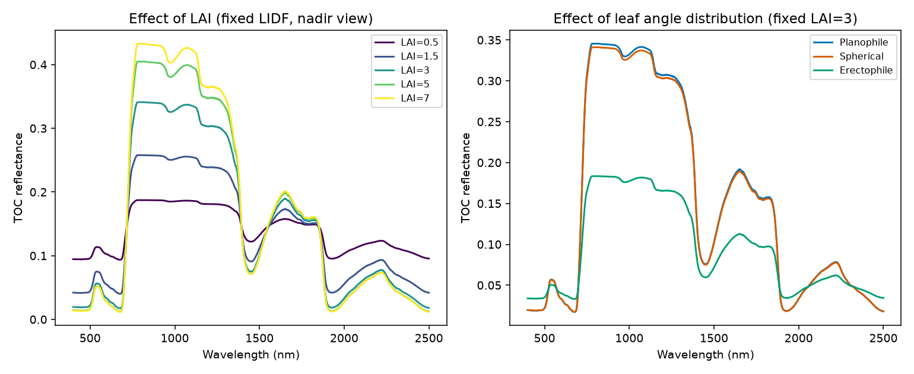
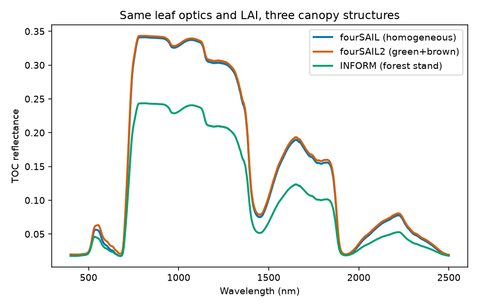

04. Canopy Radiative Transfer Models
=========================================

What you will learn
------------------------

- What fourSAIL, fourSAIL2, and INFORM each simulate, and what
  structural assumption separates them.
- How LAI and leaf-angle distribution (LIDF) change top-of-canopy (TOC)
  reflectance, quantitatively.
- How to run and interpret all three canopy models on the same leaf
  optics.

Concept
-----------

A canopy model takes a leaf model's reflectance/transmittance, a soil
background, canopy structure, and sun/view geometry, and returns TOC
reflectance -- what a sensor above the canopy sees.

.. list-table::
   :header-rows: 1
   :widths: 20 45 35

   * - Model
     - What it represents
     - What makes it different
   * - fourSAIL
     - The classic PROSAIL turbid-medium canopy: a single, statistically
       homogeneous "cloud" of leaves at a given LAI and angle
       distribution -- no explicit 3D structure.
     - The reference/default; single-layer, single leaf-biochemistry
       profile.
   * - fourSAIL2
     - Two-layer canopy (a green layer + a brown/senescent layer,
       ``fraction_brown``-weighted).
     - Same turbid-medium idea, but two vertically-stacked layers
       instead of one -- e.g. a canopy with visible dead/dry material
       mixed in with live foliage.
   * - INFORM
     - Forest-stand extension (Atzberger): explicit tree crowns (stem
       density, crown diameter, height) over an understorey + background.
     - The only one of the three with real gap/shadow geometry.

Python tools used
----------------------

.. list-table::
   :header-rows: 1
   :widths: 25 75

   * - Function
     - Key arguments
   * - :func:`~toolsrtm.canopy.foursail`
     - Trait dict (leaf + ``LAI, LIDFa, LIDFb, TypeLidf, hspot, tts, tto, psi``),
       ``rsoil`` (2101-element soil spectrum), ``leaf_model``. Returns an
       object whose ``.rsot`` is the TOC BRDF.
   * - ``toolsrtm.canopy.foursail2``
     - Adds ``fraction_brown, diss, Cv, Zeta`` on top of ``foursail``'s arguments.
   * - :func:`~toolsrtm.inform.inform`
     - Adds ``LAIu, sd, cd, h, skyl`` on top of ``foursail``'s arguments.
       Returns the TOC spectrum directly (not wrapped in a result object).

Run the example
--------------------

.. code-block:: python

   import numpy as np
   from toolsrtm import foursail

   inputLUT = dict(N=1.5, Cab=40, Car=8, Anth=1, Cbrown=0, EWT=0.01, LMA=0.009, alpha=40,
                    LIDFa=-0.35, LIDFb=-0.15, TypeLidf=1, LAI=3, hspot=0.01, tts=30, tto=0, psi=0)
   rsoil = np.full(2101, 0.15)
   wl = np.arange(400, 2501)

   def sweep_lai(values):
       out = []
       for v in values:
           lut = dict(inputLUT); lut["LAI"] = v
           out.append(foursail(lut, rsoil, leaf_model="PROSPECT-D", spectrum_all=True).rsot)
       return np.array(out)

   lai_vals = [0.5, 1.5, 3, 5, 7]
   lai_curves = sweep_lai(lai_vals)
   print("NIR (850nm) reflectance by LAI:", dict(zip(lai_vals, lai_curves[:, 450].round(4))))

Result
----------

Printed output (exact, deterministic)::

   NIR (850nm) reflectance by LAI: {0.5: 0.1872, 1.5: 0.2576, 3: 0.3404, 5: 0.4038, 7: 0.4316}

   Real output: increasing LAI raises NIR reflectance but with visibly
   diminishing returns (LAI 5 -> 7 barely moves); leaf angle distribution
   has almost no effect at this nadir view (``tto=0``) except for
   erectophile, whose near-vertical leaves present much less projected
   area to a straight-down sensor.

   Real output: same leaf optics and LAI (3) through all three models --
   INFORM sits well below fourSAIL/fourSAIL2 across the whole spectrum
   (explicit crown/gap shadow geometry that a homogeneous turbid medium
   doesn't have); fourSAIL2 with a modest ``fraction_brown=0.1`` is
   nearly indistinguishable from plain fourSAIL here.

Interpretation
-------------------

NIR reflectance rises with LAI (0.187 at LAI=0.5 to 0.432 at LAI=7) but
saturates -- the jump from LAI 0.5 to 3 (+0.153) is much larger than from
LAI 5 to 7 (+0.028). This is the physically expected "LAI saturation"
behaviour: once enough leaf layers exist to scatter nearly all incoming
NIR light multiple times before it can escape, adding still more leaves
changes the outgoing signal only marginally -- one of the best-known
practical limits of optical LAI retrieval (very high LAI canopies become
hard to distinguish from each other in the NIR alone). Leaf angle
distribution barely changes reflectance at this nadir viewing geometry
for planophile vs. spherical, but erectophile (near-vertical leaves)
drops noticeably -- at ``tto=0`` a vertical leaf presents little
projected area to a straight-down sensor, so more of the signal comes
from the soil/lower canopy instead. INFORM's forest-stand reflectance is
lower than a same-LAI fourSAIL canopy at every wavelength -- exactly what
real forest canopies show relative to a closed homogeneous canopy,
because gaps between tree crowns let some of the signal come from
shadow/background rather than sunlit leaves.

Try it yourself
--------------------

- Re-run the LIDF comparison at ``tto=40`` (an oblique view) instead of
  nadir -- the erectophile/planophile difference should become much
  larger.
- Push ``LAI`` past 7 (try 10, 15) and confirm the NIR value keeps
  flattening rather than continuing to rise linearly.
- In the fourSAIL vs. fourSAIL2 comparison, raise ``fraction_brown`` from
  0.1 to 0.6 and see how much more the two curves separate.

Common mistakes
--------------------

- ``rsoil`` must be a 2101-element array matching the model's native
  400-2500nm/1nm grid -- not a scalar.
- ``inform()`` returns the TOC spectrum directly (a plain array), unlike
  ``foursail()``/``foursail2()`` which return a result object with
  ``.rsot`` -- a real, useful-to-know inconsistency across the three
  functions.
- LAI-vs-reflectance saturation means a small reflectance difference at
  high LAI can correspond to a large true LAI difference -- don't expect
  linear sensitivity across the whole LAI range (the sensitivity-analysis chapter
  covers this quantitatively).

Next
--------

:doc:`t05-soil-atmosphere` -- the soil background these canopy models
take as an input, modelled properly instead of assumed flat, plus the
atmosphere step to go all the way to top-of-atmosphere.

----

Using R? -> `ToolsRTM Tutorial 02: From Leaf to Canopy Reflectance
<https://ccgcam.github.io/RTM-Suite/toolsrtm/articles/t02-leaf-to-canopy.html>`_
and `Tutorial 04: Comparing Models
<https://ccgcam.github.io/RTM-Suite/toolsrtm/articles/t04-comparing-models.html>`_
