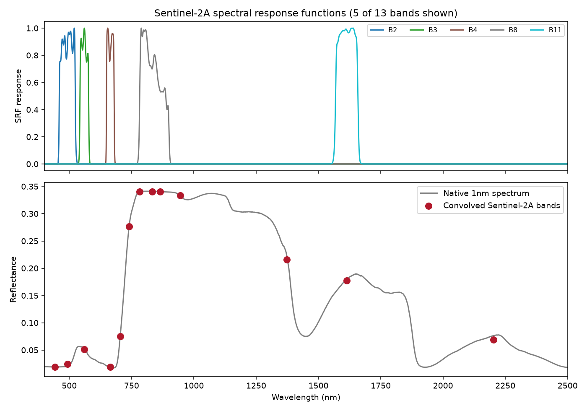

08. Sensor Simulation
==========================

What you will learn
------------------------

- What a spectral response function (SRF) is, and why a simulated
  spectrum can't be compared to real sensor data without one.
- The two ways this package convolves onto a sensor, and when to use
  which.
- How to convolve onto Sentinel-2A/PRISMA (real measured SRF) and
  EnMAP/Landsat/MODIS/a custom camera (nominal center+FWHM).

Concept
-----------

Every model in Part I simulates a spectrum at native resolution
(400-2500nm, 1nm steps). A real sensor never sees that -- it integrates
incoming light over each band's own SRF: some wavelengths inside the
band contribute fully, others (near the edges) only partially, and
everything outside the band contributes nothing. **Spectral convolution**
is that integration, applied to a simulated spectrum so it can be
compared apples-to-apples with real sensor data, or used to train a
model that will later run on real sensor bands
(:doc:`t13-machine-learning-inversion`).

Python tools used
----------------------

.. list-table::
   :header-rows: 1
   :widths: 25 75

   * - Function
     - What it does
   * - :func:`~toolsrtm.srf.spectral_convolution_srf`
     - Convolves using a real, measured per-wavelength SRF table.
       Takes ``wave``/``values`` (the native-resolution spectrum, arrays
       of the same length) and a ``sensor`` (an
       :class:`~toolsrtm.srf.SrfTable` -- :func:`~toolsrtm.srf.srf_sentinel2a`,
       :func:`~toolsrtm.srf.srf_sentinel2b`, or
       :func:`~toolsrtm.srf.srf_prisma`). Returns ``.wl`` (band centers)
       and ``.rfl`` (one value per band).
   * - :func:`~toolsrtm.srf.spectral_convolution_gaussian`
     - Convolves using only nominal band center (+ FWHM or band edges),
       approximated as a Gaussian response. Either ``sensor="EnMAP"``/
       ``"MODIS"``/... (see :func:`~toolsrtm.srf.sensor_characteristics`
       for all 13 bundled names), or your own ``centers``
       (``fwhm`` optional) for any custom sensor/camera.

Run the example
--------------------

.. code-block:: python

   import numpy as np
   from toolsrtm import prospect_d, foursail
   from toolsrtm.srf import srf_sentinel2a, spectral_convolution_srf

   inputLUT = dict(N=1.5, Cab=40, Car=8, Anth=1, Cbrown=0, EWT=0.01, LMA=0.009, alpha=40,
                    LIDFa=-0.35, LIDFb=-0.15, TypeLidf=1, LAI=3, hspot=0.01, tts=30, tto=0, psi=0)
   sail = foursail(inputLUT, np.full(2101, 0.15), leaf_model="PROSPECT-D", spectrum_all=True)
   wl = np.arange(400, 2501)

   s2a = srf_sentinel2a()
   conv = spectral_convolution_srf(wl, sail.rsot, s2a)
   print(s2a.band_names)
   print(conv.rfl.round(4))

   # EnMAP, MODIS, or any custom camera: nominal center+FWHM instead of a real SRF table
   from toolsrtm.srf import spectral_convolution_gaussian
   conv_enmap = spectral_convolution_gaussian(wl, sail.rsot, sensor="EnMAP")
   print(len(conv_enmap.rfl), "EnMAP channels")
   my_centers = np.array([550.0, 660.0, 790.0, 1050.0])
   conv_custom = spectral_convolution_gaussian(wl, sail.rsot, centers=my_centers)
   print(conv_custom.rfl.round(4))

Result
----------

Printed output (exact, deterministic)::

   ['B1', 'B2', 'B3', 'B4', 'B5', 'B6', 'B7', 'B8', 'B8A', 'B9', 'B10', 'B11', 'B12']
   [0.019  0.0247 0.0511 0.0187 0.0748 0.2763 0.3406 0.3407 0.3403 0.3336 0.2157 0.1773 0.0692]
   242 EnMAP channels
   [0.0391 0.0623 0.27   0.3267]

   Real output: 5 of Sentinel-2A's 13 real, measured spectral response functions (top -- the jagged double-humped shapes are real instrument characteristics, not simulation artifacts), and the native 1nm spectrum with the resulting convolved band reflectances overlaid (bottom).

Interpretation
-------------------

The SRF curves aren't smooth, idealized bell shapes -- B8 (NIR) and B11
(SWIR) both show a visibly double-humped, asymmetric response, a real
instrument characteristic of Sentinel-2's actual detector design, not a
simulation artifact. Because of this, a band's convolved value is a
*weighted* average over its response curve, not a simple average over its
nominal wavelength range -- which is exactly why
``spectral_convolution_srf`` (real measured SRF) and
``spectral_convolution_gaussian`` (idealized Gaussian approximation) can
give slightly different results for the same sensor, and why the real
SRF is preferred whenever it's available (Sentinel-2A/B, PRISMA).

Try it yourself
--------------------

- Compare ``spectral_convolution_srf`` against
  ``spectral_convolution_gaussian(..., sensor="Sentinel2a")`` on the same
  spectrum -- the two should be close but not identical, since one uses
  the real SRF shape and the other a Gaussian approximation.
- Convolve onto PRISMA (:func:`~toolsrtm.srf.srf_prisma`, 234 bands) and
  plot the resulting hyperspectral band reflectances as a continuous
  curve -- it should closely retrace the native 1nm spectrum.
- Build a custom 3-band RGB camera (``centers=[650, 550, 450]``, no
  ``fwhm``) and check the returned reflectance values look like a
  reasonable true-color reading of the spectrum.

Common mistakes
--------------------

- ``wave``/``values`` passed to ``spectral_convolution_srf`` must be the
  same length and cover the sensor's full SRF range -- a truncated
  native spectrum silently loses whatever SRF weight falls outside it.
- ``spectral_convolution_gaussian``'s custom-``centers`` path estimates
  each band's width from neighbouring-band spacing when ``fwhm`` isn't
  given -- fine for a contiguous pushbroom sensor, not accurate for
  widely and unevenly spaced custom bands.
- A convolved reflectance is one number per band, not a spectrum -- don't
  index it by wavelength the way you would the native 1nm array.

Next
--------

:doc:`t09-spectral-indices` -- computing vegetation indices from the
convolved bands above.

----

Using R? -> `ToolsRTM Tutorial 07: Sensor Convolution
<https://ccgcam.github.io/RTM-Suite/toolsrtm/articles/t07-sensor-convolution.html>`_
and `Tutorial 08: Hyperspectral Sensors
<https://ccgcam.github.io/RTM-Suite/toolsrtm/articles/t08-hyperspectral-sensors.html>`_
