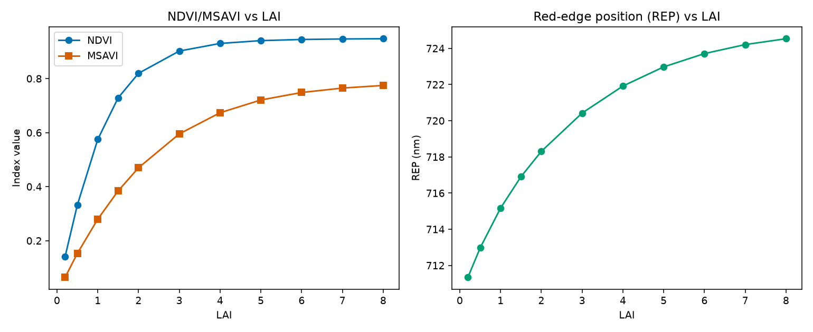

09. Spectral Indices
=========================

What you will learn
------------------------

- What a spectral index is, and why it's still the simplest way to go
  from reflectance to a trait estimate.
- The main conceptual families of index this package computes.
- How index sensitivity to a trait (LAI here) saturates -- and why that
  matters for retrieval.

Concept
-----------

A spectral index is a simple, fixed formula over a handful of bands (a
ratio, a normalized difference, ...) built to track one trait while
staying relatively insensitive to everything else. :func:`~toolsrtm.indices.get_indices`
computes ~75 VNIR + ~18 SWIR indices from one reflectance spectrum in a
single call, organized into a few conceptual families:

.. list-table::
   :header-rows: 1
   :widths: 20 30 50

   * - Category
     - Example indices
     - What they track
   * - Greenness / structure
     - ``NDVI``, ``RDVI``, ``SR``, ``MSR``, ``OSAVI``, ``MSAVI``
     - Green biomass / LAI -- the oldest, most saturating-at-high-LAI
       family.
   * - Chlorophyll / pigments
     - ``MCARI``, ``MCARI1``, ``MCARI2``, ``VOG``, ``VOG2``, ``VOG3``,
       ``CI1``, ``CI2``
     - Chlorophyll content, using the red-edge (~700-750nm) where
       chlorophyll absorption saturates less than in the red.
   * - Red-edge position
     - ``REP``
     - The wavelength of steepest reflectance rise (~700-740nm) --
       shifts with chlorophyll/canopy state.
   * - Vegetation water / SWIR / dry matter
     - ``NDNI``, ``S1080``, ``S1260``, ``N1645``, ``N870``
     - Formulas needing wavelengths only a SWIR-capable sensor
       resolves -- ``spectral_domain="SWIR"`` or ``"VNIR-SWIR"``.

Python tools used
----------------------

.. list-table::
   :header-rows: 1
   :widths: 25 75

   * - Function
     - Key arguments
   * - :func:`~toolsrtm.indices.get_indices`
     - ``wl``/``refl`` (wavelength + reflectance arrays, same length),
       ``spectral_domain`` (``"VNIR"``, ``"SWIR"``, or ``"VNIR-SWIR"`` --
       which formula set to compute). Returns a dict of index name ->
       value.

Run the example
--------------------

.. code-block:: python

   import numpy as np
   from toolsrtm import foursail, get_indices

   lai_vals = np.array([0.2, 0.5, 1, 1.5, 2, 3, 4, 5, 6, 7, 8])
   wl = np.arange(400, 2501)
   ndvi, msavi, rep = [], [], []
   for lai in lai_vals:
       lut = dict(N=1.5, Cab=40, Car=8, Anth=1, Cbrown=0, EWT=0.01, LMA=0.009, alpha=40,
                  LIDFa=-0.35, LIDFb=-0.15, TypeLidf=1, LAI=lai, hspot=0.01, tts=30, tto=0, psi=0)
       sail = foursail(lut, np.full(2101, 0.15), leaf_model="PROSPECT-D", spectrum_all=True)
       idx = get_indices(wl, sail.rsot, spectral_domain="VNIR")
       ndvi.append(np.ravel(idx["NDVI"])[0])
       msavi.append(np.ravel(idx["MSAVI"])[0])
       rep.append(np.ravel(idx["REP"])[0])

   print("NDVI:", np.round(ndvi, 4))
   print("MSAVI:", np.round(msavi, 4))
   print("REP (nm):", np.round(rep, 2))

Result
----------

Printed output (exact, deterministic)::

   NDVI:  [0.1417 0.3325 0.5749 0.7287 0.8195 0.9019 0.93   0.9404 0.9447 0.9465 0.9474]
   MSAVI: [0.0647 0.153  0.2797 0.3843 0.47   0.5953 0.6736 0.7207 0.7485 0.7648 0.7745]
   REP (nm): [711.35 712.97 715.17 716.9  718.31 720.42 721.92 722.98 723.71 724.21 724.53]

   Real output: NDVI (left, blue) rises steeply then flattens hard above LAI~4; MSAVI (left, orange) rises more gradually and keeps separating LAI values further into the high range; REP (right) shifts steadily but by a much smaller absolute amount across the whole LAI range.

Interpretation
-------------------

NDVI moves from 0.14 (LAI=0.2, near-bare soil) to 0.90 (LAI=3) -- most of
its usable range is used up by LAI 3 -- and then crawls from 0.90 to
0.947 across the entire remaining LAI 3-8 range. This is NDVI's
well-known saturation problem, visible here as real numbers rather than
a textbook claim: once the canopy is closed enough that visible-light
absorption is nearly complete, adding more leaf layers barely changes
the red/NIR ratio NDVI is built from. MSAVI (soil-adjusted) saturates
too, but less sharply -- it keeps separating LAI 5 from LAI 8 more than
NDVI does, which is exactly why soil-line-adjusted indices exist. REP
moves only ~13nm across the whole LAI sweep (711 to 725nm) -- a real,
usable signal, but one that needs much finer spectral resolution to
exploit than a broadband multispectral sensor like Sentinel-2 typically
offers.

Try it yourself
--------------------

- Re-run the sweep varying ``Cab`` instead of ``LAI`` (fixed LAI=3) and
  compare which index (NDVI vs. a chlorophyll index like ``CI2``)
  separates ``Cab`` values better.
- Convolve the same spectra onto Sentinel-2A bands first
  (:doc:`t08-sensor-simulation`) and recompute the indices on the
  convolved bands -- check how much the values shift from the native-
  resolution ones above.
- Compute a SWIR index (e.g. ``N1645``, needs ``spectral_domain="SWIR"``)
  across the same LAI sweep and compare its saturation behaviour to
  NDVI's.

Common mistakes
--------------------

- ``spectral_domain="VNIR-SWIR"`` does **not** include VNIR-only indices
  like NDVI (an exact-match gate, not a superset) -- use
  ``spectral_domain="VNIR"`` explicitly to get them.
- A SWIR-domain formula needing a wavelength your spectrum doesn't cover
  (e.g. a sensor-convolved spectrum missing 1510nm) returns ``NaN``
  rather than an error -- always worth checking after convolving onto a
  real sensor (:doc:`t08-sensor-simulation`).
- An index that saturates at high LAI doesn't mean the underlying
  simulation is wrong -- it's the index's own known limitation, the same
  behaviour real satellite NDVI shows over closed canopies.

Next
--------

:doc:`t10-sensitivity-analysis` -- which traits actually drive
reflectance variance, at which wavelengths, quantified properly (rather
than one trait swept at a time as above).

----

Using R? -> `ToolsRTM Tutorial 09: Vegetation Indices
<https://ccgcam.github.io/RTM-Suite/toolsrtm/articles/t09-vegetation-indices.html>`_
