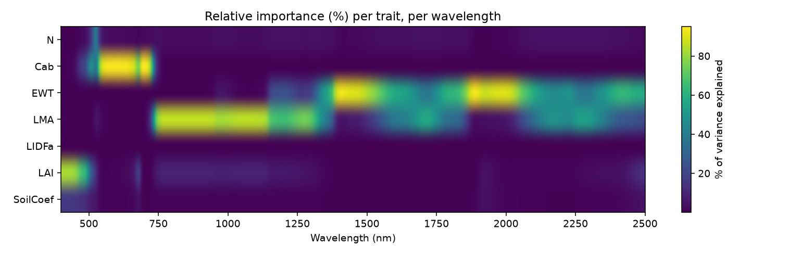
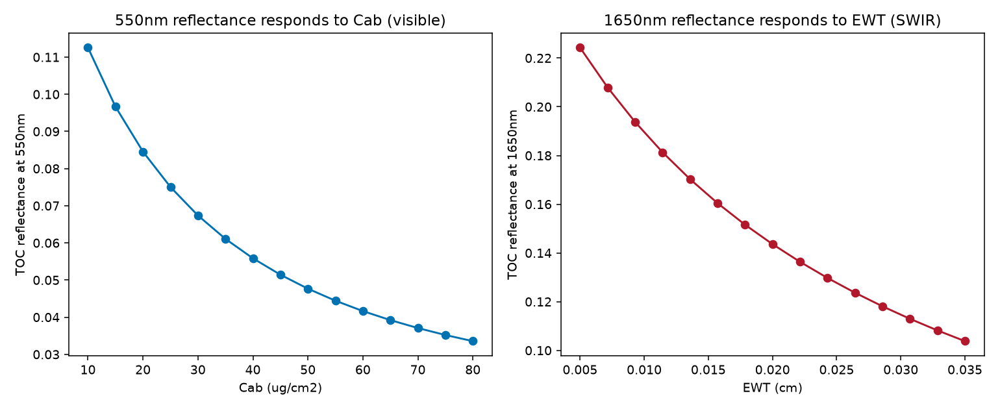

10. Sensitivity Analysis
=============================

What you will learn
------------------------

- How to quantify which traits actually drive reflectance variance, at
  which wavelengths -- not just eyeball a sweep.
- How to read a wavelength x trait sensitivity heatmap.
- Why sensitivity is meaningless outside a trait's own physical
  absorption region, and how to spot that in real output.

Concept
-----------

Chapters 04 and 09 swept one trait at a time and watched reflectance (or
an index) respond -- useful, but it only shows *that* a trait matters,
not *how much*, relative to every other trait, at every wavelength, when
everything varies at once. :func:`~toolsrtm.sensitivity.spectral_sensitivity`
runs the canopy model many times with every trait varying simultaneously
(Uniform-sampled by default) and computes, at each wavelength, each
trait's relative contribution to the resulting reflectance variance
(a Johnson relative-importance index, normalized to sum to 100% per
wavelength).

Python tools used
----------------------

.. list-table::
   :header-rows: 1
   :widths: 25 75

   * - Function
     - Key arguments
   * - :func:`~toolsrtm.sensitivity.spectral_sensitivity`
     - ``n_samples`` (simulations to run), ``distribution`` (``"Uniform"``
       or ``"Gaussian"``), ``traits`` (which to vary -- a ``SoilCoef``
       soil-brightness multiplier is added automatically), ``wl_step``
       (nm, coarser = faster). Returns long-format arrays:
       ``.wavelength``, ``.trait``, ``.sti_pct`` (% of variance
       explained, sums to 100 per wavelength).

Run the example
--------------------

.. code-block:: python

   import numpy as np
   from toolsrtm.sensitivity import spectral_sensitivity

   result = spectral_sensitivity(n_samples=500, distribution="Uniform",
                                  traits=("N", "Cab", "EWT", "LMA", "LIDFa", "LAI"),
                                  wl_step=5, seed=11)

   wls = np.unique(result.wavelength)
   traits = list(dict.fromkeys(result.trait))   # includes the auto-added SoilCoef
   at_550 = {tr: round(float(result.sti_pct[(result.wavelength == 550) & (result.trait == tr)][0]), 1)
             for tr in traits}
   at_1650 = {tr: round(float(result.sti_pct[(result.wavelength == 1650) & (result.trait == tr)][0]), 1)
              for tr in traits}
   print("At 550nm (visible):", at_550)
   print("At 1650nm (SWIR):", at_1650)

Result
----------

Printed output (exact, deterministic)::

   At 550nm (visible): {'N': 5.1, 'Cab': 90.8, 'EWT': 0.2, 'LMA': 1.7, 'LIDFa': 0.3, 'LAI': 1.0, 'SoilCoef': 0.9}
   At 1650nm (SWIR): {'N': 4.0, 'Cab': 0.0, 'EWT': 52.5, 'LMA': 42.7, 'LIDFa': 0.0, 'LAI': 0.2, 'SoilCoef': 0.5}

   Real output: each trait's relative importance (%), per wavelength. Cab lights up sharply in the visible (500-700nm) and nowhere else; EWT and LMA both light up in the NIR-SWIR, with EWT specifically peaking at the two strongest water-absorption bands (~1450/1950nm) and LMA dominating the broader region between them.

   Real output: single-wavelength reflectance as each trait's own dominant band responds to it -- both decrease monotonically (more absorption -> less reflected light), confirming the heatmap's regions with a direct, physically interpretable response curve.

Interpretation
-------------------

At 550nm, ``Cab`` alone explains 90.8% of reflectance variance -- every
other trait combined explains under 10%. At 1650nm the story flips
completely: ``Cab``'s contribution drops to 0.0%, while ``EWT`` (52.5%)
and ``LMA`` (42.7%) together explain essentially all of it. This is
exactly the physically expected pattern -- chlorophyll absorbs in the
visible and has no direct SWIR absorption feature, while water and dry
matter absorb in the SWIR and barely touch the visible -- and it's the
right way to read this kind of analysis: a trait's sensitivity is only
meaningful *within* its own physical absorption region. A tool reporting
high ``Cab`` sensitivity at 1650nm, or high ``EWT`` sensitivity at
550nm, would be signalling a bug, not a real result -- which is exactly
why this page shows the full heatmap rather than cherry-picking numbers
that happen to look sensible.

Try it yourself
--------------------

- Read the heatmap at ~1200nm (a genuine ambiguity zone) and check that
  no single trait dominates the way ``Cab``/``EWT`` do at 550/1650nm --
  a real region of low trait separability.
- Re-run with ``distribution="Gaussian"`` and compare the heatmap -- the
  overall pattern should be similar, since it reflects the underlying
  physics, not the sampling scheme.
- Increase ``n_samples`` (e.g. to 2000) and confirm the 550nm/1650nm
  numbers above barely change -- a sign 500 samples was already enough
  to trust.

Common mistakes
--------------------

- Sensitivity results only make sense *within* a trait's physical
  absorption region -- don't over-interpret small (<5%) values outside
  it as meaningful signal; they're sampling noise around zero.
- ``spectral_sensitivity`` reruns the canopy model ``n_samples`` times --
  costly at high ``n_samples``/fine ``wl_step``; start coarse (``wl_step=10``
  or more) while exploring, then refine.
- A trait explaining a high % of variance doesn't mean it's easy to
  *retrieve* -- see :doc:`t04-canopy-models`'s LAI-saturation discussion
  for a case where high sensitivity at low trait values coexists with
  very poor separability at high trait values.

Next
--------

Part III starts here: :doc:`t11-lut-generation` -- building the training
data every inversion method (LUT matching, ML, DL) needs.

----

Using R? -> `ToolsRTM Tutorial 10: Sensitivity Analysis
<https://ccgcam.github.io/RTM-Suite/toolsrtm/articles/t10-sensitivity.html>`_
