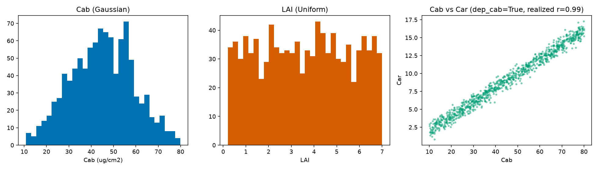
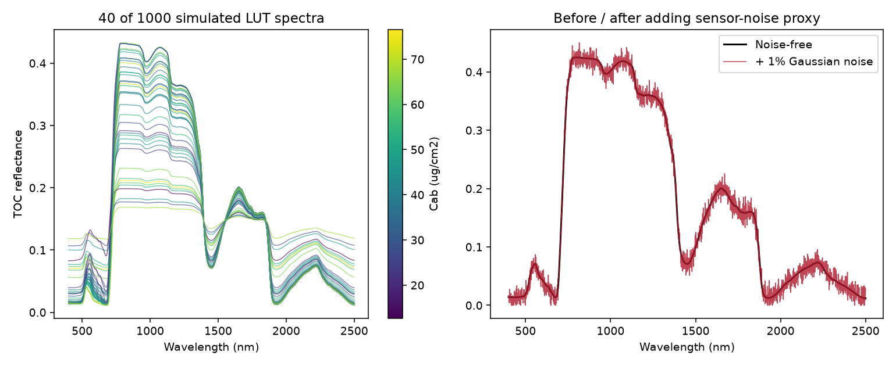

11. LUT Generation
=======================

What you will learn
------------------------

- What a look-up table (LUT) is, and why building one well is mostly
  about sampling, not the RTM call itself.
- How to sample realistic trait distributions, including real
  trait-to-trait covariance instead of full independence.
- How to add sensor-realistic noise, and split into train/validation/
  test before any inversion method touches the data.

Concept
-----------

A look-up table (LUT) is a set of RTM simulations, each row a different
combination of trait values and its resulting reflectance spectrum -- the
raw material every inversion method in Part III needs: rank spectral
indices by correlation with a trait, train an ML/DL model, or match a
real observation against simulated neighbours. This chapter builds one
properly, at a realistic size (1000 rows -- large enough that the
inversion chapters that follow produce genuinely meaningful results, not
an artifact of too little training data).

Python tools used
----------------------

.. list-table::
   :header-rows: 1
   :widths: 25 75

   * - Function
     - Key arguments
   * - :func:`~toolsrtm.sensitivity.get_distribution_lut`
     - ``minval``/``maxval`` (per-trait bounds, dicts), ``n_samples``,
       ``type_distrib`` (``"Uniform"``/``"Gaussian"`` per trait),
       ``mean_gauss``/``std_gauss`` (only read for ``"Gaussian"``
       traits), ``dep_cab`` (tie ``Car`` to ``Cab``, see below). Returns
       a dict of trait name -> array.
   * - :func:`~toolsrtm.sensitivity.get_cor`
     - General-purpose version: correlate any two named traits at any
       target correlation (``rho``), not just the built-in Cab-Car tie.

Run the example
--------------------

.. code-block:: python

   import numpy as np
   from toolsrtm.sensitivity import get_distribution_lut
   from toolsrtm import foursail

   N_SAMPLES = 1000

   # 1. Realistic per-trait distributions
   lut = get_distribution_lut(
       minval=dict(Cab=10, LAI=0.2), maxval=dict(Cab=80, LAI=7),
       n_samples=N_SAMPLES, type_distrib=dict(Cab="Gaussian", LAI="Uniform"),
       mean_gauss=dict(Cab=45), std_gauss=dict(Cab=15), seed=1,
   )
   print("Cab: mean=%.2f std=%.2f" % (lut["Cab"].mean(), lut["Cab"].std()))
   print("LAI: min=%.2f max=%.2f" % (lut["LAI"].min(), lut["LAI"].max()))

   # 2. Real trait co-variation: Car tied to Cab (a real empirical leaf-pigment relationship)
   lut2 = get_distribution_lut(
       minval=dict(Cab=10, Car=2), maxval=dict(Cab=80, Car=25),
       n_samples=N_SAMPLES, type_distrib=dict(Cab="Uniform", Car="Uniform"),
       dep_cab=True, seed=1,
   )
   print("Realized Cab-Car correlation:", np.corrcoef(lut2["Cab"], lut2["Car"])[0, 1])

   # 3. RTM simulation: one row -> one spectrum, 1000 times
   rsoil = np.full(2101, 0.15)
   rows = []
   for i in range(N_SAMPLES):
       row_lut = dict(N=1.5, Cab=lut["Cab"][i], Car=8, Anth=1, Cbrown=0, EWT=0.01, LMA=0.009,
                       alpha=40, LIDFa=-0.35, LIDFb=-0.15, TypeLidf=1,
                       LAI=lut["LAI"][i], hspot=0.01, tts=30, tto=0, psi=0)
       sail = foursail(row_lut, rsoil, leaf_model="PROSPECT-D", spectrum_all=True)
       rows.append(sail.rsot)
   spectral_lut = np.stack(rows)   # (1000, 2101)

   # 4. Adding noise: simulated reflectance is noise-free, real sensor data never is
   rng = np.random.default_rng(7)
   noisy_lut = np.clip(spectral_lut + rng.normal(0, 0.01, spectral_lut.shape), 0, 1)

   # 5. Train / validation / test -- never evaluate an inversion on rows it trained on
   from sklearn.model_selection import train_test_split
   idx = np.arange(N_SAMPLES)
   train_idx, test_idx = train_test_split(idx, test_size=0.3, random_state=1)
   print("Train rows:", len(train_idx), " Test rows:", len(test_idx))

Result
----------

Printed output (exact, deterministic)::

   Cab: mean=44.98 std=13.90
   LAI: min=0.20 max=7.00
   Realized Cab-Car correlation: 0.9900876992344007
   Train rows: 700  Test rows: 300

   Real output: ``Cab`` sampled Gaussian (visibly bell-shaped, clipped to ``[10, 80]``), ``LAI`` sampled Uniform (flat), and ``Car`` tied to ``Cab`` via ``dep_cab=True`` -- a real, strong (r=0.99) linear relationship, not independent sampling.

   Real output: 40 of the 1000 simulated spectra (left, colour = Cab -- most of the visible spread is actually driven by the co-varying LAI, not Cab alone), and one spectrum before/after adding a 1% Gaussian noise proxy (right).

Interpretation
-------------------

The ``dep_cab=True`` constraint produces a real, strong relationship
(r=0.99) between ``Cab`` and ``Car`` -- deliberately much tighter than
"somewhat correlated," reflecting how tightly co-regulated chlorophyll
and carotenoid pools actually are in healthy leaf tissue. Sampling them
fully independently instead (the default) would let an inversion method
implicitly learn a Cab-Car relationship that doesn't exist in real
leaves, and then fail on real data where it does. In the spectra sample,
most of the visible NIR-plateau spread by eye traces back to LAI (not
color-coded here) rather than Cab -- exactly the kind of thing Chapter
10's sensitivity heatmap already predicts: Cab dominates the visible,
not the NIR, so coloring NIR-plateau spread by Cab alone won't explain
much of it. The noise panel shows a physically reasonable proxy: real
sensor noise is neither perfectly smooth nor overwhelming -- 1% Gaussian
noise visibly roughens the curve without destroying its shape, which is
the point (:doc:`t12-lut-inversion` and :doc:`t13-machine-learning-inversion`
train on data like this, not the noise-free ideal).

Try it yourself
--------------------

- Use :func:`~toolsrtm.sensitivity.get_cor` to tie ``Cab`` and a
  physiological trait like ``Vcmax25`` at a *moderate* target
  correlation (``rho=0.6``) instead of the strong built-in Cab-Car tie,
  and check the realized correlation matches roughly.
- Switch the noise model from additive (``+``) to multiplicative
  (``* (1 + noise)``) and compare how much more the SWIR (already lower
  reflectance) is affected relative to the NIR plateau.
- Reduce ``N_SAMPLES`` to 50 and re-run :doc:`t12-lut-inversion`'s
  retrieval on it -- compare the result's stability against the
  1000-row version here.

Common mistakes
--------------------

- A LUT too small for the trait space it's meant to cover gives
  inversion methods too few realistic "neighbours" to match against or
  learn from -- 1000 rows is a reasonable floor for a 2-3 trait problem,
  not an arbitrary nice-looking number.
- Sampling every trait independently when real ones co-vary
  (``Cab``/``Car``, ``Cab``/``Vcmax25``) teaches an inversion method
  relationships that don't exist in nature.
- Adding noise *after* the train/test split (fit any noise-parameter
  choice using only the training rows) avoids leaking test-set
  information into modelling decisions -- the same train/test discipline
  Chapter 14 applies to normalization.

Next
--------

:doc:`t12-lut-inversion` -- the simplest way to go from an observed
spectrum back to a trait: matching it against this LUT directly.

----

Using R? -> `ToolsRTM Tutorial 05: Building LUTs
<https://ccgcam.github.io/RTM-Suite/toolsrtm/articles/t05-building-luts.html>`_
