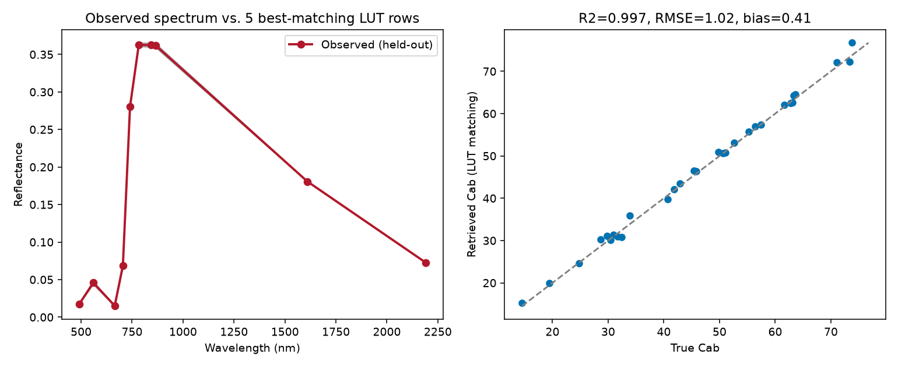

12. LUT Inversion
======================

What you will learn
------------------------

- The LUT-matching (merit-function) inversion concept: observed spectrum
  -> compare with LUT -> select best simulations -> retrieve traits.
- What a merit function is, and how the number of selected matches
  (``n_opt``) trades off noise against bias.
- How to evaluate a retrieval with R2/RMSE/bias, not just eyeball a plot.

Concept
-----------

The simplest inversion strategy needs no training step at all: rank every
row of a LUT (:doc:`t11-lut-generation`) by how closely its simulated
spectrum matches an observation, then average the trait values of the
best matches.

.. code-block:: text

   Observed spectrum
          |
          v
   Compare against every LUT row (merit function, e.g. RMSE)
          |
          v
   Rank all LUT rows by match quality
          |
          v
   Select the n_opt best matches
          |
          v
   Average their trait values  ->  retrieved trait

Python tools used
----------------------

.. list-table::
   :header-rows: 1
   :widths: 25 75

   * - Function
     - Key arguments
   * - :func:`~toolsrtm.inversion.get_inversion_opt`
     - ``rfl_sensor`` (n_obs x n_bands observations), ``rfl_rtm``
       (n_lut x n_bands simulated spectra), ``lut`` (matching trait
       DataFrame), ``method`` (merit function -- ``"merit-RMSE"``,
       ``"merit-NRMSE"``, ``"merit-MAE"``, ``"merit-NMB"``,
       ``"merit-FGE"``, or a custom ``custom_stat=f(sim, obs) -> error``),
       ``n_opt`` (how many best matches to average). Returns
       ``.lut_best`` (retrieved traits) and ``.rfl_best`` (matching
       spectra).

Run the example
--------------------

.. code-block:: python

   import numpy as np
   import pandas as pd
   from toolsrtm import foursail
   from toolsrtm.inversion import get_inversion_opt

   bands = (490, 560, 665, 705, 740, 783, 842, 865, 1610, 2190)

   # 1000-row training LUT (same shape as t11-lut-generation)
   rng = np.random.default_rng(1)
   rows = []
   for _ in range(1000):
       Cab, LAI = rng.uniform(10, 80), rng.uniform(0.5, 6)
       inputLUT = dict(N=1.5, Cab=Cab, Car=8, Anth=1, Cbrown=0, EWT=0.01, LMA=0.009, alpha=40,
                        LIDFa=-0.35, LIDFb=-0.15, TypeLidf=1, LAI=LAI, hspot=0.01, tts=30, tto=0, psi=0)
       sail = foursail(inputLUT, np.full(2101, 0.15), leaf_model="PROSPECT-D", spectrum_all=True)
       row = {"Cab": Cab, "LAI": LAI}
       for wl in bands:
           row[f"R{wl}"] = sail.rsot[wl - 400]
       rows.append(row)
   lut_df = pd.DataFrame(rows)
   band_cols = [c for c in lut_df.columns if c.startswith("R")]

   # 30 independently-simulated "observations" (held out, LUT never sees these Cab/LAI values)
   rng2 = np.random.default_rng(99)
   test_rows = []
   for _ in range(30):
       Cab, LAI = rng2.uniform(12, 78), rng2.uniform(0.6, 5.8)
       inputLUT = dict(N=1.5, Cab=Cab, Car=8, Anth=1, Cbrown=0, EWT=0.01, LMA=0.009, alpha=40,
                        LIDFa=-0.35, LIDFb=-0.15, TypeLidf=1, LAI=LAI, hspot=0.01, tts=30, tto=0, psi=0)
       sail = foursail(inputLUT, np.full(2101, 0.15), leaf_model="PROSPECT-D", spectrum_all=True)
       row = {"Cab": Cab, "LAI": LAI}
       for wl in bands:
           row[f"R{wl}"] = sail.rsot[wl - 400]
       test_rows.append(row)
   test_df = pd.DataFrame(test_rows)

   result = get_inversion_opt(rfl_sensor=test_df[band_cols].values, rfl_rtm=lut_df[band_cols].values,
                               lut=lut_df[["Cab", "LAI"]], method="merit-RMSE", n_opt=5)
   pred_cab, true_cab = result.lut_best["Cab"].values, test_df["Cab"].values
   r2 = np.corrcoef(pred_cab, true_cab)[0, 1] ** 2
   rmse = np.sqrt(np.mean((pred_cab - true_cab) ** 2))
   bias = np.mean(pred_cab - true_cab)
   print(f"R2={r2:.3f}  RMSE={rmse:.2f}  bias={bias:.2f}")

Result
----------

Printed output (exact, deterministic)::

   R2=0.997  RMSE=1.02  bias=0.41

   Real output: one held-out observed spectrum against its 5 best-matching LUT rows (left -- close enough to be visually indistinguishable), and retrieved vs. true Cab across all 30 held-out observations (right).

Interpretation
-------------------

R2=0.997 with RMSE=1.02 ug/cm2 (against a true Cab range of ~15-80) is a
genuinely strong retrieval -- expected here, since the observations were
drawn from the *same* simulation model and trait ranges the LUT itself
was built from (no real-world confounding, no sensor noise). The small
positive bias (+0.41) shows the LUT-matching approach is very slightly
over-predicting Cab on average, plausible with only ``n_opt=5`` averaging
a handful of nearest neighbours rather than the true value exactly.
This result is best read as an upper bound on what LUT matching can do
under ideal conditions -- :doc:`t11-lut-generation`'s noise-adding step
and any real sensor/atmosphere confounding will both push R2 down and
RMSE up in a more realistic setting.

Try it yourself
--------------------

- Re-run with ``n_opt=1`` (nearest neighbour only) vs. ``n_opt=20`` and
  compare R2/RMSE/bias -- more averaging should reduce noise-driven
  scatter but can increase bias toward the LUT's own mean.
- Add the noise from :doc:`t11-lut-generation` to the test observations
  before inversion, and watch R2 drop from the near-perfect value above.
- Switch ``method`` to ``"merit-MAE"`` and check whether the retrieval
  changes meaningfully for this trait/noise level.

Common mistakes
--------------------

- ``rfl_rtm``'s bands must be in the exact same order as ``rfl_sensor``'s
  -- a mismatched column order silently compares the wrong bands.
- LUT matching can only retrieve trait combinations *close to* something
  already in the LUT -- a LUT with too narrow a trait range
  (:doc:`t11-lut-generation`) will systematically fail on real
  observations outside it, not just perform poorly.
- A near-perfect R2 like the one here reflects a best-case, no-noise,
  no-confounding setup -- don't expect the same number on real satellite
  data (:doc:`t18-applying-inversion-spatially`).

Next
--------

:doc:`t13-machine-learning-inversion` -- training a reusable model
instead of comparing against the LUT every time.

----

Using R? -> `ToolsRTM Tutorial 11: Hybrid Inversion
<https://ccgcam.github.io/RTM-Suite/toolsrtm/articles/t11-hybrid-inversion.html>`_
