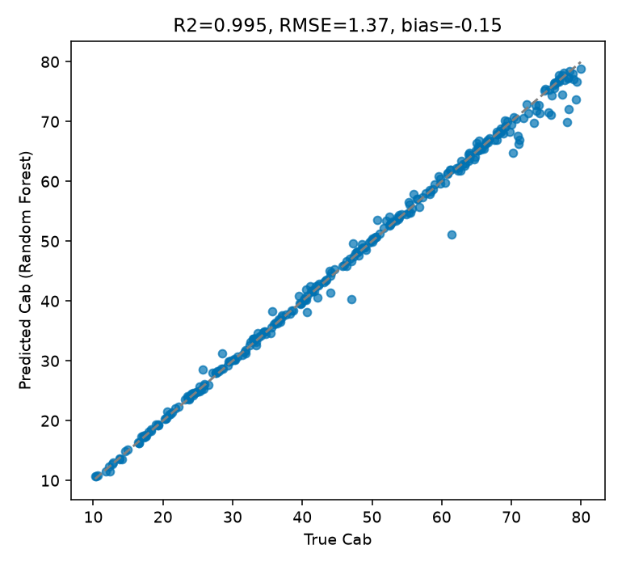

13. Machine-Learning Inversion
===================================

What you will learn
------------------------

- The full ML inversion workflow: LUT -> predictors/target ->
  train/test split -> model -> independent prediction.
- Which of the 12 ML algorithms this package dispatches to, and what
  each argument to :func:`~toolsrtm.inversion.get_inversion` actually
  controls.
- How to evaluate with R2/RMSE/bias on a genuinely held-out split.

Concept
-----------

Unlike :doc:`t12-lut-inversion` (compare against the LUT every time),
machine learning fits a regression model **once** on (spectrum -> trait)
pairs from a LUT (:doc:`t11-lut-generation`), then reuses that trained
model on new spectra without touching the LUT again.

.. code-block:: text

   RTM LUT (predictors = bands, target = trait)
                 |
                 v
        Train / test split (never evaluate on training rows)
                 |
                 v
             Fit model (RF, PLSR, SVM, ...)
                 |
                 v
        Predict on held-out test spectra
                 |
                 v
        R2 / RMSE / bias, observed vs. predicted

Python tools used
----------------------

.. list-table::
   :header-rows: 1
   :widths: 25 75

   * - Function
     - Key arguments
   * - :func:`~toolsrtm.inversion.get_inversion`
     - ``data`` (LUT DataFrame), ``dep_var`` (target trait column),
       ``inputs`` (predictor column names), ``algorithm`` (one of 12,
       see :data:`~toolsrtm.inversion.ALGORITHMS`), ``seed`` (controls
       both the train/test split and any stochastic estimator),
       ``n_samples`` (subsample the LUT before splitting, if smaller
       than the LUT itself), ``test_size`` (fraction held out, default
       0.3). Returns ``.statistics`` (``{"train":{...}, "test":{...}}``,
       each with ``r2``/``rmse``/``mae``), ``.predictions``
       (``{"train":.., "test":..}`` arrays), ``.model``, ``.importance``.

Run the example
--------------------

.. code-block:: python

   import numpy as np
   import pandas as pd
   from sklearn.model_selection import train_test_split
   from toolsrtm.inversion import get_inversion

   # lut_df: the same 1000-row LUT built in t11-lut-generation (Cab, LAI + 10 bands)
   band_cols = [c for c in lut_df.columns if c.startswith("R")]

   fit = get_inversion(lut_df, dep_var="Cab", inputs=band_cols, algorithm="RF",
                        n_samples=len(lut_df), seed=1)
   print(f"R2={fit.statistics['test']['r2']:.3f}  "
         f"RMSE={fit.statistics['test']['rmse']:.2f}  "
         f"MAE={fit.statistics['test']['mae']:.2f}")

   # Reconstruct the same held-out y_test to plot against (get_inversion's split
   # is deterministic: train_test_split(X, y, test_size=0.3, random_state=seed))
   X = lut_df[band_cols].to_numpy(dtype=float)
   y = lut_df["Cab"].to_numpy(dtype=float)
   _, _, _, y_test = train_test_split(X, y, test_size=0.3, random_state=1)
   bias = float(np.mean(fit.predictions["test"] - y_test))
   print("Bias:", bias)

Result
----------

Printed output (exact, deterministic)::

   R2=0.995  RMSE=1.37  MAE=0.68
   Bias: -0.14909781428882435

   Real output: predicted vs. true Cab on the 300 held-out test rows -- points sit tightly along the 1:1 line across the full 10-80 ug/cm2 range, with only a handful of visible outliers at the high end.

Interpretation
-------------------

R2=0.995 with a small negative bias (-0.15) means Random Forest slightly
*under*-predicts Cab on average here -- the opposite direction from
:doc:`t12-lut-inversion`'s LUT-matching result on a similar setup, and a
useful reminder that different methods can have different (small) bias
directions on the same problem. The handful of visible outliers cluster
at high true Cab (>60) -- consistent with Random Forest's known
mean-reversion tendency: an ensemble of trees can only interpolate
within training-data combinations it saw, so it tends to under-predict
the very top of a trait's range and over-predict the very bottom,
exactly the pattern the R side of this comparison flags too (see the
"Common mistakes" note below).

Try it yourself
--------------------

- Swap ``algorithm="RF"`` for ``"PLSR"`` or ``"SVM"`` and compare R2/RMSE
  -- PLSR (a linear method) usually does *worse* than RF on this kind of
  problem, a useful sanity check that the nonlinear structure RF exploits
  is real.
- Reduce ``n_samples`` well below 1000 (e.g. 100) and watch R2 degrade --
  direct evidence for :doc:`t11-lut-generation`'s "realistic LUT size"
  requirement.
- Predict on the same 30 independently-simulated observations used in
  :doc:`t12-lut-inversion` and compare RF's R2/RMSE/bias against LUT
  matching's, on the exact same held-out data.

Common mistakes
--------------------

- ``get_inversion``'s train/test split is controlled entirely by
  ``seed`` -- reusing the same ``seed`` for a different LUT size or
  column order won't reproduce the same rows.
- Tree ensembles (RF, GB, AdaBag) can't extrapolate past the trait range
  they were trained on -- predictions systematically compress toward the
  training mean at the extremes, visible in the outliers above. This is
  the exact behaviour a real capstone example on this site flags when
  applying a trained model to real satellite data -- see
  :doc:`t19-trait-maps-uncertainty`.
- A near-perfect R2 here reflects noise-free, same-distribution
  simulated data -- :doc:`t11-lut-generation`'s noise step and any real
  sensor/atmosphere mismatch will both lower it in practice.

Next
--------

:doc:`t14-deep-learning-inversion` -- when a neural network is worth the
extra complexity over the methods above.

----

Using R? -> `ToolsRTM Tutorial 11: Hybrid Inversion
<https://ccgcam.github.io/RTM-Suite/toolsrtm/articles/t11-hybrid-inversion.html>`_
and `Tutorial 12: ML Inversion Comparison
<https://ccgcam.github.io/RTM-Suite/toolsrtm/articles/t12-ml-inversion-comparison.html>`_
